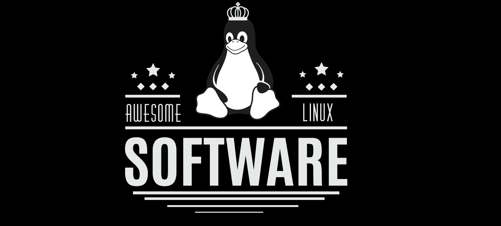

# IMPRESSIONANTES aplicativos para Linux

🐧 Este repositório é uma coleção de **IMPRESSIONANTES** aplicativos e ferramentas Linux para **usuários/desenvolvedores**.
 
🐧 Sinta-se livre para **contribuir** / **star** / **fork** / **pull request**. Qualquer **recomendação** e **sugestão** será bem-vinda.

**Reconhecimento:** *Tudo escrito abaixo é da minha própria experiência na faculdade e depois de ler vários materiais. Eu não sou profissional nem especialista, mas um aluno que tem uma grande paixão.
Qualquer um pode abrir uma discussão na seção de problemas, ou enviar um pull request, caso algo seja modificado ou adicionado.*

Duas versões chinesas desta lista estão disponíveis [aqui](https://github.com/alim0x/Awesome-Linux-Software-zh_CN) e [aqui(já atualizadas ultimamente).](https://github.com/0xE8551CCB/awesome-linux-software-cn)

## Índice

- [Aplicativos](#aplicativos)
    - [Áudio](#áudio)
    - [Clientes para bate-papo](#clientes-para-bate-papo)
    - [Backup e Recuperação de Dados](#backup-e-recuperação-de-dados)
    - [Personalização do Desktop](#desktop-customization)
    - [Desenvolvimento](#desenvolvimento)
    - [E-Book úteis](#e-book-úteis)
    - [Editores](#editores)
    - [Educação](#educação)
    - [E-mail](#email)
    - [Gerenciador de arquivos](#gerenciador-de-arquivos)
    - [Jogos](#jogos)
    - [Gráficos](#gráficos)
    - [Internet](#internet)
    - [Trabalho](#trabalho)
    - [Produtividade](#produtividade)
    - [Proxy](#proxy)
    - [Segurança](#segurança)
    - [Compartilhamento de arquivos](#compartilhamento-de-arquivos)
    - [Terminal](#terminal)
    - [Utilitários](#utilitários)
    - [Vídeo](#vídeo)
    - [Wiki software](#wiki-software)
    - [Outros](#outros)
- [Command Line Utilities](#command-line-utilities)
- [Ambientes para Desktop](#ambientes-para-desktop)
- [Gestores de exibição](#gestores-de-exibição)
    - [Console](#console)
    - [Gráfico](#gráfico)
- [Gerenciador de janelas](#gerenciador-de-janelas)
    - [Compositores](#compositores)
    - [Empilhadas](#empilhadas)
    - [Revestimento](#revestimento)
    - [Dinâmica](#dinâmica)

***********

- [Setup](#setup)
    - [ArchLinux](#arch-linux)
    - [CentOS](#centos)
    - [Fedora](#fedora)
    - [openSUSE](#opensuse)
    - [Ubuntu](#ubuntu)
- [Discussion Forums](#discussion-forums)
    - [ArchLinux Forums](#arch-linux-forums)
    - [CentOS Forums](#centos-forums)
    - [Fedora Forums](#fedora-forums)
    - [Ubuntu Forums](#ubuntu-forums)
    - [openSUSE Forums](#opensuse-forums)
    - [IRC channels](#irc-channels)
    - [Linux News, Apps, and more ....](#linux-news-apps-and-more-)
    - [Reddit](#reddit)
- [Learn Linux](#learn-linux)
- [Linux Hacking/Development](#linux-hackingdevelopment)
- [Advanced Linux](#advanced-linux)
- [Other Awesome Lists](#Other-Awesome-Lists)
- [Contributors](#contributors)
- [Guideline to Contribute](#guideline-to-contribute)

***********

## Aplicativos

### Áudio

- [Airtime](https://www.sourcefabric.org/en/airtime/download/) - Airtime é um software de transmissão aberta para agendamento e gerenciamento de estação remota [![Open-Source Software][OSS Icon]](https://github.com/sourcefabric/Airtime)
- [Ardour](https://ardour.org/) - Grave, edite e misture no Linux  [![Open-Source Software][OSS Icon]](https://ardour.org/development.html)
- [Audacious](http://audacious-media-player.org/) - Um leitor de aúdio open source,  reproduz sua música como você quiser, sem roubar os recursos de outras tarefas do seu computador.[![Open-Source Software][OSS Icon]](http://audacious-media-player.org/developers)
- [Audacity](http://www.audacityteam.org/download/linux/) - Software Livre, open source, multiplataforma para gravação e edição de sons. [![Open-Source Software][OSS Icon]](https://github.com/audacity/audacity)
- [![Open-Source Software][OSS Icon]](https://bazaar.launchpad.net/~audio-recorder/audio-recorder/trunk/files) [Audio Recorder](https://launchpad.net/~audio-recorder) - Gravador de aúdio simples, disponível no PPA do Ubuntu
- [Cantata](https://www.linux-apps.com/content/show.php/Cantata?content=147733) - Qt5 Graphical MPD (Music Player Daemon) Cliente para Linux, Windows, MacOS. [![Open-Source Software][OSS Icon]](https://github.com/CDrummond/cantata)
- [Clementine](https://www.clementine-player.org/) - Reproduza inúmeros formatos de áudio perdidos e sem perdas. [![Open-Source Software][OSS Icon]](https://github.com/clementine-player/Clementine)
- [Cmus](https://cmus.github.io/) - cmus é um pequeno, rápido e poderoso console de música para sistemas operacionais semelhantes a Unix.[Freeware][Freeware Icon]
- [Deepin](https://www.deepin.org/en/original/deepin-music/) - Um aplicativo desenvolvido pela Deepin Technology Team, com foco em tocar música local. [![Open-Source Software][OSS Icon]](https://github.com/linuxdeepin/deepin-music)
- [![Open-Source Software][OSS Icon]](https://github.com/enzo1982/freac) [fre:ac](https://www.freac.org/index.php) - fre:ac is a free audio converter and CD ripper with support for various popular formats and encoders. It currently converts between MP3, MP4/M4A, WMA, Ogg Vorbis, FLAC, AAC, WAV and Bonk formats.
- [Google Play Music](https://www.googleplaymusicdesktopplayer.com/) - Não é oficial, mas é um bonito reprodutor multiplataforma para Google Play Music.[![Open-Source Software][OSS Icon]](https://github.com/MarshallOfSound/Google-Play-Music-Desktop-Player-UNOFFICIAL-)
- [Gpodder](https://gpodder.github.io/) - Agregador de mídia e cliente de podcast. [![Open-Source Software][OSS Icon]](https://github.com/gpodder/gpodder)
- [![Open-Source Software][OSS Icon]](https://github.com/mtytel/helm) [Helm](http://tytel.org/helm/) - A software synthesizer, that runs either standalone, or as an LV2, VST, VST3 or AU plugin.
- [Hydrogen](http://www.hydrogen-music.org/hcms/node/21) - Bateria avançada paraa GNU/Linux.
- [![Open-Source Software][OSS Icon]](https://github.com/trazyn/ieaseMusic) [ieaseMusic](https://github.com/trazyn/ieaseMusic) - iEaseMusic is a multiplatform program built in electron for listening to NetEase Music.
- [K3b](http://www.k3b.org/) - K3b - Criador de CD/DVD para Linux - otimizado para o KDE.[![Open-Source Software][OSS Icon]](https://github.com/KDE/k3b)
- [Kid3Qt](https://apps.ubuntu.com/cat/applications/precise/kid3-qt/) - Edite tags de vários arquivos, por exemplo o artista, albúm, ano e genêro de todos os arquivos mp3 de um albúm.
- [KxStudio](http://kxstudio.linuxaudio.org/) - O KXStudio é uma coleção de aplicativos e plugins para produção de áudio profissional.
- [Libretime](http://libretime.org/) - O Libre é o software de transmissão aberta para agendamento e gerenciamento de estação remota, oferecido pelo Airtime [![Open-Source Software][OSS Icon]](https://github.com/LibreTime/libretime)
- [LMMS](https://lmms.io/download/#linux) - Faça música em seu PC, crie melodias e batidas, sintetize e misture sons, organize amostras e muito mais. [![Open-Source Software][OSS Icon]](https://github.com/LMMS/lmms)
- [Lollypop](http://gnumdk.github.io/lollypop-web) - Lollypop é uma nova aplicação de reprodução de música GNOME. [![Open-Source Software][OSS Icon]](https://github.com/gnumdk/lollypop)
- [Lyricfier](https://github.com/emilioastarita/lyricfier) - Um aplicativo alternativo de letras do Spotify. [![Open-Source Software][OSS Icon]](https://github.com/emilioastarita/lyricfier)
- [Mixxx](http://www.mixxx.org/download/) - Software de DJ gratuito que oferece tudo o que você precisa para realizar mixagens ao vivo, verdadeira alternativa ao Traktor. [![Open-Source Software][OSS Icon]](https://github.com/mixxxdj/mixxx)
- [![Open-Source Software][OSS Icon]](https://github.com/mopidy/mopidy) [Mopidy](https://www.mopidy.com/) - An extensible music server written in Python.
- [Museek](http://museeks.io/) - Um reprodutor de música simples, limpo e multiplataforma. [![Open-Source Software][OSS Icon]](https://github.com/KeitIG/museeks)
- [![Open-Source Software][OSS Icon]](https://github.com/musescore/MuseScore) [MuseScore](https://musescore.org) - Create, play and print beautiful sheet music.
- [![Open-Source Software][OSS Icon]](https://github.com/metabrainz/picard) [MusicBrainz Picard](https://picard.musicbrainz.org/) - Picard is a cross-platform music tagger written in Python.
- [Netease Music](http://music.163.com/#/download) -  Um reprodutor de música do Netease
- [Nuclear](http://nuclear.gumblert.tech/) - Um aplicativo de reprodução de música multiplataforma baseado em eletrônicos que transmite para várias fontes. [![Open-Source Software][OSS Icon]](https://github.com/nukeop/nuclear)
- [Ocenaudio](http://www.ocenaudio.com/whatis) - ocenaudio é um editor de áudio multiplataforma, fácil de usar rápido e funcional. É o software ideal para quem precisa analisar e editar arquivos de áudio.
- [OSD Lyrics](https://aur.archlinux.org/packages/osdlyrics-git/) - Exiba letras de música com seu reprodutor de música favorito. [![Open-Source Software][OSS Icon]](https://github.com/PedroHLC/osdlyrics)
- [Parlatype](http://gkarsay.github.io/parlatype/) - Reprodutor de áudio GNOME para transcrição.  [![Open-Source Software][OSS Icon]](https://github.com/gkarsay/parlatype)
- [Pithos](https://pithos.github.io/) - Um cliente pandora nativo para Linux [![Open-Source Software][OSS Icon]](https://github.com/pithos/pithos)
- [PulseEffect](https://github.com/wwmm/pulseeffects) - Limitador, compressor, reverberador, equalizador e efeitos de auto volume para aplicações Pulseaudio. [![Open-Source Software][OSS Icon]](https://github.com/wwmm/pulseeffects)
- [Quod Libet](https://quodlibet.readthedocs.io) - Reprodutor de música GTK escrito com grandes bibliotecas. O Quod libet suporta listas de reprodução dinâmicas baseadas em pesquisa, expressões regulares, marcação, Ganho de repetição, podcasts e rádio na Internet.[![Open-Source Software][OSS Icon]](https://github.com/quodlibet/quodlibet)
- [RadioTray-NG](https://github.com/ebruck/radiotray-ng) - Um player de rádio na Internet para Linux. [![Open-Source Software][OSS Icon]](https://github.com/ebruck/radiotray-ng)
- [Rhythmbox](https://wiki.gnome.org/Apps/Rhythmbox) - Reprodutor de música do GNOME. [![Open-Source Software][OSS Icon]](https://github.com/GNOME/rhythmbox)
- [Sayonara Player](https://sayonara-player.com/downloads.php) - Sayonara é um pequeno, limpo e rápido reprodutor de música para Linux escrito em C++, supportado pelo framework Qt.[![Open-Source Software][OSS Icon]](https://sayonara-player.com/downloads.php#Source)
- [Sonata](http://www.nongnu.org/sonata/) - Sonata é um elegante player de música GTK+. Atualmente, sua versão mais recente é a 1.6.2.1.
- [Soundconverter](http://soundconverter.org/) - Líder da conversão de arquivos de aúdio, SoundConverter tem o intuito de ser simples de usar e muito rápido.[![Open-Source Software][OSS Icon]](https://launchpad.net/soundconverter/trunk/2.1.6)
- [SoundJuicer](http://www.howtogeek.com/howto/20126/rip-audio-cds-with-sound-juicer/) - Ferramenta de rascunho de CD para GNOME
- [Soundnode](http://www.soundnodeapp.com/) - Um aplicativo SoundCloud OpenSouce para Desktop. [![Open-Source Software][OSS Icon]](https://github.com/Soundnode/soundnode-app)
- [Spotio](https://github.com/devinhalladay/spotio) - Um tema de luz inspirado no Rdio para o aplicativo desktop Spotify. [![Open-Source Software][OSS Icon]](https://github.com/devinhalladay/spotio)
- [Tomahawk](https://www.tomahawk-player.org/) -A new kind of music player that invites all your streams, downloads, cloud music storage, playlists, radio stations and more. [![Open-Source Software][OSS Icon]](https://github.com/tomahawk-player/tomahawk)
- [![Open-Source Software][OSS Icon]](https://github.com/VCVRack/Rack) [VCV Rack](https://vcvrack.com/) - An open-source virtual modular synthesizer.
- [Vocal](http://vocalproject.net/) - Cliente Podcast para Desktops modernos. [![Open-Source Software][OSS Icon]](https://github.com/vocalapp)

### Clientes para bate papo
- [![Open-Source-Software][OSS Icon]](hhttps://sourceforge.net/p/beebeep/code/HEAD/tree/) [BeeBEEP](http://beebeep.sourceforge.net) - BeeBEEP is an open source, peer to peer, lan messenger. You can talk and share files with anyone inside your local area network. You don't need a server, just download, unzip and start it. Simple, fast and secure.
- [Caprine](https://sindresorhus.com/caprine) - Elegante aplicativo desktop do Facebook Messenger. [![Open-Source Software][OSS Icon]](https://github.com/sindresorhus/caprine)
- [Chatty](http://chatty.github.io/) - Chatty é um cliente de bate-papo Twitch para todos que querem experimentar algo novo e diferente de um webchat, e que também não desejam a complexidade de um cliente IRC ou perder os recursos especifícos do Twitch.[![Open-Source Software][OSS Icon]](https://github.com/chatty/chatty)
- [Dino](https://dino.im) - Cliente de chat Jabber/XMPP limpo e moderno.  [![Open-Source Software][OSS Icon]](https://github.com/dino/dino)
- [Discord](https://discordapp.com/) - Conversa de voz e texto para gamers de forma gratuita, segura, e funciona tanto em desktop quanto no celular.
- [Franz](http://meetfranz.com/) - Franz é um aplicativo de messagem que combina vários serviços de bate-papo e messagem em um único aplicativo. [![Open-Source-Software][OSS Icon]](https://github.com/meetfranz/franz)
- [GhettoSkype](https://github.com/stanfieldr/ghetto-skype) -  wrapper web open source para o Skype. [![Open-Source Software][OSS Icon]](https://github.com/stanfieldr/ghetto-skype)
- [Gitter](https://gitter.im/) - Gitter — Aonde os desenvolvedores conversam. Gitter é projetado para tornar a comunicação, colaboração e descoberta de uma comunidade tão simples quanto possível. [![Open-Source Software][OSS Icon]](https://github.com/gitterHQ/services)
- [HexChat](https://hexchat.github.io/) - HexChat é um cliente IRC baseado no XChat, mas ao contrário do XChat é completamente gratuito tanto para Windows quanto para Unix.[![Open-Source Software][OSS Icon]](https://github.com/hexchat)
- [Irssi](https://github.com/irssi/irssi) - Irssi é um cliente de bate-papo que é mais popular por sua interface de usuário do modo texto. [![Open-Source Software][OSS Icon]](https://github.com/irssi/irssi)
- [Jitsi](https://jitsi.org/) - Jitsi é um aplicativo de voz, videoconferência e mensagens instantâneas, multiplataforma open-source gratuito para Windows, Linux, Mac OS e Android. [![Open-Source Software][OSS Icon]](https://github.com/jitsi)
- [KVIrc](http://www.kvirc.net/) - KVIrc é um cliente  gratuito IRC client baseado no excelente toolkit Qt GUI. [![Open-Source Software][OSS Icon]](https://github.com/kvirc/KVIrc)
- [Messenger for Desktop](https://messengerfordesktop.com/#download) - Um aplicativo para o Facebook messenger. [![Open-Source Software][OSS Icon]](https://github.com/Aluxian/Facebook-Messenger-Desktop)
- [Pidgin](http://askubuntu.com/questions/307622/update-pidgin-using-apt-get) - Um cliente universal de bate-papo.
- [qTox](https://qtox.github.io/) - Um simples messenger seguro e distríbuido, com capacidades de audio e video no bate-papo. [![Open-Source Software][OSS Icon]](https://github.com/qTox/qTox)
- [Rambox](http://rambox.pro/) - É um aplicativo de mensagens e emails gratuito, Open Source e multiplataforma que combina applicações web comuns em um único lugar. [![Open-Source Software][OSS Icon]](https://github.com/saenzramiro/rambox)
- [Ring](https://ring.cx/) - Bata papo. Converse. Compartilhe. Ring é uma plataforma de comunicação gratuita e universal que preserva a privacidade e liberdade dos usuários. [![Open-Source Software][OSS Icon]](https://ring.cx/en/documentation/faq#node-106)
- [Riot](https://riot.im/) - Um cliente de colaboração MATRIX para web. [![Open-Source Software][OSS Icon]](https://github.com/vector-im/riot-web)
- [ScudCloud](https://github.com/raelgc/scudcloud/) - Um cliente Slack para Linux. [![Open-Source Software][OSS Icon]](https://github.com/raelgc/scudcloud/)
- [Skype](https://www.skype.com/en/) - Skype mantém o mundo conversando, de graça.
- [Slack](https://slack.com/downloads/linux) - Mensagens em tempo real, arquivamento e busca de equipes modernas.
- [Telegram](https://desktop.telegram.org/) - Um aplicativo com foco na rapidez e segurança, é muito rápido, simples e gratuito. [![Open-Source Software][OSS Icon]](https://github.com/telegramdesktop/tdesktop)
- [Viber](https://www.viber.com/en/products/linux) - O Viber para o Linux permite que você envie mensagens e faça ligações gratuitas para outros usuários Viber em qualquer dispositivo e rede, em qualquer país.
- [Weechat](https://weechat.org/) - WeeChat é um rápido, leve e extensivel client de bate-papo. [![Open-Source Software][OSS Icon]](https://github.com/weechat)
- [Wire](https://wire.com/en/) - Comunicação Segura. Privacidade total. [![Open-Source Software][OSS Icon]](https://github.com/wireapp)

### Backup e recuperação de dados
- [Borg Backup](https://borgbackup.readthedocs.io/en/stable/) - Uma ótima ferramenta para recuperação de dados.[![Open-Source Software][OSS Icon]](https://borgbackup.readthedocs.io/en/stable/development.html)
- [Deja Dup](https://www.linux.com/learn/total-system-backup-and-recall-deja-dup) - Uma ferramenta de backup simples com criptografia embutida. [![Open-Source Software][OSS Icon]](https://launchpad.net/deja-dup)
- [Duplicity](http://duplicity.nongnu.org/) - Duplicity faz backup de diretórios produzindo volumes no formato tar criptografados e enviando-os para servidores de arquivos remotos ou local. [![Open-Source Software][OSS Icon]](https://launchpad.net/duplicity)
- [![Open-Source Software][OSS Icon]](https://www.freefilesync.org/download.php) [FreeFileSync](https://www.freefilesync.org) - FreeFileSync is a folder comparison and synchronization software that creates and manages backup copies of all your important files. Instead of copying every file every time, FreeFileSync determines the differences between a source and a target folder and transfers only the minimum amount of data needed.
- [Photorec](http://www.cgsecurity.org/wiki/PhotoRec) - PhotoRec é um software de recuperação de dados de arquivos perdidos incluindo vídeo, documentos e arquivos de disco rígido, CD-ROM, e imagens da memória de uma camêra digital(por isso o nome PhotoRecovery).
- [Qt4-fsarchiver](https://sourceforge.net/projects/qt4-fsarchiver/) - qt4-fsarchiver é uma GUI para o programa fsarchiver para salvar/restaurar partições, arquivos e MBR/GPT. O programa é para sistemas baseados em Debian, Suse e Fedora. [![Open-Source Software][OSS Icon]](https://borgbackup.readthedocs.io/en/stable/)
- [rclone](http://rclone.org/) - O Rclone é um programa de linha de comando para sincronizar arquivos e diretórios e para várias soluções de armazenamento em nuvem. Também permite backups criptografados. [![Open-Source Software][OSS Icon]](https://github.com/ncw/rclone)
- [rsnapshot](http://rsnapshot.org/) - rsnapshot é um utilitário de linha de comando baseado no rsync para fazer periódicos snapshots  de máquinas locais ou remotas. O código faz uso extensivo de links rígidos sempre que possível para reduzir o espaço em dísco necessário. [![Open-Source Software][OSS Icon]](https://github.com/rsnapshot/rsnapshot.git)
- [System Rescue CD](http://www.system-rescue-cd.org/SystemRescueCd_Homepage) - SystemRescueCd é um disco de recuperação do sistema Linux disponível como um CD-ROM ou usb bootável para administração ou reparo do seu sistema após uma falha.
- [Test Disk](http://www.cgsecurity.org/wiki/TestDisk) - TestDisk é um software poderoso e gratuito recuperador de dados!
Ele foi projetado principalmente para ajudar a recuperar partições perdidas e/ou tornar os discos não inicializados bootáveis novamente quando esse sintoma é causado por uma falha de software.
- [Timeshift](https://launchpad.net/timeshift) - TimeShift é um utilitário de restauração do sistema que leva snapshots incrementais do sistema usando rsync e hard-links. Esses snapshots podem ser restaurados em uma data posterior para desfazer todas alterações que foram feitas no sistema após o snapshot ser tirado. Os snapshots podem ser tomados manualmente ou em intervalos regulares usando trabalhos agendados.

### Personalização do Desktop
- [Adapta Theme](https://github.com/tista500/Adapta) - Um tema Gtk+ adaptado baseado nas diretrizes do Material Design. ![Open-Source Software][OSS Icon]
- [Arc Icon Theme](https://github.com/horst3180/arc-icon-theme) - Um tema de ícone modernos que deve ser usado com o Moka Icon Theme. ![Open-Source Software][OSS Icon]
- [Arc Theme](https://github.com/jnsh/arc-theme) - Um tema flat com elementos transparentes. ![Open-Source Software][OSS Icon]
- [Compiz Config settings manager](https://apps.ubuntu.com/cat/applications/compizconfig-settings-manager/) - O projeto OpenCompositing traz efeitos visuais de desktop 3D que melhoram a usabilidade do sistema X Window e proporcionam uma maior produtividade.
- [Conky](https://github.com/brndnmtthws/conky) - Conky é um monitor de sistema gratuito e leve para X, que exibe qualquer tipo de informação no seu Desktop. [![Open-Source Software][OSS Icon]](https://github.com/brndnmtthws/conky)
- [EvoPop Theme](https://github.com/solus-project/evopop-gtk-theme) - EvoPop é uma construção de conjuntos de temas de desktop moderno para o Projeto Solus. Seu design é principalmente flat com um uso minímo de sombras para profundiade. [![Open-Source Software][OSS Icon]](https://github.com/solus-project/evopop-gtk-theme)
- [Flatabulous Arc Theme](https://github.com/andreisergiu98/arc-flatabulous-theme) - Meu tema favorito para Ubuntu.[![Open-Source Software][OSS Icon]](https://github.com/andreisergiu98/arc-flatabulous-theme)
- [![Open-Source Software][OSS Icon]](https://github.com/anmoljagetia/Flatabulous) [Flatabulous](https://github.com/anmoljagetia/Flatabulous) - Esse é um tema Flat para Ubuntu e Gnome baseados em sistemas Linux.
- [Gnome Extensions](http://extensions.gnome.org/) - Extensões para o Gnome Desktop Environment.
- [Gnome Look](https://www.gnome-look.org/) - Grandes quantidades de ícones criados pela comunidade, temas de shell, fontes, e vários recursos que podem ser usados para customizar seu Gnome desktop Enviromnment, todos localizados em um único site.
- [Hardcode Tray](https://github.com/bil-elmoussaoui/Hardcode-Tray) - Esse script corrige os ícones hardcoded tray no Linux detectando seu tema padrão automaticamente, o tamanho certo do ícone, as aplicações hard-coded, os ícones certos para cada indicador e os corrige. [![Open-Source Software][OSS Icon]](https://github.com/bil-elmoussaoui/Hardcode-Tray)
- [Irradiance Theme](https://github.com/bsundman/Irradiance) - Um tema inspirado por OSX Yosemite baseado em Radiance.[![Open-Source Software][OSS Icon]](https://github.com/bsundman/Irradiance)
- [La Capitaine Icon Theme](https://github.com/keeferrourke/la-capitaine-icon-theme) - Um tema de ícone inspirado em Material Design e macOS projetado para se encaixar na maioria dos ambientes desktop.
- [Macbuntu](http://www.noobslab.com/2016/04/macbuntu-1604-transformation-pack-for.html) - Um pacote de transformação para fazer com que seu desktop se pareça com um macOS.
- [Numix Icon Theme](http://www.noobslab.com/2014/04/install-numix-icon-packs-in-ubuntulinux.html) - Um dos melhores temas de ícones do Ubuntu Linux. [![Open-Source Software][OSS Icon]](https://github.com/numixproject/numix-icon-theme)
- [Numix Theme](https://itsfoss.com/install-numix-ubuntu/) - Um bom tema popular. [![Open-Source Software][OSS Icon]](https://github.com/numixproject/numix-gtk-theme)
- [Papirus Icon Theme](https://github.com/PapirusDevelopmentTeam/papirus-icon-theme-gtk/) - Tema de ícone SVG para sistemas Linux, baseado em Paper com alguns recursos extras como(suporte à hardcode-tray e kde-color-scheme support, tema de ícone libreoffice, tema filezilla, temas smplayer...) e outras modificações. O tema está disponível para GTK e KDE. [![Open-Source Software][OSS Icon]](https://github.com/PapirusDevelopmentTeam/papirus-icon-theme-gtk/)
- [Unity Tweak Tool](https://apps.ubuntu.com/cat/applications/unity-tweak-tool/) - Aplicação indispensável para a personalização da Unity do Ubuntu. [![Open-Source Software][OSS Icon]](https://github.com/ianyh/Amethyst)
- [Wpgtk](https:github.com/deviantfero/wpgtk) - Um software temático universal para todos os temas definidos em arquivos de texto compatível com todos os terminais, com temas paadrão GTK2, GTK+, openbox e tint2 que usam pywal como núcleo para geração de cores.
- [Yosembiance theme](https://github.com/bsundman/Yosembiance) - Um tema de ambiente modificado(vagamente) inspirado no OS X Yosemite. [![Open-Source Software][OSS Icon]](https://github.com/bsundman/Yosembiance)

### Desenvolvimento

#### Android
- [Anbox](https://anbox.io) - Execute aplicativos Android em qualquer sistema operacional GNU / Linux. [![Open-Source Software][OSS Icon]](https://github.com/anbox/anbox)
- [Android studio](https://developer.android.com/studio/index.html) - A IDE Oficial para Android: o Android Studio fornece as ferramentas mais rápidas para a construção de aplicativos em todos os tipos de dispositivos Android.

#### C\+\+
- [Clion](https://www.jetbrains.com/clion/) - Uma IDE multiplataforma e poderosa para C e C++! [Nonfree][Money Icon]
- [Code::Blocks](http://www.codeblocks.org/) - Code :: Blocks é uma IDE gratuita para C, C++ e Fortran, criada para atender às necessidades mais exigentes de seus usuários. Ela é projetada para ser muito extensível e totalmente configurável.
- [Codelite](http://codelite.org/) - Uma IDE gratuita, open source e multiplataforma para C, C++, PHP e Node.js.
- [QT Creator](https://www.qt.io/ide/) - Ambiente de desenvolvimento integrado multiplataforma totalmente integrado para criação fácil de dispositivos conectados, UIs e aplicativos. [![Open-Source Software][OSS Icon]](https://github.com/qt-creator/qt-creator)

#### Database
- [Cassandra](http://cassandra.apache.org/) - O banco de dados Apache Cassandra é a escolha certa quando você precisa de escalabilidade e alta disponibilidade sem comprometer o desempenho. A escalabilidade linear e a comprovada tolerância a falhas em hardware de commodities ou nuvem tornam a plataforma perfeita para dados de missão crítica. [![Open-Source Software][OSS Icon]](https://github.com/apache/cassandra)
- [CouchDB](http://couchdb.apache.org/) - Sincronização multi-master perfeita, que escala de Big Data para Mobile, com uma API intuitiva HTTP/JSON e projetada para confiabilidade. [![Open-Source Software][OSS Icon]](https://github.com/apache?query=couchdb)
- [DBeaver](http://dbeaver.jkiss.org/) - Um client de banco de dados universal para suportar múltiplas plataformas e bases de dados. [![Open-Source Software][OSS Icon]](https://github.com/serge-rider/dbeaver/)
- [![Open-Source Software][OSS Icon]](https://cgit.kde.org/kexi.git/about/) [Kexi](http://kexi-project.org/) - Kexi is an open source visual database applications creator, a long-awaited competitor for programs like MS Access or Filemaker.
- [MariaDB](https://mariadb.org/) - Um dos servidores de banco de dados mais populares. Feito pelos desenvolvedores originais do MySQL. [![Open-Source Software][OSS Icon]](https://mariadb.org/get-involved/getting-started-for-developers/)
- [MongoDB](https://www.mongodb.com/) - MongoDB é uma aplicação de código aberto, de alta performance, sem esquemas, orientado a documentos. [![Open-Source Software][OSS Icon]](https://github.com/mongodb/mongo)
- [MySQL](https://dev.mysql.com/doc/refman/5.7/en/linux-installation.html) - O MySQL é o principal banco de dados de código aberto do mundo graças ao seu desempenho comprovado, confiabilidade e facilidade de uso. Ele é usado por grandes empresas da internet, incluindo Facebook, Twitter, YouTube, Yahoo! e muitos mais. [![Open-Source Software][OSS Icon]](https://github.com/mysql/mysql-server)
- [![Open-Source Software][OSS Icon]](https://github.com/mysql/mysql-workbench) [MySQL Workbench](https://www.mysql.com/products/workbench/) - MySQL Workbench is a unified visual tool for database architects, developers, and DBAs. MySQL Workbench provides data modeling, SQL development, and comprehensive administration tools for server configuration, user administration, backup, and much more.
- [MyCLI](http://www.mycli.net/) - MyCLI é uma interface de linha de comando para MySQL, MariaDB e Percona com auto-complete e sintaxe destacada. [![Open-Source Software][OSS Icon]](https://github.com/dbcli/mycli)
- [OmniDB](https://omnidb.org) - Ferramenta baseada em navegador que visualmente cria, gerencia e exibe bancos de dados.
- [OracleDB](http://www.oracle.com/technetwork/database/enterprise-edition/downloads/index.html) - Sistema de gerenciamento de banco de dados objeto-relacional produzido e comercializado pela Oracle Corporation, um dos mecanismos de banco de dados relacionais mais confiáveis e amplamente utilizados.
- [Percona MongoDB](https://www.percona.com/software/mongo-database/percona-server-for-mongodb) - O Servidor Percona para MongoDB fornece todos os recursos e benefícios do MongoDB Community Server. [![Open-Source Software][OSS Icon]](https://github.com/percona/percona-server-mongodb)
- [Percona Monitoring](https://www.percona.com/software/database-tools/percona-monitoring-and-management) - Percona Monitoring and Management (PMM) é uma plataforma gratuita e de código aberto para gerenciar e monitorar o desempenho do MySQL, MariaDB e MongoDB. Você pode executar o PMM em seu próprio ambiente para obter a máxima segurança e confiabilidade. Ele fornece uma análise minuciosa baseada no tempo para servidores MySQL, MariaDB e MongoDB para garantir que seus dados funcionem o mais eficientemente possível. [![Open-Source Software][OSS Icon]](https://github.com/percona/pmm-server)
- [Percona MySQL](https://www.percona.com/software/mysql-database/percona-server) - O Servidor Percona para MySQL é uma substituição gratuita, totalmente compatível, aprimorada e de código aberto para o MySQL que oferece desempenho, escalabilidade e instrumentação superiores. [![Open-Source Software][OSS Icon]](https://github.com/percona/percona-server)
- [Percona XtraDB Cluster](https://www.percona.com/software/mysql-database/percona-xtradb-cluster) - Percona XtraDB Cluster é uma solução ativa/ativa de alta disponibilidade e alta escalabilidade de código aberto para agrupamento MySQL. Ele integra o Percona Server e o Percona XtraBackup com a biblioteca Codership Galera de soluções de alta disponibilidade do MySQL em um único pacote que permite que você crie um cluster de alta disponibilidade MySQL de baixo custo. [![Open-Source Software][OSS Icon]](https://github.com/percona/percona-xtradb-cluster)
- [![Open-Source Software][OSS Icon]](https://github.com/dbcli/pgcli) [pgcli](https://www.pgcli.com/) - Pgcli is a command line interface for Postgres with auto-completion and syntax highlighting.
- [PostgreSQL](https://www.postgresql.org/download/) - O PostgreSQL é um poderoso sistema de banco de dados de objeto-relacional de código aberto com mais de 15 anos de desenvolvimento. O PostgreSQL não é controlado por qualquer corporação ou outra entidade privada e o código fonte está disponível gratuitamente. [![Open-Source Software][OSS Icon]](https://github.com/postgres/postgres)
- [Sqlite](https://sqlite.org/download.html) - O SQLite é uma biblioteca em processo que implementa um mecanismo de banco de dados SQL transacional autônomo, sem servidor, de configuração zero. [![Open-Source Software][OSS Icon]](https://www.sqlite.org/src/doc/trunk/README.md)
- [Sqlite Browser](http://sqlitebrowser.org/) - Visualmente crie, gerencie e visualize arquivos de banco de dados do SQLite.  [![Open-Source Software][OSS Icon]](https://github.com/sqlitebrowser/sqlitebrowser)

#### Golang
- [GoLand](https://www.jetbrains.com/go/) - GoLand é um codinome para uma nove IDE comercial feita pela JetBrains, destinada a prover um ambiente ergonômico para desenvolvedores de Go.
#### Java
- [BlueJ](http://bluej.org/) - Um ambiente de desenvolvimento grátis para Java projetado para inicianetes, usado por milhões de pessoas ao redor do mundo. [![Open-Source Software][OSS Icon]](https://www.bluej.org/versions.html)
- [Eclipse](https://eclipse.org/ide/) - Eclipse é famoso pelo nosso Ambiente de Desenvolvimento Integrado para Java (IDE), mas pode também fazer o download de packages que suportam IDE para C/C++ e para PHP.
- - [![Open-Source Software][OSS Icon]](https://github.com/JetBrains/intellij-community) [IntelliJ IDEA](https://www.jetbrains.com/idea/) -  Poderosa IDE para JAVA.

#### Javascript
- [Webstorm](https://www.jetbrains.com/webstorm/) - Poderosa IDE para o desenvolvedor moderno de JavaScript, feita pela JetBrains.

#### Microcomputer and Embedded Devices
- [![Open-Source Software][OSS Icon]](https://github.com/arduino/Arduino) [Arduino IDE](https://www.arduino.cc/en/Main/Software) - O software open-source de Arduino (IDE) faz com que seja mais fácil escrever códigos e fazer o upload deles para a placa (board).
- [Fritzing](http://fritzing.org/) - Fritzing é uma iniciativa de hardware open-source que torna eletrônicos acessíveis como material criativo para qualquer um. [![Open-Source Software][OSS Icon]](https://github.com/fritzing/fritzing-app)
- [Sloeber IDE](http://eclipse.baeyens.it/) - Sloeber IDE. A IDE de Arduino para o Eclipse. [![Open-Source Software][OSS Icon]](https://github.com/jantje/arduino-eclipse-plugin)

#### Suporte multilinguagem
- [Aptana](http://www.aptana.com/) - Aptana Studio aproveita a flexibilidade do Eclipse e foca isto em uma poderoso mecanismo de desenvolvimento web.
- [KDevelop](https://www.kdevelop.org/) - Uma IDE de códio aberto livre, feature-full com plugin extensível da IDE para C/C++ e dentre outras linguagens de programação. [![Open-Source Software][OSS Icon]](https://phabricator.kde.org/dashboard/view/8/)
- [MonoDevelop](http://www.monodevelop.com/) - IDE para as plataformas C#, F# e outras. [![Open-Source Software][OSS Icon]](http://www.monodevelop.com/developers/)
- [Netbeans](https://netbeans.org/downloads/) - NetBeans IDE o permite rapidamente e facilmente desenvolver aplicações Java para desktop, mobile e aplicações web, também como aplicaçes HTML5 com HTML, Javascript e CSS.

#### PHP
- [PHPStorm](https://www.jetbrains.com/phpstorm/) - Uma IDE leve, inteligente e poderosa para PHP fornecida pela Jetbrain.

#### Python
- [PyCharm](https://www.jetbrains.com/pycharm/) - IDE poderosa para Python.

#### Shell
- [Fish](https://fishshell.com/) - Um shell de linha de comando inteligente e amigável. [![Open-Source Software][OSS Icon]](https://github.com/fish-shell/fish-shell)
- [Fisherman](https://github.com/fisherman/fisherman) - Um gerenciador de plugins para o Fish. [![Open-Source Software][OSS Icon]](https://github.com/fisherman/fisherman)
- [Ipython](https://ipython.org/) - Um poderoso shell para Python. [![Open-Source Software][OSS Icon]](https://github.com/ipython/ipython)
- [Oh-my-fish](https://github.com/oh-my-fish/oh-my-fish) - Fornece vários pacotes e temas para ampliar a funcionalidade do seu Fish shell. [![Open-Source Software][OSS Icon]](https://github.com/oh-my-fish/oh-my-fish)
- [Oh-my-zsh](https://github.com/robbyrussell/oh-my-zsh) - Uma excelente estrutura baseada na comunidade para gerenciar sua configuração zsh.  [![Open-Source Software][OSS Icon]](https://github.com/robbyrussell/oh-my-zsh)
- [Zsh](http://www.zsh.org/) -  Um poderoso shell de linha de comando. [![Open-Source Software][OSS Icon]](http://sourceforge.net/p/zsh/code/ci/master/tree/)

#### Supporting Tools
- [Cscope](http://cscope.sourceforge.net/) - Cscope is a developer's tool for browsing source code. Although cmd-line application, it is nativelly integrated with Vim editor.  It allows searching code for symbols, definitions, functions (called/calling), regex, files. [![Open-Source Software][OSS Icon]](https://sourceforge.net/projects/cscope/)
- [Diffuse](https://sourceforge.net/projects/diffuse/) - Diffuse is a graphical tool for comparing and merging text files. It can retrieve files for comparison from Bazaar, CVS, Darcs, Git, Mercurial, Monotone, RCS, Subversion, and SVK repositories.  [![Open-Source Software][OSS Icon]](https://sourceforge.net/projects/diffuse/files/?source=navbar)
- [Fossil](https://www.fossil-scm.org) - Self-contained, distributed software configuration management system with integrated bug-tracking, wiki, technotes and web interface. [![Open-Source Software][OSS Icon]](https://www.fossil-scm.org/index.html/dir?ci=tip)
- [Genymotion](https://www.genymotion.com/features/) - Genymotion is a fast third-party emulator that can be used instead of the default Android emulator.
- [Giggle](https://wiki.gnome.org/action/show/Apps/giggle?action=show&redirect=giggle) - Giggle is a graphical frontend for the git content tracker. [![Open-Source Software][OSS Icon]](https://git.gnome.org//browse/giggle/)
- [Gisto](http://www.gistoapp.com/) - Gisto is a code snippet manager that runs on GitHub Gists and adds additional features such as searching, tagging and sharing gists while including a rich code editor. [![Open-Source Software][OSS Icon]](https://github.com/Gisto/Gisto)
- [![Open-Source Software][OSS Icon]](https://github.com/git/git) [Git](https://git-scm.com/) - Git is a free and open source distributed version control system designed to handle everything from small to very large projects with speed and efficiency.
- [![Open-Source Software][OSS Icon]](https://github.com/git-cola/git-cola) [GitCola](http://git-cola.github.io/) - Git Cola is a sleek and powerful graphical Git client. Written in Python and GPL-licensed.
- [Gitg](https://wiki.gnome.org/Apps/Gitg) - gitg is the GNOME GUI client to view git repositories. [![Open-Source Software][OSS Icon]](https://wiki.gnome.org/Apps/Gitg#Development_Resources)
- [GitKraken](https://www.gitkraken.com/) - The downright luxurious Git GUI client,for Windows, Mac & Linux.
- [Git](https://git-scm.com/) - Git is a free and open source distributed version control system designed to handle everything from small to very large projects with speed and efficiency.
- [GitLab](https://github.com/gitlabhq/gitlabhq) - GitLab is a web-based Git repository manager with wiki and issue tracking features. [![Open-Source Software][OSS Icon]](https://github.com/gitlabhq/gitlabhq)
- [Gitolite](http://gitolite.com/gitolite/index.html) - Gitolite allows you to setup git hosting on a central server, with fine-grained access control and many more powerful features. [![Open-Source Software][OSS Icon]](https://github.com/sitaramc/gitolite)
- [Insomnia](https://insomnia.rest/) - A simple, beautiful, and free REST API client.
- [Jupyter Notebook](https://jupyter.org/) - An open source program that provides interactive data and scientific computing information across over 40 programming languages. [![Open-Source Software][OSS Icon]](https://jupyter.readthedocs.io/en/latest/install.html)
- [Meld](http://meldmerge.org/) - Meld is a visual diff and merge tool that helps you compare files, directories, and version controlled projects.  [![Open-Source Software][OSS Icon]](http://meldmerge.org/development.html)
- [Mockingbot](https://mockingbot.in/?) - Mockingbot is an easy-to-use prototyping tool.
- [Nemiver](https://github.com/GNOME/nemiver) - Nemiver is a project to write a standalone graphical debugger that integrates well in the GNOME desktop environment. [![Open-Source Software][OSS Icon]](https://github.com/GNOME/nemiver)
- [Pencil](http://pencil.evolus.vn/) - An open-source GUI prototyping tool that's available for ALL platforms.  [![Open-Source Software][OSS Icon]](https://github.com/evolus/pencil)
- [Pick](http://kryogenix.org/code/pick/) - Simple color picker.  [![Open-Source Software][OSS Icon]](https://github.com/stuartlangridge/ColourPicker)
- [Postman](https://www.getpostman.com) - Postman, allows a user to develop and test APIs quickly.
- [Rabbit VCS](http://rabbitvcs.org/) - RabbitVCS is a set of graphical tools written to provide simple and straightforward access to the version control systems you use. [![Open-Source Software][OSS Icon]](https://github.com/rabbitvcs/rabbitvcs)
- [SmartGit](http://www.syntevo.com/smartgit/) - SmartGit is a Git client with support for GitHub Pull Requests+Comments and SVN. ![Nonfree][Money Icon]
- [StarUML](http://staruml.io/) - A sophisticated software modeler.
- [Uncrustify](http://uncrustify.sourceforge.net/) - Source Code Beautifier for C, C++, C#, ObjectiveC, D, Java, Pawn and VALA. See UniversalIndentGUI below. [![Open-Source Software][OSS Icon]]
- [UniversalIndentGUI](http://universalindent.sourceforge.net/) - UniversalIndentGUI offers a live preview for setting the parameters of nearly any indenter. [![Open-Source Software][OSS Icon]](https://sourceforge.net/projects/universalindent/files/uigui/)
- [Wdiff](https://www.gnu.org/software/wdiff/) - The GNU wdiff program is a front end to diff for comparing files on a word per word basis. It collects the diff output and uses it to produce a nicer display of word differences between the original files. [![Open-Source Software][OSS Icon]](https://www.gnu.org/software/wdiff/devguide)
- [![Open-Source Software][OSS Icon]](https://code.wireshark.org/review/gitweb?p=wireshark.git;a=tree) [Wireshark](https://www.wireshark.org/) - Wireshark is the world's foremost network protocol analyzer. It lets you see what's happening on your network at a microscopic level. It is the de facto (and often de jure) standard across many industries and educational institutions.
- [Zeal](https://zealdocs.org/) - Zeal is an offline documentation browser for software developers. [![Open-Source Software][OSS Icon]](https://github.com/zealdocs/zeal)

### Serviços E-Books
- [Bookworm](https://babluboy.github.io/bookworm/) - Um leitor de eBook simples e focado. [![Open-Source Software][OSS Icon]](https://github.com/babluboy/bookworm) ![Freeware][Freeware Icon]
- [Buka](https://github.com/oguzhaninan/Buka/releases) - Gestor de eBook's [![Open-Source Software][OSS Icon]](https://github.com/oguzhaninan/Buka) ![Freeware][Freeware Icon]
- [Calibre](http://calibre-ebook.com/) - Software incrívelmente feio, mas poderoso para gerenciamento e conversão de eBook. [![Open-Source Software][OSS Icon]](https://github.com/kovidgoyal/calibre) ![Freeware][Freeware Icon]
- [Easy Ebook Viewer](https://github.com/michaldaniel/Ebook-Viewer) - Leitor de eBook's python GTK para ler facilmente arquivos EPUB. [![Open-Source Software][OSS Icon]](https://github.com/michaldaniel/Ebook-Viewer) ![Freeware][Freeware Icon]
- [Evince](https://wiki.gnome.org/Apps/Evince) - Evince é um visualizador de documentos para múltiplos formatos de documentos. O objetivo do Evince é substituir os vários visualizadores de documentos que existem no GNOME Desktop com um único aplicativo simples.[![Open-Source Software][OSS Icon]](https://wiki.gnome.org/Apps/Evince/GettingEvince) ![Freeware][Freeware Icon]
- [FBReader](https://fbreader.org/content/fbreader-beta-linux-desktop) - Um dos aplicativos eReader mais populares. ![Freeware][Freeware Icon]
- [Foxit](https://www.foxitsoftware.com/products/pdf-reader/) - Foxit Reader 8.0 — Leitor de PDF premiado. ![Freeware][Freeware Icon]
- [Gnome Books](https://github.com/martamilakovic/gnome-books) - Books é um aplicativo para listagem, pesquisa e leitura de livros eletrônicos. [![Open-Source Software][OSS Icon]](https://github.com/martamilakovic/gnome-books) ![Freeware][Freeware Icon]
- [Lucidor](http://www.lucidor.org/lucidor/) - Lucidor é um programa de computador para ler e manusear e-books. Lucidor suporta e-books no formato de arquivo EPUB e catálogos no formato OPDS. ![Freeware][Freeware Icon]
- [MasterPDF editor](https://code-industry.net/free-pdf-editor/) - MasterPDF Editor é um editor de PDF conveniente e inteligente para Linux.![Freeware][Freeware Icon]
- [Mcomix](https://sourceforge.net/projects/mcomix/) - Visualizador de quadrinhos GTK+.[![Open-Source Software][OSS Icon]](https://sourceforge.net/p/mcomix/git/ci/master/tree/) ![Freeware][Freeware Icon]
- [MuPDF](http://mupdf.com/) - Um leitor de PDF e XPS leve. [![Open-Source Software][OSS Icon]](http://git.ghostscript.com/?p=mupdf.git;a=summary) ![Freeware][Freeware Icon]
- [Okular](https://okular.kde.org/) - O Okular é um visualizador de documentos universal desenvolvido pela KDE. O Okular trabalha em várias plataformas, incluindo, mas não limitado a, Linux, Windows, Mac OS X, BSD, etc.![Freeware][Freeware Icon]
- [PDFsam](http://www.pdfsam.org/) - Um aplicativo de desktop para dividir, extrair páginas, girar, misturar e mesclar arquivos PDF.[![Open-Source Software][OSS Icon]](https://github.com/torakiki/pdfsam) ![Freeware][Freeware Icon]
- [Peruse](https://peruse.kde.org/) - Uma maneira agradável de ler quadrinhos..[![Open-Source Software][OSS Icon]](https://download.kde.org/stable/peruse/peruse-1.2.tar.xz.mirrorlist) ![Freeware][Freeware Icon]
- [qpdf](https://launchpad.net/qpdfview) - qpdfview é um visualizador de documentos com guias. [![Open-Source Software][OSS Icon]](https://launchpad.net/qpdfview) ![Freeware][Freeware Icon]
- [Sigil](https://github.com/Sigil-Ebook/Sigil) - Sigil é um editor de eBook multi-plataforma EPUB.[![Open-Source Software][OSS Icon]](https://github.com/Sigil-Ebook/Sigil) ![Freeware][Freeware Icon]
- [Zathura](https://pwmt.org/projects/zathura/) - Zathura é um visualizador de documentos altamente personalizável e funcional. [![Open-Source Software][OSS Icon]](https://git.pwmt.org/pwmt/zathura.git) ![Freeware][Freeware Icon]

### Editores
- [Atom](https://atom.io/) - Hackable text editor for the 21st century. [![Open-Source Software][OSS Icon]](https://github.com/atom/atom)
- [Bluefish](http://bluefish.openoffice.nl/index.html) - Bluefish is a powerful editor targeted towards programmers and webdevelopers, with many options to write websites, scripts and programming code. [![Open-Source Software][OSS Icon]](https://sourceforge.net/p/bluefish/code/HEAD/tree/trunk/bluefish/)
- [Brackets](http://brackets.io/) - A modern text editor that understands web design. [![Open-Source Software][OSS Icon]](https://github.com/adobe/brackets)
- [Emacs](https://www.gnu.org/software/emacs/) - An extensible, customizable, free/libre text editor — and more. [![Open-Source Software][OSS Icon]](https://github.com/emacs-mirror/emacs)
- [Geany](https://www.geany.org/) - Geany is a text editor using the GTK+ toolkit with basic features of an integrated development environment. It was developed to provide a small and fast IDE, which has only a few dependencies from other packages. [![Open-Source Software][OSS Icon]](https://www.geany.org/Download/Git)
- [Gedit](https://wiki.gnome.org/Apps/Gedit) -gedit is the GNOME text editor. While aiming at simplicity and ease of use, gedit is a powerful general purpose text editor.
- [Kakoune](http://kakoune.org/) - Kakoune code ediotr - Vim inspired.  Faster as in less keystrokes.  Multiple selections.  Orthogonal design. Has a strong focus on interactivity.  [![Open-Source Software][OSS Icon]](https://github.com/mawww/kakoune)
- [Kate](https://kate-editor.org/get-it/) - Kate is a multi-document editor part of KDE since release 2.2. [![Open-Source Software][OSS Icon]](https://kate-editor.org/build-it/)
- [Komodo Edit](https://github.com/Komodo/KomodoEdit) - Free and open source multilanguage development environment. [![Open-Source Software][OSS Icon]](https://github.com/Komodo/KomodoEdit)
- [Gnome Builder](https://wiki.gnome.org/Apps/Builder) - IDE poderoso para o desenvolvimento moderno C / C ++ / Bash / JavaScript, feito pela Gnome Team. Um dos melhores IDE para desenvolvimento C / C ++ (Cmake integrado).
- [Lighttable](http://lighttable.com/) - The next generation code editor! Support live coding. [![Open-Source Software][OSS Icon]](https://github.com/LightTable/LightTable)
- [Spacemacs](http://spacemacs.org) - A community-driven Emacs distribution. [![Open-Source Software][OSS Icon]](https://github.com/syl20bnr/spacemacs)
- [Sublime](https://www.sublimetext.com/) - A very capable text editor with advanced search capabilities, and many powerful plugins to improve its functionality.
- [Textadept](https://foicica.com/textadept) - Minimalist text editor for programmers. Textadept is extensible with Lua programming language. [![Open-Source Software][OSS Icon]](https://foicica.com/hg/textadept)
- [Vim](http://www.vim.org/download.php) -Vim is an advanced text editor that seeks to provide the power of the de-facto Unix editor 'Vi', with a more complete feature set. It's useful whether you're already using vi or using a different editor. [![Open-Source Software][OSS Icon]](https://github.com/vim/vim)
- [VSCode](https://code.visualstudio.com) - Visual Studio Code is a lightweight but powerful source code editor which runs on your desktop and is available for Windows, OS X and Linux. It comes with built-in support for JavaScript, TypeScript and Node.js and has a rich ecosystem of extensions for other languages (C++, C#, Python, PHP, Golang) and runtimes. [![Open-Source Software][OSS Icon]](https://github.com/Microsoft/vscode)
- [Nano](https://www.nano-editor.org/) - GNU Nano is a text editor which aims to introduce a simple interface and intuitive command options to console based text editing. [![Open-Source Software][OSS Icon]](http://git.savannah.gnu.org/cgit/nano.git/)
- [Neovim](https://neovim.io/) - Neovim is a fork of Vim aiming to improve user experience, plugins, and GUIs. [![Open-Source Software][OSS Icon]](https://github.com/neovim/neovim)
- [Micro](https://micro-editor.github.io/) - Micro is a terminal-based text editor that aims to be easy to use and intuitive, while also taking advantage of the full capabilities of modern terminals. [![Open-Source Software][OSS Icon]](https://github.com/zyedidia/micro)

### Educação
- [![Open-Source Software][OSS Icon]](https://apps.ankiweb.net/) [Anki](https://apps.ankiweb.net/) - Powerful, intelligent flash cards which makes remembering things easy.
- [Artha](http://artha.sourceforge.net/wiki/index.php/Home) - Artha is a free cross-platform English thesaurus that works completely off-line and is based on WordNet. [![Open-Source Software][OSS Icon]](http://artha.sourceforge.net/wiki/index.php/Download#Source)
- [BibleTime](http://bibletime.info/) - BibleTime is a Bible study application based on the Sword library and Qt toolkit. [![Open-Source Software][OSS Icon]](https://github.com/bibletime/bibletime)
- [Celestia](http://celestiaproject.net/) - The free space simulation that lets you explore our universe in three dimensions. [![Open-Source Software][OSS Icon]](https://sourceforge.net/projects/celestia/files/Celestia-source/1.6.1/celestia-1.6.1.tar.gz/download)
- [Chemtool](http://ruby.chemie.uni-freiburg.de/~martin/chemtool/) - Chemtool is a small program for drawing chemical structures on Linux. [![Open-Source Software][OSS Icon]](https://github.com/opp11/chemtool/blob/master/README.md)
- [Epoptes](http://www.epoptes.org/) - An open source computer lab management and monitoring tool. [![Open-Source Software][OSS Icon]](https://code.launchpad.net/epoptes)
- [GAP](http://www.gap-system.org/) - A computer algebra system for computational discrete algebra with particular emphasis on computational group theory. [![Open-Source Software][OSS Icon]](https://github.com/gap-system/gap)
- [Gcompris](http://gcompris.net/index-en.html) - GCompris is a high quality educational software suite comprising of numerous activities for children aged 2 to 10. [![Open-Source Software][OSS Icon]](http://gcompris.net/wiki/Developer%27s_corner)
- [Geogebra](https://www.geogebra.org/download) - The graphing calculator for functions, geometry, algebra, calculus, statistics and 3D mathematics. [![Open-Source Software][OSS Icon]](https://github.com/geogebra/geogebra)
- [Gnome-dictionary](https://wiki.gnome.org/Apps/Dictionary) - A powerful dictionary for GNOME. [![Open-Source Software][OSS Icon]](https://wiki.gnome.org/Apps/Dictionary)
- [![Open-Source Software][OSS Icon]](http://opensis.sourceforge.net/) [GNU Octave](http://www.gnu.org/software/octave/) - GNU Octave is a scientific programming language, primarily intended for numerical computations, that is mostly compatible with MATLAB.
- [GNU Typist](https://www.gnu.org/software/gtypist/index.html) - ncurses-based free-software typing instructor [![Open-Source Software][OSS Icon]](http://ftp.gnu.org/gnu/gtypist/)
- [GNUKhata](http://www.gnukhata.in/) - Open source accounting software. [![Open-Source Software][OSS Icon]](https://github.com/kinitrupti/GNUKhata)
- [Google Earth](https://itsfoss.com/install-google-earth-ubunu/) - Google Earth is a virtual globe, map and geographical information program.
- [GPeriodic](http://gperiodic.seul.org/) - GPeriodic is a periodic table application for Linux. [![Open-Source Software][OSS Icon]](http://gperiodic.seul.org/cvs/)
- [KDE Edu Suite](https://edu.kde.org/) - Free Educational Software based on the KDE technologies.
- [Klavaro](http://klavaro.sourceforge.net/en/index.html) - A touch typing tutor very flexible, supporting customizable keyboard layouts. You can edit and save new or unknown keyboard layouts, as the basic course was designed to not depend on specific ones. Also, there are some charts about the learning process. [![Open-Source Software][OSS Icon]](https://sourceforge.net/projects/klavaro)
- [Ktouch](https://github.com/KDE/ktouch) - KTouch is a program to learn and practice touch typing. [![Open-Source Software][OSS Icon]](https://github.com/KDE/ktouch)
- [MAPLE](http://www.maplesoft.com/products/maple/) - Maple is math software that combines the world's most powerful math engine with an interface that makes it extremely easy to analyze, explore, visualize, and solve mathematical problems. ![Nonfree][Money icon]
- ![Nonfree][Money icon] [MapTiler](https://www.maptiler.com/) - MapTiler generates zoomable raster maps from images in user-defined coordinate system.
- [![Open-Source Software][OSS Icon]](https://cgit.kde.org/marble.git) [Marble](https://marble.kde.org/) - Marble is a virtual globe and world atlas — your swiss army knife for maps.
- ![Nonfree][Money icon] [MATLAB](http://www.mathworks.com/products/matlab/?requestedDomain=www.mathworks.com) - The MATLAB platform is optimized for solving engineering and scientific problems. MATLAB helps you take your ideas beyond the desktop. You can run your analyses on larger data sets and scale up to clusters and clouds.
- [Maxima](http://maxima.sourceforge.net/) - Maxima is a system for the manipulation of symbolic and numerical expressions, including differentiation, integration, Taylor series, Laplace transforms, ordinary differential equations, systems of linear equations, ....  [![Open-Source Software][OSS Icon]](http://maxima.sourceforge.net/project.html)
- [Moodle](https://download.moodle.org/) - Course management system for online learning. [![Open-Source Software][OSS Icon]](https://github.com/moodle/moodle)
- [OpenEuclid](http://coulon.publi.free.fr/openeuclide/) - OpenEuclide is a 2D geometry software: figures are defined dynamically by describing formal geometrical constraints. [![Open-Source Software][OSS Icon]](https://sourceforge.net/projects/openeuclide/)
- [![Open-Source Software][OSS Icon]](https://github.com/openmaptiles) [OpenMapTiles](https://openmaptiles.org/) - OpenMapTiles is a set of open-source tools for self-hosting of OpenStreetMaps in more than 50 languages. It provides both raster as well as vector tiles, WMS, WMTS, support for JavaScript viewers and mobile SDK.
- [OpenSIS](http://www.opensis.com/home) - School Management Software that Increases Student Achievements & Teacher Performances.
- [PARI/GP](http://pari.math.u-bordeaux.fr/) - A computer algebra system for fast computations in number theory. [![Open-Source Software][OSS Icon]](http://pari.math.u-bordeaux.fr/cgi-bin/gitweb.cgi?p=pari.git;a=summary)
- [SageMath](http://www.sagemath.org/) - A mathematical software with features covering many aspects of mathematics, including algebra, combinatorics, numerical mathematics, number theory, and calculus. [![Open-Source Software][OSS Icon]](https://git.sagemath.org/sage.git/)
- [Scipy](https://scipy.org/install.html) - SciPy is a Python-based ecosystem of open-source software for mathematics, science, and engineering. [![Open-Source Software][OSS Icon]](https://scipy.org/stackspec.html#stackspec)
- [Scratch](https://scratch.mit.edu/) - With Scratch, you can program your own interactive stories, games, and animations — and share your creations with others in the online community. [![Open-Source Software][OSS Icon]](https://github.com/LLK/scratch-flash)
- [Stellarium](http://www.stellarium.org/) - Stellarium is a free open source planetarium for your computer. [![Open-Source Software][OSS Icon]](https://sourceforge.net/p/stellarium/code/HEAD/tree/)
- [UGENE](http://ugene.net/) - UGENE is free open-source cross-platform integrated GUI-based bioinformatics software. [![Open-Source Software][OSS Icon]](https://github.com/ugeneunipro/ugene)
- [![Open-Source Software][OSS Icon]](https://github.com/veyon/veyon) [Veyon](https://github.com/veyon/veyon/releases) - Veyon is a computer management software for classrooms, it allows a teacher to control student computers and guide students over a computer network.

### E-mail
- [Claws](http://www.claws-mail.org/) - Claws é um client de e-mail e leitor de notícias, com interface sofisticada, configuração fácil, operação intuitiva, recursos e plugins abundantes, robustez e estabilidade. [![Open-Source Software][OSS Icon]](http://git.claws-mail.org/)
- [Evolution](https://wiki.gnome.org/Apps/Evolution/) - O Evolution é um aplicativo de gerenciamento de informações pessoais que fornece funcionalidades integradas de email, calendário e caderno de endereços. [![Open-Source Software][OSS Icon]](https://wiki.gnome.org/Apps/Evolution/#Get_the_Source_Code)
- [Geary](https://wiki.gnome.org/Apps/Geary) - Geary é um aplicativo de e-mail criado para o GNOME 3. Ele permite que você leia e envie e-mails com uma interface simples e moderna. [![Open-Source Software][OSS Icon]](https://git.gnome.org//browse/geary/)
- [Hiri](https://www.hiri.com/) - Hiri é um cliente de e-mail de desktop focado no negócio para enviar e receber e-mails, gerenciando calendários, contatos e tarefas.
- [KMail](https://www.kde.org/applications/internet/kmail/) - KMail é o componente de email do Kontact, o gerenciador de informações pessoais integrado do KDE. [![Open-Source Software][OSS Icon]](https://cgit.kde.org/kmail.git/)
- [Mailnag](https://launchpad.net/~pulb/+archive/ubuntu/mailnag) - Mailnag é um programa daemon que verifica servidores POP3 e IMAP para novas mensagens. [![Open-Source Software][OSS Icon]](https://github.com/pulb/mailnag)
- [Mailspring](https://getmailspring.com/) - A beautiful, fast and maintained fork of Nylas Mail by one of the original authors.
- [Sylpheed](http://sylpheed.sraoss.jp/en/) - Cliente de e-mail leve e amigável. [![Open-Source Software][OSS Icon]](http://sylpheed.sraoss.jp/en/download.html#stable)
- [Thunderbird](https://www.mozilla.org/en-US/thunderbird/) - O Thunderbird é um aplicativo de e-mail gratuito que é fácil de configurar e personalizar e ele está carregado com excelentes recursos. [![Open-Source Software][OSS Icon]](https://releases.mozilla.org/pub/thunderbird/)
- [Trojita](http://trojita.flaska.net/download.html) - Um cliente de email para Linux super rápido. [![Open-Source Software][OSS Icon]](https://cgit.kde.org/trojita.git/)
- [Vmail](http://danielchoi.com/software/vmail.html) - Um cliente Vim-Like para Gmail. [![Open-Source Software][OSS Icon]](https://github.com/danchoi/vmail)
- [Wmail](https://github.com/Thomas101/wmail) - Cliente de desktop não oficial do Gmail e Google Inbox para o linux. [![Open-Source Software][OSS Icon]](https://github.com/Thomas101/wmail)

### Gerenciador de arquivos
- [7Zip](http://www.7-zip.org/download.html) - Unzip any zip files
- [Dolphin](https://userbase.kde.org/Dolphin) - Dolphin is  the default file manager of the KDE desktop environment featuring usability as well as functionality. [![Open-Source Software][OSS Icon]](https://github.com/KDE/dolphin)
- [Double Commander](http://doublecmd.sourceforge.net/) - Double Commander is a cross platform open source file manager with two panels side by side. It is inspired by Total Commander and features some new ideas.
- [Krusader](https://krusader.org) - Krusader is an advanced twin panel (commander style) file manager for KDE and other desktops in the \*nix world, similar to Midnight or Total Commander. [![Open-Source Software][OSS Icon]](https://krusader.org/get-involved/index.html)
- [Midnight Commander](https://www.midnight-commander.org/) - A feature rich full-screen file manager that allows you to copy, move and delete files and whole directory trees. [![Open-Source Software][OSS Icon]](https://github.com/MidnightCommander)
- [Nautilus](https://wiki.gnome.org/Apps/Nautilus) - Nautilus (Files) is a file manager designed to fit the Gnome desktop design and behaviour, giving the user a simple way to navigate and manage its files. [![Open-Source Software][OSS Icon]](https://github.com/GNOME/nautilus)
- [Nemo](http://askubuntu.com/questions/294421/how-do-i-install-nemo-file-manager) - Nemo is the file manager for the Cinnamon desktop environment. [![Open-Source Software][OSS Icon]](https://github.com/linuxmint/nemo)
- [![Open-Source Software][OSS Icon]](https://github.com/jarun/nnn) [nnn](https://github.com/jarun/nnn) - A very lightweight and fast terminal file browser with excellent desktop integration.
- [![Open-Source Software][OSS Icon]](https://github.com/teejee2008/polo) [Polo](https://github.com/teejee2008/polo) - Polo is a modern, light-weight file manager for Linux with support for multiple panes and tabs; support for archives, and much more.
- [QDirStat](https://github.com/shundhammer/qdirstat#ubuntu) - Qt-based directory statistics - KDirStat without any KDE, from the original KDirStat author. [![Open-Source Software][OSS Icon]](https://github.com/shundhammer/qdirstat)
- [Ranger](http://ranger.nongnu.org/) - Ranger is a console file manager with VI key bindings. [![Open-Source Software][OSS Icon]](https://github.com/ranger/ranger)
- [Thunar](https://apps.ubuntu.com/cat/applications/precise/thunar/) - Thunar is the file manager designed to be the default file manager of Xfce 4.6 It has been designed to be fast and easy to use.

### Jogos

#### Simulador de Construção de Cidades
- [Dwarf Fortress](http://www.bay12games.com/dwarves/) - A famously complex simulation of a High Fantasy Dwarf Fortress, fight goblins, and slay massive legendary beasts. Strike the earth!
- [![Open-Source Software][OSS Icon]](https://svn.openttd.org/trunk/) [OpenTTD](https://www.openttd.org/) - An open-source clone of Transport Tycoon Plus with major improvements.
- [![Open-Source Software][OSS Icon]](https://github.com/aburch/simutrans) [Simutrans](https://www.simutrans.com) - Simutrans is a freeware and open-source transportation simulator.
- [![Open-Source Software][OSS Icon]](https://github.com/unknown-horizons/unknown-horizons) [Unknown Horizons](http://unknown-horizons.org/) - A 2D realtime strategy simulation with an emphasis on economy and city building. Multiplayer currently broken.

#### Command Line
- [![Open-Source Software][OSS Icon]](https://itsfoss.com/best-command-line-games-linux/) [2048](https://itsfoss.com/best-command-line-games-linux/) - Play the famous 2048 in commandline.
- [![Open-Source Software][OSS Icon]](https://github.com/fph/bastet) [Bastet](https://github.com/fph/bastet) - Play Tetris in commandline.
- [![Open-Source Software][OSS Icon]](https://itsfoss.com/best-command-line-games-linux/) [Backgammon](https://itsfoss.com/best-command-line-games-linux/) - Play Backgammon in commandline.
- [![Open-Source Software][OSS Icon]](https://itsfoss.com/best-command-line-games-linux/) [Greed](https://itsfoss.com/best-command-line-games-linux/) - Tron game in the linux command line.
- [![Open-Source Software][OSS Icon]](https://itsfoss.com/best-command-line-games-linux/) [Ninvaders](https://itsfoss.com/best-command-line-games-linux/) - Play Space Invaders on the command line.
- [![Open-Source Software][OSS Icon]](https://itsfoss.com/best-command-line-games-linux/) [nSnake](https://itsfoss.com/best-command-line-games-linux/) - Play the classic Nokia snake game on the command line.
- [![Open-Source Software][OSS Icon]](https://github.com/alexdantas/pacman4console.debian) [Pacman4console](https://launchpad.net/ubuntu/+source/pacman4console) - Play Pacman game in console.
- [![Open-Source Software][OSS Icon]](https://itsfoss.com/best-command-line-games-linux/) [Tron](https://itsfoss.com/best-command-line-games-linux/) - Play the best action game, Tron in the command line.

#### Recriação de Engines (requerem o jogo)
- [![Open-Source Software][OSS Icon]](https://github.com/SFTtech/openage) [openage](http://openage.sft.mx/) - Free (as in freedom) open source clone of the Age of Empires II engine, source needs to be built.
- [![Open-Source Software][OSS Icon]](https://github.com/OpenMW/openmw) [OpenMW](http://openmw.org) - A recreation of the Morrowind engine, expanding upon the original. It can be used to play legitimate copies of original game.
- [![Open-Source Software][OSS Icon]](https://github.com/OpenRA/OpenRA) [OpenRA](http://www.openra.net/) - Classic strategy games, rebuilt for the modern era. Open source.
- [![Open-Source Software][OSS Icon]](https://github.com/OpenRCT2/OpenRCT2) [OpenRCT2](https://openrct2.website/) - A recreation of the Rollercoaster Tycoon 2 engine. Requires the original games assests.
- ![Open-Source Software][OSS Icon] [NXEngine](http://nxengine.sourceforge.net/) - A source port of Cave Story that runs natively on Linux, source needs to be built.

#### Tiro em Primeira Pessoa (FPS)
- [![Open-Source Software][OSS Icon]](https://gitlab.com/groups/xonotic) [ChaosEsqueAnthology Disc 1](https://sourceforge.net/projects/chaosesqueanthology/) [ChaosEsqueAnthology Disc 2](https://sourceforge.net/projects/chaosesqueanthologyvolume2/) - A modification of Xonotic which included extended weapons, maps, vehicles, buildable buildings, mounted weapons, spell casting, monsters, player characters, textures, and game mode (such as colorwar (think liquidwar))
- [![Open-Source Software][OSS Icon]](https://github.com/freedoom/freedoom) [Freedoom](https://freedoom.github.io/) - The Freedoom project aims to create a complete free content game based on the Doom engine.
- [![Open-Source Software][OSS Icon]](https://github.com/red-eclipse/base) [Red Eclipse](https://redeclipse.net/) - Red Eclipse is a fun-filled new take on the first person arena shooter, which lends itself toward a balanced gameplay, with a general theme of agility in a variety of environments.
- ![Open-Source Software][OSS Icon] [Urban Terror](http://www.urbanterror.info) - A "Hollywood" tactical shooter - realism based, but the motto is "fun over realism".
- [![Open-Source Software][OSS Icon]](https://gitlab.com/groups/xonotic) [Xonotic](http://www.xonotic.org/) - Arena shooter inspired by Unreal Tournament and Quake.
- [![Open-Source Software][OSS Icon]](https://bitbucket.org/Torr_Samaho/zandronum) [Zandronum](http://zandronum.com/) - Leading the way in newschool multiplayer Doom online.
- [![Open-Source Software][OSS Icon]](https://github.com/coelckers/gzdoom) [Zdoom](https://zdoom.org/index) - ZDoom is a source port for the modern era, supporting current hardware and operating systems and sporting a vast array of user options.

#### Aplicativos para Jogos
- [![Open-Source Software][OSS Icon]](https://github.com/itchio/itch) [itch](https://itch.io/) - The itch.io app. All of your downloads are kept in a single place and are automatically updated. Plenty of free games.
- [![Open-Source Software][OSS Icon]](https://github.com/lutris/lutris) [Lutris](https://lutris.net/) - Lutris is an open gaming platform for Linux. It helps you install and manage your games in a unified interface.
- [![Open-Source Software][OSS Icon]](http://repository.playonlinux.com/) [PlayOnLinux](https://www.playonlinux.com) - A front-end for Wine.
- [![Open-Source Software][OSS Icon]](https://github.com/libretro/RetroArch) [RetroArch](http://www.retroarch.com/) - A front-end for a lot of game emulators.
- [Steam](steampowered.com) - Gaming store, which opens the gates to many games.
- [![Open-Source Software][OSS Icon]](https://dl.winehq.org/wine/source/) [Wine](https://www.winehq.org/) - Wine ("Wine Is Not an Emulator") is a compatibility layer capable of running Windows applications on Linux, quality depends from game to game.

#### Machine emulators
- [![Open-Source Software][OSS Icon]](https://github.com/dolphin-emu/dolphin) [Dolphin Emulator](https://dolphin-emu.org/) - Dolphin is a GameCube / Wii emulator, allowing you to play games for these two platforms on PC with improvements.
- [![Open-Source Software][OSS Icon]](https://sourceforge.net/p/fuse-emulator/fuse/ci/master/tree/) [Fuse](http://fuse-emulator.sourceforge.net/) - Fuse (the Free Unix Spectrum Emulator) is a ZX Spectrum emulator for Unix.
- [![Open-Source Software][OSS Icon]](https://github.com/GNOME/gnome-video-arcade) [GNOME Video Arcade](https://wiki.gnome.org/action/show/Apps/GnomeVideoArcade?action=show&redirect=GnomeVideoArcade) - GNOME Video Arcade is a simple Mame frontend for any freedesktop.org compliant desktop environment.
- [![Open-Source Software][OSS Icon]](https://gitlab.com/higan/higan) [Higan](https://byuu.org/emulation/higan/) - Higan is a multi-system emulator that supports emulating a huge number of different systems including: NES, SNES, GameBoy, GameBoy Color, Gameboy Advance, NEC PC Engine, Sega Master System, and more. Here is a guide to install it on Linux [Higan Installation](https://higan.readthedocs.io/en/stable/install/linux/)
- [![Open-Source Software][OSS Icon]](https://github.com/mamedev/mame) [MAME](http://mamedev.org/) - MAME is an Arcade Cabinet emulator that strives for accuracy, and can play a huge number of different arcade games.
- [![Open-Source Software][OSS Icon]](https://github.com/0ldsk00l/nestopia) [nestopia](http://0ldsk00l.ca/nestopia/) - nestopia is a Nintendo Entertainment System/Famicon emulator.
- [![Open-Source Software][OSS Icon]](https://sourceforge.net/projects/qmc2/files/qmc2/) [qmc2](https://qmc2.batcom-it.net/) - QMC2 is the successor to QMamecat, it is a gui for MAME and a ROM manager.
- [![Open-Source Software][OSS Icon]](https://github.com/snes9xgit/snes9x) [Snes9x](http://www.snes9x.com/) - Is a multiplatform Super Nintendo Entertainment System emulator that has gone through many incarnations, but is still being actively developed.
- [![Open-Source Software][OSS Icon]](https://github.com/stella-emu/stella) [Stella](https://stella-emu.github.io/) - is an Atari 2600 Emulator that is multiplatform.
- [![Open-Source Software][OSS Icon]](https://github.com/visualboyadvance-m/visualboyadvance-m) [Visual Boy Advance-M](http://vba-m.com/) - A Gameboy and Gameboy Advance Emulator that is still undergoing active development and can even emulate a system link between two gameboys.
- [![Open-Source Software][OSS Icon]](https://sourceforge.net/projects/zsnes/files/zsnes/ZSNES%20v1.51/) [ZSNES](http://www.zsnes.com/) - A capable and commonly used Super Nintendo Entertainment System/Super Famicom emulator, many consider it the gold standard in SNES/Super Famicom emulation.

#### Variados
- ![Open-Source Software][OSS Icon] [Cockatrice](https://cockatrice.github.io/) - Cockatrice is an open-source multiplatform supported program for playing tabletop card games over a network.
- [![Open-Source Software][OSS Icon]](https://download.savannah.gnu.org/releases/galois/source/) [Galois](http://www.nongnu.org/galois/) - Galois is a Falling Blocks type game that isn't limited to the standard tetrominoes that most games in it's genre are limited to.
- [![Open-Source Software][OSS Icon]](https://wiki.gnome.org/action/show/Apps/gbrainy?action=show&redirect=gbrainy#Source_code) [GBrainy](https://wiki.gnome.org/action/show/Apps/gbrainy?action=show&redirect=gbrainy) - Gbrainy is a brain teaser game with logic puzzles and memory trainers.
- ![Nonfree][Money icon] [Minecraft](https://minecraft.net) - Minecraft is a game about placing blocks and going on adventures. Explore randomly generated worlds and build amazing things from the simplest of homes to the grandest of castles.
- [![Open-Source Software][OSS Icon]](https://github.com/minetest/minetest/) [Minetest](https://minetest.net) - Open-source Minecraft written in C++ (uses less resources) and includes modding API.
- ![Open-Source Software][OSS Icon] [Mudlet](mudlet.org) - A cross-platform, open source, and super fast MUD (text-only MMORPGs) client with scripting in Lua.
- [OhMyGiraffe](https://ohmygiraffe.com) - A delightful game of survival. A game about a giraffe eating fruit while being chased by lions.
- [![Open-Source Software][OSS Icon]](https://github.com/alpcoskun/snake) [Snake Game](https://alpcoskun.com/snake/) - Cross-platform Classic Snake Game based on Node.js.
- [![Open-Source Software][OSS Icon]](https://github.com/supertuxkart/stk-code) [SuperTuxKart](https://supertuxkart.net) - SuperTuxKart is a 3D open-source arcade racer with a variety characters, tracks, and modes to play.

#### RPG
- ![Open-Source Software][OSS Icon] [Tales of Maj'Eyal](https://te4.org/) - Tales of Maj’Eyal (ToME) is a free, open source roguelike RPG, featuring tactical turn-based combat and advanced character building.
- ![Open-Source Software][OSS Icon] [Zelda Classic](http://www.zeldaclassic.com/) - A tribute to Nintendo's The Legend of Zelda with additional quests, items and challenges.
- ![Open-Source Software][OSS Icon] [Zelda: Mystery of Solarus DX](http://www.solarus-games.org) - A direct sequel to The Legend of Zelda: A Link to the Past on the SNES, using the same graphics and game mechanisms.

#### Estratégia em Tempo Real
- [![Open-Source Software][OSS Icon]](http://releases.wildfiregames.com/) [0 AD](https://play0ad.com/) - Age of Empires like RTS game of ancient warfare.
- [![Open-Source Software][OSS Icon]](https://sourceforge.net/p/nethack/NetHack/ci/NetHack-3.6.0/tree/) [Nethack](https://www.nethack.org/) - Open-source rogue-like with ASCII graphics.
- [![Open-Source Software][OSS Icon]](https://github.com/triplea-game/triplea/) [TripleA](http://www.triplea-game.org/) - Open source grand strategy game with "Axis and Allies" game rules.
- [![Open-Source Software][OSS Icon]](https://github.com/Warzone2100/warzone2100) [Warzone 2100](https://www.wz2100.net/) - Open-source real-time strategy game that takes place after a nuclear war.
- [![Open-Source Software][OSS Icon]](https://bazaar.launchpad.net/~widelands-dev/widelands/trunk/changes) [Widelands](https://wl.widelands.org/) - Widelands is a open source RTS game with singleplayer campaigns and a multiplayer mode inspired by Settlers II.

#### Estratégia Baseada em Turnos
- [![Open-Source Software][OSS Icon]](https://github.com/wesnoth/wesnoth) [Battle for Wesnoth](https://wesnoth.org/) - The Battle for Wesnoth is an open source, turn-based strategy game with a high fantasy theme. It features both singleplayer and online/hotseat multiplayer combat.
- [![Open-Source Software][OSS Icon]](https://github.com/freeciv/freeciv) [FreeCiv](http://www.freeciv.org/) - Freeciv is a Free and Open Source empire-building strategy game inspired by the history of human civilization.

### Gráficos

#### Criação de Gráficos
- [![Open-Source Software][OSS Icon]](https://github.com/aseprite/aseprite/) [Aseprite](https://www.aseprite.org/) - Animated sprite editor & pixel art tool.
- [![Open-Source Software][OSS Icon]](http://archive.blender.org/download/source-code/index.html) [Blender](https://www.blender.org/) - a free and open source complete 3D creation pipeline for artists and small teams.
- [![Open-Source Software][OSS Icon]](https://sourceforge.net/projects/cinepaint/) [Cinepaint](http://www.cinepaint.org/) - Open source deep paint software
- [![Open-Source Software][OSS Icon]](https://github.com/lettier/gifcurry) [Gifcurry](https://lettier.github.io/gifcurry/) - Your open source video to GIF maker built with Haskell.
- [Gravit](https://www.designer.io/) - Gravit Designer is a full featured free vector design app right at your fingertip.
- [Heron Animation](https://www.heronanimation.brick-a-brack.com/#download) - A free stop animation making program.
- [![Open-Source Software][OSS Icon]](https://github.com/inkscape/inkscape) [Inkscape](https://inkscape.org/en/) - A powerful, free design tool for you , whether you are an illustrator, designer, web designer or just someone who needs to create some vector imagery
- [Karbon](https://www.calligra.org/karbon/) - An open source vector drawing program. [![Open-Source Software][OSS Icon]](https://www.kde.org/applications/graphics/karbon/development)
- [![Open-Source Software][OSS Icon]](https://github.com/mbasaglia/Knotter) [Knotter](https://knotter.mattbas.org/Knotter) - A Program designed solely to help design and create Celtic Knots.
- [Krita](https://krita.org/en/) - Open Source Software for Concept Artists, Digital Painters, and Illustrators[![Open-Source Software][OSS Icon]](https://github.com/KDE/krita)
- [Mypaint](http://mypaint.org/about/) - Mypaint is a paint program for use with graphics tablets.  [![Open-Source Software][OSS Icon]](https://github.com/mypaint/mypaint/releases)
- [Open DVD Producer](http://opendvdproducer.jonata.org/) - A modern, open source cross platform software to produce DVD images.  [![Open-Source Software][OSS Icon]](https://github.com/jonata/opendvdproducer)
- [Pinta](https://pinta-project.com/pintaproject/pinta/) - Pinta is a free, open source program for drawing and image editing. [![Open-Source Software][OSS Icon]](https://pinta-project.com/pintaproject/pinta/contribute)
- [StopMotion](http://linuxstopmotion.org/) - Linux Stopmotion is a Free Open Source application to create stop-motion animations. It helps you capture and edit the frames of your animation and export them as a single file. [![Open-Source Software][OSS Icon]](https://launchpad.net/lsm)
- [Synfig Studio](http://www.synfig.org/) - Open-source 2D animation software. [![Open-Source Software][OSS Icon]](https://github.com/synfig/synfig)
- [Xara Extreme](http://www.xaraxtreme.org/) - Xara Xtreme for Linux is a powerful, general purpose graphics program for Unix platforms including Linux, FreeBSD[![Open-Source Software][OSS Icon]](http://www.xaraxtreme.org/Developers/develeopers-source-code-a-building.html)
- [yEd Graph Editor](https://www.yworks.com/products/yed) - yEd is a powerful desktop application that can be used to quickly and effectively generate high-quality diagrams. Create diagrams manually, or import your external data for analysis. Our automatic layout algorithms arrange even large data sets with just the press of a button.
- [Vectr](https://vectr.com/) - Vectr is a free graphics software used to create vector graphics easily and intuitively. It's a simple yet powerful web and desktop cross-platform tool to bring your designs into reality.

#### Edição de Imagens
- [Aftershot](http://www.aftershotpro.com/en/products/aftershot/pro/) - A powerful alternative to Adobe Photoshop. ![Nonfree][Money icon]
- [![Open-Source Software][OSS Icon]](https://github.com/darktable-org/darktable) [Darktable](http://www.darktable.org/) - Darktable is an open source photography workflow application and RAW developer.
- [GIMP](https://www.gimp.org/downloads/) - GIMP is a freely distributed program for such tasks as photo retouching, image composition and image authoring[![Open-Source Software][OSS Icon]](https://github.com/GNOME/gimp)
- [![Open-Source Software][OSS Icon]](http://www.graphicsmagick.org/) [GraphicsMagick](http://www.graphicsmagick.org/) - GraphicsMagick is the swiss army knife of image processing.
- [Hugin](http://hugin.sourceforge.net/) - an easy to use cross-platform panoramic imaging toolchain based on Panorama Tools.
- [ImageMagik](http://www.imagemagick.org/script/index.php) - ImageMagick is a suite of command-line utilities for modifying and working with images.
- [Luminance HDR](http://qtpfsgui.sourceforge.net/) - Luminance HDR is an open source graphical user interface application that aims to provide a workflow for HDR imaging. [![Open-Source Software][OSS Icon]](https://github.com/LuminanceHDR/LuminanceHDR)
- [Photivo](http://photivo.org/) - Photivo is a free and open source (GPL3) photo processor, handles your RAW and bitmap files (TIFF, JPEG, BMP, PNG and many more) in a non-destructive 16 bit processing pipe with gimp workflow integration and batch mode. It is intended to be used in a workflow together with digiKam/F-Spot/Shotwell and Gimp. [![Open-Source Software][OSS Icon]](https://github.com/google-code-export/photivo)
- [Pixelitor](http://pixelitor.sourceforge.net/) - Pixelitor is a free and open source image editing software that supports layers, layer masks, text layers, filters, multiple undo etc. [![Open-Source Software][OSS Icon]](https://github.com/lbalazscs/Pixelitor)
- [RawTherapee](http://rawtherapee.com/) - A good looking but lesser known photo editing app. [![Open-Source Software][OSS Icon]](https://github.com/Beep6581/RawTherapee)

#### Image Management
- [Digikam](http://www.digikam.org/) - digiKam is an advanced digital photo management application for Linux
- [Feh](https://feh.finalrewind.org/) - lightweight and fast image viewer. [![Open-Source Software][OSS Icon]](http://git.finalrewind.org/feh)
- [Fotoxx](http://www.kornelix.net/fotoxx/fotoxx.html) - Fotoxx is a free open source Linux program for image editing and collection management.
- [gThumb](https://wiki.gnome.org/Apps/gthumb) - gThumb is an image viewer and browser (it also includes an importer tool for transferring photos from cameras).  [![Open-Source Software][OSS Icon]](https://git.gnome.org/browse/gthumb/)
- [gwenview](https://userbase.kde.org/Gwenview) - Simple yet powerful image viewer and management for KDE desktops. [![Open-Source Software][OSS Icon]](https://cgit.kde.org/gwenview.git/tree//?)
- [Imagine](https://github.com/meowtec/Imagine) - Image Optimizer. [![Open-Source Software][OSS Icon]](https://github.com/meowtec/Imagine)
- [nomacs](https://nomacs.org/) - nomacs is an image viewer that is able to view nearly any image format, and has powerful renaming and sorting tools. [![Open-Source Software][OSS Icon]](https://github.com/nomacs/nomacs/tree/master)
- [Ojo](https://github.com/peterlevi/ojo) - A fast and pretty image viewer.  [![Open-Source Software][OSS Icon]](https://github.com/peterlevi/ojo)
- [![Open-Source Software][OSS Icon]](https://github.com/ivandokov/phockup) [Phockup](https://github.com/ivandokov/phockup) - Command line sorting tool to organize photos and videos from your camera in folders by year, month and day.
- [Photonic](https://github.com/oferkv/phototonic) - Phototonic is image viewer and organizer.  [![Open-Source Software][OSS Icon]](https://github.com/oferkv/phototonic)
- [Shotwell](https://wiki.gnome.org/Apps/Shotwell) - Shotwell is a photo manager for GNOME 3. [![Open-Source Software][OSS Icon]](https://wiki.gnome.org/Apps/Shotwell)

#### Miscellaneous
- [Handbrake](https://handbrake.fr/) - HandBrake is a tool for converting video from nearly any format to a selection of modern, widely supported codecs. [![Open-Source Software][OSS Icon]](https://github.com/HandBrake/HandBrake)
- [Potrace](http://potrace.sourceforge.net/) - Potrace is a tool for tracing a bitmap, which means, transforming a bitmap into a smooth, scalable image. [![Open-Source Software][OSS Icon]](http://potrace.sourceforge.net/#downloading)
- [Radiance](http://www.radiance-online.org/) - Radiance - A Validated Lighting Simulation Tool[![Open-Source Software][OSS Icon]](https://www.radiance-online.org/download-install/radiance-source-code)
- [Ramme](https://github.com/terkelg/ramme) - Unofficial Instagram desktop application. [![Open-Source Software][OSS Icon]](https://github.com/terkelg/ramme)
- [Rapid Photo Downloader](http://damonlynch.net/rapid/download.html) - Rapid Photo Downloader Makes It Easy to Import Photos from a Camera or Smartphone.  [![Open-Source Software][OSS Icon]](https://launchpad.net/rapid/pyqt/0.9.0b2)

#### PSD, Sketch Inspection
- [Avocode](https://avocode.com/) - Avocode - Share and inspect Photoshop and Sketch designs in a heart beat. ![Nonfree][Money Icon]

#### Screen Recorder
- [asciinema](https://asciinema.org) - Terminal session recorder. [![Open-Source Software][OSS Icon]](https://github.com/asciinema/asciinema)
- [Green Recorder](https://github.com/foss-project/green-recorder) - A simple desktop recorder for Linux systems, supports recording audio and video on almost all Linux interfaces and  Wayland display server on GNOME session. [![Open-Source Software][OSS Icon]](https://github.com/foss-project/green-recorder)
- [Kazam](https://launchpad.net/kazam) - An easy to use and very intuitive screen recording program that will capture the content of your screen and record a video file that can be played by any video player that supports VP8/WebM video format. [![Open-Source Software][OSS Icon]](https://code.launchpad.net/kazam)
- [OBS Studio](https://obsproject.com/) - Free and open source software for video recording and live streaming. Download and start streaming quickly and easily on Windows, Mac or Linux. Share your gaming, art and entertainment with the world. [![Open-Source Software][OSS Icon]](https://github.com/jp9000/OBS)
- [Peek](https://github.com/phw/peek) - Simple animated GIF screen recorder with an easy to use interface. [![Open-Source Software][OSS Icon]](https://github.com/phw/peek)
- [Silentcast](https://github.com/colinkeenan/silentcast) - Create silent mkv screencast and animated gif. [![Open-Source Software][OSS Icon]](https://github.com/colinkeenan/silentcast)
- [![Open-Source Software][OSS Icon]](https://github.com/MaartenBaert/ssr) [SimpleScreenRecorder](http://www.maartenbaert.be/simplescreenrecorder/) - SimpleScreenRecorder is a feature-rich screen recorder that supports X11 and OpenGL. It has a Qt-based graphical user interface.
- [Vokoscreen](http://www.kohaupt-online.de/hp/) - A free, multilingual and easy to use screencast recorder with audio for Linux. Features: detects webcams, avi and mkv video containers, mpeg4 and h.264 video codecs, adjustable frame rate, ... [![Open-Source Software][OSS Icon]](https://github.com/vkohaupt/vokoscreen)

#### Screenshot
- [![Open-Source Software][OSS Icon]](https://github.com/lupoDharkael/flameshot) [Flameshot](https://github.com/lupoDharkael/flameshot) - Powerful yet simple to use screenshot software.
- [Screencloud](http://screencloud.net/) - ScreenCloud is an easy to use screenshot sharing tool consisting of a cross-platform client and a sharing website: http://screencloud.net/. [![Open-Source Software][OSS Icon]](https://github.com/olav-st/screencloud)
- [![Open-Source Software][OSS Icon]](https://github.com/ShareX/ShareX) [ShareX](https://getsharex.com) - ShareX is a free and open source program that lets you capture or record any area of your screen and share it with a single press of a key. It also allows uploading images, text or other types of files to over 80 supported destinations you can choose from.
- [![Open-Source Software][OSS Icon]](https://launchpad.net/shutter/) [Shutter](http://shutter-project.org/) - Shutter is a feature-rich screenshot program for Linux based operating systems such as Ubuntu.

#### Streaming
- [ReadyMedia](http://minidlna.sourceforge.net/) - Formerly known as **MiniDLNA**, ReadyMedia is a is a simple, lightweight media server software, with the aim of being fully compliant with DLNA/UPnP-AV clients. The MiniDNLA daemon serves media files (music, pictures, and video) to clients on a network such as smartphones, portable media players, televisions, other computers and some gaming systems. [![Open-Source Software][OSS Icon]](https://sourceforge.net/projects/minidlna)

#### Video editor
- [![Open-Source Software][OSS Icon]](https://git.cinelerra-cv.org/gitweb?p=CinelerraCV.git;a=summary) [Cinelerra-cv](http://cinelerra.org/) - Professional video editing and compositing environment.
- [Flowblade](https://github.com/jliljebl/flowblade/releases/tag/1.12.2) - A multitrack non-linear video editor for Linux. [![Open-Source Software][OSS Icon]](https://github.com/jliljebl/flowblade)
- [Kdenlive](https://kdenlive.org/) - Kdenlive is a Non-Linear Video Editor, which is much more powerful than beginners’ (linear) editors.  [![Open-Source Software][OSS Icon]](https://github.com/KDE/kdenlive)
- [Lightworks](https://www.lwks.com/) - Professional non-linear video editing program with a free version available ![Nonfree][Money Icon]
- [![Open-Source Software][OSS Icon]](https://github.com/OpenShot/openshot-qt) [OpenShot](http://www.openshot.org/) - OpenShot is a free, simple-to-use, feature-rich video editor for Linux.
- [Shotcut](https://www.shotcut.org/) - Shotcut is a free, open source, cross-platform video editor with support for hundreds of audio and video formats and codecs and a sleek, intuitive interface. [![Open-Source Software][OSS Icon]](https://github.com/mltframework/shotcut)
- [![Open-Source Software][OSS Icon]](https://gitlab.gnome.org/GNOME/pitivi) [Pitivi](http://www.pitivi.org/) - A free video editor with a beautiful and intuitive user interface, a clean codebase and a fantastic community.
- [Vidcutter](http://vidcutter.ozmartians.com/) - Cross-platform Qt5 based app for quick and easy video trimming/splitting and merging/joining for simple quick edits. [![Open-Source Software][OSS Icon]](https://github.com/ozmartian/vidcutter)

### Internet

#### Browser
- [Brave](https://brave.com/) - Brave is a fast, good desktop browser for macOS, Windows, and Linux. [![Open-Source Software][OSS Icon]](https://github.com/brave/browser-laptop)
- [Chrome](https://www.google.com/chrome/browser/desktop/index.html) - A popular Web Browser with a lot of plugins/apps.
- [Chromium](http://askubuntu.com/questions/250773/how-do-i-install-chromium-from-the-command-line) - Chromium is an open-source browser project that aims to build a safer, faster, and more stable way for all users to experience the web. [![Open-Source Software][OSS Icon]](https://www.chromium.org/)
- [Firefox](https://www.mozilla.org/en-US/firefox/new/) - A popular Web Browsers with a lot of plugins/apps. [![Open-Source Software][OSS Icon]](https://developer.mozilla.org/en-US/docs/Mozilla/Developer_guide)
- [IceCat](https://www.gnu.org/software/gnuzilla/) - GNU version of Firefox built for privacy, using only free software and free of trademarks. [![Open-Source Software][OSS Icon]](https://git.savannah.gnu.org/cgit/gnuzilla.git)
- [Midori](http://midori-browser.org/) - A lightweight free browser that runs well on low spec systems.  [![Open-Source Software][OSS Icon]](https://launchpad.net/~midori/+archive/ubuntu/ppa).
- [Min](https://minbrowser.github.io/min) - A smarter, faster web browser. [![Open-Source Software][OSS Icon]](https://github.com/minbrowser/min)
- [Opera](http://www.opera.com/) - Opera browser is everything you need to do more on the web.
- [QuteBrowser](https://www.qutebrowser.org/) - A keyboard-driven, vim-like browser based on PyQt5.   [![Open-Source Software][OSS Icon]](https://github.com/qutebrowser/qutebrowser)
- [Vivaldi](https://vivaldi.com/?lang=en) - A new and rising browser with a lot of customizations.
- [Yandex](https://browser.yandex.com/desktop/main/) - Fast and convenient browser.

#### Supportive Tool
- [Clipgrab](https://clipgrab.org/) - A friendly downloader for YouTube and other sites.
- [![Open-Source Software][OSS Icon]](https://gitweb.torproject.org/tor.git) [Tor](https://www.torproject.org/) - Tor is free software and an open network that helps you defend against traffic analysis, a form of network surveillance that threatens personal freedom and privacy.
- [![Open-Source Software][OSS Icon]](https://github.com/rg3/youtube-dl) [youtube-dl](https://github.com/rg3/youtube-dl) - Command line video downloader from youtube.com and about other thousand video platforms. It's really awesome, at least for me.
- [youtube-dlg](https://mrs0m30n3.github.io/youtube-dl-gui/#downloads) - Youtube-dlg is a GUI for youtube-dl and allows for simple copy and paste from all youtube-dl compatible websites. It can auto-update youtube-dl as well as process a list of URL's in parallel. [![Open-Source Software][OSS Icon]](https://github.com/MrS0m30n3/youtube-dl-gui)
- [![Open-Source Software][OSS Icon]](https://github.com/zerotier/ZeroTierOne) [Zerotier](https://my.zerotier.com) - Zerotier is a program that creates a Virtual Network for only your devices with end to end encyrption over the internet. By default Zerotier will manage your virtual network but you can switch to a self-managed network if you prefer.

#### Web Service Client
- [![Open-Source Software][OSS Icon]](https://cgit.kde.org/akregator.git/) [Akregator](https://userbase.kde.org/Akregator) - A KDE Feed Reader.
- [![Open-Source Software][OSS Icon]](http://choqok.gnufolks.org/) [Choqok](http://choqok.gnufolks.org/) - Choqok is a Qt5 client for Twitter, GNU Social, Friendica and Pump.IO.
- [Corebird](http://corebird.baedert.org/) - corebird is native gtk+ twitter desktop client.  [![Open-Source Software][OSS Icon]](https://github.com/baedert/corebird)
- [FeedReader](https://github.com/jangernert/FeedReader) -  a modern desktop application designed to complement existing web-based RSS accounts, combines all the advantages of web based services and modern desktop application.   [![Open-Source Software][OSS Icon]](https://github.com/jangernert/FeedReader)
- [FeedTheMonkey](https://github.com/jeena/FeedTheMonkey/releases) - FeedTheMonkey is a desktop client for TinyTinyRSS.  [![Open-Source Software][OSS Icon]](https://github.com/jeena/FeedTheMonkey)
- [GnomeTwitch](http://gnome-twitch.vinszent.com/) - Enjoy Twitch on your GNU/Linux desktop with this Twitch non-Adobe-flash client.  [![Open-Source Software][OSS Icon]](https://github.com/vinszent/gnome-twitch)
- [Kaku](https://github.com/EragonJ/Kaku/releases) - An opensource youtube music player for Ubuntu.  [![Open-Source Software][OSS Icon]](https://github.com/EragonJ/Kaku)
- [Popcorntime](https://popcorntime.sh/) - Watch torrent movies instantly.  [![Open-Source Software][OSS Icon]](https://https://github.com/popcorn-official/)

### Trabalho

#### Accounting
- [GnuCash](https://www.gnucash.org/) - GnuCash is a free software accounting program that implements a double-entry bookkeeping system. It was initially aimed at developing capabilities similar to Intuit, Inc.'s Quicken application, but also has features for small business accounting.  [![Open-Source Software][OSS Icon]](https://github.com/Gnucash/)
- [![Open-Source Software][OSS Icon]](https://code.launchpad.net/homebank) [HomeBank](http://homebank.free.fr/en/index.php) - HomeBank is a free software that will assist you to manage your personal accounting.
- [KMyMoney](https://kmymoney.org/) - KMyMoney is the personal finance manager by KDE. Its operation is similar to Microsoft Money and Quicken.  [![Open-Source Software][OSS Icon]](https://github.com/KDE/kmymoney)
- [![Open-Source Software][OSS Icon]](https://cgit.kde.org/skrooge.git) [Skrooge](https://skrooge.org/) - A personal finances manager, powered by KDE.

#### Office Suites
- [Caligra Office](https://www.calligra.org/) - offers a comprehensive set of 8 applications which satisfies the office, graphics and management needs.
- [LibreOffice](https://www.libreoffice.org/) - Arguably the most popular office suite for Linux, it is very heavily developed and widely known. [![Open-Source Software][OSS Icon]](https://www.libreoffice.org/about-us/source-code/)
- [OnlyOffice](https://www.onlyoffice.com/) - An office suite that charges for a cloud version of itself, but is free for other uses. [![Open-Source Software][OSS Icon]](https://github.com/ONLYOFFICE)
- [WPS office](http://wps-community.org/) - A popular office suite in China, but is fully translated and functions well in English.

#### LaTeX
- Gummi [gtk2](https://github.com/alexandervdm/gummi)|[gtk3](https://github.com/aitjcize/Gummi) - Simple latex editor with templates, spell check, and wizards. [![Open-Source Software][OSS Icon]](https://github.com/alexandervdm/gummi)
- [LaTeXila](https://wiki.gnome.org/Apps/LaTeXila) - LaTeXila is a LaTeX editor for the GNOME desktop. [![Open-Source Software][OSS Icon]](https://git.gnome.org/browse/latexila)
- [LyX](http://www.lyx.org/) - Mature document editor that renders into LaTeX .. [![Open-Source Software][OSS Icon]](https://github.com/yihui/lyx)
- [TexLive](https://www.tug.org/texlive/) - TeX Live is an easy way to get up and running with the TeX document production system.  [![Open-Source Software][OSS Icon]](https://www.tug.org/texlive/build.html)
- [TeXmacs](http://www.texmacs.org/) - Free scientific text editor, inspired by TeX and GNU Emacs. WYSIWYG editor and CAS-interface. [![Open-Source Software][OSS Icon]](https://savannah.gnu.org/projects/texmacs)
- [Texmaker](http://www.xm1math.net/texmaker/) - Free cross-platform LaTeX editor. [![Open-Source Software][OSS Icon]](http://www.xm1math.net/texmaker/download.html)
- [TeXworks](https://www.tug.org/texworks/) - TeXworks is an environment for authoring TeX (LaTeX, ConTeXt, etc) documents, with a Unicode-based, TeX-aware editor, integrated PDF viewer, and a clean, simple interface accessible to casual and non-technical users. [![Open-Source Software][OSS Icon]](https://github.com/TeXworks/texworks)

#### Markdown
- [Ghost Writer](http://wereturtle.github.io/ghostwriter/) - A distraction-free Markdown editor for Windows and Linux.  [![Open-Source Software][OSS Icon]](http://github.com/wereturtle/ghostwriter).
- [Remarkable](https://remarkableapp.github.io/) - A capable markdown editor that uses a variant of GitHub Flavored Markdown (GFM) [![Open-Source Software][OSS Icon]](https://github.com/jamiemcg/remarkable)
- [Typora](https://typora.io/) - A Minimal markdown editor.

#### Novel Writing
- [Bibisco](http://www.bibisco.com/) - A novel writing software with focus on ideas and characters. [![Open-Source Software][OSS Icon]](https://github.com/andreafeccomandi/bibisco)
- [Manuskript](http://www.theologeek.ch/manuskript/) - Manuskript is a perfect tool for those writer who like to organize and plan everything before writing. [![Open-Source Software][OSS Icon]](https://github.com/olivierkes/manuskript)
- [Plume Creator](http://plume-creator.eu/) - An open-source tool for novelist that gives you an outliner, a distraction-free mode, a note manager and much more. [![Open-Source Software][OSS Icon]](https://github.com/jacquetc/plume-creator)
- [Scribus](https://www.scribus.net/downloads/) - Scribus is a desktop publishing application designed for layout, typesetting, and preparation of files for professional-quality image-setting equipment. It can also create animated and interactive PDF presentations and forms. [![Open-Source Software][OSS Icon]](https://github.com/scribusproject/scribus)
- [Trelby](http://www.trelby.org/) - Trelby is simple, fast and elegantly laid out to make screenwriting simple. [![Open-Source Software][OSS Icon]](https://github.com/oskusalerma/trelby)

### Produtividade
#### Automation
- [Actionaz](http://actionaz.org/) - Automation tasks utility for Ubuntu/Linux
- [Autokey](https://github.com/autokey/autokey) - A desktop automation utility for Linux allows you to manage collection of scripts and phrases, and assign abbreviations and hotkeys to these.
- [Caffeine](https://launchpad.net/caffeine) - Prevents Ubuntu from automatically going to sleep.

#### Dock
- [Cairo-Dock](http://glx-dock.org/) - Cairo-Dock is a desktop interface that takes the shape of docks, desklets, panel, etc. [![Open-Source Software][OSS Icon]](https://github.com/Cairo-Dock)
- [Docky](http://wiki.go-docky.com/index.php?title=Welcome_to_the_Docky_wiki) - Docky is a full fledged dock application that makes opening common applications and managing windows easier and quicker. [![Open-Source Software][OSS Icon]](https://launchpad.net/docky/+download)
- [Plank](https://launchpad.net/plank) - Plank is meant to be the simplest dock of apps on the planet. [![Open-Source Software][OSS Icon]](https://code.launchpad.net/plank)

#### Local Search
- [Albert](https://github.com/albertlauncher/albert) - An awesome application launcher for the Linux desktop [![Open-Source Software][OSS Icon]](https://github.com/albertlauncher/albert)
- [AngrySearch](https://github.com/DoTheEvo/ANGRYsearch) - Linux file search, instant results as you type. [![Open-Source Software][OSS Icon]](https://github.com/DoTheEvo/ANGRYsearch)
- [Catfish](https://launchpad.net/catfish-search) - Catfish is a versatile file searching tool. [![Open-Source Software][OSS Icon]](https://code.launchpad.net/catfish-search)
- [Cerebro](https://cerebroapp.com/) - Open-source productivity booster with a brain / MacOS-Spotlight alternative. [![Open-Source Software][OSS Icon]](https://github.com/KELiON/cerebro)
- [![Open-Source Software][OSS Icon]](https://github.com/cboxdoerfer/fsearch) [fsearch](https://github.com/cboxdoerfer/fsearch) - A fast file search utility for Unix-like systems based on GTK+3. Wildcard support,RegEx support,Filter support.
- [Plotinus](https://github.com/p-e-w/plotinus) - A searchable command palette in every modern GTK+ application. [![Open-Source Software][OSS Icon]](https://github.com/p-e-w/plotinus)

#### Miscellaneous
- [Ambient Noise](https://itsfoss.com/ambient-noise-music-player-ubuntu/) - Install ambient noise for extra focus on Linux.
- [CopyQ](http://hluk.github.io/CopyQ/) -CopyQ is advanced clipboard manager with editing and scripting features. [![Open-Source Software][OSS Icon]](https://github.com/hluk/CopyQ)
- [f.lux](https://justgetflux.com/linux.html) - Automatically adjust your computer screen to match lighting.
- [Gpick](http://www.gpick.org/) - Gpick allows you to sample any color from anywhere on your desktop, and it also provides some other advanced features! [![Open-Source Software][OSS Icon]](https://github.com/thezbyg/gpick)
- [Redshift](http://jonls.dk/redshift/) - Redshift adjusts the color temperature of your screen according to your surroundings. This may help your eyes hurt less if you are working in front of the screen at night. [![Open-Source Software][OSS Icon]](https://github.com/jonls/redshift)
- [SpeedCrunch](http://www.speedcrunch.org/) - A nice, open source, high-precision scientific calculator. [![Open-Source Software][OSS Icon]](http://www.speedcrunch.org/)
- [Undistract me](https://github.com/jml/undistract-me) - Notifies you when long-running terminal commands complete. [![Open-Source Software][OSS Icon]](https://github.com/jml/undistract-me)
- [Xmind](http://www.xmind.net/) - Mind Mapping Tool.

#### Note Taking
- [![Open-Source Software][OSS Icon]](http://basket.kde.org/svnaccess.php) [Basket Note Pads](http://basket.kde.org/) - This multi-purpose note-taking application helps you to easily take all sort of notes.
- [![Open-Source Software][OSS Icon]](https://github.com/BoostIO/Boostnote) [Boostnote](https://boostnote.io/) - Boostnote is an open source note-taking app made for programmers just like you.
- ![Nonfree][Money Icon] [Inkdrop](https://www.inkdrop.info/) - The Note-Taking App for Markdown Lovers with simple interface, seemless security and powerful APIs.
- [![Open-Source Software][OSS Icon]](https://github.com/laurent22/joplin) [Joplin](http://joplin.cozic.net) - a note taking and to-do application with synchronization capabilities for Windows, macOS, Linux, Android and iOS.
- [![Open-Source Software][OSS Icon]](https://sourceforge.net/p/nevernote/code/ci/master/tree/) [NixNote](https://sourceforge.net/projects/nevernote/) - An open source client for Evernote.
- [![Open-Source Software][OSS Icon]](https://github.com/notepadqq/notepadqq) [Notepadqq](http://notepadqq.altervista.org/wp/) - Notepadqq is a Notepad++-like editor for the Linux desktop.
- [![Open-Source Software][OSS Icon]](https://github.com/nuttyartist/notes) [Notes](http://www.get-notes.com/) - A clean simple note taking app for Linux.
- [![Open-Source Software][OSS Icon]](https://github.com/patrikx3/onenote) [OneNote](https://www.corifeus.com/onenote) - Linux Electron OneNote.
- [![Open-Source Software][OSS Icon]](http://orgmode.org/cgit.cgi/org-mode.git/) [Org mode](http://orgmode.org/) - Org mode is for keeping notes, maintaining TODO lists, planning projects, and authoring documents with a fast and effective plain-text system.
- [![Open-Source Software][OSS Icon]](https://github.com/Aseman-Land/Papyrus) [Papyrus](http://aseman.co/en/products/papyrus/) - Papyrus is a different note manager which is focusing on Security, Better user interface. Papyrus are trying to provide an easy to use and smart user interface for users.
- [![Open-Source Software][OSS Icon]](https://github.com/pbek/QOwnNotes) [QOwnNotes](https://github.com/pbek/QOwnNotes) - QOwnNotes is a plain-text file notepad and todo-list manager with markdown support and ownCloud / Nextcloud integration.
- [Simplenote](https://simplenote.com/) - A Cross platform notetaking app and Evernote competitor.
- [![Open-Source Software][OSS Icon]](https://github.com/spsdco/notes) [Springseed](https://github.com/spsdco/notes) - Simple and beautiful note taking app for daily user.
- [Stickynote](https://itsfoss.com/indicator-stickynotes-windows-like-sticky-note-app-for-ubuntu/) - Sticky notes on your Linux desktop.
- [![Open-Source Software][OSS Icon]](https://wiki.gnome.org/Apps/Tomboy) [Tomboy](https://wiki.gnome.org/Apps/Tomboy) - Tomboy is a desktop note-taking application which is simple and easy to use.
- [![Open-Source Software][OSS Icon]](https://github.com/CellarD0-0r/whatever) [Whatever](https://github.com/CellarD0-0r/whatever) - An unofficial Evernote desktop client for Linux.
- [![Open-Source Software][OSS Icon]](https://github.com/wizteam/wizqtclient) [WizNote](https://github.com/wizteam/wizqtclient) - A cross-platform cloud based note-taking client.

#### Time and Task
- [Alarm Clock](http://alarm-clock.pseudoberries.com/) - Alarm Clock is a fully-featured alarm clock for your GNOME panel or equivalent.  [![Open-Source Software][OSS Icon]](http://bazaar.launchpad.net/~joh/alarm-clock/trunk/files)
- [![Open-Source Software][OSS Icon]](http://git.calcurse.org/calcurse.git/) [calcurse](http://calcurse.org/) - A calendar and scheduling application for the command line.
- [California](https://wiki.gnome.org/Apps/California) - Complete Calendar app replacement which uses natural language for creating events.
- ![Nonfree][Money Icon] [Everdo](https://everdo.net/linux) - TODO list and Getting Things Done® app for all platforms. Beautiful, powerful, not SaaS, free version available.
- [Gnome Pomodoro](http://gnomepomodoro.org/#download) - A full-featured pomodoro timer for GNOME. [![Open-Source Software][OSS Icon]](https://github.com/codito/gnome-pomodoro)
- [Go For It](http://manuel-kehl.de/projects/go-for-it/) - Go For It! is a simple and stylish productivity app, featuring a to-do list, merged with a timer that keeps your focus on the current task.
- [My Todo](https://github.com/mohamed-aziz/mytodo) - Mytodo is an open source to-do list program that puts you, the user, in command of everything. [![Open-Source Software][OSS Icon]](https://github.com/mohamed-aziz/mytodo)
- [Pomodone App](http://pomodoneapp.com/) - PomoDoneApp is the easiest way to track your workflow using Pomodoro technique®, on top of your current task management service.![Nonfree][Money Icon]
- [![Open-Source Software][OSS Icon]](https://userbase.kde.org/RSIBreak) [RSIBreak](https://userbase.kde.org/RSIBreak) - RSIBreak takes care of your health and regularly breaks your work to avoid repetitive strain injury.
- [TaskWarrior](https://taskwarrior.org/) - Taskwarrior is Free and Open Source Software that manages your TODO list from the command line. [![Open-Source Software][OSS Icon]](https://git.tasktools.org/projects)
- [Todo.txt](http://todotxt.com/) - todo.txt-focused editors which help you manage your tasks with as few keystrokes and taps possible.
- [Todoist](https://github.com/kamhix/todoist-linux) - Unofficial client of Todoist, the cross-platform to-do manager with mobile apps, great UI and has some optional premium features. [![Open-Source Software][OSS Icon]](https://github.com/kamhix/todoist-linux)

#### Widget and Indicator
- [Brightness](https://launchpad.net/indicator-brightness) - Brightness indicator for Ubuntu.
- [My Weather Indicator](http://ubuntuhandbook.org/index.php/2016/04/weather-indicator-desktop-widget-ubuntu-16-04/) - Weather indicator and widget for ubuntu.
- [Recent Noti](https://itsfoss.com/7-best-indicator-applets-for-ubuntu-13-10/) - An indicator for recent notification.

### Proxy
- [Privoxy](https://www.privoxy.org/) - Privoxy is a non-caching web proxy with advanced filtering capabilities for enhancing privacy, modifying web page data and HTTP headers, controlling access, and removing ads and other obnoxious Internet junk. [![Open-Source Software][OSS Icon]](https://sourceforge.net/projects/ijbswa/)  [
- [ProxyChains](https://github.com/haad/proxychains) - A tool that forces any TCP connection made by any given application to follow through proxy like TOR or any other SOCKS4, SOCKS5 or HTTP(S) proxy. [![Open-Source Software][OSS Icon]](https://github.com/haad/proxychains)  [
- [Shadowsocks](https://shadowsocks.org/en/index.html) - A secure socks5 proxy, designed to protect your Internet traffic. [![Open-Source Software][OSS Icon]](https://github.com/shadowsocks/shadowsocks-qt5/releases)  [

### Segurança
- [ClamAV](https://www.clamav.net/) - Clam Anti Virus
- [Fail2ban](http://www.fail2ban.org/wiki/index.php/Main_Page) - Fail2ban scans log files (e.g. /var/log/apache/error_log) and bans IPs that show the malicious signs -- too many password failures, seeking for exploits, etc.
- [FireHOL](https://firehol.org) - Linux firewall (`iptables`) manager for humans. [![Open-Source Software][OSS Icon]](https://github.com/firehol/firehol)
- [![Open-Source Software][OSS Icon]](https://github.com/netblue30/firejail) [Firejail](https://firejail.wordpress.com/) - Firejail is a SUID program that reduces the risk of security breaches by restricting the running environment of untrusted applications using [Linux namespaces](https://lwn.net/Articles/531114/) and [seccomp-bpf](https://l3net.wordpress.com/2015/04/13/firejail-seccomp-guide/).
- [FireQoS](https://github.com/firehol/netdata/wiki/You-should-install-QoS-on-all-your-servers) - Linux QoS (`tc`) manager for humans. [![Open-Source Software][OSS Icon]](https://firehol.org/tutorial/fireqos-new-user/)
- [Firewalld](https://github.com/firewalld/firewalld) - Firewalld provides a dynamically managed firewall with support for network or
  firewall zones to define the trust level of network connections or interfaces. [![Open-Source Software][OSS Icon]](https://github.com/firewalld/firewalld)
- [GnuPG](https://www.gnupg.org/) - Gnu Privacy Guard
- [GuFW](http://gufw.org/) - One of the easiest firewalls in the world of Linux. [![Open-Source Software][OSS Icon]](https://code.launchpad.net/gui-ufw)
- [IPrange](https://github.com/firehol/iprange) - A very fast command line utility for processing IP lists (merge, compare, exclude, etc). [![Open-Source Software][OSS Icon]](https://github.com/firehol/iprange)
- [Lynis](https://cisofy.com/lynis/) - Security auditing tool for Linux, macOS, and UNIX-based systems. Assists with compliance testing (HIPAA/ISO27001/PCI DSS) and system hardening. Agentless, and installation optional. [![Open-Source Software][OSS Icon]](https://github.com/CISOfy/lynis)
- [OpenSSH](http://www.openssh.com/) - OpenSSH Secure Shell Server and Client
- [Password Safe](https://pwsafe.org/) - Password Safe allows you to safely and easily create a secured and encrypted user name/password list. [![Open-Source Software][OSS Icon]](https://sourceforge.net/projects/passwordsafe/)
- [Pass](https://www.passwordstore.org/) - the standard unix password manager. [![Open-Source Software][OSS Icon]](https://git.zx2c4.com/password-store/)
- [Seahorse](https://wiki.gnome.org/Apps/Seahorse) - Gnome frontend for GnuPG[![Open-Source Software][OSS Icon]](https://wiki.gnome.org/Apps/Seahorse)
- [Tcpdump](http://www.tcpdump.org/) - TCP Debugging/Capture Tool[![Open-Source Software][OSS Icon]](http://www.tcpdump.org/#source)
- [![Open-Source Software][OSS Icon]](https://github.com/usbkey9/uktools) [Uktools](https://github.com/usbkey9/uktools) - Mantenha seu sistema atualizado com o último kernel disponível. Possibilidade de limpar o kernel antigo também.
- [Update-IPsets](https://iplists.firehol.org) - A manager for all cybercrime IP feeds that can download, convert and install netfilter `ipsets`. [![Open-Source Software][OSS Icon]](https://github.com/firehol/blocklist-ipsets)

### Compartilhamento de arquivos
- [aria2](https://aria2.github.io/) - aria2 is a lightweight multi-protocol & multi-source command-line download utility. [![Open-Source Software][OSS Icon]](https://github.com/aria2/aria2)
- [CrossFTP](http://www.crossftp.com/ftp-client.htm) - CrossFTP makes it extremely simple to manage the FTP related tasks.
- [D-lan](http://www.d-lan.net/) - A free LAN file sharing software.
- [Deluge](http://deluge-torrent.org/) - Deluge is a lightweight, Free Software, cross-platform BitTorrent client. [![Open-Source Software][OSS Icon]](http://dev.deluge-torrent.org/wiki/Development#SourceCode)
- [Dropbox](https://www.dropbox.com/install?os=lnx) - Dropbox is a free service that lets you bring your photos, docs, and videos anywhere and share them easily.
- [Filezilla](https://filezilla-project.org/) - the free FTP solution [![Open-Source Software][OSS Icon]](https://filezilla-project.org/sourcecode.php)
- [Flareget](https://flareget.com/) - Full featured, multi-threaded download manager and accelerator
- [KTorrent](https://www.kde.org/applications/internet/ktorrent/) - KTorrent is a BitTorrent application by KDE which allows you to download files using the BitTorrent protocol. [![Open-Source Software][OSS Icon]](https://cgit.kde.org/ktorrent.git/tree//?)
- [Mega](https://mega.nz/#sync) - Easy automated syncing between your computers and your MEGA cloud drive. [![Open-Source Software][OSS Icon]](https://github.com/meganz/MEGAsync)
- [Meiga](http://meiga.igalia.com/) - a tool that makes possible to share selected local directories via web. [![Open-Source Software][OSS Icon]](http://git.igalia.com/meiga.git)
-  [NitroShare](https://nitroshare.net/) - Cross-Platform network file transfer application. [![Open-Source Software][OSS Icon]](https://github.com/nitroshare/nitroshare-desktop)
- [ownCloud](https://owncloud.com/products/desktop-clients/) - The goal of ownCloud is to give you access to your files wherever you are
- [PushBullet for desktop](https://sidneys.github.io/pb-for-desktop/) - The missing Desktop application for Pushbullet. [![Open-Source Software][OSS Icon]](https://github.com/sidneys/pb-for-desktop)
- [PushBullet](https://www.pushbullet.com/) - Pushbullet connects your devices, making them feel like one.
- [qBittorent](http://www.qbittorrent.org/) - The qBittorrent project aims to provide a Free Software alternative to µTorrent. [![Open-Source Software][OSS Icon]](https://github.com/qbittorrent/qBittorrent)
- [Quazaa](https://sourceforge.net/projects/quazaa/) - A cross platform multi-network peer-to-peer (P2P) file-sharing client.
- [![Open-Source Software][OSS Icon]](https://github.com/haiwen/seafile) [Seafile](https://www.seafile.com/en/home/) - Seafile is an enterprise file hosting platform with high reliability and performance. Put files on your own server. Sync and share files across different devices, or access all the files as a virtual disk.
- [SpiderOak](https://spideroak.com/) - Real-time collaboration for teams and businesses that care about privacy
- [Syncthing](https://syncthing.net/) - Syncthing replaces proprietary sync and cloud services with something open, trustworthy and decentralized. [![Open-Source Software][OSS Icon]](https://github.com/syncthing/syncthing)
- [Teamviewer](https://www.teamviewer.com/ ) - PC remote control/remote access software, free for personal use.
- [Tixati](https://www.tixati.com/) - Freeware, advanced featured torrent client, a web user interface is included.
- [Transmission](https://www.transmissionbt.com/download/) - Simple, lightweight, multi-platform torrent client. [![Open-Source Software][OSS Icon]](https://trac.transmissionbt.com/browser/trunk)
- [Transmission Remote GUI](https://sourceforge.net/projects/transgui/) - Transmission Remote GUI is a feature rich cross platform front-end to remotely control a Transmission Bit-Torrent client daemon via its RPC protocol. [![Open-Source Software][OSS Icon]](https://github.com/leonsoft-kras/transmisson-remote-gui)
- [uGet](http://ugetdm.com/) - A download manager that can monitor the clipboard for downloadable links, and can create a list of downloads, and run them in parallel [![Open-Source Software][OSS Icon]](http://ugetdm.com/contribute/code)
- [Vuze](http://www.vuze.com) - Bittorrent Client is an end-to-end software application for all your torrent needs.
- [Web Torrent Desktop](https://webtorrent.io/desktop/) - Web Torrent Desktop is for streaming torrents which connects to both BitTorrent and WebTorrent peers. [![Open-Source Software][OSS Icon]](https://github.com/webtorrent/webtorrent-desktop)
- [Wormhole](https://github.com/warner/magic-wormhole) - get arbitrary-sized files and directories (or short pieces of text) from one computer to another safely. [![Open-Source Software][OSS Icon]](https://github.com/warner/magic-wormhole)

### Terminal
- [Alacritty](https://github.com/jwilm/alacritty) - A cross-platform, GPU-accelerated terminal emulator[![Open-Source Software][OSS Icon]](https://github.com/jwilm/alacritty)
- [Cool Retro Term](https://github.com/Swordfish90/cool-retro-term) - A good looking terminal that mimicks the old cathode display [![Open-Source Software][OSS Icon]](https://github.com/Swordfish90/cool-retro-term)
- [![Open-Source Software][OSS Icon]](https://sourceforge.net/projects/dban/) [DBAN](https://dban.org/) - Delete information stored on hard disk drives (HDDs) in PC laptops, desktops or servers.
- [GnomeTerminal](https://help.gnome.org/users/gnome-terminal/stable/) - A widely preinstalled terminal emulator in Linux world
- [Guake](http://guake.org/) - Guake is a top-down terminal for Gnome
- [Hyper](https://hyper.is/) - A terminal built on web technologies. [![Open-Source Software][OSS Icon]](https://github.com/zeit/hyper)
- [![Open-Source Software][OSS Icon]](https://github.com/KeyLo99/k3rmit) [K3rmit](https://github.com/KeyLo99/k3rmit) - A VTE-based terminal emulator that aims to be simple, fast and effective.
- [![Open-Source Software][OSS Icon]](https://github.com/kovidgoyal/kitty) [Kitty](https://github.com/kovidgoyal/kitty) - Cross-platform, fast, feature full, OpenGL based terminal emulator.
- [Konsole](https://konsole.kde.org/) - An alternative terminal emulator for KDE desktop environment.
- [RXVT-Unicode](http://software.schmorp.de/pkg/rxvt-unicode.html) - rxvt-unicode is a fork of the well known terminal emulator. [![Open-Source Software][OSS Icon]](rxvt.http://cvs.schmorp.de/rxvt-unicode/)
- [RXVT](http://rxvt.sourceforge.net/) - A terminal emulator for X11, a popular replacement for the standard ‘xterm’. [![Open-Source Software][OSS Icon]](https://sourceforge.net/projects/rxvt/)
- [Sakura](https://launchpad.net/sakura) - Simple but powerful libvte based terminal emulator, supporting utf-8 and input methods as provided by gtk+ and pango libraries. [![Open-Source Software][OSS Icon]](https://launchpad.net/sakura)
- [![Open-Source Software][OSS Icon]](https://launchpad.net/terminator) [Terminator](http://gnometerminator.blogspot.com/p/introduction.html) - it’s quite clear that the most powerful terminal emulator on Linux is the feature-filled Terminator.
- [Terminology](https://www.enlightenment.org/about-terminology) - The Pretty and lightweight Terminal from the Enlightenment Desktop, it's highly configurable, it works in X11, under a Wayland compositor and even directly in the framebuffer on Linux. Replace your boring text-mode VT with a graphical one that requires no display system. [![Open-Source Software][OSS Icon]](https://github.com/billiob/terminology)
- [Terminus](https://eugeny.github.io/terminus/) - modern, highly configurable terminal app based on web technologies.  [![Open-Source Software][OSS Icon]](https://github.com/Eugeny/terminus)
- [Termite](https://github.com/thestinger/termite) - A keyboard-centric VTE-based terminal, aimed at use within a window manager with tiling and/or tabbing support. [![Open-Source Software][OSS Icon]](https://github.com/thestinger/termite)
- [Termit](https://github.com/nonstop/termit/wiki) - Simple terminal emulator based on vte library, extensible via Lua. [![Open-Source Software][OSS Icon]](https://github.com/nonstop/termit/wiki)
- [Termius](https://www.termius.com/) - cross-platform terminal with built-in SSH and Telnet.
- [Tilix](https://gnunn1.github.io/tilix-web/) - A tiling terminal emulator for Linux using GTK+ 3 ! [![Open-Source Software][OSS Icon]](https://github.com/gnunn1/tilix)
- [Tmux](https://tmux.github.io/) - It lets you switch easily between several programs in one terminal, detach them (they keep running in the background) and reattach them to a different terminal. And do a lot more. [![Open-Source Software][OSS Icon]](https://github.com/tmux/tmux)
- [![Open-Source Software][OSS Icon]](https://github.com/cosmos72/twin) [Twin](https://github.com/cosmos72/twin/) - Fast, lightweight text-mode window environment with mouse support. Enables multiple terminals in a single Linux console, terminal or X11 window. It can be detached (keeps running in background) and reattached to a different console, terminal or X11 server. Works on Linux, Mac OS X and BSD
- [Upterm](https://github.com/railsware/upterm) - Upterm (formerly Black Screen) is an IDE in the world of terminals. Strictly speaking, it's both a terminal emulator and an interactive shell based on [Electron](https://electron.atom.io/). [![Open-Source Software][OSS Icon]](https://github.com/railsware/upterm)
- [Xterm](http://invisible-island.net/xterm/) - The xterm program is a terminal emulator for the X Window System. It provides DEC VT102 and Tektronix 4014 compatible terminals for programs that can't use the window system directly.
- [Yakuake](https://yakuake.kde.org/) - A Quake-style terminal emulator based on KDE Konsole technology.

### Utilitários
- [Angry IP Scanner](http://angryip.org/) - Scanner de rede rápido e amigável. [![Open-Source Software][OSS Icon]](https://github.com/angryip/ipscan)
- [Aptik](http://www.teejeetech.in/2014/01/introducing-aptik.html) - Uma ferramenta para você organizar seus PPAs favoritos e controlar pacotes facilmente. [![Open-Source Software][OSS Icon]](https://code.launchpad.net/~teejee2008/apt-toolkit/trunk)
- [![Open-Source Software][OSS Icon]](https://github.com/bleachbit/bleachbit) [Bleach bit](https://www.bleachbit.org/) - BleachBit libera rapidamente espaço em disco e protege incansavelmente sua privacidade. Free cache, delete cookies, clear Internet history, shred temporary files, delete logs, and more ...
- [Brasero](https://wiki.gnome.org/Apps/Brasero) - Gravador de CD/DVD.
- [Cheat](https://github.com/chrisallenlane/cheat) - Cheat permite você criar e visualizar interativamente comandos na linha de comando.`Simplify man tool`[![Open-Source Software][OSS Icon]](https://github.com/chrisallenlane/cheat)
- [Clonezilla](http://clonezilla.org/) - Clonezilla é um programa de particionamento e montagem/clonagem de disco similar ao True Image® ou Norton Ghost®. [![Open-Source Software][OSS Icon]](http://clonezilla.org/related-links/)
- [Convertall](https://sourceforge.net/projects/convertall/) - Converte todas as unidades.
- [CPU-G](http://www.omgubuntu.co.uk/2016/09/monitor-battery-life-ubuntu-cpu-g) - Fácil monitoramento da vida útil da bateria do seu laptop Ubuntu. [![Open-Source Software][OSS Icon]](https://launchpad.net/cpug)
- [Curlew](https://github.com/chamfay/Curlew) - GTK Media Converter para o desktop com GNOME [![Open-Source Software][OSS Icon]](https://github.com/chamfay/Curlew)
- [EasyStroke](https://github.com/thjaeger/easystroke/wiki#download) - Easystroke é uma aplicação de reconhecimento de gestos para X11. [![Open-Source Software][OSS Icon]](https://github.com/thjaeger/easystroke)
- [Emoji Keyboard](https://github.com/OzymandiasTheGreat/emoji-keyboard) - Virtual keyboard-like emoji picker for Linux. [![Open-Source Software][OSS Icon]](https://github.com/OzymandiasTheGreat/emoji-keyboard)
- [Encryptr](https://spideroak.com/encryptr/) - Encryptr is a zero-knowledge, cloud-based e-wallet / password manager powered by Crypton. [![Open-Source Software][OSS Icon]](https://github.com/SpiderOak/Encryptr)
- [Enpass](https://www.enpass.io/) - Enpass makes your life easy by securely managing your passwords and important information.
- [![Open-Source Software][OSS Icon]](https://github.com/resin-io/etcher) [Etcher](https://etcher.io/) - Flash OS images to SD cards & USB drives, safely and easily.
- [FreeRDP](http://www.freerdp.com/) - FreeRDP é uma implementação livre do Remote Desktop Protocol (RDP). [![Open-Source Software][OSS Icon]](https://github.com/FreeRDP/FreeRDP)
- [GD map](http://gdmap.sourceforge.net/) - Uma ferramenta para visualizar o uso de disco.
- [Gloobus-Preview](https://github.com/antonio-malcolm/gloobus-preview) - It gives you a quick preview of your files. It's similar to [Sushi](https://github.com/GNOME/sushi) [![Open-Source Software][OSS Icon]](https://github.com/antonio-malcolm/gloobus-preview) .
- [GnomePie](http://simmesimme.github.io/news/2016/08/24/gnome-pie-069) - the circular app launcher for Linux desktops. [![Open-Source Software][OSS Icon]](http://simmesimme.github.io/news/2016/08/24/gnome-pie-069)
- [GParted](http://gparted.org/) - Disk Partition utility for Linux.
- [Gramps](https://github.com/gramps-project/gramps) - Research, organize and share your family tree with Gramps. [![Open-Source Software][OSS Icon]](https://github.com/gramps-project/gramps)
- [indicator-cpufreq](https://launchpad.net/indicator-cpufreq) -  It provides the same functionality as the Gnome CPU frequency applet, but doesn't require Gnome panel and works under Unity.
- [indicator-multiload](https://launchpad.net/ubuntu/+source/indicator-multiload) - Graphical system load indicator for CPU, ram, etc.
- [Indicator-SysMonitor](https://github.com/fossfreedom/indicator-sysmonitor) - An Application Indicator showing cpu temperature, memory, network speed, cpu usage,  public IP address and internet connection status. [![Open-Source Software][OSS Icon]](https://github.com/fossfreedom/indicator-sysmonitor)
- [![Open-Source Software][OSS Icon]](https://github.com/KDE/kdeconnect-kde) [KDE-Connect](https://community.kde.org/KDEConnect) - A tool, that allows one to integrate the Linux desktop with an Android smartphone and can be used to send files to and from the phone and the linux desktop, use the phone as a trackpad, control the desktop media player using the phone, and lots more.
- [KeePassXC](https://keepassxc.org/) - Cross platform password manager. A Community-maintained fork of KeePassX([dead](https://github.com/keepassx/keepassx/pull/204)) [![Open-Source Software][OSS Icon]](https://github.com/keepassxreboot/keepassxc)
- [KeePass](https://www.keepass.info/) - Windows focused password manager, with some cross platform support through Mono.
- [KeeWeb](https://github.com/keeweb/keeweb) - Free cross-platform password manager compatible with KeePass [![Open-Source Software][OSS Icon]](https://github.com/keeweb/keeweb)
- [![Open-Source Software][OSS Icon]](https://github.com/jordansissel/keynav) [Keynav](http://www.semicomplete.com/projects/keynav/) - Keynav is a piece of an on-going experiment to make pointer-driven interfaces easier and faster for users to operate. It lets you move the pointer quickly to most points on the screen with only a few key strokes.
- [Komorebi](https://github.com/iabem97/komorebi/releases) - Komorebi is a background manager for all Linux platforms, provides fully customizeable backgrounds that can be tweaked at any time. [![Open-Source Software][OSS Icon]](https://github.com/iabem97/komorebi)
- [KVM](http://www.linux-kvm.org/page/Main_Page) - KVM (for Kernel-based Virtual Machine) is a full virtualization solution for Linux on x86 hardware containing virtualization extensions (Intel VT or AMD-V). [![Open-Source Software][OSS Icon]](https://sourceforge.net/projects/kvm/files/)
- [LastPass](https://lastpass.com/misc_download2.php) - LastPass is a crossplatform freemium password management service that stores encrypted passwords in private accounts.
- [Mosh](https://mosh.org/#getting) - Mosh is a Remote terminal application that allows roaming, supports intermittent connectivity, and provides intelligent local echo and line editing of user keystrokes. [![Open-Source Software][OSS Icon]](https://github.com/mobile-shell/mosh)
- [Nativefier](https://github.com/jiahaog/nativefier) - Make any web page a desktop application [![Open-Source Software][OSS Icon]](https://github.com/jiahaog/nativefier)
- [NetData](https://my-netdata.io) - Next-gen web based real-time performance and health monitoring for physical and virtual servers, containers and IoT devices. It is also a distributed `statsd` server with automatic visualization for APM (applications performance monitoring). [![Open-Source Software][OSS Icon]](https://github.com/firehol/netdata)
- [Ncdu](https://dev.yorhel.nl/ncdu) - Disk usage analyzer with an ncurses interface. [![Open-Source Software][OSS Icon]](https://g.blicky.net/ncdu.git/)
- [PeaExtractor](http://www.peazip.org/peaextractor-unace-unrar-unzip.html) A utility designed to unzip files and be as frictionless as possible, and easy to use as possible. [![Open-Source Software][OSS Icon]](https://sourceforge.net/projects/peaextractor/)
- [PeaUtilities](http://www.peazip.org/peautils-hash-secure-delete.html) PeaUtils is a suite of file management utilities, including hash checksums, secure delete, and file comparisons.  [![Open-Source Software][OSS Icon]](https://sourceforge.net/projects/peautils/)
- [Peazip](http://www.peazip.org/) - Utility to unzip any of a huge variety of compression formats. [![Open-Source Software][OSS Icon]](https://sourceforge.net/projects/peazip/files/Resources/)
- [Pi-Hole](https://pi-hole.net) - Network-wide ad blocking via your own Linux hardware, using DNS filtering and re-direction Pi-Hole can block ads on a whole network, so Smartphones and Game Consoles can benefit from it in addition to computers. [![Open-Source Software][OSS Icon]](https://github.com/pi-hole/pi-hole)
- [PlexyDesk](http://www.omgubuntu.co.uk/2016/09/plexydesk-widgets-linux-desktop-ppa) - Plexydesk supports multiple widget workspaces/desktops on Linux.
- [Powertop](https://01.org/powertop/downloads) - Diagnose issue with powerconsumption.
- [Psensor](http://wpitchoune.net/psensor/) - Graphical hardware temperature monitor for Linux. [![Open-Source Software][OSS Icon]](http://git.wpitchoune.net/psensor.git/)
- [Pulse Audio](https://wiki.ubuntu.com/PulseAudio) - Improve Linux Audio with customized Profiles.
- [Remmina](http://www.remmina.org/wp/) - A feature-rich remote desktop application for Linux and other UNIXes. [![Open-Source Software][OSS Icon]](https://github.com/FreeRDP/Remmina)
- [![Open-Source Software][OSS Icon]](https://github.com/sahib/rmlint) [rmlint](https://rmlint.readthedocs.io/en/latest/) - rmlint finds space waste and other broken things on your filesystem and offers to remove it.
- [Stacer](https://github.com/oguzhaninan/Stacer) - Ubuntu System Optimizer [![Open-Source Software][OSS Icon]](https://github.com/oguzhaninan/Stacer)
- [Sushi](https://github.com/GNOME/sushi) - Sushi is a quick previewer for Nautilus, the GNOME desktop file manager. [![Open-Source Software][OSS Icon]](https://github.com/GNOME/sushi)
- [Synaptic](http://www.nongnu.org/synaptic/) - Synaptic is a graphical package management program for apt.
- [Systemload](http://www.omgubuntu.co.uk/2014/06/system-monitor-indicator-ubuntu-ppa) - Show systemload in status bar.
- [TightVNC](http://www.tightvnc.com/) - Free, Lightweight, Fast and Reliable Remote Control / Remote Desktop Software [![Open-Source Software][OSS Icon]]
- [TLP](http://linrunner.de/en/tlp/docs/tlp-linux-advanced-power-management.html) - Optimize Linux battery.
- [Trimage](https://trimage.org/) - A cross-platform tool for losslessly optimizing PNG and JPG files. [![Open-Source Software][OSS Icon]](https://github.com/Kilian/Trimage)
- [UbuntuCleaner](https://github.com/gerardpuig/ubuntu-cleaner) - Ubuntu Cleaner is a tool that makes it easy to clean your Ubuntu system. [![Open-Source Software][OSS Icon]](https://github.com/gerardpuig/ubuntu-cleaner)
- [Ubunsys](https://github.com/adgellida/ubunsys) - Configurable app designed for Ubuntu referent to packages, updates and configurations [![Open-Source Software][OSS Icon]](https://github.com/adgellida/ubunsys)
- [ULauncher](http://ulauncher.io/) - Application launcher for Linux. [![Open-Source Software][OSS Icon]](https://github.com/Ulauncher/Ulauncher/)
- [![Open-Source Software][OSS Icon]](https://github.com/unetbootin/unetbootin) [Unetbootin](https://unetbootin.github.io) - UNetbootin allows you to create bootable Live USB drives for Ubuntu and other Linux distributions. You can either let UNetbootin download one of the many distributions supported out-of-the-box for you, or supply your own Linux .iso file.
- [USB network gate](https://www.eltima.com/products/usb-over-ip-linux/) - Share USB port over Network on Linux.
- [Variety](http://peterlevi.com/variety/) - Variety is an open-source wallpaper changer for Linux, packed with great features, yet slim and easy to use. [![Open-Source Software][OSS Icon]](https://github.com/peterlevi/variety-slideshow)
- [Virtualbox](https://www.virtualbox.org/wiki/Downloads) - VirtualBox is a general-purpose full virtualizer for x86 hardware, targeted at server, desktop and embedded use. [![Open-Source Software][OSS Icon]](https://www.virtualbox.org/wiki/Contributor_information)
- [WallpaperChange](https://apps.ubuntu.com/cat/applications/raring/wallch/) - Automatically change your wallpaper.
- [Workrave](http://www.workrave.org/) - A program that assists in the recovery and prevention of Repetitive Strain Injury (RSI). [![Open-Source Software][OSS Icon]](https://github.com/rcaelers/workrave)
- [Xtreme Download Manager](http://xdman.sourceforge.net/) - A good download manager with fresh UI for Linux. [![Open-Source Software][OSS Icon]](https://github.com/KaOS-Community-Packages/xdm)

### Vídeo
- [Bomi Player](https://bomi-player.github.io/) - A powerful and easy-to-use multimedia player . [![open-Source Software][OSS Icon]](https://github.com/xylosper/bomi)
- [Cheese](https://wiki.gnome.org/Apps/Cheese) - Cheese uses your webcam to take photos and videos, applies fancy special effects and lets you share the fun with others. [![Open-Source Software][OSS Icon]](https://github.com/GNOME/cheese)
- [![Open-Source Software][OSS Icon]](https://github.com/xbmc/xbmc) [Kodi](https://kodi.tv/about/) - An award-winning free and open source (GPL) software media center for playing videos, music, pictures, games, and more .
- [Miro](http://www.getmiro.com/) - Free, and open video, music and internet TV application; it brings video channels from thousands of sources and has more free HD than any other platform.  [
- [![Open-Source Software][OSS Icon]](https://github.com/lettier/movie-monad) [Movie Monad](https://lettier.github.io/movie-monad) - A free and simple to use video player made with Haskell.
- [![Open-Source Software][OSS Icon]](http://www.mplayerhq.hu/design7/dload.html) [MPlayer](http://www.mplayerhq.hu/design7/news.html) - MPlayer is a movie player which runs on many systems, play any kind of videos.
- [![Open-Source Software][OSS Icon]](https://github.com/mpv-player/mpv) [MPV](https://www.mpv.io) - A free, open source, and cross-platform media player .
- [![Open-Source Software][OSS Icon]](https://sourceforge.net/p/smplayer/code/HEAD/tree/) [SMPlayer](http://smplayer.sourceforge.net/) - Free Media Player with built-in codecs. Play all audio and video formats.
- [SVP](https://www.svp-team.com/w/index.php?title=Main_Page) - SVP allows you to watch any video on your desktop computer using frame interpolation as it is available on high-end TVs and projectors.
- [VLC](http://www.videolan.org/vlc/index.html) - VLC is a free and open source cross-platform multimedia player and framework that plays most multimedia files as well as DVDs, Audio CDs, VCDs, and various streaming protocols. [![Open-Source Software][OSS Icon]](https://www.videolan.org/vlc/download-sources.html)

### Wiki software
- [ikiwiki](https://ikiwiki.info/) - ikiwiki é um compilador wiki. Ele converte páginas wiki em HTML pronto para publicação em websites. Ikiwiki armazena páginas e histrias em um sistema de controle de versão como Subversion ou Git. [![Open-Source Software][OSS Icon]](https://git.joeyh.name/git/ikiwiki.git/)
- [![Open-Source Software][OSS Icon]](https://github.com/Jermolene/TiddlyDesktop) [TiddlyDesktop on GitHub](https://github.com/TiddlyDesktop) -  [TiddlyDesktop on TiddlyWiki.com](https://github.com/TiddlyDesktop) - A desktop app for TiddlyWiki, an open-source personal wiki written in javascript, great if you're still searching for a good note-taking (and more) app.
- [Zim](http://zim-wiki.org/) - Um editor de texto gráfico usado para manter uma coleção de páginas wiki, ótimo para documentos e anotações. Armazenado em texto plano para facilitar o controle de versão. [![Open-Source Software][OSS Icon]](https://launchpad.net/zim)

### Outros
- [![Open-Source Software][OSS Icon]](https://displaycal.net/#download) [DisplayCAL](https://displaycal.net/) - Open Source Display Calibration and Characterization powered by ArgyllCMS.
- [![Open-Source Software][OSS Icon]](https://github.com/fontforge/fontforge) [FontForge](https://fontforge.github.io) - Free (libre) font editor for Windows, Mac OS X and GNU+Linux.
- [GrubCustomizer](https://launchpad.net/grub-customizer) - Grub Customizer is a graphical interface to configure the GRUB2/BURG settings and menuentries. [![Open-Source Software][OSS Icon]](https://code.launchpad.net/grub-customizer)
- [Infinality bundle & fonts](https://bohoomil.com/) - *Pre-note: Infinality is currently not maintained anymore by the creator, if on rolling release operating systems, expect breakage*. Infinality bundle & fonts is an Open Source project aimed at Linux administrators and individual users who are looking for a hassle-free way of improving the quality of font rendering. [![Open-Source Software][OSS Icon]](https://github.com/bohoomil/fontconfig-ultimate)
- [Mycroft](https://github.com/MycroftAI/mycroft-core) - A.I. for everyone. [![Open-Source Software][OSS Icon]](https://github.com/MycroftAI/mycroft-core)
- [Polychromatic](https://github.com/lah7/polychromatic) - Graphical front end and tray applet for configuring Razer peripherals on GNU/Linux. [![Open-Source Software][OSS Icon]](https://github.com/lah7/polychromatic)

## Utilitário de Linha de Comando

- [Buku](https://github.com/jarun/Buku) - Command line bookmark managers. [![Open-Source Software][OSS Icon]](https://github.com/jarun/Buku)
- [![Open-Source Software][OSS Icon]](https://github.com/AlDanial/cloc) [Cloc](https://github.com/AlDanial/cloc) - Count Lines of Code: cloc counts blank lines, comment lines, and physical lines of source code in many programming languages.
- [Color LS](http://www.omgubuntu.co.uk/2017/07/add-bling-ls-bash-command-colorls) - Color Ls is a Ruby Gem that spices up the ls command and shows more visually than ls does without additional commands. [![Open-Source Software][OSS Icon]](https://github.com/athityakumar/colorls)
- [Daily Reddit Wallpaper](https://github.com/ssimunic/Daily-Reddit-Wallpaper) - Change your wallpaper to the most upvoted image of the day from /r/wallpapers or any other subreddit on system startup. [![Open-Source Software][OSS Icon]](https://github.com/ssimunic/Daily-Reddit-Wallpaper)
- [![Open-Source Software][OSS Icon]](https://github.com/jarun/ddgr) [ddgr](https://github.com/jarun/ddgr) - DuckDuckGo from the command line.
- [![Open-Source Software][OSS Icon]](https://github.com/resin-io/etcher) [Etcher CLI](https://etcher.io/cli/) - The Etcher CLI is a command-line tool that aims to provide all the benefits of the Etcher desktop application in a way that can be run from a terminal, or even used from a script.
- [exa](https://the.exa.website/) - exa is a modern replacement for ls. [![Open-Source Software][OSS Icon]](https://github.com/ogham/exa)
- [Fishfry](https://github.com/LubuntuFu/fishfry) - replaces fish history with a history tailored to pentesters for efficiency and newbie pentesters for learning. [![Open-Source Software][OSS Icon]](https://github.com/LubuntuFu/fishfry)
- [fzf](https://github.com/junegunn/fzf) - General-purpose command-line fuzzy finder with interactive filter and preview feature for things like files, command history, git commits, hostnames, etc.
- [Gkill](https://github.com/heppu/gkill) - Interactive process killer for Linux. [![Open-Source Software][OSS Icon]](https://github.com/heppu/gkill)
- [Googler](https://itsfoss.com/review-googler-linux/) - Google any stuff right in the command line. [![Open-Source Software][OSS Icon]](https://github.com/jarun/googler)
- [Glances](https://nicolargo.github.io/glances/) - Glances is a system monitoring terminal application that shows you your disk usage, ram usage, and cpu usage in a very friendly way using the Ncurses programming library. It is tolerant to windows resizing, and very low on system ram useage. [![Open-Source Software][OSS Icon]](https://github.com/nicolargo/glances)
- [gtop](https://github.com/aksakalli/gtop) - System monitoring dashboard for terminal. Think 'graphical top', with bar charts, line graphs, pie charts etc [![Open-Source Software][OSS Icon]](https://github.com/aksakalli/gtop)
- [htop](http://hisham.hm/htop/) - an interactive process viewer for Unix systems with improved features and user experience [![Open-Source Software][OSS Icon]](https://github.com/hishamhm/htop)
- [Liquidprompt](https://github.com/nojhan/liquidprompt) - A full-featured & carefully designed adaptive prompt for Bash & Zsh [![Open-Source Software][OSS Icon]](https://github.com/nojhan/liquidprompt)
- [mps-youtube](https://github.com/mps-youtube/mps-youtube) - Terminal based program to search, stream and download music. This implementation uses YouTube as a source of content and can play and download video as well as audio. [![Open-Source Software][OSS Icon]](https://github.com/mps-youtube/mps-youtube)
- [Mutt](http://www.mutt.org/) - A terminal based mail client with vim keybindings and great flexibility and customizability. [![Open-Source Software][OSS Icon]](https://dev.mutt.org/hg/mutt/file/tip)
- [Neofetch](https://github.com/dylanaraps/neofetch/releases) -  A fast, highly customizable system info script that supports Linux, MacOS, iOS, BSD, Solaris, Android, Haiku, GNU Hurd, MINIX, AIX and Windows. [![Open-Source Software][OSS Icon]](https://github.com/dylanaraps/neofetch)
- [Newsbeuter](http://newsbeuter.org/) - A fast and customizable RSS feed reader with vim keybindings. [![Open-Source Software][OSS Icon]](https://github.com/akrennmair/newsbeuter/tree/master)
- [PathPicker](https://github.com/facebook/PathPicker) - Accepts a wide range of input -- output from git commands, grep results, searches
- [pywal](https://github.com/dylanaraps/pywal) - pywal is a script that takes an image (or a directory of images), generates a colorscheme (using imagemagick) and then changes all of your open terminal's colors to the new colorscheme on the fly, allowing you to have your terminal colors change with your wallpaper, or other criteria.
- [s-tui](https://amanusk.github.io/s-tui/) - s-tui is an UI for monitoring your computer's CPU temperature, frequency and utilization in a graphical way from the terminal. [![Open-Source Software][OSS Icon]](https://github.com/amanusk/s-tui)
- [TheFuck](https://github.com/nvbn/thefuck) - Magnificent app which corrects your previous console command. [![Open-Source Software][OSS Icon]](https://github.com/nvbn/thefuck)
- [The Silver Searcher / Ag](https://github.com/ggreer/the_silver_searcher) - A code-searching tool similar to ack, but faster. [![Open-Source Software][OSS Icon]](https://github.com/ggreer/the_silver_searcher)
- [Tmux](https://tmux.github.io/) - It lets you switch easily between several programs in one terminal, detach them (they keep running in the background) and reattach them to a different terminal. And do a lot more. [![Open-Source Software][OSS Icon]](https://github.com/tmux/tmux)
- [Top 10 command line tools](http://lifehacker.com/399468/top-10-command-line-tools)
- [![Open-Source Software][OSS Icon]](https://github.com/jml/undistract-me) [undistract-me](https://github.com/jml/undistract-me) - A command line program that plays a sound or sends a notification when a long command has finished running in the command line.
- [wicd-curses](https://wiki.archlinux.org/index.php/wicd#Running_Wicd_in_Text_Mode) - Command line WiFi connection manager.
- [youtube-dl](http://rg3.github.io/youtube-dl/) - youtube-dl is a command-line program to download videos from YouTube.com and a few more sites. It requires the Python interpreter (2.6, 2.7, or 3.2+), and it is not platform specific. [![Open-Source Software][OSS Icon]](https://github.com/rg3/youtube-dl)

## Desktop Environments
- [Budgie](http://www.omgubuntu.co.uk/2016/09/install-budgie-desktop-on-ubuntu) - Budgie is a desktop environment designed with the modern user in mind, it focuses on simplicity and elegance. [![Open-Source Software][OSS Icon]](https://github.com/solus-project/budgie-desktop)
- [Cinnamon](http://cinnamon.linuxmint.com/) - Cinnamon strives to provide a traditional user experience. Cinnamon is a fork of GNOME 3. [![Open-Source Software][OSS Icon]](https://github.com/linuxmint/Cinnamon)
- [Deepin DE](https://www.deepin.org/en/dde/) - DDE (Deepin Desktop Environment) is the default desktop environment originally created for the Linux Deepin distribution.  [![Open-Source Software][OSS Icon]](https://github.com/linuxdeepin/dde-desktop)
- [GNOME Flashback](https://wiki.gnome.org/Projects/GnomeFlashback) - GNOME Flashback is a shell for GNOME 3 which was initially called GNOME fallback mode. The desktop layout and the underlying technology is similar to GNOME 2. [![Open-Source Software][OSS Icon]](https://github.com/GNOME/gnome-flashback)
- [Gnome](https://www.gnome.org/gnome-3/) - The GNOME desktop environment is an attractive and intuitive desktop with both a modern (GNOME) and a classic (GNOME Classic) session. [![Open-Source Software][OSS Icon]](https://github.com/GNOME/gnome-desktop)
- [KDE Plasma](https://www.kde.org/workspaces/plasmadesktop/) - The KDE Plasma desktop environment is a familiar working environment. Plasma Desktop offers all the tools required for a modern desktop computing experience so you can be productive right from the start. [![Open-Source Software][OSS Icon]](https://github.com/KDE/plasma-desktop)
- [LXDE](http://lxde.org/) - The Lightweight X11 Desktop Environment is a fast and energy-saving desktop environment. [![Open-Source Software][OSS Icon]](https://github.com/lxde)
- [LXQt](http://lxqt.org/) - LXQt is the Qt port and the upcoming version of LXDE, the Lightweight Desktop Environment. [![Open-Source Software][OSS Icon]](https://github.com/lxde/lxqt)
- [Mate](http://mate-desktop.com/) - Mate provides an intuitive and attractive desktop to Linux users using traditional metaphors. MATE is a fork of GNOME 2. [![Open-Source Software][OSS Icon]](https://github.com/mate-desktop/)
- [Manokwari](http://manokwari.blankonlinux.or.id/) - Desktop shell for GNOME 3 with Gtk+ and HTML5 frontend. [![Open-Source Software][OSS Icon]](https://github.com/BlankOn/manokwari)
- [Pantheon](https://elementary.io/) - Pantheon is the default desktop environment originally created for the elementary OS distribution.
- [![Open-Source Software][OSS Icon]](https://github.com/ubports/unity8) [Unity](https://unity8.io/) - Unity is a shell for GNOME designed by Canonical for Ubuntu. A [guide](http://www.omgubuntu.co.uk/2016/04/ubuntu-16-04-unity-8-desktop-progress-video) on how to install unity 8 on Ubuntu 16.04.
- [Xfce](https://www.xfce.org/) - Xfce embodies the traditional UNIX philosophy of modularity and re-usability. [![Open-Source Software][OSS Icon]](https://github.com/xfce-mirror)

## Display manager

### Console
- [CDM](https://github.com/ghost1227/cdm) - Ultra-minimalistic, yet full-featured login manager written in Bash. [![Open-Source Software][OSS Icon]](https://github.com/ghost1227/cdm)  [
- [Console TDM](https://github.com/dopsi/console-tdm) - Extension for xinit written in pure Bash. [![Open-Source Software][OSS Icon]](https://github.com/dopsi/console-tdm)  [
- [nodm](https://github.com/spanezz/nodm) - Minimalistic display manager for automatic logins. [![Open-Source Software][OSS Icon]](https://github.com/spanezz/nodm)  [

### Graphic
- [Entrance](http://enlightenment.org) - An EFL based display manager, highly experimental. [![Open-Source Software][OSS Icon]](https://github.com/tomas/entrance)  [
- [GDM](https://wiki.gnome.org/Projects/GDM) - GNOME display manager. [![Open-Source Software][OSS Icon]](https://github.com/GNOME/gdm)  [
- [KDM](http://www.kde.org) - KDE4 display manager (discontinued).  [
- [LightDM](http://www.freedesktop.org/wiki/Software/LightDM) - Cross-desktop display manager, can use various front-ends written in any toolkit. [![Open-Source Software][OSS Icon]](https://github.com/davvid/lightdm)  [
- [LXDM](http://sourceforge.net/projects/lxdm/) - LXDE display manager. Can be used independent of the LXDE desktop environment.  [
- [MDM](https://github.com/linuxmint/mdm) - MDM display manager, used in Linux Mint, a fork of GDM 2. [![Open-Source Software][OSS Icon]](https://github.com/linuxmint/mdm)  [
- [SDDM](https://github.com/sddm/sddm) - QML-based display manager and successor to KDE4's kdm; recommended for Plasma 5 and LXQt. [![Open-Source Software][OSS Icon]](https://github.com/sddm/sddm)  [
- [SLiM](http://sourceforge.net/projects/slim.berlios/) - Lightweight and elegant graphical login solution. (discontinued) [![Open-Source Software][OSS Icon]](https://github.com/gsingh93/slim-display-manager)  [
- [XDM](http://www.x.org/archive/X11R7.5/doc/man/man1/xdm.1.html) - X display manager with support for XDMCP, host chooser. [![Open-Source Software][OSS Icon]](https://github.com/bbidulock/xdm)  [

## Display manager

### Console
- [CDM](https://github.com/ghost1227/cdm) - Ultra-minimalistic, yet full-featured login manager written in Bash. [![Open-Source Software][OSS Icon]](https://github.com/ghost1227/cdm)
- [Console TDM](https://github.com/dopsi/console-tdm) - Extension for xinit written in pure Bash. [![Open-Source Software][OSS Icon]](https://github.com/dopsi/console-tdm)
- [nodm](https://github.com/spanezz/nodm) - Minimalistic display manager for automatic logins. [![Open-Source Software][OSS Icon]](https://github.com/spanezz/nodm)

### Graphic
- [Entrance](http://enlightenment.org) - An EFL based display manager, highly experimental. [![Open-Source Software][OSS Icon]](https://github.com/tomas/entrance)
- [GDM](https://wiki.gnome.org/Projects/GDM) - GNOME display manager. [![Open-Source Software][OSS Icon]](https://github.com/GNOME/gdm)
- [KDM](http://www.kde.org) - KDE4 display manager (discontinued).
- [LightDM](http://www.freedesktop.org/wiki/Software/LightDM) - Cross-desktop display manager, can use various front-ends written in any toolkit. [![Open-Source Software][OSS Icon]](https://github.com/davvid/lightdm)
- [LXDM](http://sourceforge.net/projects/lxdm/) - LXDE display manager. Can be used independent of the LXDE desktop environment.
- [MDM](https://github.com/linuxmint/mdm) - MDM display manager, used in Linux Mint, a fork of GDM 2. [![Open-Source Software][OSS Icon]](https://github.com/linuxmint/mdm)
- [SDDM](https://github.com/sddm/sddm) - QML-based display manager and successor to KDE4's kdm; recommended for Plasma 5 and LXQt. [![Open-Source Software][OSS Icon]](https://github.com/sddm/sddm)
- [SLiM](http://sourceforge.net/projects/slim.berlios/) - Lightweight and elegant graphical login solution. (discontinued) [![Open-Source Software][OSS Icon]](https://github.com/gsingh93/slim-display-manager)
- [XDM](http://www.x.org/archive/X11R7.5/doc/man/man1/xdm.1.html) - X display manager with support for XDMCP, host chooser. [![Open-Source Software][OSS Icon]](https://github.com/bbidulock/xdm)

## Window Managers

### Compositors
- [Compton](https://github.com/yshui/compton) - Compton is a standalone composite manager, suitable for use with window managers that do not natively provide compositing functionality. [![Open-Source Software][OSS Icon]](https://github.com/yshui/compton)
- [Xcompmgr](https://cgit.freedesktop.org/xorg/app/xcompmgr) - Xcompmgr is a simple composite manager capable of rendering drop shadows and, with the use of the transset utility, primitive window transparency. [![Open-Source Software][OSS Icon]](https://cgit.freedesktop.org/xorg/app/xcompmgr)

### Stacking window managers
- [2bwm](https://github.com/venam/2bwm) - Fast floating WM, with the particularity of having 2 borders, written over the XCB library and derived from mcwm. [![Open-Source Software][OSS Icon]](https://github.com/venam/2bwm)
- [Blackbox](http://blackboxwm.sourceforge.net) - Fast, lightweight window manager for the X Window System, without all those annoying library dependencies. [![Open-Source Software][OSS Icon]](https://github.com/bbidulock/blackboxwm)
- [Fluxbox](http://fluxbox.org) - Window manager for X that was based on the Blackbox 0.61.1 code. [![Open-Source Software][OSS Icon]](https://github.com/fluxbox/fluxbox)
- [Openbox](http://openbox.org) - Highly configurable, next generation window manager with extensive standards support. [![Open-Source Software][OSS Icon]](https://github.com/danakj/openbox)

### Tiling window managers
- [Bspwm](https://github.com/baskerville/bspwm/wiki) - bspwm is a tiling window manager that represents windows as the leaves of a full binary tree. [![Open-Source Software][OSS Icon]](https://github.com/baskerville/bspwm)
- [Herbstluftwm](https://herbstluftwm.org) - Manual tiling window manager for X11 using Xlib and Glib. [![Open-Source Software][OSS Icon]](https://github.com/herbstluftwm/herbstluftwm)
- [i3 WM](https://i3wm.org/) - A better tiling and dynamic window manager. It's completely written from scratch. The target platforms are GNU/Linux and BSD operating systems. [![Open-Source Software][OSS Icon]](https://github.com/i3/i3)
- [Qtile](http://www.qtile.org/) - qtile is a full-featured, hackable tiling window manager written and configured in Python [![Open-Source Software][OSS Icon]](https://github.com/qtile/qtile)
- [![Open-Source Software][OSS Icon]](https://github.com/swaywm/sway) [Sway](http://swaywm.org) - Sway is tiling Wayland compositor and a drop-in replacement for the i3 window manager for X11.

### Dynamic window managers
- [awesome](https://awesomewm.org) - Highly configurable, next generation framework window manager for X. [![Open-Source Software][OSS Icon]](https://github.com/awesomeWM/awesome)
- [dwm](http://dwm.suckless.org) - Dynamic window manager for X. It manages windows in tiled, monocle and floating layouts. [![Open-Source Software][OSS Icon]](https://github.com/cdown/dwm)
- [i3](https://i3wm.org) - Tiling window manager, completely written from scratch. [![Open-Source Software][OSS Icon]](https://github.com/i3/i3)
- [spectrwm](https://github.com/conformal/spectrwm/wiki) - Small dynamic tiling window manager for X11, largely inspired by xmonad and dwm. [![Open-Source Software][OSS Icon]](https://github.com/conformal/spectrwm)
- [xmonad](http://xmonad.org) - Dynamically tiling X11 window manager that is written and configured in Haskell. [![Open-Source Software][OSS Icon]](https://github.com/xmonad/xmonad)

## Setup

- [What is Linux](https://www.linux.com/what-is-linux)
- [Basic Linux term](http://www.makeuseof.com/tag/linux-confusing-key-terms-definitions/)
- [Choosing Distro that Suits You Best](http://i.imgur.com/TV21DgN.jpg)
- [38 Things To Do After Installing Ubuntu](https://www.lifewire.com/things-to-do-installing-ubuntu-2200611)
- [What do the commands on the command line mean?](https://www.explainshell.com) [![Open-Source Software][OSS Icon]](https://github.com/idank/explainshell)

### Arch Linux

- [Getting and installing Arch](https://wiki.archlinux.org/index.php/Category:Getting_and_installing_Arch)
- [Installation guide](https://wiki.archlinux.org/index.php/Installation_guide)
- [General recommendations](https://wiki.archlinux.org/index.php/General_recommendations)
- [List of applications](https://wiki.archlinux.org/index.php/List_of_applications)

### Bodhi

- [What is Bodhi](https://en.wikipedia.org/wiki/Bodhi_Linux)
- [Where to download Bodhi](http://www.bodhilinux.com/download/)
- [How do I install Bodhi](http://www.bodhilinux.com/w/installation-instructions/)

### CentOS

- [Official website](https://www.centos.org)
- [About](https://wiki.centos.org/About)
- [Downloads](https://wiki.centos.org/Download)
- [Manuals](https://www.centos.org/docs/)
- [Tips and Tricks](https://wiki.centos.org/TipsAndTricks)
- [FAQ](https://www.centos.org/forums/faq.php?sid=4e6d260284c7936505dcf75564717272)

### Fedora

- [What is Fedora?](https://docs.fedoraproject.org/fedora-project/project/fedora-overview.html)
- [Where to download Fedora](https://getfedora.org)
- [How do I install Fedora?](https://docs.fedoraproject.org/f26/install-guide/install/Preparing_for_Installation.html)
- [Ask Fedora](https://ask.fedoraproject.org/en/questions/)

### openSUSE

- [What is openSUSE](https://www.techopedia.com/definition/28543/opensuse)
- [Reason to try openSUSE](http://www.pcworld.com/article/222065/5_reasons_to_try_opensuse_114.html)
- [Beginner's FAQ](https://en.opensuse.org/openSUSE:OpenSUSE_for_beginners)
- [How to install openSUSE](https://en.opensuse.org/Portal:Installation)
- [Review](https://www.linux.com/news/opensuse-leap-421-review-most-mature-linux-distribution)

### Ubuntu

- [What is Ubuntu](https://en.wikipedia.org/wiki/Ubuntu_(operating_system))
- [How to install Ubuntu](http://www.ubuntu.com/download/desktop/install-ubuntu-desktop)
- [How to dual-boot Ubuntu with Windows](http://www.everydaylinuxuser.com/2014/05/install-ubuntu-1404-alongside-windows.html)
- [What to do after installing Ubuntu](http://www.omgubuntu.co.uk/2016/04/10-things-to-do-after-installing-ubuntu-16-04-lts)

### Other distros

> To be added later

## Discussion Forums

### Arch Linux Forums

* [Arch Linux Forums](https://bbs.archlinux.org/)
* [Arch Linux ARM Forums](https://archlinuxarm.org/forum/viewforum.php?f=31)

### Bodhi Linux Forums

* [Bodhi Linux Forums](http://forums.bodhilinux.com/)

### CentOS Forums

* [CentOS Forum](https://www.centos.org/forums/)

### Fedora Forums

* [Fedora Forums](https://forums.fedoraforum.org/index.php)

### Ubuntu Forums

* [Ubuntu Forum](https://ubuntuforums.org/)
* [Ask Ubuntu](askubuntu.com/)

### openSUSE Forums

* [openSUSE Forum](https://forums.opensuse.org/forum.php)

### IRC channels
* [#linux](http://webchat.freenode.net/?channels=#linux)
* [#ubuntu](https://webchat.freenode.net/?channels=ubuntu)
* [#archlinux](http://webchat.freenode.net/?channels=archlinux)
* [#debian](http://webchat.freenode.net/?channels=debian)
* [#gentoo](http://webchat.freenode.net/?channels=gentoo)
* [#docker](http://webchat.freenode.net/?channels=docker)
* [#bash](http://webchat.freenode.net/?channels=bash)

### Linux News, Apps, and more ....

* [OMG!Ubuntu](http://www.omgubuntu.co.uk/)
* [ITSFOSS](https://itsfoss.com/)
* [Linux official](https://www.linux.com/)
* [Webupd8](http://www.webupd8.org/)
* [Noobslab](http://www.noobslab.com/)
* [Make use of](http://www.makeuseof.com/service/linux/)
* [TecMint](http://www.tecmint.com/)
* [AllTop](http://linux.alltop.com/)
* [Unixmen](https://www.unixmen.com/)
* [DistroWatch](http://distrowatch.com/)
* [Phoronix](http://www.phoronix.com/)
* [Dedoimedo](http://www.dedoimedo.com/)
* [How-To Geek](http://www.howtogeek.com/t/linux/)
* [Liliputing](http://liliputing.com/)
* [FAMILUG](http://www.familug.org/)
* [Ubuntu Geek](http://www.ubuntugeek.com/)

### Reddit

* [Arch Linux](https://www.reddit.com/r/archlinux/)
* [CentOS](https://www.reddit.com/r/CentOS/)
* [Fedora](https://www.reddit.com/r/Fedora/)
* [Linux](https://www.reddit.com/r/linux/)
* [Open Source](https://www.reddit.com/r/opensource/)
* [Ubuntu](https://www.reddit.com/r/Ubuntu/)
* [Unix Porn](https://www.reddit.com/r/unixporn/)
* [Linux Kernel](https://www.reddit.com/r/kernel/)
* [Linux Gaming](https://www.reddit.com/r/linux_gaming/)

## Learn Linux

- [Learn Linux Command](http://linuxcommand.org/)
- [GNU/Linux Command-Line Tools Summary](http://tldp.org/LDP/GNU-Linux-Tools-Summary/html/book1.htm)
- [Learn Linux](https://linuxjourney.com/)
- [Linux Course](https://www.edx.org/course/introduction-linux-linuxfoundationx-lfs101x-0)
- [Linus Pocket Guide](http://www.opencore.eesc.usp.br/bruno/livros/Linux_Pocket_Guide.pdf)
- [Linux Command Line with Bash - Tek Linux](https://www.youtube.com/watch?v=ltjPIpilqow)

## Linux Hacking/Development

- [Kernel Newbies](https://kernelnewbies.org/)
- [Linux Insides](https://0xax.gitbooks.io/linux-insides/content/index.html)
- [The Linux Kernel](http://www.tldp.org/LDP/tlk/tlk.html)
- [Linux Kernel Archives (Official Website)](https://www.kernel.org/)
- [Linux Kernel Internals (PDF)](http://www.tldp.org/LDP/lki/lki.pdf)
- [Linux Kernel Mailing List Archive](https://lkml.org/)
- [Linux Kernel Module Programming Guide (PDF)](http://www.tldp.org/LDP/lkmpg/2.6/lkmpg.pdf)

## Advanced Linux

- [Virtual Containers](https://github.com/Citrix-TechSpecialist/Docker-101)
- [Virtualization with Virtualbox](https://www.virtualbox.org/manual/ch01.html)

## Other Awesome Lists

*These are the list that I highly recommended:*
- [Awesome Linux Audio](https://github.com/nodiscc/awesome-linuxaudio)
- [Awesome Self-hosted](https://github.com/kickball/awesome-selfhosted)
- [Awesome Sysadmin](https://github.com/n1trux/awesome-sysadmin)

## Contribuintes

Muito obrigado a [**TODOS os contribuintes**](https://github.com/LewisVo/Awesome-Linux-Software/graphs/contributors) que ajudaram a tornar esta lista possível.
*Todos do @ reddit.com/r/linux, reddit.com/r/ubuntu, vozforums.com e outros fóruns por muitas sugestões e elogios*
 ...

**[⬆ voltar ao topo](#table-of-contents)**

 

## Guia para contribuir

> Basta colocar o nome da **aplicação** na lista.
> Link para a sua **página inicial** ou um **guia** como instalá-la.
> Escreva também uma **breve descrição** para uma aplicação + adicionando um **icone**.
> Certifique-se de que o software está escrito no seu **tópico apropriado**.
> Se o aplicativo não se encaixa em nenhum **tópico existente**, faça **um novo** para ele.
> Certifique que tudo seja classificado em ordem **alfabética**.

## Não sabe como contribuir?

- [How to Use Github](https://guides.github.com/activities/forking/)
- [How to Git from the Command Line](https://rogerdudler.github.io/git-guide/)
- [What is Markdown?](https://github.com/LewisVo/Markdown-Tutorial) - Markdown is the writing method used to create this list, if you want to know how to format properly, it's best that you learn how to use Github Markdown.
- [Alternative Markdown Guide:](https://guides.github.com/features/mastering-markdown/)

*Itens marcados com ![open-Source Software][OSS Icon] são software de código aberto e link para o código-fonte. Os itens marcados com ![Nonfree][Money Icon] são não livres (as in nonfree beer) e pode custar dinheiro para poder utilizá-lo.*

 

*Author's note: Recently, I received feedbacks from you about the quality of some applications on this list. I myself tested them out a lot (not all of them, though). If you have any problems with the apps, please: -> head to the dev page (if available) -> make an issue for the dev there -> make an issue here so that I can consider whether I should get the app out of the list. Remember : Everything has its own quality, so there will never be anything like "best app" or "selective list" here, thank you.*

 

## Licença

Este projeto trabalha sob a licença [Creative Commons Attribution 4.0 International License](http://creativecommons.org/licenses/by/4.0/).

[OSS Icon]: https://cdn.rawgit.com/iCHAIT/awesome-osx/master/media/oss.svg
[Money Icon]: https://rawgit.com/LewisVo/Awesome-Linux-Software/master/img/money.svg
