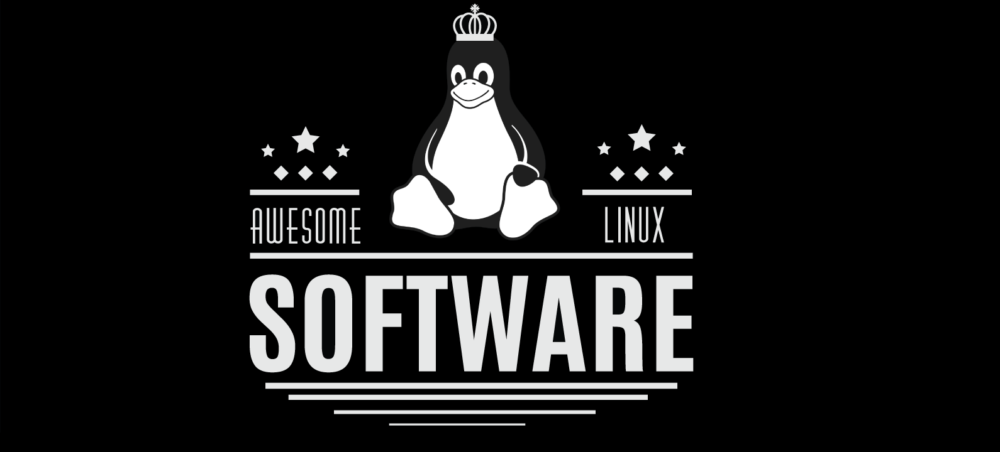

# برامج لينكس الرائعة

🐧 المستودع ده مجموعة من **برامج** و **أدوات رائعة** لنظام لينكس تناسب **أي مستخدمين/مطورين**.

🐧 متترددش في **المساهمة** / **تقييم** / **تفرع** / **طلب سحب**. أي **توصيات** أو **اقتراحات** مرحب بها.

**شكر وتقدير:** _كل اللي مكتوب تحت ده من تجربتي الشخصية في الجامعة وبعد ما قريت مواد مختلفة. أنا مش محترف ولا خبير، لكن مستخدم شغوف. أي حد يقدر يفتح نقاش في قسم القضايا، أو يطلب سحب لو في حاجة محتاجة تعديل أو إضافة._

- النسخة الإنجليزية: [هنا](https://github.com/luong-komorebi/Awesome-Linux-Software/blob/master/README.md).
- النسخة البرتغالية البرازيلية: [هنا](https://github.com/luong-komorebi/Awesome-Linux-Software/blob/master/README_pt-BR.md).
- النسخة الصينية: [هنا](https://github.com/luong-komorebi/Awesome-Linux-Software/blob/master/README_zh-CN.md) أو [هنا](https://github.com/eniqiz/Awesome-Linux-Software-zh_CN).
- النسخة الإسبانية: [هنا](https://github.com/luong-komorebi/Awesome-Linux-Software/blob/master/README_es-ES.md) أو [هنا](https://github.com/SaintFenix/Awesome-Linux-Software/blob/master/README_es-ES.md).
- النسخة التايلاندية: [هنا](https://github.com/luong-komorebi/Awesome-Linux-Software/blob/master/README_th-TH.md).

- [التطبيقات](#applications)
- [طباعة ثلاثية الأبعاد](#3d-printing)
- [صوتيات](#audio)
- [تعديل-خلط-تسجيل](#edit-mix-record)
- [مشغل موسيقى](#music-player)
- [راديو](#radio)
- [أدوات](#utilities)
- [عملاء دردشة](#chat-clients)
- [عميل طرف ثالث](#3rd-party-client)
- [عميل شامل](#all-in-one-client)
- [أدوات عميل الدردشة](#chat-client-utilities)
- [عميل IRC](#irc-client)
- [العميل الرسمي](#official-client)
- [نسخ البيانات الاحتياطي واستعادة البيانات](#data-backup-and-recovery)
- [تخصيص سطح المكتب](#desktop-customization)
- [حزم أيقونات سطح المكتب](#desktop-icon-packs)
- [ثيمات سطح المكتب](#desktop-themes)
- [أدوات ويدجت سطح المكتب والثيمات](#desktop-widgets-and-theme-utilities)
- [التطوير](#development)
- [أندرويد](#android)
- [C++](#c)
- [قاعدة البيانات](#database)
- [محركات الألعاب](#game-engines)
- [Git](#git)
- [Golang](#golang)
- [جافا](#java)
- [جافا سكريبت](#javascript)
- [أجهزة الكمبيوتر الصغيرة والأجهزة المدمجة](#microcomputer-and-embedded-devices)
- [دعم لغات متعددة](#multiple-languages-support)
- [PHP](#php)
- [بايثون](#python)
- [روبي](#ruby)
- [شل](#shell)
- [أدوات الدعم](#supporting-tools)
- [أدوات الكتب الإلكترونية](#e-book-utilities)
- [إلكترونيات](#electronic)
- [تعليم](#education)
- [بريد إلكتروني](#email)
- [مدير الملفات](#file-manager)
- [ألعاب](#games)
- [محاكاة بناء المدن](#city-building-simulation)
- [سطر الأوامر](#command-line)
- [إعادة إنشاء المحركات (تتطلب اللعبة الفعلية)](#engine-re-creations-require-the-actual-game)
- [FPS](#fps)
- [متنوعات](#miscellaneous)
- [ألغاز](#puzzle)
- [سباقات](#racing)
- [RPG](#rpg)
- [RT](#rt)
- [صندوق الرمل](#sandbox)
- [لعبة إطلاق نار](#shooter)
- [استراتيجية قائمة على الأدوار](#turn-based-strategy)
- [تطبيقات الألعاب](#gaming-applications)
- [مشغلات](#launchers)
- [أدوات](#tools)
- [W.I.N.E.](#wine)
- [محاكيات الآلات](#machine-emulators)
- [شامل](#all-in-one)
- [أتاري](#atari)
- [مايكروسوفت](#microsoft)
- [نينتندو](#nintendo)
- [سوني](#sony)
- [ZX Spectrum](#zx-spectrum)
- [رسوميات](#graphics)
- [إنشاء الرسوميات](#graphic-creation)
- [محرر الصور](#image-editor)
- [إدارة الصور](#image-management)
- [متنوعات](#miscellaneous-1)
- [فحص PSD و Sketch](#psd-sketch-inspection)
- [مسجل الشاشة](#screen-recorder)
- [لقطة شاشة](#screenshot)
- [بث مباشر](#streaming)
- [محرر الفيديو](#video-editor)
- [إنترنت](#internet)
- [متصفح](#browser)
- [أداة مساعدة](#supportive-tool)
- [عميل خدمة الويب](#web-service-client)
- [مكتب](#office)
- [محاسبة](#accounting)
- [حزم المكتب](#office-suites)
- [LaTeX](#latex)
- [Markdown](#markdown)
- [كتابة رواية](#novel-writing)
- [إنتاجية](#productivity)
- [أتمتة](#automation)
- [شريط المهام](#dock) <!-- Adjusted for cultural resonance -->
- [بحث محلي](#local-search)
- [متنوعات](#miscellaneous-2)
- [تدوين الملاحظات](#note-taking)
- [الوقت والمهام](#time-and-task)
- [متتبع الوقت والاستخدام](#time-and-usage-tracker)
- [ودجت ومؤشر](#widget-and-indicator)
- [بروكسي](#proxy)
- [أمان](#security)
- [سلامة الإقلاع](#boot-integrity)
- [تقسيم](#compartmentalization)
- [جدار ناري](#firewall)
- [تحليل الشبكة](#network-analysis)
- [مدير كلمات المرور](#password-manager)
- [هندسة عكسية](#reverse-engineering)
- [أخرى](#other)
- [مشاركة الملفات](#sharing-files)
- [خدمة التخزين السحابي](#cloud-drive)
- [مدير التحميل](#download-manager)
- [مشاركة الملفات](#file-sharing)
- [سطح المكتب البعيد](#remote-desktop)
- [عميل التورنت](#torrent-client)
- [ترمينال](#terminal)
- [محررات النصوص](#text-editors)
- [بيئة تطوير متكاملة مستوحاة / وصول مستخدم مشترك](#integrated-development-environment-inspired--common-user-access-based)
- [محررات نموذجية واشتقاقاتها](#modal-editors--derivatives)
- [محررات أخرى](#other-editors)
- [أدوات مساعدة](#utilities-1)
- [أدوات القرص](#disk-utilities)
- [صيانة النظام](#system-maintenance)
- [مراقبة النظام](#system-monitoring)
- [أخرى](#other-1)
- [فيديو](#video)
- [VPN](#vpn)
- [برنامج ويكي](#wiki-software)
- [أخرى](#others)
- [أدوات سطر الأوامر](#command-line-utilities)
- [إنترنت](#internet-1)
- [معلومات النظام / مراقبة](#system-info--monitoring)
- [أدوات](#tools-1)
- [نوى لينكس مخصصة](#custom-linux-kernels)
- [بيئات سطح المكتب](#desktop-environments)
- [مدير الشاشة](#display-manager)
- [الكونسول](#console)
- [الجرافيك](#graphic)
- [مديري النوافذ](#window-managers)
- [المركبات](#compositors)
- [مديري النوافذ المتداخلة](#stacking-window-managers)
- [مديري النوافذ الموزعة](#tiling-window-managers)
- [مديري النوافذ الديناميكيين](#dynamic-window-managers)
- [أخبار لينكس، التطبيقات، وأكثر:](#linux-news-apps-and-more)
- [ريدت](#reddit)
- [المساهمين](#contributors)
- [إرشادات للمساهمة](#guidelines-to-contribute)
- [مش عارف تساهم إزاي؟](#unsure-how-to-contribute)
- [الرخصة](#license)

##التطبيقات

### الطباعة ثلاثية الأبعاد

- [![برمجيات مفتوحة المصدر][أيقونة oss]](https://github.com/Ultimaker/Cura) [Cura](https://ultimaker.com/software/ultimaker-cura/) - برنامج الطابعة ثلاثية الأبعاد الأكثر تقدمًا في العالم.
- [![برنامج مفتوح المصدر][أيقونة oss]](https://github.com/FreeCAD) [FreeCAD](https://www.freecad.org/) - برنامج مفتوح المصدر لنمذجة CAD ثلاثية الأبعاد.
- [![برمجيات مفتوحة المصدر][أيقونة oss]](https://github.com/prusa3d/PrusaSlicer) [PrusaSlicer](https://www.prusa3d.com/page/prusaslicer_424/) - أداة تقطيع تعتمد على Slic3r بواسطة Alessandro Ranellucci ومجتمع RepRap.
- [![برمجيات مفتوحة المصدر][أيقونة oss]](https://github.com/slic3r/Slic3r) [Slic3r](https://slic3r.org/) - مولد مسار أداة مفتوح المصدر للطابعات ثلاثية الأبعاد.

### صوتي

للحصول على قائمة أكثر شمولاً/تقدمًا/تصنيفًا أفضل/... لبرامج الصوت لنظام Linux، قد ترغب في النقر [هنا](https://github.com/nodiscc/awesome-linuxaudio)_

#### تحرير-مزج-تسجيل

- [![برمجيات مفتوحة المصدر][أيقونة oss]](https://github.com/Ardour/ardour) [Ardour](https://ardour.org/) - قم بالتسجيل والتحرير والمزج على Linux.
- [![برمجيات مفتوحة المصدر][أيقونة oss]](https://github.com/audacity/audacity) [Audacity](https://www.audacityteam.org/download/linux/) - برنامج مجاني مفتوح المصدر ومتعدد المنصات لتسجيل وتحرير الأصوات.
- [![برمجيات مفتوحة المصدر][أيقونة oss]](https://bazaar.launchpad.net/~audio-recorder/audio-recorder/trunk/files) [مسجل الصوت](https://launchpad.net/~audio-recorder) - مسجل صوت بسيط متاح في Ubuntu PPA.
- ![غير مجاني][أيقونة المال] [Bitwig](https://www.bitwig.com/en/download.html) - برنامج DAW لإنتاج الموسيقى.
- [![برنامج مفتوح المصدر][أيقونة oss]](https://github.com/wwmm/easyeffects) [EasyEffects](https://github.com/wwmm/easyeffects) - EasyEffects هي أداة متقدمة للتلاعب بالصوت. وهي تتضمن موازنًا ومحددًا وضاغطًا وأداة صدى، على سبيل المثال لا الحصر. ولإكمال ذلك، يوجد أيضًا محلل طيف مدمج.
- [![برمجيات مفتوحة المصدر][أيقونة oss]](https://github.com/mtytel/helm) [Helm](https://tytel.org/helm/) - برنامج مركب يعمل إما بشكل مستقل أو كمكون إضافي LV2 أو VST أو VST3 أو AU.
- [![برمجيات مفتوحة المصدر][أيقونة oss]](https://github.com/hydrogen-music/hydrogen) [Hydrogen](http://www.hydrogen-music.org/) - آلة طبول متقدمة لنظام GNU/Linux.
- [![برمجيات مفتوحة المصدر][أيقونة oss]](https://github.com/KXStudio/Repository) [KxStudio](https://kx.studio/) - مجموعة من التطبيقات والمكونات الإضافية لإنتاج الصوت الاحترافي.
- [![برمجيات مفتوحة المصدر][أيقونة oss]](https://github.com/LMMS/lmms) [LMMS](https://lmms.io/download/#linux) - إنشاء الموسيقى على جهاز الكمبيوتر الخاص بك عن طريق إنشاء الألحان والإيقاعات، وتوليف الأصوات وخلطها، وترتيب العينات وغير ذلك الكثير.
- [![برمجيات مفتوحة المصدر][أيقونة oss]](https://github.com/mixxxdj/mixxx) [Mixxx](https://www.mixxx.org/download/) - برنامج DJ مجاني يوفر لك كل ما تحتاجه لأداء المزيجات الحية؛ وهو بديل حقيقي لبرنامج Traktor.
- [![برمجيات مفتوحة المصدر][أيقونة oss]](https://github.com/musescore/MuseScore) [MuseScore](https://musescore.org) - قم بإنشاء وتشغيل وطباعة نوتات موسيقية جميلة.
- ![غير مجاني][أيقونة المال] [Reaper](https://www.reaper.fm/) - إنتاج صوتي بلا حدود.
- [![برمجيات مفتوحة المصدر][أيقونة oss]](https://github.com/VCVRack/Rack) [VCV Rack](https://vcvrack.com/) - مُركِّب صوتي معياري افتراضي مفتوح المصدر.
- [![برمجيات مفتوحة المصدر][أيقونة oss]](https://github.com/Audio4Linux/Viper4Linux-GUI) [Viper4Linux](https://github.com/Audio4Linux/Viper4Linux-GUI) - معالج تأثيرات صوتية يعتمد على Viper4Android.

#### مشغل الموسيقى

- [![برمجيات مفتوحة المصدر][أيقونة oss]](https://gitlab.gnome.org/World/amberol) [Amberol](https://apps.gnome.org/app/io.bassi.Amberol/) - مشغل صوت وموسيقى صغير وبسيط ومتكامل بشكل جيد مع GNOME.
- [![برمجيات مفتوحة المصدر][أيقونة oss]](https://audacious-media-player.org/developers) [Audacious](https://audacious-media-player.org/) - مشغل صوتي مفتوح المصدر يقوم بتشغيل الموسيقى بالطريقة التي تريدها، دون سرقة موارد جهاز الكمبيوتر الخاص بك من المهام الأخرى.
- [![برمجيات مفتوحة المصدر][أيقونة oss]](https://invent.kde.org/multimedia/audiotube) [AudioTube](https://apps.kde.org/audiotube/) - عميل YouTube Music غني بالميزات لنظام التشغيل KDE، تم إنشاؤه باستخدام Kirigami.
- [![برمجيات مفتوحة المصدر][أيقونة oss]](https://github.com/beetbox/beets) [beets](https://beets.io/) - Beets هو نظام إدارة مكتبة الوسائط لمحبي الموسيقى المهووسين.
- [![برمجيات مفتوحة المصدر][أيقونة oss]](https://github.com/CDrummond/cantata) [Cantata](https://github.com/CDrummond/cantata) - عميل Qt5 الرسومي MPD (شيطان مشغل الموسيقى) لنظام Linux وWindows وMacOS.
- [![برمجيات مفتوحة المصدر][أيقونة oss]](https://github.com/ciderapp/cider) [Cider](https://cider.sh/) - تجربة Apple Music جديدة متعددة الأنظمة تعتمد على Electron وVue.js مكتوبة من الصفر مع وضع الأداء في الاعتبار.
- [![برمجيات مفتوحة المصدر][أيقونة oss]](https://github.com/clementine-player/Clementine) [Clementine](https://www.clementine-player.org/) - تشغيل العديد من تنسيقات الصوت التي بها فقدان للبيانات أو التي لا بها فقدان للبيانات.
- [![برمجيات مفتوحة المصدر][أيقونة oss]](https://github.com/cmus/cmus) [Cmus](https://cmus.github.io/#download) - مشغل موسيقى وحدة تحكم صغير وسريع وقوي لأنظمة التشغيل الشبيهة بنظام Unix.
- [![برمجيات مفتوحة المصدر][أيقونة oss]](https://github.com/DeaDBeeF-Player/deadbeef) [DeaDBeeF](https://deadbeef.sourceforge.io/) - DeaDBeeF هو مشغل صوت معياري لأنظمة GNU/Linux وBSD وOpenSolaris وmacOS وأنظمة أخرى شبيهة بأنظمة UNIX.
- [![برمجيات مفتوحة المصدر][أيقونة oss]](https://github.com/linuxdeepin/deepin-music) [موسيقى Deepin](https://www.deepin.org/en/original/deepin-music/) - تطبيق تم تطويره بواسطة فريق Deepin Technology، والذي يركز على تشغيل الموسيقى المحلية.
- [![برمجيات مفتوحة المصدر][أيقونة oss]](https://invent.kde.org/multimedia/elisa) [Elisa](https://apps.kde.org/elisa/) - Elisa هو مشغل موسيقى تم تطويره بواسطة مجتمع KDE الذي يسعى جاهداً ليكون بسيطًا وسهل الاستخدام.
- [![برمجيات مفتوحة المصدر][أيقونة oss]](https://gitlab.gnome.org/neithern/g4music) [G4Music](https://gitlab.gnome.org/neithern/g4music) - مشغل موسيقى سريع وسلس وخفيف الوزن مكتوب بلغة GTK4.
- [![برمجيات مفتوحة المصدر][أيقونة oss]](https://github.com/gpodder/gpodder) [Gpodder](https://gpodder.github.io/) - مجمع وسائط وعميل بودكاست.
- [![برنامج مفتوح المصدر][أيقونة oss]](https://github.com/harmonoid/harmonoid) [Harmonoid](https://harmonoid.com/) - يشغل مكتبة الموسيقى الخاصة بك ويديرها. يبدو جميلاً ورائعاً. قوائم تشغيل، ومرئيات، وكلمات متزامنة، وتغيير درجة الصوت، وزيادة مستوى الصوت والمزيد.
- [![برمجيات مفتوحة المصدر][أيقونة oss]](https://github.com/trazyn/ieaseMusic) [ieaseMusic](https://github.com/trazyn/ieaseMusic) - iEaseMusic هو برنامج متعدد المنصات تم إنشاؤه في إلكترونيا للاستماع إلى NetEase Music.
- [![برمجيات مفتوحة المصدر][أيقونة oss]](https://invent.kde.org/multimedia/juk) [JuK](https://juk.kde.org/) - مشغل موسيقى Jukebox لإدارة الصوت وتحرير البيانات الوصفية.
- [![برمجيات مفتوحة المصدر][أيقونة oss]](https://github.com/LibreTime/libretime) [Libretime](https://libretime.org/) - برنامج البث المفتوح للجدولة وإدارة المحطات عن بعد؛ متفرع من Airtime.
- [![برمجيات مفتوحة المصدر][أيقونة oss]](https://gitlab.gnome.org/World/lollypop) [Lollypop](https://wiki.gnome.org/Apps/Lollypop) - تطبيق تشغيل موسيقى GNOME.
- [![برمجيات مفتوحة المصدر][أيقونة oss]](https://gitlab.com/ColinDuquesnoy/MellowPlayer) [Mellow Player](https://colinduquesnoy.gitlab.io/MellowPlayer/) - تكامل الموسيقى السحابية لسطح المكتب الخاص بك.
- [![برمجيات مفتوحة المصدر][أيقونة oss]](https://gitlab.com/zehkira/monophony) [Monophony](https://gitlab.com/zehkira/monophony) - تطبيق Linux لبث الموسيقى من YouTube.
- [![برمجيات مفتوحة المصدر][أيقونة oss]](https://github.com/Moosync/Moosync) [Moosync](https://moosync.app/) - مشغل موسيقى سطح مكتب قابل للتخصيص مع واجهة نظيفة لبث الموسيقى المحلية بالإضافة إلى الموسيقى من المصادر عبر الإنترنت مثل YouTube وSpotify.
- [![برمجيات مفتوحة المصدر][أيقونة oss]](https://github.com/mopidy/mopidy) [Mopidy](https://www.mopidy.com/) - خادم موسيقى قابل للتوسعة مكتوب بلغة بايثون.
- [![برمجيات مفتوحة المصدر][أيقونة oss]](https://github.com/staniel359/muffon) [muffon](https://muffon.netlify.app/) - muffon هو متصفح بث موسيقى متعدد الأنظمة لسطح المكتب، يساعدك في العثور على الموسيقى والاستماع إليها وتنظيمها بطريقة لم تجربها على الأرجح من قبل.
- [![برمجيات مفتوحة المصدر][أيقونة oss]](https://github.com/martpie/museeks) [Museeks](https://museeks.io/) - مشغل موسيقى بسيط ونظيف ومتعدد الأنظمة الأساسية.
- [![برمجيات مفتوحة المصدر][أيقونة oss]](https://github.com/metabrainz/picard) [MusicBrainz Picard](https://picard.musicbrainz.org/) - Picard هو برنامج وسم موسيقى متعدد الأنظمة مكتوب بلغة بايثون.
- [Netease Music](https://music.163.com/#/download) - مشغل موسيقى من Netease - خدمة موسيقى سحابية في الصين.
- [![برمجيات مفتوحة المصدر][أيقونة oss]](https://github.com/nukeop/nuclear) [Nuclear](https://nuclearplayer.com/) - تطبيق مشغل موسيقى متعدد المنصات يعتمد على Electron ويقوم بالبث من مصادر متعددة.
- [Ocenaudio](https://www.ocenaudio.com/whatis) - محرر صوتي متعدد المنصات وسهل الاستخدام وسريع وعملي. إنه البرنامج المثالي للأشخاص الذين يحتاجون إلى تحرير وتحليل ملفات الصوت.
- [![برمجيات مفتوحة المصدر][أيقونة oss]](https://github.com/gkarsay/parlatype) [Parlatype](https://www.parlatype.xyz/) - مشغل صوت GNOME للنسخ.
- [![برمجيات مفتوحة المصدر][أيقونة oss]](https://github.com/pithos/pithos) [Pithos](https://pithos.github.io/) - عميل Pandora أصلي لنظام Linux.
- [![برمجيات مفتوحة المصدر][أيقونة oss]](https://github.com/quodlibet/quodlibet) [Quod Libet](https://quodlibet.readthedocs.io) - مشغل موسيقى GTK+ مكتوب مع وضع مكتبات ضخمة في الاعتبار. يدعم قوائم التشغيل الديناميكية القائمة على البحث، والتعبيرات العادية، والوسوم، وميزة Replay Gain، والبودكاست، والراديو عبر الإنترنت.
- [![برمجيات مفتوحة المصدر][أيقونة oss]](https://github.com/GNOME/rhythmbox) [Rhythmbox](https://wiki.gnome.org/Apps/Rhythmbox) - مشغل موسيقى من GNOME.
- [![برمجيات مفتوحة المصدر][أيقونة oss]](https://gitlab.com/luciocarreras/sayonara-player) [Sayonara Player](https://sayonara-player.com/downloads/) - مشغل صوت صغير وواضح وسريع لنظام Linux مكتوب بلغة C++، ويدعمه إطار عمل Qt.
- [![برمجيات مفتوحة المصدر][أيقونة oss]](https://github.com/multani/sonata/) [Sonata](https://www.nongnu.org/sonata/) - مشغل موسيقى مصمم ليكون واجهة أنيقة وبديهية لمجموعة الموسيقى الخاصة بك عبر Music Player Daemon (MPD).
- [![برنامج مفتوح المصدر][أيقونة oss]](https://github.com/Soundnode/soundnode-app) [Soundnode](https://soundnode.github.io/soundnode-website/) - تطبيق SoundCloud مفتوح المصدر لسطح المكتب.
- [![برمجيات مفتوحة المصدر][أيقونة oss]](https://github.com/xou816/spot) [Spot](https://github.com/xou816/spot) - عميل Spotify الأصلي لسطح مكتب GNOME.
- [Spotify](https://www.spotify.com/us/) - Spotify هي أفضل طريقة للاستماع إلى الموسيقى والبودكاست على الكمبيوتر الشخصي أو الهاتف المحمول أو الجهاز اللوحي.
- [![برمجيات مفتوحة المصدر][أيقونة oss]](https://github.com/krtirtho/spotube) [Spotube](https://spotube.krtirtho.dev/) - Spotube هو عميل Spotify خفيف الوزن يعتمد على Flutter. إنه يستخدم قوة واجهة برمجة التطبيقات العامة لـ Spotify وYoutube ويخلق تجربة مستخدم خالية من المخاطر وعالية الأداء وصديقة للموارد.
- [![برمجيات مفتوحة المصدر][أيقونة oss]](https://github.com/strawberrymusicplayer/strawberry) [Strawberry](https://www.strawberrymusicplayer.org/) - Strawberry هو فرع من Clementine يستهدف جامعي الموسيقى وعشاق الصوت. وهو مكتوب بلغة C++ باستخدام مجموعة أدوات Qt.
- [![برمجيات مفتوحة المصدر][أيقونة oss]](https://github.com/Mastermindzh/tidal-hifi) [Tidal-hifi](https://github.com/Mastermindzh/tidal-hifi) - إصدار الويب من Tidal يعمل في electron مع دعم hifi بفضل widevine.
- [![برنامج مفتوح المصدر][أيقونة oss]](https://github.com/th-ch/youtube-music) [Youtube-Music](https://th-ch.github.io/youtube-music/) - تطبيق YouTube Music لسطح المكتب مضمّن مع مكونات إضافية مخصصة (ومانع إعلانات/أداة تنزيل مدمجة)

#### راديو

- [![برنامج مفتوح المصدر][رمز oss]](https://github.com/chronitis/curseradio) [curseradio](https://github.com/chronitis/curseradio) - مشغل راديو سطر الأوامر.
- [![برمجيات مفتوحة المصدر][أيقونة oss]](https://invent.kde.org/multimedia/kasts) [Kasts](https://apps.kde.org/kasts/) - عميل بودكاست متقارب وغني بالميزات لأجهزة سطح المكتب والأجهزة المحمولة التي تعمل بنظام Linux.
- [![برنامج مفتوح المصدر][رمز oss]](https://github.com/ebruck/radiotray-ng) [RadioTray-NG](https://github.com/ebruck/radiotray-ng) - مشغل راديو الإنترنت لنظام التشغيل Linux.
- [![برمجيات مفتوحة المصدر][أيقونة oss]](https://gitlab.gnome.org/World/Shortwave) [Shortwave](https://apps.gnome.org/app/de.haeckerfelix.Shortwave/) - Shortwave هو مشغل راديو عبر الإنترنت يوفر الوصول إلى قاعدة بيانات محطات تحتوي على أكثر من 25000 محطة.
- [![برمجيات مفتوحة المصدر][أيقونة oss]](https://github.com/needle-and-thread/vocal) [Vocal](https://vocalproject.net/) - عميل بودكاست لسطح المكتب الحديث.

#### المرافق

- [![برمجيات مفتوحة المصدر][أيقونة oss]](https://github.com/karlstav/cava) [cava](https://github.com/karlstav/cava) - Cava هو برنامج مرئي صوتي متعدد الأنظمة.
- [![برمجيات مفتوحة المصدر][أيقونة oss]](https://gitlab.gnome.org/World/eartag) [علامة الأذن](https://apps.gnome.org/EarTag/) - محرر علامات ملفات صوتية صغير وبسيط.
- [![برمجيات مفتوحة المصدر][أيقونة oss]](https://github.com/GNOME/easytag) [EasyTag](https://github.com/GNOME/easytag) - تحرير بيانات تعريف ملف الصوت.
- [![برنامج مفتوح المصدر][أيقونة oss]](https://github.com/enzo1982/freac) [fre:ac](https://www.freac.org) - fre:ac هو محول صوتي مجاني وناسخ أقراص مضغوطة يدعم العديد من التنسيقات الشائعة وبرامج الترميز. يحول حاليًا بين تنسيقات MP3 وMP4/M4A وWMA وOgg Vorbis وFLAC وAAC وWAV وBonk.
- [![برمجيات مفتوحة المصدر][أيقونة oss]](https://github.com/KDE/k3b) [K3b](https://userbase.kde.org/K3b) - برنامج CD/DVD Kreator لنظام Linux، المُحسّن لـ KDE.
- [![برمجيات مفتوحة المصدر][أيقونة oss]](https://invent.kde.org/multimedia/kid3/) [Kid3](https://kid3.kde.org/) - تحرير علامات ملفات متعددة، مثل الفنان والألبوم والسنة والنوع لجميع ملفات mp3 في الألبوم.
- [![برمجيات مفتوحة المصدر][أيقونة oss]](https://github.com/orhun/linuxwave) [linuxwave](https://orhun.dev/linuxwave/) - توليد الموسيقى من إنتروبيا لينكس
- [![برمجيات مفتوحة المصدر][أيقونة oss]](https://github.com/SeaDve/Mousai) [Mousai](https://apps.gnome.org/app/io.github.seadve.Mousai/) - Mousai هو تطبيق بسيط يمكنه التعرف على الأغاني المشابهة لشازام.
- [MusixMatch](https://snapcraft.io/musixmatch) - تطبيق كلمات الأغاني قادر على مزامنة الكلمات.
- [![برمجيات مفتوحة المصدر][أيقونة oss]](https://github.com/osdlyrics/osdlyrics) [كلمات الأغاني OSD](https://github.com/osdlyrics/osdlyrics) - اعرض كلمات الأغاني باستخدام مشغل الوسائط المفضل لديك.
- [![برنامج مفتوح المصدر][أيقونة oss]](https://launchpad.net/soundconverter) [Soundconverter](https://soundconverter.org/) - محول ملفات صوتية رائد. يهدف إلى أن يكون سهل الاستخدام وسريعًا للغاية.
- [![برمجيات مفتوحة المصدر][أيقونة oss]](https://gitlab.gnome.org/GNOME/sound-juicer) [SoundJuicer](https://wiki.gnome.org/Apps/SoundJuicer/Documentation#Installing) - أداة تمزيق الأقراص المضغوطة لـ GNOME.
- [![برنامج مفتوح المصدر][رمز oss]](https://github.com/Soundux/Soundux) [Soundux](https://soundux.rocks/) - لوحة صوت متعددة المنصات.
- [![برنامج مفتوح المصدر][أيقونة oss]](https://github.com/spicetify/spicetify-cli) [Spicetify](https://spicetify.app/) - أداة سطر أوامر لتخصيص عميل Spotify الرسمي. تدعم أنظمة Windows وMacOS وLinux.

### عملاء الدردشة

#### عميل الطرف الثالث

- [![برنامج مفتوح المصدر][رمز oss]](https://github.com/sindresorhus/caprine) [Caprine](https://sindresorhus.com/caprine) - تطبيق Facebook Messenger الأنيق لسطح المكتب.
- [![برمجيات مفتوحة المصدر][أيقونة oss]](https://github.com/chatterino/chatterino2) [Chatterino](https://chatterino.com/) - Chatterino هو عميل دردشة لدردشة Twitch. ويهدف إلى أن يكون نسخة محسنة/ممتدة من دردشة الويب Twitch.
- [![برمجيات مفتوحة المصدر][أيقونة oss]](https://github.com/chatty/chatty) [Chatty](https://chatty.github.io/) - Chatty هو عميل دردشة Twitch لأي شخص يريد تجربة شيء جديد ومختلف عن الدردشة عبر الويب، لكنه لا يريد تعقيد عميل IRC أو تفويت ميزات Twitch المحددة.
- [![برمجيات مفتوحة المصدر][أيقونة oss]](https://gitlab.gnome.org/GNOME/fractal) [Fractal](https://wiki.gnome.org/Apps/Fractal) - Fractal هو تطبيق مراسلة Matrix لنظام GNOME مكتوب بلغة Rust. تم تحسين واجهته للتعاون في مجموعات كبيرة، مثل مشاريع البرمجيات الحرة.
- [![برمجيات مفتوحة المصدر][أيقونة oss]](https://invent.kde.org/network/neochat) [NeoChat](https://apps.kde.org/neochat/) - NeoChat هو عميل Matrix. يسمح لك بإرسال رسائل نصية ومقاطع فيديو وملفات صوتية إلى عائلتك وزملائك وأصدقائك باستخدام بروتوكول Matrix.
- [![برمجيات مفتوحة المصدر][أيقونة oss]](https://github.com/Nheko-Reborn/nheko) [nheko](https://nheko-reborn.github.io/) - عميل سطح مكتب لـ Matrix باستخدام Qt وC++20.
- [![برمجيات مفتوحة المصدر][أيقونة oss]](https://invent.kde.org/network/tokodon) [Tokodon](https://apps.kde.org/tokodon/) - Tokodon هو عميل Mastodon لـ Plasma وPlasma Mobile.
- [![برمجيات مفتوحة المصدر][أيقونة oss]](https://github.com/SpacingBat3/WebCord) [WebCord](https://github.com/SpacingBat3/WebCord) - عميل ويب قائم على Discord وFosscord تم إنشاؤه باستخدام الإلكترون.
- [![برمجيات مفتوحة المصدر][أيقونة oss]](https://gitlab.com/zerkc/whatsdesk) [WhatsDesk](https://zerkc.gitlab.io/whatsdesk/) - WhatsDesk هو عميل غير رسمي لـ WhatsApp.

#### عميل الكل في واحد

- [![Open-Source-Software][oss icon]](https://github.com/ferdium/ferdium-app) [Ferdium](https://ferdium.org/) - شوكة Ferdi/Franz. Ferdium هو تطبيق سطح مكتب يساعدك على تنظيم كيفية استخدام تطبيقاتك المفضلة من خلال دمجها في تطبيق واحد.
- [![برمجيات مفتوحة المصدر][أيقونة oss]](https://github.com/meetfranz/franz) [Franz](https://meetfranz.com/) - Franz هو تطبيق مراسلة مجاني يجمع العديد من خدمات الدردشة والمراسلة في تطبيق واحد.
- [![برمجيات مفتوحة المصدر][أيقونة oss]](https://developer.pidgin.im/) [Pidgin](https://pidgin.im/) - عميل دردشة عالمي.
- [Rambox](https://rambox.app/) - تطبيق مراسلة وبريد إلكتروني مجاني ومتعدد المنصات يجمع بين تطبيقات الويب الشائعة في تطبيق واحد.
- [![برمجيات مفتوحة المصدر][أيقونة oss]](https://github.com/sonnyp/Tangram) [Tangram](https://apps.gnome.org/app/re.sonny.Tangram/) - Tangram هو نوع جديد من المتصفحات. وهو مصمم لتنظيم وتشغيل تطبيقات الويب الخاصة بك.

#### أدوات عميل الدردشة

- [![برمجيات مفتوحة المصدر][أيقونة oss]](https://github.com/BetterDiscord/BetterDiscord) [BetterDiscord](https://betterdiscord.app/) - يعمل BetterDiscord على توسيع وظائف DiscordApp من خلال تحسينها بميزات جديدة.
- [![برمجيات مفتوحة المصدر][أيقونة oss]](https://github.com/trigg/Discover) [Discover](https://trigg.github.io/Discover/) - طبقة Discord أخرى لنظام Linux مكتوبة بلغة Python باستخدام GTK3.
- [![برمجيات مفتوحة المصدر][أيقونة oss]](https://github.com/jagrosh/MusicBot) [JMusicBot](https://jmusicbot.com/) - روبوت موسيقى Discord سهل الإعداد وتشغيله بنفسك.
- [![برمجيات مفتوحة المصدر][أيقونة oss]](https://github.com/Cog-Creators/Red-DiscordBot) [روبوت Red Discord](https://index.discord.red/) - يعد Red Discord Bot روبوت موسيقى/دردشة/توافه يتم استضافته ذاتيًا ويمكن تشغيله على Raspberry Pi ومجموعة متنوعة من أنظمة التشغيل. ويمكن توسيعه من خلال نظام "Cogs" الذي يسمح له بالقيام بالمزيد.
- [![برمجيات مفتوحة المصدر][أيقونة oss]](https://github.com/Vendicated/Vencord) [Vencord](https://vencord.dev/) - أجمل تعديل لعميل Discord.

#### عميل IRC

- [![برمجيات مفتوحة المصدر][أيقونة oss]](https://github.com/hexchat) [HexChat](https://hexchat.github.io/) - HexChat هو عميل IRC يعتمد على XChat، ولكن على عكس XChat فهو مجاني تمامًا لكل من أنظمة Windows وUnix-like.
- [![برمجيات مفتوحة المصدر][أيقونة oss]](https://github.com/irssi/irssi) [Irssi](https://irssi.org/) - Irssi هو عميل دردشة معياري يُعرف عادةً بواجهة المستخدم ذات الوضع النصي.
- [![برمجيات مفتوحة المصدر][أيقونة oss]](https://invent.kde.org/network/konversation) [Konversation](https://konversation.kde.org/) - عميل IRC سهل الاستخدام وذو ميزات كاملة.
- [![برمجيات مفتوحة المصدر][أيقونة oss]](https://github.com/kvirc/KVIrc) [KVIrc](https://www.kvirc.net/) - KVIrc هو عميل IRC محمول مجاني يعتمد على مجموعة أدوات Qt GUI الممتازة.
- [![برمجيات مفتوحة المصدر][أيقونة oss]](https://gitlab.gnome.org/GNOME/polari) [Polari](https://wiki.gnome.org/Apps/Polari) - عميل IRC بسيط تم تصميمه للتكامل بسلاسة مع GNOME.
- [![برمجيات مفتوحة المصدر][أيقونة oss]](https://github.com/weechat/weechat) [WeeChat](https://weechat.org/) - WeeChat هو عميل دردشة سريع وخفيف وقابل للتوسعة.

#### العميل الرسمي

- [![Open-Source-Software][oss icon]](https://sourceforge.net/p/beebeep/code/HEAD/tree/) [BeeBEEP](https://www.beebeep.net/) - BeeBEEP هو برنامج مراسلة مفتوح المصدر يعمل بنظام نظير إلى نظير. يمكنك التحدث ومشاركة الملفات مع أي شخص داخل شبكتك المحلية. لست بحاجة إلى خادم، فقط قم بتنزيله وفك ضغطه وبدء تشغيله. بسيط وسريع وآمن.
- [![برمجيات مفتوحة المصدر][أيقونة oss]](https://github.com/dino/dino) [Dino](https://dino.im) - عميل دردشة Jabber/XMPP نظيف وحديث.
- [Discord](https://discord.com/) - دردشة صوتية ونصية شاملة للاعبين مجانية وآمنة وتعمل على كل من سطح المكتب والهاتف.
- [![برمجيات مفتوحة المصدر][أيقونة oss]](https://github.com/vector-im/element-web) [Element](https://element.io/) - عميل تعاون Matrix لامع للويب.
- [![برمجيات مفتوحة المصدر][أيقونة oss]](https://gitlab.com/gitlab-org/gitter/services) [Gitter](https://gitter.im/) - Gitter — حيث يأتي المطورون للتحدث. تم تصميم Gitter لجعل المراسلة المجتمعية والتعاون والاستكشاف سلسة وبسيطة قدر الإمكان.
- [Guilded](https://www.guilded.gg/) - Guilded هو أفضل تطبيق للدردشة أثناء اللعب. Guilded مثالي للعب مع الأصدقاء والعشائر والنقابات والمجتمعات والرياضات الإلكترونية وLFG والفرق. وهو مجاني.
- [![برمجيات مفتوحة المصدر][أيقونة oss]](https://git.jami.net/savoirfairelinux) [Jami](https://jami.net/) - دردشة. تحدث. شارك. Jami عبارة عن منصة اتصال مجانية وعالمية تحافظ على خصوصية المستخدمين وحرياتهم. كانت تُعرف سابقًا باسم Ring.
- [![برمجيات مفتوحة المصدر][أيقونة oss]](https://github.com/jitsi) [Jitsi](https://jitsi.org/) - Jitsi هو تطبيق مجاني ومفتوح المصدر متعدد المنصات للصوت والفيديو والمراسلة الفورية لأنظمة Windows وLinux وMac OS X وAndroid.
- [![برمجيات مفتوحة المصدر][أيقونة oss]](https://github.com/mattermost/) [Mattermost](https://mattermost.com/) - Mattermost عبارة عن منصة تعاون آمنة مفتوحة ومرنة ومتكاملة بشكل عميق مع الأدوات التي تحبها.
- [![برمجيات مفتوحة المصدر][أيقونة oss]](https://github.com/qTox/qTox) [qTox](https://qtox.github.io/) - برنامج مراسلة بسيط وموزع وآمن مع إمكانيات الدردشة الصوتية والمرئية.
- [![برمجيات مفتوحة المصدر][أيقونة oss]](https://github.com/revoltchat) [Revolt](https://revolt.chat/) - Revolt عبارة عن منصة دردشة مفتوحة المصدر تركز على المستخدم أولاً.
- [![برمجيات مفتوحة المصدر][أيقونة oss]](https://github.com/RocketChat/Rocket.Chat) [Rocket.Chat](https://rocket.chat/) - Rocket.Chat عبارة عن منصة اتصالات مفتوحة المصدر قابلة للتخصيص بالكامل تم تطويرها بلغة JavaScript للمؤسسات ذات المعايير العالية لحماية البيانات.
- [![برمجيات مفتوحة المصدر][أيقونة oss]](https://github.com/oxen-io) [جلسة](https://getsession.org/) - الجلسة عبارة عن رسول مشفر من البداية إلى النهاية يقلل من البيانات الوصفية الحساسة، وهو مصمم ومبني للأشخاص الذين يريدون الخصوصية المطلقة والحرية من أي شكل من أشكال المراقبة.
- [![برنامج مفتوح المصدر][أيقونة oss]](https://github.com/signalapp) [Signal](https://signal.org) - تطبيق دردشة مشفر من البداية إلى النهاية يركز على الخصوصية للجميع. قل "مرحبًا" بالخصوصية.
- [Skype](https://www.skype.com/en/) - يتيح لك Skype التواصل مع العالم مجانًا.
- [Slack](https://slack.com/downloads/linux) - المراسلة في الوقت الفعلي والأرشفة والبحث للفرق الحديثة.
- [![برمجيات مفتوحة المصدر][أيقونة oss]](https://github.com/telegramdesktop/tdesktop) [Telegram](https://desktop.telegram.org/) - تطبيق مراسلة يركز على السرعة والأمان، فهو سريع للغاية وبسيط ومجاني.
- [![برنامج مفتوح المصدر][رمز oss]](https://github.com/linagora/Twake) [Twake](https://twake.app/) - بديل مفتوح المصدر لـ Microsoft Teams.
- [Viber](https://www.viber.com/download/) - يتيح لك Viber for Linux إرسال رسائل مجانية وإجراء مكالمات مجانية لمستخدمي Viber الآخرين على أي جهاز وشبكة، في أي بلد.
- [![برمجيات مفتوحة المصدر][أيقونة oss]](https://github.com/wireapp) [Wire](https://wire.com/en/) - اتصال آمن. خصوصية كاملة.
- [![برمجيات مفتوحة المصدر][أيقونة oss]](https://github.com/zulip/zulip) [Zulip](https://zulip.com/) - Zulip هو تطبيق محادثة جماعية قوي ومفتوح المصدر يجمع بين فورية الدردشة في الوقت الفعلي وفوائد الإنتاجية للمحادثات المترابطة.

### النسخ الاحتياطي للبيانات واستردادها

- [![برمجيات مفتوحة المصدر][أيقونة oss]](https://github.com/bit-team/backintime/) [Back In Time](https://github.com/bit-team/backintime/) - أداة نسخ احتياطي بسيطة لنظام Linux، مستوحاة من "مشروع flyback".
- [![برمجيات مفتوحة المصدر][أيقونة oss]](https://borgbackup.readthedocs.io/en/stable/development.html) [BorgBackup](https://borgbackup.readthedocs.io/en/stable/) - برنامج نسخ احتياطي لإزالة التكرارات باستخدام الضغط والتشفير المعتمد.
- [![برمجيات مفتوحة المصدر][أيقونة oss]](https://github.com/bup/bup) [bup](https://bup.github.io/) - نظام نسخ احتياطي فعال للغاية يعتمد على تنسيق ملف حزمة git، مما يوفر عمليات حفظ تدريجية سريعة وإزالة التكرار العالمي (بين الملفات وداخلها، بما في ذلك صور الآلة الافتراضية).
- [![برمجيات مفتوحة المصدر][أيقونة oss]](https://gitlab.gnome.org/World/deja-dup) [Deja Dup](https://wiki.gnome.org/Apps/DejaDup) - أداة نسخ احتياطي بسيطة مع تشفير مدمج.
- [![برنامج مفتوح المصدر][أيقونة oss]](https://github.com/gilbertchen/duplicacy) [Duplicacy](https://duplicacy.com/) - Duplicacy هي أداة نسخ احتياطي سحابي متعددة الأنظمة من الجيل الجديد تعتمد على فكرة إزالة التكرار بدون قفل. إصدار CLI مجاني للاستخدام الشخصي وهو مفتوح المصدر، ويتطلب الاستخدام التجاري والواجهة الرسومية الترخيص.
- [![برمجيات مفتوحة المصدر][أيقونة oss]](https://gitlab.com/duplicity/duplicity) [Duplicity](https://duplicity.gitlab.io/) - يقوم Duplicity بعمل نسخ احتياطية للدليل من خلال إنتاج مجلدات بتنسيق tar مشفرة وتحميلها إلى خادم ملفات بعيد أو محلي.
- [![برنامج مفتوح المصدر][أيقونة oss]](https://www.freefilesync.org/download.php) [FreeFileSync](https://www.freefilesync.org) - FreeFileSync هو برنامج لمقارنة المجلدات ومزامنتها، حيث يقوم بإنشاء نسخ احتياطية من جميع ملفاتك المهمة وإدارتها. فبدلاً من نسخ كل ملف في كل مرة، يحدد FreeFileSync الاختلافات بين مجلد المصدر والمجلد المستهدف وينقل الحد الأدنى من البيانات المطلوبة فقط.
- [![برمجيات مفتوحة المصدر][أيقونة oss]](https://github.com/kopia/kopia/) [Kopia](https://kopia.io/) - أداة نسخ احتياطي متعددة الأنظمة لنظامي التشغيل Windows وmacOS وLinux مع نسخ احتياطية سريعة ومتزايدة، وتشفير شامل من جانب العميل، وضغط وإزالة البيانات المكررة.
- [![برمجيات مفتوحة المصدر][أيقونة oss]](https://github.com/cgsecurity/testdisk) [Photorec](https://www.cgsecurity.org/wiki/PhotoRec) - PhotoRec هو برنامج لاستعادة بيانات الملفات مصمم لاستعادة الملفات المفقودة بما في ذلك مقاطع الفيديو والمستندات والمحفوظات من الأقراص الصلبة وأقراص CD-ROM والصور المفقودة (ومن هنا جاء اسم Photo Recovery) من ذاكرة الكاميرا الرقمية.
- [![برنامج مفتوح المصدر][أيقونة oss]](https://gitlab.gnome.org/World/pika-backup) [Pika Backup](https://apps.gnome.org/app/org.gnome.World.PikaBackup/) - تم تصميم Pika Backup لحفظ بياناتك الشخصية ولا يدعم الاسترداد الكامل للنظام. يعمل Pika Backup بواسطة برنامج BorgBackup الذي تم اختباره جيدًا.
- [![برمجيات مفتوحة المصدر][أيقونة oss]](https://sourceforge.net/projects/qt-fsarchiver/) [Qt-fsarchiver](https://sourceforge.net/projects/qt-fsarchiver/) - Qt-fsarchiver عبارة عن واجهة مستخدم رسومية لبرنامج fsarchiver لحفظ/استعادة الأقسام والمجلدات وحتى جدول MBR/GPT. البرنامج مخصص للأنظمة المستندة إلى Debian أو OpenSuse أو Fedora.
- [![برمجيات مفتوحة المصدر][أيقونة oss]](https://github.com/ncw/rclone) [rclone](https://rclone.org/) - Rclone هو برنامج سطر أوامر لمزامنة الملفات والدلائل من وإلى حلول التخزين السحابي المختلفة. كما يسمح أيضًا بالنسخ الاحتياطية المشفرة.
- [![برمجيات مفتوحة المصدر][أيقونة oss]](https://github.com/restic/restic) [restic](https://restic.net/) - restic هو برنامج نسخ احتياطي سريع وفعال وآمن. وهو يدعم أنظمة التشغيل الثلاثة الرئيسية (Linux وmacOS وWindows) وبعض الأنظمة الأصغر (FreeBSD وOpenBSD).
- [![برمجيات مفتوحة المصدر][أيقونة oss]](https://github.com/rsnapshot/rsnapshot) [rsnapshot](https://rsnapshot.org/) - rsnapshot هي أداة سطر أوامر تعتمد على rsync لإنشاء لقطات دورية للأجهزة المحلية/البعيدة. يستخدم الكود بشكل مكثف الروابط الصلبة كلما أمكن ذلك لتقليل مساحة القرص المطلوبة بشكل كبير.
- [![برمجيات مفتوحة المصدر][أيقونة oss]](https://sourceforge.net/projects/systemrescuecd/) [قرص إنقاذ النظام](https://www.system-rescue.org/) - SystemRescueCd هو قرص إنقاذ نظام Linux متاح كقرص مضغوط قابل للتمهيد أو عصا USB لإدارة أو إصلاح نظامك وبياناتك بعد التعطل.
- [![برنامج مفتوح المصدر][أيقونة oss]](https://github.com/cgsecurity/testdisk) [TestDisk](https://www.cgsecurity.org/wiki/TestDisk) - TestDisk هو برنامج قوي مجاني لاستعادة البيانات! تم تصميمه في الأساس للمساعدة في استعادة الأقسام المفقودة و/أو جعل الأقراص غير القابلة للتمهيد قابلة للتمهيد مرة أخرى عندما تكون هذه الأعراض ناتجة عن برنامج معيب.
- [![برمجيات مفتوحة المصدر][أيقونة oss]](https://github.com/linuxmint/timeshift) [Timeshift](https://github.com/linuxmint/timeshift) - أداة استعادة النظام لنظام Linux. تنشئ لقطات لنظام الملفات باستخدام rsync+hardlinks، أو لقطات BTRFS. تدعم اللقطات المجدولة ومستويات النسخ الاحتياطي المتعددة ومرشحات الاستبعاد. يمكن استعادة اللقطات أثناء تشغيل النظام أو من Live CD/USB.
- [![برنامج مفتوح المصدر][أيقونة oss]](https://github.com/borgbase/vorta) [Vorta](https://vorta.borgbase.com/) - Vorta هو عميل نسخ احتياطي لأجهزة سطح المكتب التي تعمل بنظامي التشغيل macOS وLinux. فهو يدمج BorgBackup القوي مع بيئة سطح المكتب لديك لحماية بياناتك من فشل القرص وبرامج الفدية والسرقة.

### تخصيص سطح المكتب

#### حزم أيقونات سطح المكتب

- [![برمجيات مفتوحة المصدر][أيقونة oss]](https://github.com/EliverLara/candy-icons) [أيقونات الحلوى](https://github.com/EliverLara/candy-icons) - سمة أيقونات ملونة بتدرجات جميلة.
- [![برمجيات مفتوحة المصدر][أيقونة oss]](https://github.com/daniruiz/Flat-Remix) [Flat Remix](https://github.com/daniruiz/Flat-Remix) - Flat Remix هو موضوع أيقونات مستوحى من التصميم المادي. وهو مسطح في الغالب باستخدام لوحة ألوان ملونة مع بعض الظلال والإبرازات والتدرجات اللونية لإضفاء بعض العمق.
- [![برمجيات مفتوحة المصدر][أيقونة oss]](https://github.com/vinceliuice/Fluent-icon-theme) [موضوع أيقونة Fluent](https://github.com/vinceliuice/Fluent-icon-theme) - موضوع أيقونة Fluent لأجهزة سطح المكتب التي تعمل بنظام Linux.
- [![برمجيات مفتوحة المصدر][أيقونة oss]](https://github.com/keeferrourke/la-capitaine-icon-theme) [موضوع أيقونة La Capitaine](https://github.com/keeferrourke/la-capitaine-icon-theme) - موضوع أيقونة مستوحى من تصميم macOS وMaterial مصمم ليناسب معظم بيئات سطح المكتب.
- [![برمجيات مفتوحة المصدر][أيقونة oss]](https://github.com/snwh/moka-icon-theme) [موضوع أيقونة Moka](https://snwh.org/moka) - تم إنشاء Moka مع مراعاة البساطة. باستخدام الهندسة البسيطة والألوان الزاهية.
- [![برمجيات مفتوحة المصدر][أيقونة oss]](https://github.com/numixproject/numix-icon-theme) [موضوع أيقونة Numix](https://numixproject.github.io/) - موضوع أيقونة مسطحة يأتي في نوعين، Numix Main، ودائرة Numix.
- [![برمجيات مفتوحة المصدر][أيقونة oss]](https://github.com/PapirusDevelopmentTeam/papirus-icon-theme) [موضوع أيقونة Papirus](https://github.com/PapirusDevelopmentTeam/papirus-icon-theme) - موضوع أيقونة SVG لأنظمة Linux، يعتمد على Paper مع بعض الإضافات مثل (دعم hardcode-tray، ودعم kde-color-scheme، وموضوع أيقونة libreoffice، وموضوع filezilla، وموضوعات smplayer، ...) وتعديلات أخرى. الموضوع متاح لـ GTK وKDE.
- [![برمجيات مفتوحة المصدر][أيقونة oss]](https://github.com/vinceliuice/Qogir-icon-theme) [موضوع أيقونة Qogir](https://github.com/vinceliuice/Qogir-icon-theme) - موضوع تصميم أيقونة مسطحة ملونة لسطح مكتب لينكس.
- [![برمجيات مفتوحة المصدر][أيقونة oss]](https://github.com/yeyushengfan258/Reversal-icon-theme) [موضوع أيقونة العكس](https://github.com/yeyushengfan258/Reversal-icon-theme) - موضوع أيقونة تصميم ملون لأجهزة سطح المكتب لينكس.
- [![برمجيات مفتوحة المصدر][أيقونة oss]](https://github.com/vinceliuice/Tela-icon-theme) [موضوع أيقونة Tela](https://github.com/vinceliuice/Tela-icon-theme) - موضوع تصميم أيقونة مسطحة ملونة.
- [![برمجيات مفتوحة المصدر][أيقونة oss]](https://github.com/vinceliuice/WhiteSur-icon-theme) [موضوع أيقونة WhiteSur](https://github.com/vinceliuice/WhiteSur-icon-theme) - موضوع أيقونة على طراز MacOS Big Sur لأجهزة سطح المكتب التي تعمل بنظام Linux.
- [![برمجيات مفتوحة المصدر][أيقونة oss]](https://github.com/zayronxio/Zafiro-icons) [أيقونات Zafiro](https://github.com/zayronxio/Zafiro-icons) - أيقونات بسيطة تم إنشاؤها باستخدام تقنية التصميم المسطح، باستخدام الألوان الباهتة ويصاحبها دائمًا اللون الأبيض.

#### سمات سطح المكتب

- [![برمجيات مفتوحة المصدر][أيقونة oss]](https://github.com/EliverLara/Ant) [موضوع Ant](https://github.com/EliverLara/Ant) - Ant هو موضوع GTK مسطح لنظام التشغيل Ubuntu وأجهزة سطح مكتب Linux الأخرى المستندة إلى GNOME ويأتي بثلاثة أنواع: vanilla أو Bloody أو Dracula.
- [![برمجيات مفتوحة المصدر][أيقونة oss]](https://github.com/jnsh/arc-theme) [موضوع Arc](https://github.com/jnsh/arc-theme) - موضوع مسطح مع عناصر شفافة.
- [![برمجيات مفتوحة المصدر][أيقونة oss]](https://github.com/catppuccin) [Catppuccin](https://github.com/catppuccin) - Catppuccin هو موضوع باستيل مدفوع من المجتمع يهدف إلى أن يكون نقطة الوسط بين الموضوعات ذات التباين المنخفض والعالي.
- [![برمجيات مفتوحة المصدر][أيقونة oss]](https://github.com/dracula/gtk) [دراكولا](https://draculatheme.com/gtk) - مظهر داكن يستخدم لوحة ألوان دراكولا الرائعة.
- [![برمجيات مفتوحة المصدر][أيقونة oss]](https://github.com/daniruiz/Flat-Remix-GTK) [Flat Remix](https://github.com/daniruiz/Flat-Remix-GTK) - Flat Remix هو سمة تطبيق GTK مستوحاة من التصميم المادي.
- [![برمجيات مفتوحة المصدر][أيقونة oss]](https://github.com/vinceliuice/Graphite-gtk-theme) [Graphite](https://github.com/vinceliuice/Graphite-gtk-theme) - قالب Graphite GTK.
- [![برامج مفتوحة المصدر][رمز oss]](https://github.com/Fausto-Korpsvart/Gruvbox-GTK-Theme) [Gruvbox](https://github.com/Fausto-Korpsvart/Gruvbox -GTK-Theme) - سمة GTK تعتمد على لوحة ألوان Gruvbox.
- [![برمجيات مفتوحة المصدر][أيقونة oss]](https://github.com/EliverLara/Kimi) [Kimi](https://github.com/EliverLara/Kimi) - Kimi هو موضوع خفيف لـ Gtk3.20+.
- [![برمجيات مفتوحة المصدر][أيقونة oss]](https://github.com/vinceliuice/Layan-gtk-theme) [Layan](https://github.com/vinceliuice/Layan-gtk-theme) - Layan هو موضوع تصميم مادي مسطح لـ GTK 3 و GTK 2 و Gnome-Shell والذي يدعم بيئات سطح المكتب المستندة إلى GTK 3 و GTK 2 مثل Gnome و Budgie وما إلى ذلك.
- [![برمجيات مفتوحة المصدر][أيقونة oss]](https://github.com/material-ocean/material-ocean) [موضوع المحيط المادي](https://github.com/material-ocean/material-ocean) - موضوع تصميم مادي بألوان محيطية (GTK، QT).
- [![برمجيات مفتوحة المصدر][أيقونة oss]](https://github.com/vinceliuice/Mojave-gtk-theme) [موضوع Mojave GTK](https://github.com/vinceliuice/Mojave-gtk-theme) - Mojave هو موضوع يشبه Mac OSX لـ GTK 3 و GTK 2 و GNOME-Shell والذي يدعم بيئات سطح المكتب المستندة إلى GTK 3 و GTK 2 مثل GNOME و Pantheon و XFCE و Mate وما إلى ذلك.
- [![برمجيات مفتوحة المصدر][أيقونة oss]](https://github.com/EliverLara/Nordic) [Nordic](https://github.com/EliverLara/Nordic) - تم إنشاء سمة Dark Gtk3.20+ باستخدام لوحة ألوان Nord الرائعة.
- [![برمجيات مفتوحة المصدر][أيقونة oss]](https://github.com/vinceliuice/Orchis-theme) [موضوع Orchis](https://github.com/vinceliuice/Orchis-theme) - Orchis هو موضوع تصميم مادي لبيئات سطح المكتب المستندة إلى GNOME/GTK.
- [![برمجيات مفتوحة المصدر][أيقونة oss]](https://github.com/vinceliuice/Qogir-theme) [Qogir](https://github.com/vinceliuice/Qogir-theme) - Qogir هو موضوع تصميم مسطح لـ GTK.
- [![برمجيات مفتوحة المصدر][أيقونة oss]](https://github.com/EliverLara/Sweet) [Sweet](https://github.com/EliverLara/Sweet) - سمة Gtk3.20+ ملونة فاتحة وداكنة.
- [![برمجيات مفتوحة المصدر][أيقونة oss]](https://github.com/vinceliuice/WhiteSur-gtk-theme) [موضوع WhiteSur GTK](https://github.com/vinceliuice/WhiteSur-gtk-theme) - موضوع مشابه لنظام MacOS Big Sur لسطح مكتب GNOME.

#### أدوات سطح المكتب وأدوات السمات

- [![برمجيات مفتوحة المصدر][أيقونة oss]](https://github.com/brndnmtthws/conky) [Conky](https://conky.cc/) - Conky هو برنامج مراقبة نظام مجاني وخفيف الوزن لنظام X، يعرض أي نوع من المعلومات على سطح المكتب.
- [![برمجيات مفتوحة المصدر][أيقونة oss]](https://github.com/mjakeman/extension-manager) [مدير الإضافات](https://github.com/mjakeman/extension-manager) - أداة مساعدة لاستعراض وتثبيت إضافات GNOME Shell.
- [ملحقات GNOME](https://extensions.gnome.org/) - ملحقات لبيئة سطح مكتب GNOME.
- [GNOME Look](https://www.gnome-look.org/) - موقع ويب يستضيف كميات كبيرة من الأيقونات التي أنشأها المجتمع، وموضوعات shell، والخطوط، والعديد من الأصول الأخرى التي يمكن استخدامها لتخصيص بيئة سطح مكتب GNOME الخاصة بك.
- [![برمجيات مفتوحة المصدر][أيقونة oss]](https://github.com/GradienceTeam/Gradience) [Gradience](https://gradienceteam.github.io/) - Gradience هي أداة لتخصيص تطبيقات Libadwaita وموضوع adw-gtk3.
- [![برمجيات مفتوحة المصدر][أيقونة oss]](https://github.com/bilelmoussaoui/Hardcode-Tray) [Hardcode Tray](https://github.com/bilelmoussaoui/Hardcode-Tray) - يعمل هذا البرنامج النصي على إصلاح أيقونات الدرج المبرمجة في Linux عن طريق الكشف تلقائيًا عن السمة الافتراضية لديك وحجم الأيقونات الصحيح والتطبيقات المبرمجة والأيقونات الصحيحة لكل مؤشر وإصلاحها.
- [![برمجيات مفتوحة المصدر][أيقونة oss]](https://github.com/LemonBoy/bar) [Lemonbar](https://github.com/LemonBoy/bar) - شريط حالة سريع للغاية وخفيف الوزن وجميل لنظام Linux.
- [![برمجيات مفتوحة المصدر][أيقونة oss]](https://github.com/realmazharhussain/gdm-settings) [إعدادات مدير تسجيل الدخول](https://realmazharhussain.github.io/gdm-settings/) - تطبيق إعدادات لمدير تسجيل الدخول في GNOME، GDM.
- [![برمجيات مفتوحة المصدر][أيقونة oss]](https://github.com/themix-project/themix-gui) [مصمم واجهة المستخدم الرسومية لـ Themix](https://github.com/themix-project/themix-gui) - تطبيق رسومي لتوليد اختلافات لونية مختلفة لموضوعات Oomox (المبنية على Numix) وMateria (Flat-Plat سابقًا) (GTK2 وGTK3 وCinnamon وGNOME وOpenbox وXfwm) وArchdroid وGnome-Color وNumix وPapirus وSuru++).
- [![برمجيات مفتوحة المصدر][أيقونة oss]](https://www.opencode.net/dfn2/pling-store-development) [متجر Pling](https://www.pling.com/) - تطبيق سطح المكتب لـ openDesktop.org، وهو أحد أكبر المجتمعات حيث يتشارك المطورون والفنانون التطبيقات والموضوعات والمحتوى الآخر.
- [![برمجيات مفتوحة المصدر][أيقونة oss]](https://github.com/jaagr/polybar) [Polybar](https://polybar.github.io/) - شريط حالة سريع وسهل الاستخدام.
- [![برمجيات مفتوحة المصدر][أيقونة oss]](https://github.com/deviantfero/wpgtk) [Wpgtk](https://deviantfero.github.io/wpgtk) - برنامج تصميم موضوعات عالمي لجميع الموضوعات المحددة في ملفات نصية، متوافق مع جميع المحطات، مع موضوعات افتراضية لـ GTK2 وGTK+ وopenbox وTint2 التي تستخدم pywal كنواة لتوليد مخطط الألوان.

### تطوير

#### أندرويد

- [![برمجيات مفتوحة المصدر][أيقونة oss]](https://github.com/anbox/anbox) [Anbox](https://anbox.io) - قم بتشغيل تطبيقات Android على أي نظام تشغيل GNU/Linux.
- [![برمجيات مفتوحة المصدر][أيقونة oss]](https://android.googlesource.com/platform/tools/base/+/studio-master-dev/source.md) [Android Studio](https://developer.android.com/studio/) - بيئة التطوير المتكاملة الرسمية لنظام Android: يوفر Android Studio أسرع الأدوات لبناء التطبيقات على كل نوع من أجهزة Android.
- [![برمجيات مفتوحة المصدر][أيقونة oss]](https://github.com/waydroid/waydroid) [Waydroid](https://waydro.id/) - يستخدم Waydroid نهجًا يعتمد على الحاويات لتشغيل نظام Android كاملًا على نظام GNU/Linux عادي مثل Ubuntu.

#### C\+\+

- ![غير مجاني][أيقونة المال] [CLion](https://www.jetbrains.com/clion/) - بيئة تطوير متكاملة قوية ومتعددة الأنظمة للغة C/C++.
- [![برمجيات مفتوحة المصدر][أيقونة oss]](https://sourceforge.net/p/codeblocks/code/HEAD/tree/) [Code::Blocks](https://www.codeblocks.org/) - Code::Blocks عبارة عن بيئة تطوير متكاملة مجانية للغة C/C++ وFortran تم تصميمها لتلبية الاحتياجات الأكثر إلحاحًا لمستخدميها. وهي مصممة لتكون قابلة للتوسع والتكوين بالكامل.
- [![برمجيات مفتوحة المصدر][أيقونة oss]](https://wiki.codelite.org/pmwiki.php/Main/Repositories) [CodeLite](https://codelite.org/) - بيئة تطوير متكاملة مجانية ومفتوحة المصدر ومتعددة المنصات تعمل بلغات C/C++ وPHP وNode.js.
- [![برمجيات مفتوحة المصدر][أيقونة oss]](https://github.com/qt-creator/qt-creator) [QT Creator](https://www.qt.io/product/development-tools) - بيئة تطوير متكاملة متعددة الأنظمة الأساسية مزودة بجميع الأدوات اللازمة لإنشاء الأجهزة المتصلة وواجهات المستخدم والتطبيقات بسهولة.

#### قاعدة البيانات

- [![برمجيات مفتوحة المصدر][أيقونة oss]](https://github.com/apache/cassandra) [Cassandra](https://cassandra.apache.org/) - قاعدة بيانات Apache Cassandra هي الخيار الصحيح عندما تحتاج إلى قابلية التوسع والتوافر العالي دون المساس بالأداء. إن قابلية التوسع الخطي والتسامح مع الأخطاء المثبتة على الأجهزة التجارية أو البنية الأساسية السحابية تجعلها المنصة المثالية للبيانات المهمة.
- [![برمجيات مفتوحة المصدر][أيقونة oss]](https://github.com/apache/couchdb) [CouchDB](https://couchdb.apache.org/) - مزامنة متعددة الأساتذة سلسة، قابلة للتطوير من البيانات الضخمة إلى الأجهزة المحمولة، مع واجهة برمجة تطبيقات HTTP/JSON سهلة الاستخدام ومصممة لتحقيق الموثوقية.
- [DataGrip](https://www.jetbrains.com/datagrip/) - DataGrip عبارة عن بيئة تطوير متكاملة متعددة الأنظمة تستهدف مسؤولي قواعد البيانات والمطورين الذين يعملون مع قواعد بيانات SQL. وهي تحتوي على برامج تشغيل مدمجة تدعم DB2 وDerby وH2 وHSQLDB وMySQL وOracle وPostgreSQL وSQL Server وSqlite وSybase.
- [![برمجيات مفتوحة المصدر][أيقونة oss]](https://github.com/dbeaver/dbeaver) [DBeaver](https://dbeaver.io/) - عميل قاعدة بيانات عالمي يدعم منصات وقواعد بيانات متعددة.
- [![برمجيات مفتوحة المصدر][أيقونة oss]](https://invent.kde.org/office/kexi) [Kexi](https://calligra.org/kexi/) - Kexi هو منشئ تطبيقات قواعد البيانات المرئية مفتوحة المصدر، وهو منافس طال انتظاره لبرامج مثل MS Access أو Filemaker.
- [![برمجيات مفتوحة المصدر][أيقونة oss]](https://mariadb.org/get-involved/getting-started-for-developers/) [MariaDB](https://mariadb.org/) - أحد أكثر خوادم قواعد البيانات شهرة. تم إنشاؤه بواسطة المطورين الأصليين لـ MySQL.
- [![برمجيات مفتوحة المصدر][أيقونة oss]](https://github.com/mongodb/mongo) [MongoDB](https://www.mongodb.com/) - MongoDB هو برنامج قاعدة بيانات متعدد الأنظمة الأساسية ومجاني ومفتوح المصدر وموجه للمستندات، ويستخدم مستندات تشبه JSON مع المخططات.
- [![برمجيات مفتوحة المصدر][أيقونة oss]](https://github.com/dbcli/mycli) [MyCLI](https://www.mycli.net/) - MyCLI هي واجهة سطر أوامر لـ MySQL وMariaDB وPercona مع الإكمال التلقائي وتسليط الضوء على بناء الجملة.
- [![برمجيات مفتوحة المصدر][أيقونة oss]](https://github.com/mysql/mysql-server) [MySQL](https://dev.mysql.com/doc/refman/5.7/en/linux-installation.html) - MySQL هي قاعدة البيانات مفتوحة المصدر الرائدة في العالم بفضل أدائها الموثوق به وسهولة استخدامها. تستخدمها مواقع الويب البارزة بما في ذلك Facebook وTwitter وYouTube وYahoo! وغيرها الكثير.
- [![برمجيات مفتوحة المصدر][أيقونة oss]](https://github.com/mysql/mysql-workbench) [MySQL Workbench](https://www.mysql.com/products/workbench/) - MySQL Workbench هي أداة بصرية موحدة لمهندسي قواعد البيانات والمطورين ومسؤولي قواعد البيانات. توفر MySQL Workbench نمذجة البيانات وتطوير SQL وأدوات إدارة شاملة لتكوين الخادم وإدارة المستخدم والنسخ الاحتياطي والمزيد.
- [![برمجيات مفتوحة المصدر][أيقونة oss]](https://github.com/oceanbase/oceanbase) [OceanBase](https://github.com/oceanbase/oceanbase) - قاعدة بيانات علائقية موزعة. استنادًا إلى بروتوكول Paxos وبنيته الموزعة، توفر توفرًا عاليًا وقابلية للتوسع الخطي.
- [![برمجيات مفتوحة المصدر][أيقونة oss]](https://github.com/OmniDB/OmniDB) [OmniDB](https://github.com/OmniDB/OmniDB) - أداة تعتمد على المتصفح لإنشاء قواعد البيانات وإدارتها وعرضها بصريًا.
- ![غير مجاني][أيقونة المال] [OracleDB](https://www.oracle.com/technetwork/database/enterprise-edition/downloads/index.html) - نظام إدارة قاعدة بيانات علاقاتية كائنية تم إنتاجه وتسويقه بواسطة شركة Oracle Corporation، أحد محركات قواعد البيانات العلائقية الأكثر ثقة واستخدامًا على نطاق واسع.
- [![برمجيات مفتوحة المصدر][أيقونة oss]](https://github.com/percona/percona-server-mongodb) [Percona MongoDB](https://www.percona.com/software/mongo-database/percona-server-for-mongodb) - يوفر Percona Server for MongoDB جميع الميزات والفوائد الموجودة في MongoDB Community Server.
- [![برمجيات مفتوحة المصدر][أيقونة oss]](https://github.com/percona/pmm-server) [مراقبة Percona](https://www.percona.com/software/database-tools/percona-monitoring-and-management) - تعد مراقبة وإدارة Percona (PMM) منصة مجانية ومفتوحة المصدر لإدارة ومراقبة أداء MySQL وMariaDB وMongoDB. يمكنك تشغيل PMM في بيئتك الخاصة لتحقيق أقصى قدر من الأمان والموثوقية. كما توفر تحليلاً شاملاً قائمًا على الوقت لخوادم MySQL وMariaDB وMongoDB لضمان عمل بياناتك بأكبر قدر ممكن من الكفاءة.
- [![برمجيات مفتوحة المصدر][أيقونة oss]](https://github.com/percona/percona-server) [Percona MySQL](https://www.percona.com/software/mysql-database/percona-server) - Percona Server for MySQL هو بديل مجاني ومتوافق تمامًا ومُحسَّن ومفتوح المصدر لـ MySQL يوفر أداءً فائقًا وقابلية للتطوير وأدوات قياس.
- [![برمجيات مفتوحة المصدر][أيقونة oss]](https://github.com/percona/percona-xtradb-cluster) [مجموعة Percona XtraDB](https://www.percona.com/software/mysql-database/percona-xtradb-cluster) - مجموعة Percona XtraDB هي حل مفتوح المصدر نشط/نشط وعالي التوفر وقابل للتوسع لمجموعات MySQL. وهي تدمج Percona Server وPercona XtraBackup مع مكتبة Codership Galera لحلول MySQL عالية التوفر في حزمة واحدة تمكنك من إنشاء مجموعة MySQL عالية التوفر بتكلفة فعالة.
- [![برمجيات مفتوحة المصدر][أيقونة oss]](https://github.com/dbcli/pgcli) [pgcli](https://www.pgcli.com/) - Pgcli هي واجهة سطر أوامر لـ Postgres مع الإكمال التلقائي وتسليط الضوء على بناء الجملة.
- [![برمجيات مفتوحة المصدر][أيقونة oss]](https://github.com/postgres/postgres) [PostgreSQL](https://www.postgresql.org/download/) - PostgreSQL هو نظام قاعدة بيانات كائنية علائقية مفتوح المصدر قوي تم تطويره منذ أكثر من 15 عامًا. لا تخضع PostgreSQL لسيطرة أي شركة أو كيان خاص آخر، كما أن الكود المصدري متاح مجانًا.
- [![برمجيات مفتوحة المصدر][أيقونة oss]](https://www.sqlite.org/src/doc/trunk/README.md) [Sqlite](https://sqlite.org/download.html) - SQLite هي مكتبة قيد التنفيذ تنفذ محرك قاعدة بيانات SQL معاملاتي، مستقل، بدون خادم، بدون تكوين.
- [![برمجيات مفتوحة المصدر][أيقونة oss]](https://github.com/sqlitebrowser/sqlitebrowser) [متصفح Sqlite](https://sqlitebrowser.org/) - إنشاء ملفات قاعدة بيانات sqlite وإدارتها وعرضها بصريًا.
- [![برمجيات مفتوحة المصدر][أيقونة oss]](https://github.com/WebDB-App/app) [WebDB](https://webdb.app/) - بيئة تطوير متكاملة فعالة لقواعد البيانات مفتوحة المصدر. اتصال سهل بالخادم، وERD حديث، ومولد بيانات ذكي، ومساعد IA، ومدير هيكل NoSQL، وآلة الزمن ومحرر استعلامات قوي.

#### محركات الألعاب

- [![برمجيات مفتوحة المصدر][أيقونة oss]](https://github.com/bevyengine/bevy) [محرك Bevy](https://bevyengine.org/) - محرك ألعاب بسيط ومنعش يعتمد على البيانات ومبني بلغة Rust.
- [![برمجيات مفتوحة المصدر][أيقونة oss]](https://github.com/defold/defold) [Defold](https://defold.com/) - Defold هو محرك ألعاب مجاني تمامًا للاستخدام لتطوير ألعاب سطح المكتب والجوال والويب.
- [![برمجيات مفتوحة المصدر][أيقونة oss]](https://github.com/AchetaGames/Epic-Asset-Manager) [Epic Asset Manager](https://github.com/AchetaGames/Epic-Asset-Manager) - عميل غير رسمي لتثبيت Unreal Engine وتنزيل وإدارة الأصول والمشاريع والمكونات الإضافية والألعاب المشتراة من متجر Epic Games.
- [![برنامج مفتوح المصدر][رمز oss]](https://github.com/FlaxEngine/FlaxEngine) [Flax Engine](https://flaxengine.com/) - Flax Engine - لعبة ثلاثية الأبعاد متعددة المنصات محرك.
- [GameMaker](https://gamemaker.io/en/gamemaker) - بيئة تطوير الألعاب ثنائية الأبعاد المثالية.
- [![برمجيات مفتوحة المصدر][أيقونة oss]](https://github.com/4ian/GDevelop) [GDevelop](https://gdevelop.io/) - محرك ألعاب مفتوح المصدر ومتعدد الأنظمة مصمم للاستخدام من قبل الجميع.
- [![برمجيات مفتوحة المصدر][أيقونة oss]](https://github.com/godotengine) [محرك Godot](https://godotengine.org/) - يوفر Godot مجموعة ضخمة من الأدوات الشائعة، حتى تتمكن من التركيز فقط على إنشاء لعبتك دون إعادة اختراع العجلة.
- [![برمجيات مفتوحة المصدر][أيقونة oss]](https://github.com/haxeflixel/flixel) [Haxeflixel](https://haxeflixel.com/) - محرك ألعاب ثنائي الأبعاد مكتوب بلغة [Haxe](https://github.com/HaxeFoundation/haxe).
- [![برمجيات مفتوحة المصدر][أيقونة oss]](https://github.com/HeapsIO/heaps) [Heaps](https://heaps.io/) - Heaps هو محرك رسوميات متعدد المنصات مصمم للألعاب عالية الأداء. وهو مصمم للاستفادة من وحدات معالجة الرسوميات الحديثة المتوفرة عادةً على أجهزة سطح المكتب والأجهزة المحمولة ووحدات التحكم.
- [![برمجيات مفتوحة المصدر][أيقونة oss]](https://github.com/o3de/o3de/) [محرك ثلاثي الأبعاد مفتوح المصدر](https://www.o3de.org/) - محرك ثلاثي الأبعاد مفتوح المصدر (O3DE) هو محرك ثلاثي الأبعاد معياري مفتوح المصدر ومتعدد الأنظمة الأساسية تم تصميمه لتشغيل أي شيء بدءًا من ألعاب AAA إلى العوالم ثلاثية الأبعاد بجودة السينما إلى عمليات المحاكاة عالية الدقة.
- [![برمجيات مفتوحة المصدر][أيقونة oss]](https://github.com/stride3d/stride) [Stride](https://www.stride3d.net/) - Stride هو محرك ألعاب C# مفتوح المصدر للرسم الواقعي والواقع الافتراضي.
- [Unity](https://unity.com/) - المنصة الرائدة عالميًا لإنشاء المحتوى في الوقت الفعلي.
- [Unreal Engine](https://www.unrealengine.com/en-US) - أداة إنشاء ثلاثية الأبعاد في الوقت الفعلي الأكثر انفتاحًا وتقدمًا في العالم.
- [![برمجيات مفتوحة المصدر][أيقونة oss]](https://github.com/turanszkij/WickedEngine) [Wicked Engine](https://wickedengine.net/) - محرك ثلاثي الأبعاد برسومات حديثة.
#### جيت

- [![برمجيات مفتوحة المصدر][أيقونة oss]](https://git.zx2c4.com/cgit/refs/tags) [cgit](https://git.zx2c4.com/cgit/about/) - واجهة ويب فائقة السرعة لمستودعات git مكتوبة بلغة C.
- [![برمجيات مفتوحة المصدر][أيقونة oss]](https://codeberg.org/forgejo/forgejo) [Forgejo](https://forgejo.org/) - Forgejo هو برنامج خفيف الوزن يتم استضافته ذاتيًا. وهو شوكة "ناعمة" من Gitea مع التركيز على التوسع والاتحاد والخصوصية.
- [![برمجيات مفتوحة المصدر][أيقونة oss]](https://gitlab.gnome.org/GNOME/giggle/) [Giggle](https://wiki.gnome.org/action/show/Apps/giggle) - Giggle هي واجهة رسومية لمتعقب محتوى git.
- [![برمجيات مفتوحة المصدر][أيقونة oss]](https://github.com/Gisto/Gisto) [Gisto](https://www.gistoapp.com/) - Gisto هو مدير مقتطفات التعليمات البرمجية الذي يعمل على GitHub Gists ويضيف ميزات إضافية مثل البحث ووضع العلامات ومشاركة المقتطفات مع تضمين محرر تعليمات برمجية غنية.
- [![برمجيات مفتوحة المصدر][أيقونة oss]](https://github.com/git/git) [Git](https://git-scm.com/) - Git هو نظام تحكم في الإصدارات مفتوح المصدر ومجاني مصمم للتعامل مع كل شيء من المشاريع الصغيرة إلى المشاريع الكبيرة جدًا بسرعة وكفاءة.
- [![برمجيات مفتوحة المصدر][أيقونة oss]](https://github.com/git-cola/git-cola) [GitCola](https://git-cola.github.io/) - Git Cola هو عميل Git رسومي أنيق وقوي. مكتوب بلغة Python ومرخص بموجب GPL.
- [![برمجيات مفتوحة المصدر][أيقونة oss]](https://github.com/go-gitea/) [Gitea](https://about.gitea.com/) - Gitea هو حل استضافة أكواد خفيف الوزن يتم إدارته من قبل المجتمع ومكتوب بلغة Go. وهو منشور بموجب ترخيص MIT.
- [![برمجيات مفتوحة المصدر][أيقونة oss]](https://gitlab.gnome.org/GNOME/gitg) [Gitg](https://wiki.gnome.org/Apps/Gitg) - Gitg هو عميل واجهة المستخدم الرسومية GNOME لعرض مستودعات git.
- ![غير مجاني][أيقونة برنامج مجاني]![غير مجاني][أيقونة المال] [GitKraken](https://www.gitkraken.com/) - عميل Git GUI الفاخر للغاية لأنظمة Windows وMac وLinux.
- [![برمجيات مفتوحة المصدر][أيقونة oss]](https://github.com/gitlabhq/gitlabhq) [GitLab](https://github.com/gitlabhq/gitlabhq) - GitLab هو مدير مستودع Git قائم على الويب مع ميزات wiki وتتبع المشكلات.
- [![برمجيات مفتوحة المصدر][أيقونة oss]](https://github.com/sitaramc/gitolite) [Gitolite](https://gitolite.com/gitolite/index.html) - يسمح لك Gitolite بإعداد استضافة git على خادم مركزي، مع التحكم في الوصول الدقيق والعديد من الميزات القوية الأخرى.
- [![برمجيات مفتوحة المصدر][أيقونة oss]](https://github.com/Murmele/Gittyup) [Gittyup](https://murmele.github.io/Gittyup/) - Gittyup هو عميل Git رسومي مصمم لمساعدتك على فهم وإدارة سجل الكود المصدر الخاص بك.
- [![برمجيات مفتوحة المصدر][أيقونة oss]](https://github.com/gogs/gogs) [Gogs](https://gogs.io/) - خدمة Git ذاتية الاستضافة سهلة الاستخدام.
- [![برمجيات مفتوحة المصدر][أيقونة oss]](https://github.com/jesseduffield/lazygit) [lazygit](https://github.com/jesseduffield/lazygit) - واجهة مستخدم طرفية بسيطة لأوامر git، مكتوبة بلغة Go مع مكتبة gocui.
- ![غير مجاني][أيقونة المال] [SmartGit](https://www.syntevo.com/smartgit/) - SmartGit هو عميل Git يدعم طلبات السحب والتعليقات على GitHub وSVN.

#### جولانج

- ![غير مجاني][أيقونة المال] [GoLand](https://www.jetbrains.com/go/) - بيئة تطوير متكاملة تجارية من JetBrains تهدف إلى توفير بيئة مريحة لتطوير Go.
- [![برمجيات مفتوحة المصدر][أيقونة oss]](https://github.com/visualfc/liteide) [LiteIDE X](https://github.com/visualfc/liteide) - LiteIDE عبارة عن بيئة تطوير متكاملة Go بسيطة ومفتوحة المصدر ومتعددة الأنظمة الأساسية.

####جافا

- [![برمجيات مفتوحة المصدر][أيقونة oss]](https://www.bluej.org/versions.html) [BlueJ](https://bluej.org/) - بيئة تطوير Java مجانية مصممة للمبتدئين، يستخدمها ملايين الأشخاص حول العالم.
- [![برمجيات مفتوحة المصدر][أيقونة oss]](https://git.eclipse.org/c/) [Eclipse](https://eclipse.org/ide/) - تشتهر Eclipse ببيئة التطوير المتكاملة Java (IDE)، ولكن يمكنها أيضًا تنزيل الحزم لدعم C/C++ IDE وPHP IDE.
- [![برمجيات مفتوحة المصدر][أيقونة oss]](https://github.com/JetBrains/intellij-community) [مجتمع IntelliJ IDEA](https://www.jetbrains.com/idea/) - بيئة تطوير متكاملة مفتوحة المصدر من Jetbrains لتطوير JVM وAndroid.
- ![غير مجاني][أيقونة المال] [IntelliJ IDEA Ultimate](https://www.jetbrains.com/idea/) - IDE تجاري من Jetbrains لتطوير JAVA للويب والمؤسسات.

####جافا سكريبت

- ![غير مجاني][أيقونة المال] [Webstorm](https://www.jetbrains.com/webstorm/) - بيئة تطوير متكاملة قوية لتطوير JavaScript الحديثة، من صنع JetBrains.

#### أجهزة الكمبيوتر الدقيقة والأجهزة المضمنة

- [![برمجيات مفتوحة المصدر][أيقونة oss]](https://github.com/arduino/arduino-ide) [Arduino IDE](https://www.arduino.cc/en/Main/Software) - يجعل برنامج Arduino مفتوح المصدر (IDE) من السهل كتابة التعليمات البرمجية وتحميلها على اللوحة.
- [![برمجيات مفتوحة المصدر][أيقونة oss]](https://github.com/fritzing/fritzing-app) [Fritzing](https://fritzing.org/) - Fritzing هي مبادرة أجهزة مفتوحة المصدر تجعل الإلكترونيات متاحة كمادة إبداعية لأي شخص.
- [![برامج مفتوحة المصدر][رمز OSS]](https://github.com/Sloeber/arduino-Eclipse-plugin) [Sloeber IDE](https://Eclipse.baeyens.it/) - Sloeber IDE . اردوينو IDE للكسوف.

#### دعم اللغات المتعددة

- [![برمجيات مفتوحة المصدر][أيقونة oss]](https://github.com/aptana/studio3) [Aptana](https://www.axway.com/en/aptana) - يستفيد Aptana Studio من مرونة Eclipse ويركزها في محرك تطوير ويب قوي.
- [![برمجيات مفتوحة المصدر][أيقونة oss]](https://invent.kde.org/kdevelop/kdevelop) [KDevelop](https://www.kdevelop.org/) - هو عبارة عن بيئة تطوير متكاملة مجانية مفتوحة المصدر، مليئة بالميزات، وقابلة للتوسعة من خلال المكونات الإضافية للغة البرمجة C/C++ ولغات البرمجة الأخرى.
- [![برمجيات مفتوحة المصدر][أيقونة oss]](https://www.monodevelop.com/developers/) [MonoDevelop](https://www.monodevelop.com/) - بيئة تطوير متكاملة متعددة المنصات لـ C# وF# والمزيد.
- [![برمجيات مفتوحة المصدر][أيقونة oss]](https://netbeans.apache.org/participate/index.html) [Netbeans](https://netbeans.apache.org/download/index.html) - يتيح لك NetBeans IDE تطوير تطبيقات سطح المكتب والأجهزة المحمولة والويب Java بسرعة وسهولة، بالإضافة إلى تطبيقات HTML5 باستخدام HTML وJavaScript وCSS.
- [![برمجيات مفتوحة المصدر][أيقونة oss]](https://pantsbuild.org/) [Pants Build](https://www.pantsbuild.org/) - نظام بناء قوي لـ Python وJVM وGo والمزيد، يعتمد على التحليل الثابت بدلاً من النموذج الجاهز لجعل التبني والاستخدام سهلاً.

#### بي اتش بي

- ![غير مجاني][أيقونة المال] [PHPStorm](https://www.jetbrains.com/phpstorm/) - بيئة تطوير متكاملة PHP ذكية وقوية من Jetbrains.

#### بايثون

- [![برمجيات مفتوحة المصدر][أيقونة oss]](https://github.com/JetBrains/intellij-community/tree/master/python) [مجتمع PyCharm](https://www.jetbrains.com/pycharm/) - بيئة تطوير متكاملة مفتوحة المصدر من Jetbrains لتطوير Python الخالص.
- ![غير مجاني][أيقونة المال] [PyCharm Professional](https://www.jetbrains.com/pycharm/) - بيئة تطوير متكاملة تجارية من Jetbrains لتطوير Python العلمي وتطوير الويب.

#### روبي
- ![غير مجاني][أيقونة المال] [RubyMine](https://www.jetbrains.com/ruby/) - بيئة تطوير متكاملة احترافية لـ Ruby و Rails.

#### صدَفَة

- [![برمجيات مفتوحة المصدر][أيقونة oss]](https://github.com/fish-shell/fish-shell) [Fish](https://fishshell.com/) - غلاف سطر أوامر ذكي وسهل الاستخدام.
- [![برمجيات مفتوحة المصدر][أيقونة oss]](https://github.com/jorgebucaran/fisher) [Fisher](https://github.com/jorgebucaran/fisher) - مدير المكونات الإضافية لـ fish shell.
- [![برمجيات مفتوحة المصدر][أيقونة oss]](https://github.com/ipython/ipython) [Ipython](https://ipython.org/) - غلاف Python قوي.
- [![برمجيات مفتوحة المصدر][أيقونة oss]](https://github.com/nushell/nushell) [nushell](https://www.nushell.sh/) - نوع جديد من الأغلفة.
- [![برمجيات مفتوحة المصدر][أيقونة oss]](https://github.com/oh-my-fish/oh-my-fish) [Oh-my-fish](https://github.com/oh-my-fish/oh-my-fish) - يوفر حزمًا وموضوعات مختلفة لتوسيع وظائف قوقعة السمكة الخاصة بك.
- [![برمجيات مفتوحة المصدر][أيقونة oss]](https://github.com/robbyrussell/oh-my-zsh) [Oh-my-zsh](https://ohmyz.sh/) - إطار عمل ممتع مدفوع من المجتمع لإدارة تكوين zsh الخاص بك.
- [![برمجيات مفتوحة المصدر][أيقونة oss]](https://github.com/oilshell/oil) [oilshell](https://github.com/oilshell/oil) - Oil هو غلاف يونكس جديد لمستخدمي بايثون وجافا سكريبت الذين يتجنبون الغلاف!.
- [![برمجيات مفتوحة المصدر][أيقونة oss]](https://github.com/koalaman/shellcheck) [Shellcheck](https://www.shellcheck.net/) - ShellCheck، أداة تحليل ثابتة لنصوص shell.
- [![برمجيات مفتوحة المصدر][أيقونة oss]](https://github.com/zimfw/zimfw) [Zim](https://zimfw.sh/) - إطار عمل Zsh معياري وقابل للتخصيص وسريع للغاية.
- [![برمجيات مفتوحة المصدر][أيقونة oss]](https://sourceforge.net/p/zsh/code/ci/master/tree/) [Zsh](https://www.zsh.org/) - غلاف سطر أوامر قوي.

#### أدوات الدعم

- [![برمجيات مفتوحة المصدر][أيقونة oss]](https://github.com/kspalaiologos/bzip3) [bzip3](https://github.com/kspalaiologos/bzip3) - ضاغط إحصائي متعدد الاستخدامات مع نسبة ضغط أفضل من أدوات Linux القياسية (gzip، bzip2، إلخ...).
- [![برمجيات مفتوحة المصدر][أيقونة oss]](https://github.com/GeopJr/Collision) [Collision](https://collision.geopjr.dev/) - يأتي Collision مع واجهة مستخدم بسيطة ونظيفة، مما يسمح لأي شخص، من أي عمر أو مجموعة خبرة، بإنشاء ومقارنة والتحقق من تجزئات MD5 وSHA-256 وSHA-512 وSHA-1.
- [![برمجيات مفتوحة المصدر][أيقونة oss]](https://sourceforge.net/projects/cscope/) [Cscope](https://cscope.sourceforge.net/) - Cscope هي أداة للمطورين لتصفح الكود المصدر. على الرغم من كونها تطبيقًا لسطر الأوامر، إلا أنها مدمجة بشكل أصلي مع محرر Vim. وهي تسمح بالبحث في الكود عن الرموز والتعريفات والوظائف (المستدعاة/المستدعاة) والتعبيرات العادية والملفات.
- [![برمجيات مفتوحة المصدر][أيقونة oss]](https://github.com/Huluti/Curtail) [Curtail](https://apps.gnome.org/app/com.github.huluti.Curtail/) - Curtail هو ضاغط صور مفيد، ويدعم أنواع الملفات PNG وJPEG وWEBP.
- [![برمجيات مفتوحة المصدر][رمز oss]](https://github.com/qarmin/czkawka) [Czkawka](https://github.com/qarmin/czkawka) - تطبيق متعدد الوظائف للعثور على التكرارات والمجلدات الفارغة والصور المشابهة وما إلى ذلك.
- [![برمجيات مفتوحة المصدر][أيقونة oss]](https://github.com/cytopia/devilbox) [Devilbox](https://github.com/cytopia/devilbox) - Devilbox عبارة عن حزمة PHP حديثة وقابلة للتخصيص بدرجة عالية وتدعم LAMP وMEAN بالكامل وتعمل على جميع المنصات الرئيسية. الهدف الرئيسي هو التبديل بسهولة ودمج أي إصدار مطلوب للتطوير المحلي.
- [![برمجيات مفتوحة المصدر][أيقونة oss]](https://github.com/dialect-app/dialect/) [Dialect](https://apps.gnome.org/app/app.drey.Dialect/) - تطبيق ترجمة لـ GNOME.
- [![برمجيات مفتوحة المصدر][أيقونة oss]](https://sourceforge.net/projects/diffuse/files/?source=navbar) [Diffuse](https://diffuse.sourceforge.net/) - Diffuse هي أداة رسومية لمقارنة ودمج ملفات النصوص. يمكنها استرداد الملفات للمقارنة من مستودعات Bazaar وCVS وDarcs وGit وMercurial وMonotone وRCS وSubversion وSVK.
- [![برمجيات مفتوحة المصدر][أيقونة oss]](https://github.com/docker/desktop-linux) [Docker](https://docs.docker.com/desktop/linux/install/) - Docker عبارة عن مجموعة من منتجات النظام الأساسي كخدمة تستخدم المحاكاة الافتراضية على مستوى نظام التشغيل لتسليم البرامج في حزم تسمى الحاويات.
- [![برمجيات مفتوحة المصدر][أيقونة oss]](https://github.com/flox/flox) [Flox](https://flox.dev) - Flox هي بيئة افتراضية ومدير حزم الكل في واحد.
- [![برمجيات مفتوحة المصدر][أيقونة oss]](https://www.fossil-scm.org/index.html/dir?ci=tip) [Fossil](https://www.fossil-scm.org) - نظام إدارة تكوين برمجيات موزع ومستقل مع تتبع الأخطاء المتكامل، وويكي، وملاحظات تقنية، وواجهة ويب.
- [![برمجيات مفتوحة المصدر][أيقونة oss]](https://github.com/gaphor/gaphor) [Gaphor](https://gaphor.org) - أداة نمذجة برمجيات وأنظمة بسيطة وسريعة.
- ![غير مجاني][أيقونة المال] [Genymotion](https://www.genymotion.com/desktop/) - Genymotion هو محاكي سريع تابع لجهة خارجية يمكن استخدامه بدلاً من محاكي Android الافتراضي.
- [![برمجيات مفتوحة المصدر][أيقونة oss]](https://gitlab.gnome.org/Archive/glade) [Glade](https://gitlab.gnome.org/Archive/glade) - منشئ واجهة المستخدم GTK+.
- [![برمجيات مفتوحة المصدر][أيقونة oss]](https://phabricator.kde.org/source/heaptrack/repository/master/) [Heaptrack](https://phabricator.kde.org/source/heaptrack/repository/master/) - أداة تحليل ذاكرة الكومة لنظام Linux.
- [![برمجيات مفتوحة المصدر][أيقونة oss]](https://github.com/WindSoilder/hors) [hors](https://github.com/WindSoilder/hors) - إجابات ترميز فورية عبر سطر الأوامر.
- [![برمجيات مفتوحة المصدر][أيقونة oss]](https://github.com/Kong/insomnia) [Insomnia](https://insomnia.rest/) - عميل API REST بسيط وجميل ومجاني.
- [Intel® VTune™ Profiler](https://www.intel.com/content/www/us/en/developer/tools/oneapi/vtune-profiler.html) - أداة واجهة المستخدم الرسومية وسطر الأوامر من Intel للعثور على مشكلات الأداء وإصلاحها في البرامج المكتوبة بلغات C/C++ وC# وJava والمزيد.
- [![برمجيات مفتوحة المصدر][أيقونة oss]](https://docs.jupyter.org/en/latest/install.html) [Jupyter Notebook](https://jupyter.org/) - برنامج مفتوح المصدر يوفر بيانات تفاعلية ومعلومات حوسبة علمية عبر أكثر من 40 لغة برمجة.
- [![برمجيات مفتوحة المصدر][أيقونة oss]](https://github.com/jesseduffield/lazydocker) [lazydocker](https://github.com/jesseduffield/lazydocker) - واجهة مستخدم طرفية بسيطة لكل من docker وdocker-compose، مكتوبة بلغة Go مع مكتبة gocui.
- [![برمجيات مفتوحة المصدر][أيقونة oss]](https://gitlab.gnome.org/GNOME/meld/tree/main) [Meld](https://meldmerge.org/) - Meld هي أداة مقارنة ودمج مرئية تساعدك على مقارنة الملفات والدلائل والمشاريع التي يتم التحكم في إصداراتها.
- [![برمجيات مفتوحة المصدر][أيقونة oss]](https://gitlab.com/rmnvgr/metadata-cleaner/) [منظف البيانات الوصفية](https://metadatacleaner.romainvigier.fr/) - تتيح لك هذه الأداة عرض البيانات الوصفية في ملفاتك والتخلص منها قدر الإمكان.
- [Mockitt](https://mockitt.com/home.html) - Mockitt هي أداة إنشاء نماذج أولية سهلة الاستخدام.
- [![برمجيات مفتوحة المصدر][أيقونة oss]](https://invent.kde.org/utilities/okteta) [Okteta](https://apps.kde.org/okteta/) - محرر سداسي عشري لعرض وتحرير البيانات الخام للملفات.
- [![برمجيات مفتوحة المصدر][أيقونة oss]](https://github.com/evolus/pencil) [قلم رصاص](https://pencil.evolus.vn/) - أداة إنشاء نماذج أولية لواجهة المستخدم الرسومية مفتوحة المصدر متاحة لجميع المنصات.
- [![برمجيات مفتوحة المصدر][أيقونة oss]](https://github.com/stuartlangridge/ColourPicker) [اختيار](https://kryogenix.org/code/pick/) - أداة اختيار ألوان بسيطة.
- [Postman](https://www.postman.com/) - يسمح Postman للمستخدم بتطوير واختبار واجهات برمجة التطبيقات بسرعة.
- [![برمجيات مفتوحة المصدر][أيقونة oss]](https://github.com/rabbitvcs/rabbitvcs) [Rabbit VCS](http://rabbitvcs.org/) - RabbitVCS عبارة عن مجموعة من الأدوات الرسومية المكتوبة لتوفير وصول بسيط ومباشر إلى أنظمة التحكم في الإصدارات التي تستخدمها.
- [![برمجيات مفتوحة المصدر][أيقونة oss]](https://github.com/CoatiSoftware/Sourcetrail) [Sourcetrail](https://www.sourcetrail.com/) - Sourcetrail هو مستكشف مصادر متعدد الأنظمة مجاني ومفتوح المصدر يساعدك على تحقيق إنتاجية على أكواد المصدر غير المألوفة.
- ![غير مجاني][أيقونة المال] [StarUML](https://staruml.io/) - برنامج نموذجي متطور.
- [![برمجيات مفتوحة المصدر][أيقونة oss]](https://github.com/uncrustify/uncrustify) [Uncrustify](https://uncrustify.sourceforge.net/) - أداة تجميل الكود المصدري للغات C/C++ وC# وObjectiveC وD وJava وPawn وVALA. راجع UniversalIndentGUI أدناه.
- [![برمجيات مفتوحة المصدر][أيقونة oss]](https://sourceforge.net/projects/universalindent/files/uigui/) [UniversalIndentGUI](https://universalindent.sourceforge.net/) - يوفر UniversalIndentGUI معاينة مباشرة لتعيين معلمات أي أداة تباعد تقريبًا.
- [![برمجيات مفتوحة المصدر][أيقونة oss]](https://sourceware.org/git/?p=valgrind.git) [Valgrind](https://valgrind.org/) - Valgrind هو نظام مرخص بموجب رخصة GPL لتصحيح أخطاء برامج Linux وإنشاء ملفات تعريف لها.
- ![غير مجاني][أيقونة المال] [GitBreeze](https://gitbreeze.dev/) - GitBreeze هي واجهة المستخدم الرسومية Git المجانية للاستخدام الشخصي لنظامي التشغيل Windows وMac وLinux.
- [![برمجيات مفتوحة المصدر][أيقونة oss]](https://www.gnu.org/software/wdiff/devguide) [Wdiff](https://www.gnu.org/software/wdiff/) - برنامج GNU wdiff هو واجهة أمامية لبرنامج diff لمقارنة الملفات على أساس كلمة بكلمة. فهو يجمع نتائج diff ويستخدمها لإنتاج عرض أفضل للاختلافات بين الكلمات بين الملفات الأصلية.
- [![برمجيات مفتوحة المصدر][أيقونة oss]](https://github.com/sonnyp/Workbench) [Workbench](https://apps.gnome.org/app/re.sonny.Workbench/) - هدف Workbench هو أن يسمح لك بتجربة تقنيات GNOME، بغض النظر عما إذا كنت تقوم بالتلاعب للمرة الأولى أو بناء واختبار أداة GTK مخصصة.
- [![برمجيات مفتوحة المصدر][أيقونة oss]](https://github.com/zealdocs/zeal) [Zeal](https://zealdocs.org/) - Zeal هو متصفح وثائق غير متصل بالإنترنت لمطوري البرامج.

### أدوات الكتاب الإلكتروني

- [![برمجيات مفتوحة المصدر][أيقونة oss]](https://invent.kde.org/graphics/arianna) [Arianna](https://apps.kde.org/arianna/) - قارئ كتب إلكترونية وتطبيق إدارة مكتبة لملفات `.epub` من KDE.
- [![برمجيات مفتوحة المصدر][أيقونة oss]](https://github.com/babluboy/bookworm) [Bookworm](https://babluboy.github.io/bookworm/) - قارئ كتب إلكترونية بسيط ومركّز.
- [![برمجيات مفتوحة المصدر][oss icon]](https://github.com/oguzuhaninan/Buka) [Buka](https://github.com/oguzhaninan/Buka/) - برنامج لإدارة الكتب الإلكترونية .
- [![برمجيات مفتوحة المصدر][أيقونة oss]](https://github.com/kovidgoyal/calibre) [Calibre](https://calibre-ebook.com/) - برنامج قبيح بشكل لا يصدق ولكنه قوي لإدارة الكتب الإلكترونية وتحويلها.
- [![برمجيات مفتوحة المصدر][أيقونة oss]](https://github.com/janeczku/calibre-web) [Calibre-web](https://github.com/janeczku/calibre-web) - Calibre Web هو تطبيق ويب يوفر واجهة نظيفة للتصفح وقراءة وتنزيل الكتب الإلكترونية باستخدام قاعدة بيانات Calibre الموجودة.
- [![برمجيات مفتوحة المصدر][أيقونة oss]](https://github.com/michaldaniel/Ebook-Viewer) [عارض الكتب الإلكترونية السهل](https://github.com/michaldaniel/Ebook-Viewer) - تطبيق قارئ الكتب الإلكترونية GTK Python الحديث لقراءة ملفات epub بسهولة.
- [![برمجيات مفتوحة المصدر][أيقونة oss]](https://wiki.gnome.org/Apps/Evince/GettingEvince) [Evince](https://wiki.gnome.org/Apps/Evince) - Evince هو عارض مستندات لتنسيقات مستندات متعددة. والهدف من evince هو استبدال عارضات المستندات المتعددة الموجودة على سطح مكتب GNOME بتطبيق بسيط واحد.
- [![برمجيات مفتوحة المصدر][أيقونة oss]](https://github.com/geometer/FBReader) [FBReader](https://fbreader.org/content/fbreader-beta-linux-desktop) - أحد أكثر تطبيقات القراءة الإلكترونية شيوعًا.
- [![برمجيات مفتوحة المصدر][أيقونة oss]](https://github.com/johnfactotum/foliate) [Foliate](https://johnfactotum.github.io/foliate/) - Foliate هو عارض كتب إلكترونية GTK بسيط وحديث.
- [Foxit](https://www.foxit.com/pdf-reader/) - Foxit Reader 8.0—قارئ PDF الحائز على جوائز.
- [![برمجيات مفتوحة المصدر][أيقونة oss]](https://github.com/martahilmar/gnome-books) [كتب GNOME](https://github.com/martahilmar/gnome-books) - كتب GNOME هي تطبيق لإدراج الكتب الإلكترونية والبحث عنها وقراءتها.
- [![برمجيات مفتوحة المصدر][أيقونة oss]](https://www.willus.com/k2pdfopt/src) [K2pdfopt](https://www.willus.com/k2pdfopt) - يقوم K2pdfopt بتحسين ملفات PDF/DJVU لقارئات الكتب الإلكترونية المحمولة (مثل Kindle) والهواتف الذكية.
- [![برمجيات مفتوحة المصدر][أيقونة oss]](https://codeberg.org/valos/Komikku) [Komikku](https://apps.gnome.org/Komikku/) - قارئ مانجا يدعم القراءة عبر الإنترنت وخارجها، والتنزيلات التلقائية، وتنسيقات المانجا المخزنة محليًا (تنسيقات CBZ وCBR)، وميزات تنظيم المجموعة.
- [Lucidor](https://lucidor.org/lucidor/) - Lucidor هو برنامج كمبيوتر لقراءة الكتب الإلكترونية والتعامل معها. يدعم Lucidor الكتب الإلكترونية بتنسيق ملف EPUB، والفهارس بتنسيق OPDS.
- [محرر MasterPDF](https://code-industry.net/free-pdf-editor/) - محرر Master PDF هو محرر PDF مريح وذكي لنظام Linux.
- [![برمجيات مفتوحة المصدر][أيقونة oss]](https://sourceforge.net/p/mcomix/git/ci/master/tree/) [Mcomix](https://sourceforge.net/projects/mcomix/) - عارض الكتب المصورة GTK+.
- [![برامج مفتوحة المصدر][رمز oss]](https://git.ghostscript.com/?p=mupdf.git;a=summary) [MuPDF](https://mupdf.com/) - عارض PDF وXPS خفيف الوزن.
- [![برمجيات مفتوحة المصدر][أيقونة oss]](https://github.com/KDE/okular) [Okular](https://okular.kde.org/) - Okular هو عارض مستندات عالمي تم تطويره بواسطة KDE. يعمل Okular على منصات متعددة، بما في ذلك على سبيل المثال لا الحصر Linux وWindows وMac OS X وBSD وما إلى ذلك.
- [![برمجيات مفتوحة المصدر][أيقونة oss]](https://github.com/pdfarranger/pdfarranger) [PDF Arranger](https://github.com/pdfarranger/pdfarranger) - PDF Arranger هو تطبيق صغير يساعد المستخدم على دمج أو تقسيم مستندات pdf وتدويرها وقصها وإعادة ترتيب صفحاتها باستخدام واجهة رسومية تفاعلية وبديهية.
- [![برمجيات مفتوحة المصدر][أيقونة oss]](https://github.com/torakiki/pdfsam) [PDFsam](https://www.pdfsam.org/) - تطبيق سطح مكتب لتقسيم واستخراج الصفحات وتدوير وخلط ودمج ملفات PDF.
- [![برمجيات مفتوحة المصدر][أيقونة oss]](https://github.com/junrrein/pdfslicer) [PDF Slicer](https://junrrein.github.io/pdfslicer/) - PDF Slicer هو تطبيق بسيط لاستخراج ودمج وتدوير وإعادة ترتيب صفحات مستندات PDF.
- ![غير مجاني][أيقونة نقود] [PDF Studio](https://www.qoppa.com/pdfstudio/) - برنامج تحرير PDF سهل الاستخدام وكامل الميزات وهو بديل موثوق به لبرنامج Adobe Acrobat ويوفر جميع وظائف PDF المطلوبة مقابل جزء بسيط من التكلفة. يحافظ PDF Studio على التوافق الكامل مع معيار PDF.
- [![برمجيات مفتوحة المصدر][أيقونة oss]](https://launchpad.net/qpdfview) [qpdfview](https://launchpad.net/qpdfview) - qpdfview هو عارض مستندات مُبوب.
- [![برمجيات مفتوحة المصدر][أيقونة oss]](https://github.com/Sigil-Ebook/Sigil) [Sigil](https://sigil-ebook.com/) - Sigil هو محرر كتب إلكترونية EPUB متعدد المنصات.
- [![برمجيات مفتوحة المصدر][أيقونة oss]](https://github.com/pwmt/zathura) [Zathura](https://pwmt.org/projects/zathura/) - Zathura هو عارض مستندات قابل للتخصيص وعملي للغاية.

### الكتروني

- [![برمجيات مفتوحة المصدر][أيقونة oss]](https://github.com/KiCad) [KiCAD](https://www.kicad.org/) - مجموعة أدوات EDA لتصميم المخططات ولوحات الدوائر.
- [![برمجيات مفتوحة المصدر][أيقونة oss]](https://github.com/logisim-evolution/logisim-evolution) [Logisim Evolution](https://github.com/logisim-evolution/logisim-evolution) - أداة رسومية لتصميم ومحاكاة الدوائر المنطقية الرقمية. خليفة LogiSim.

### تعليم

- [![برمجيات مفتوحة المصدر][أيقونة oss]](https://apps.ankiweb.net/) [Anki](https://apps.ankiweb.net/) - بطاقات فلاش قوية وذكية تجعل تذكر الأشياء أمرًا سهلاً.
- [![برمجيات مفتوحة المصدر][أيقونة oss]](https://sourceforge.net/projects/artha/) [Artha](https://sourceforge.net/projects/artha/) - Artha هو قاموس مرادفات إنجليزي مجاني متعدد الأنظمة يعمل دون اتصال بالإنترنت ويعتمد على WordNet.
- [![برمجيات مفتوحة المصدر][أيقونة oss]](https://github.com/bibletime/bibletime) [BibleTime](http://bibletime.info/) - BibleTime هو تطبيق لدراسة الكتاب المقدس يعتمد على مكتبة Sword ومجموعة أدوات Qt.
- [![برمجيات مفتوحة المصدر][أيقونة oss]](https://github.com/CelestiaProject/Celestia) [Celestia](https://github.com/CelestiaProject/Celestia) - محاكاة الفضاء الحر التي تتيح لك استكشاف كوننا في ثلاثة أبعاد.
- [![برمجيات مفتوحة المصدر][أيقونة oss]](https://github.com/opp11/chemtool/) [Chemtool](http://ruby.chemie.uni-freiburg.de/~martin/chemtool/) - Chemtool هو برنامج صغير لرسم الهياكل الكيميائية على Linux.
- [![برمجيات مفتوحة المصدر][أيقونة oss]](https://github.com/colobot) [Colobot](https://colobot.info/) - Colobot: Gold Edition هي لعبة إستراتيجية في الوقت الفعلي، حيث يمكنك برمجة وحداتك (الروبوتات) بلغة تسمى CBOT، وهي مشابهة للغة C++ وJava.
- [![برمجيات مفتوحة المصدر][أيقونة oss]](https://code.launchpad.net/epoptes) [Epoptes](https://epoptes.org/) - أداة مفتوحة المصدر لإدارة ومراقبة مختبرات الكمبيوتر.
- [![برمجيات مفتوحة المصدر][أيقونة oss]](https://github.com/gap-system/gap) [GAP](https://www.gap-system.org/) - نظام جبر حاسوبي للجبر المنفصل الحسابي مع التركيز بشكل خاص على نظرية المجموعة الحسابية.
- [![برمجيات مفتوحة المصدر][أيقونة oss]](https://gcompris.net/wiki/Developer%27s_corner) [Gcompris](https://gcompris.net/index-ar.html) - GCompris عبارة عن مجموعة برامج تعليمية عالية الجودة تتألف من العديد من الأنشطة للأطفال من سن 2 إلى 10 سنوات.
- [![برمجيات مفتوحة المصدر][أيقونة oss]](https://github.com/geogebra/geogebra) [Geogebra](https://www.geogebra.org/download) - الآلة الحاسبة الرسومية للوظائف والهندسة والجبر وحساب التفاضل والتكامل والإحصاء والرياضيات ثلاثية الأبعاد.
- [![برمجيات مفتوحة المصدر][أيقونة oss]](https://wiki.gnome.org/Apps/Dictionary) [قاموس GNOME](https://wiki.gnome.org/Apps/Dictionary) - قاموس قوي لـ GNOME.
- [![برمجيات مفتوحة المصدر][أيقونة oss]](https://hg.savannah.gnu.org/hgweb/octave) [GNU Octave](https://octave.org/) - GNU Octave هي لغة برمجة علمية، مخصصة في المقام الأول للعمليات الحسابية الرقمية، وهي متوافقة في الغالب مع MATLAB.
- [![برمجيات مفتوحة المصدر][أيقونة oss]](https://git.savannah.gnu.org/cgit/gtypist.git) [GNU Typist](https://www.gnu.org/software/gtypist/index.html) - مدرب كتابة حر يعتمد على ncurses.
- [![برمجيات مفتوحة المصدر][أيقونة oss]](https://gitlab.com/gnukhata) [GNUKhata](https://gnukhata.org/) - برنامج محاسبة مفتوح المصدر.
- [Google Earth](https://www.google.com/earth/about/versions/) - Google Earth هو برنامج كرة أرضية افتراضية وخريطة ومعلومات جغرافية.
- [![برمجيات مفتوحة المصدر][أيقونة oss]](http://gperiodic.seul.org/cvs/) [GPeriodic](http://gperiodic.seul.org/) - GPeriodic هو تطبيق الجدول الدوري لنظام Linux.
- [KDE Edu Suite](https://apps.kde.org/education/) - برنامج تعليمي مجاني يعتمد على تقنيات KDE.
- [![برمجيات مفتوحة المصدر][أيقونة oss]](https://sourceforge.net/projects/klavaro) [Klavaro](https://klavaro.sourceforge.io/en/index.html) - برنامج تعليمي للكتابة باللمس مرن للغاية، ويدعم تخطيطات لوحة المفاتيح القابلة للتخصيص. يمكنك تحرير تخطيطات لوحة المفاتيح الجديدة أو غير المعروفة وحفظها، حيث تم تصميم الدورة الأساسية بحيث لا تعتمد على تخطيطات محددة. كما توجد بعض المخططات البيانية حول عملية التعلم.
- [![برمجيات مفتوحة المصدر][أيقونة oss]](https://invent.kde.org/education/ktouch) [Ktouch](https://apps.kde.org/ktouch/) - KTouch هو برنامج لتعلم وممارسة الكتابة باللمس.
- ![غير مجاني][أيقونة المال] [MAPLE](https://www.maplesoft.com/products/maple/) - Maple هو برنامج رياضيات يجمع بين أقوى محرك رياضيات في العالم مع واجهة تجعل من السهل للغاية تحليل واستكشاف وتصور وحل المشكلات الرياضية.
- ![غير مجاني][أيقونة المال] [MapTiler](https://www.maptiler.com/) - يقوم MapTiler بإنشاء خرائط نقطية قابلة للتكبير والتصغير من الصور في نظام إحداثيات محدد من قبل المستخدم.
- [![برمجيات مفتوحة المصدر][أيقونة oss]](https://github.com/KDE/marble) [Marble](https://marble.kde.org/) - Marble هو أطلس افتراضي للكرة الأرضية والعالم — سكين الجيش السويسري الخاص بك للخرائط.
- ![غير مجاني][أيقونة المال] [MATLAB](https://www.mathworks.com/products/matlab/) - تم تحسين منصة MATLAB لحل المشكلات الهندسية والعلمية. يساعدك MATLAB على نقل أفكارك إلى ما هو أبعد من سطح المكتب. يمكنك تشغيل تحليلاتك على مجموعات بيانات أكبر وتوسيع نطاقها إلى مجموعات وسحابات.
- ![غير مجاني][أيقونة المال] [Mathematica](https://www.wolfram.com/mathematica/) - النظام العالمي النهائي للحوسبة التقنية الحديثة.
- [![برمجيات مفتوحة المصدر][أيقونة oss]](https://sourceforge.net/projects/maxima/) [Maxima](https://maxima.sourceforge.io/) - Maxima هو نظام للتلاعب بالتعبيرات الرمزية والعددية، بما في ذلك التفاضل والتكامل ومتسلسلة تايلور وتحويلات لابلاس والمعادلات التفاضلية العادية وأنظمة المعادلات الخطية وغير ذلك الكثير.
- [Mendeley](https://www.mendeley.com/) - Mendeley هو برنامج لإدارة ومشاركة أوراق البحث، والعثور على بيانات البحث والتعاون عبر الإنترنت.
- [![برمجيات مفتوحة المصدر][أيقونة oss]](https://github.com/moodle/moodle) [Moodle](https://download.moodle.org/) - نظام إدارة الدورات للتعلم عبر الإنترنت.
- [![برمجيات مفتوحة المصدر][أيقونة oss]](https://sourceforge.net/projects/openeuclide/) [OpenEuclide](http://coulon.publi.free.fr/openeuclide/) - OpenEuclide هو برنامج هندسة ثنائي الأبعاد: يتم تعريف الأشكال ديناميكيًا من خلال وصف القيود الهندسية الرسمية.
- [![برمجيات مفتوحة المصدر][أيقونة oss]](https://github.com/openmaptiles) [OpenMapTiles](https://openmaptiles.org/) - OpenMapTiles عبارة عن مجموعة من الأدوات مفتوحة المصدر لاستضافة خرائط OpenStreetMaps ذاتيًا بأكثر من 50 لغة. وهي توفر كلًا من المربعات النقطية والمتجهية، وWMS، وWMTS، ودعم عارضات JavaScript ومجموعة أدوات تطوير البرامج المحمولة.
- [![برمجيات مفتوحة المصدر][أيقونة oss]](https://opensis.sourceforge.net/) [OpenSIS](https://www.opensis.com/) - برنامج إدارة مدرسية يزيد من إنجازات الطلاب وأداء المعلمين.
- [![برمجيات مفتوحة المصدر][أيقونة oss]](https://pari.math.u-bordeaux.fr/cgi-bin/gitweb.cgi?p=pari.git;a=summary) [PARI/GP](https://pari.math.u-bordeaux.fr/) - نظام جبر حاسوبي للحسابات السريعة في نظرية الأعداد.
- [![برمجيات مفتوحة المصدر][أيقونة oss]](https://github.com/sagemath/sage) [SageMath](https://www.sagemath.org/) - برنامج رياضيات يتميز بميزات تغطي العديد من جوانب الرياضيات، بما في ذلك الجبر، والتركيبات، والرياضيات العددية، ونظرية الأعداد، وحساب التفاضل والتكامل.
- [![برمجيات مفتوحة المصدر][أيقونة oss]](https://github.com/scipy/scipy) [Scipy](https://scipy.org/install.html) - SciPy هو نظام بيئي قائم على Python للبرمجيات مفتوحة المصدر للرياضيات والعلوم والهندسة.
- [![برمجيات مفتوحة المصدر][أيقونة oss]](https://github.com/LLK/scratch-flash) [Scratch](https://scratch.mit.edu/) - باستخدام Scratch، يمكنك برمجة قصصك التفاعلية وألعابك ورسومك المتحركة الخاصة بك - ومشاركة إبداعاتك مع الآخرين في مجتمع الإنترنت.
- [![برمجيات مفتوحة المصدر][أيقونة oss]](https://sourceforge.net/projects/stellarium/) [Stellarium](https://www.stellarium.org/) - Stellarium هو برنامج فلكي مفتوح المصدر مجاني لجهاز الكمبيوتر الخاص بك.
- [![برمجيات مفتوحة المصدر][أيقونة oss]](https://github.com/sugarlabs/sugar) [بيئة سطح مكتب Sugar](https://sugarlabs.org/) - Sugar عبارة عن منصة تعليمية تعيد اختراع كيفية استخدام أجهزة الكمبيوتر في التعليم. يتم دمج التعاون والتأمل والاكتشاف مباشرة في واجهة المستخدم.
- [![برمجيات مفتوحة المصدر][أيقونة oss]](https://sourceforge.net/projects/tuxtype/files/tuxtype-source/) [TuxType](https://www.tux4kids.com/tuxtyping.html) - لعبة تعليمية لتعليم الكتابة من بطولة Tux.
- [![برمجيات مفتوحة المصدر][أيقونة oss]](https://github.com/ugeneunipro/ugene) [UGENE](https://ugene.net/) - UGENE هو برنامج معلومات حيوية مجاني مفتوح المصدر ومتكامل عبر الأنظمة الأساسية ويعتمد على واجهة المستخدم الرسومية.
- [![برمجيات مفتوحة المصدر][أيقونة oss]](https://github.com/veyon/veyon) [Veyon](https://veyon.io/) - Veyon هو برنامج لإدارة الكمبيوتر للفصول الدراسية، يسمح للمعلم بالتحكم في أجهزة الكمبيوتر الخاصة بالطلاب وتوجيه الطلاب عبر شبكة الكمبيوتر.

### بريد إلكتروني

- [![برمجيات مفتوحة المصدر][أيقونة oss]](https://git.sr.ht/~sircmpwn/aerc) [aerc](https://aerc-mail.org) - aerc هو عميل بريد إلكتروني فعال وقابل للتوسعة يعمل في المحطة الطرفية. يتميز بدعم خاص لتدفقات عمل البريد الإلكتروني git ومراجعة التصحيحات ومعالجة رسائل البريد الإلكتروني HTML في متصفح قائم على المحطة الطرفية.
- [![برمجيات مفتوحة المصدر][أيقونة oss]](https://git.claws-mail.org/) [Claws](https://www.claws-mail.org/) - Claws هو عميل بريد إلكتروني وقارئ أخبار، يتميز بواجهة متطورة، وتكوين سهل، وتشغيل بديهي، وميزات ومكونات إضافية وفيرة، ومتانة واستقرار.
- [![برمجيات مفتوحة المصدر][أيقونة oss]](https://github.com/vladimiry/ElectronMail) [ElectronMail](https://github.com/vladimiry/ElectronMail) - ElectronMail هو عميل سطح مكتب غير رسمي يعتمد على Electron لمقدمي البريد الإلكتروني المشفر من البداية إلى النهاية ProtonMail وTutanota.
- [![برمجيات مفتوحة المصدر][أيقونة oss]](https://gitlab.gnome.org/GNOME/evolution/) [Evolution](https://wiki.gnome.org/Apps/Evolution/) - Evolution هو تطبيق لإدارة المعلومات الشخصية يوفر وظائف البريد الإلكتروني والتقويم ودفتر العناوين المتكاملة.
- [![برمجيات مفتوحة المصدر][أيقونة oss]](https://gitlab.gnome.org/GNOME/geary/) [Geary](https://wiki.gnome.org/Apps/Geary) - Geary هو تطبيق بريد إلكتروني مصمم لنظام GNOME 3. يتيح لك قراءة وإرسال رسائل البريد الإلكتروني بواجهة بسيطة وحديثة.
- ![غير مجاني][أيقونة المال] [Hiri](https://www.hiri.com/) - Hiri هو عميل بريد إلكتروني سطح مكتب مخصص للأعمال لإرسال واستقبال رسائل البريد الإلكتروني وإدارة التقويمات وجهات الاتصال والمهام.
- [![برمجيات مفتوحة المصدر][أيقونة oss]](https://invent.kde.org/pim/kmail) [KMail](https://apps.kde.org/kmail2/) - KMail هو مكون البريد الإلكتروني لبرنامج Kontact، مدير المعلومات الشخصية المتكامل من KDE.
- [![برمجيات مفتوحة المصدر][أيقونة oss]](https://github.com/pulb/mailnag) [Mailnag](https://launchpad.net/~pulb/+archive/ubuntu/mailnag) - Mailnag هو برنامج خفي يتحقق من خوادم POP3 وIMAP بحثًا عن بريد جديد.
- [Mailspring](https://getmailspring.com/) - شوكة جميلة وسريعة ومُدارة من Nylas Mail ([dead](https://github.com/nylas/nylas-mail)) بواسطة أحد المؤلفين الأصليين.
- [![برمجيات مفتوحة المصدر][أيقونة oss]](https://sylpheed.sraoss.jp/en/download.html#stable) [Sylpheed](https://sylpheed.sraoss.jp/en/) - عميل بريد إلكتروني خفيف الوزن وسهل الاستخدام.
- [![برمجيات مفتوحة المصدر][أيقونة oss]](https://releases.mozilla.org/pub/thunderbird/) [Thunderbird](https://www.thunderbird.net/en-US/) - Thunderbird هو تطبيق بريد إلكتروني مجاني يسهل إعداده وتخصيصه وهو محمّل بميزات رائعة.
- [![برنامج مفتوح المصدر][رمز oss]](https://github.com/KDE/trojita) [Trojita](https://apps.kde.org/trojita/) - بريد إلكتروني فائق السرعة لسطح المكتب العميل لنظام التشغيل Linux.
- [![برمجيات مفتوحة المصدر][أيقونة oss]](https://github.com/danchoi/vmail) [Vmail](https://danielchoi.com/software/vmail.html) - عميل Gmail يشبه Vim.

### مدير الملفات

- [![برمجيات مفتوحة المصدر][أيقونة oss]](https://sourceforge.net/projects/sevenzip/) [7Zip](https://www.7-zip.org/download.html) - برنامج قوي للغاية يمكنه فك ضغط أي تنسيق أرشفة ملف تقريبًا.
- [![برمجيات مفتوحة المصدر][أيقونة oss]](https://github.com/mate-desktop/caja) [Caja](https://mate-desktop.org/) - هو مدير الملفات الافتراضي لبيئة سطح المكتب MATE، وهو سريع جدًا وسهل الاستخدام.
- [![برمجيات مفتوحة المصدر][أيقونة oss]](https://github.com/leo-arch/clifm) [CliFM](https://github.com/leo-arch/clifm) - مدير ملفات محطة سطر الأوامر الشبيه بالشل: بسيط، وسريع، وقابل للتوسعة، وخفيف الوزن للغاية.
- [![برمجيات مفتوحة المصدر][أيقونة oss]](https://invent.kde.org/system/dolphin) [Dolphin](https://apps.kde.org/dolphin/) - Dolphin هو مدير الملفات الافتراضي لبيئة سطح مكتب KDE ويتميز بسهولة الاستخدام بالإضافة إلى الوظائف.
- [![برنامج مفتوح المصدر][أيقونة oss]](https://sourceforge.net/projects/doublecmd/) [Double Commander](https://doublecmd.sourceforge.io/) - Double Commander هو مدير ملفات مفتوح المصدر متعدد المنصات يحتوي على لوحتين متجاورتين. وهو مستوحى من Total Commander ويتميز ببعض الأفكار الجديدة.
- [![برمجيات مفتوحة المصدر][أيقونة oss]](https://invent.kde.org/network/konqueror) [Konqueror](https://apps.kde.org/konqueror/) - Konqueror هو متصفح الويب الخاص بـ KDE والسكين السويسري لإدارة أي نوع من أنواع الملفات ومعاينتها.
- [![برمجيات مفتوحة المصدر][أيقونة oss]](https://invent.kde.org/utilities/krusader) [Krusader](https://krusader.org) - Krusader هو مدير ملفات متقدم ذو لوحتين (بأسلوب القائد) لنظام التشغيل KDE وأجهزة سطح المكتب الأخرى في عالم \*nix، وهو مشابه لبرنامج Midnight أو Total Commander.
- [![برمجيات مفتوحة المصدر][أيقونة oss]](https://github.com/MidnightCommander/mc) [Midnight Commander](https://www.midnight-commander.org/) - مدير ملفات غني بالميزات على الشاشة الكاملة يسمح لك بنسخ ونقل وحذف الملفات وأشجار الدليل بالكامل.
- [![برمجيات مفتوحة المصدر][أيقونة oss]](https://github.com/GNOME/nautilus) [Nautilus](https://wiki.gnome.org/Apps/Files) - Nautilus (ملفات) هو مدير ملفات مصمم ليناسب تصميم وسلوك سطح مكتب GNOME، مما يمنح المستخدم طريقة بسيطة للتنقل وإدارة ملفاته.
- [![برمجيات مفتوحة المصدر][أيقونة oss]](https://github.com/linuxmint/nemo) [Nemo](https://github.com/linuxmint/nemo) - Nemo هو مدير الملفات لبيئة سطح المكتب Cinnamon.
- [![برمجيات مفتوحة المصدر][أيقونة oss]](https://github.com/jarun/nnn) [nnn](https://github.com/jarun/nnn) - متصفح ملفات طرفية خفيف الوزن وسريع للغاية مع تكامل ممتاز مع سطح المكتب.
- [![برمجيات مفتوحة المصدر][أيقونة oss]](https://github.com/shundhammer/qdirstat) [QDirStat](https://github.com/shundhammer/qdirstat) - إحصائيات الدليل المستندة إلى Qt - KDirStat بدون أي KDE، من مؤلف KDirStat الأصلي.
- [![برمجيات مفتوحة المصدر][أيقونة oss]](https://github.com/ranger/ranger) [Ranger](https://ranger.github.io/) - Ranger هو مدير ملفات وحدة التحكم مع ارتباطات مفتاح VI.
- [![برمجيات مفتوحة المصدر][أيقونة oss]](https://github.com/IgnorantGuru/spacefm) [SpaceFM](https://ignorantguru.github.io/spacefm/) - مدير ملفات وسطح مكتب متعدد الألواح مع VFS مدمج أو مدير أجهزة قائم على udev أو HAL ونظام قائمة قابل للتخصيص وتكامل bash-GTK.
- [![برمجيات مفتوحة المصدر][أيقونة oss]](https://gitlab.xfce.org/xfce/thunar) [Thunar](https://docs.xfce.org/xfce/thunar/start) - Thunar هو مدير ملفات حديث لبيئة سطح المكتب Xfce.
- [![برمجيات مفتوحة المصدر][أيقونة oss]](https://github.com/vifm/vifm) [Vifm](https://vifm.info/) - Vifm هو مدير ملفات يعتمد على ncurses مع ارتباطات مفاتيح مثل VI، والذي يستعير أيضًا بعض الأفكار المفيدة من mutt.

### ألعاب

#### محاكاة بناء المدينة

- [قلعة الأقزام](http://www.bay12games.com/dwarves/) - محاكاة معقدة للغاية لقلعة الأقزام الخيالية، حارب العفاريت واقتل الوحوش الأسطورية الضخمة. اضرب الأرض!
- [![برمجيات مفتوحة المصدر][أيقونة oss]](https://github.com/OpenTTD/OpenTTD) [OpenTTD](https://www.openttd.org/) - نسخة مفتوحة المصدر من Transport Tycoon Plus مع تحسينات كبيرة.
- [![برمجيات مفتوحة المصدر][أيقونة oss]](https://github.com/aburch/simutrans) [Simutrans](https://www.simutrans.com) - Simutrans هو برنامج محاكاة نقل مفتوح المصدر ومجاني.
- [![برنامج مفتوح المصدر][أيقونة oss]](https://github.com/unknown-horizons/unknown-horizons) [Unknown Horizons](https://unknown-horizons.org/) - محاكاة إستراتيجية ثنائية الأبعاد في الوقت الفعلي مع التركيز على الاقتصاد وبناء المدينة. وضع تعدد اللاعبين معطل حاليًا.

#### سطر الأوامر

- [![برمجيات مفتوحة المصدر][أيقونة oss]](https://github.com/mydzor/bash2048) [2048](https://github.com/mydzor/bash2048) - العب لعبة 2048 الشهيرة في سطر الأوامر.
- [![برمجيات مفتوحة المصدر][أيقونة oss]](https://github.com/fph/bastet) [Bastet](https://fph.altervista.org/prog/bastet.html) - العب لعبة Tetris في سطر الأوامر.
- [![برمجيات مفتوحة المصدر][أيقونة oss]](https://github.com/maaslalani/gambit) [gambit](https://github.com/maaslalani/gambit) - العب الشطرنج في محطتك الطرفية.
- [![برمجيات مفتوحة المصدر][أيقونة oss]](https://github.com/alexdantas/nsnake) [nSnake](https://github.com/alexdantas/nsnake) - العب لعبة الثعبان الكلاسيكية من نوكيا على سطر الأوامر.
- [![برمجيات مفتوحة المصدر][أيقونة oss]](https://github.com/alexdantas/pacman4console.debian) [Pacman4console](https://launchpad.net/ubuntu/+source/pacman4console) - العب لعبة Pacman على وحدة التحكم.
- [![برامج مفتوحة المصدر][رمز oss]](https://github.com/lxgr-linux/pokete/) [Pokete](https://lxgr-linux.github.io/pokete/) - لعبة بوكيمون تشبه اللعبة.
- [![برمجيات مفتوحة المصدر][أيقونة oss]](https://github.com/mpereira/tty-solitaire) [tty-solitaire](https://github.com/mpereira/tty-solitaire) - العب لعبة سوليتير في محطتك!

#### إعادة إنشاء المحرك (يتطلب اللعبة الفعلية)

- [![برمجيات مفتوحة المصدر][أيقونة oss]](https://github.com/wheybags/freeablo) [Freeablo](https://freeablo.org/) - إعادة إنشاء مجانية لمحرك لعبة Diablo الأصلي الذي يعمل بشكل أصلي على Linux. يتطلب أصول اللعبة الأصلية.
- [![برمجيات مفتوحة المصدر][أيقونة oss]](https://nxengine.sourceforge.io/) [NXEngine](https://nxengine.sourceforge.io/) - منفذ مصدر لـ Cave Story يعمل بشكل أصلي على Linux، يجب إنشاء المصدر.
- [![برمجيات مفتوحة المصدر][أيقونة oss]](https://github.com/nxengine/nxengine-evo) [NXEngine-evo](https://github.com/nxengine/nxengine-evo) - نسخة مطورة/مُعاد تصميمها إلى حد ما من NXEngine بواسطة Caitlin Shaw.
- [![برمجيات مفتوحة المصدر][أيقونة oss]](https://github.com/SFTtech/openage) [openage](https://openage.sft.lol/) - نسخة طبق الأصل مفتوحة المصدر مجانية (كما في الحرية) لمحرك Age of Empires II، يجب بناء المصدر.
- [![برمجيات مفتوحة المصدر][أيقونة oss]](https://github.com/OpenMW/openmw) [OpenMW](https://openmw.org) - إعادة إنشاء لمحرك Morrowind، مع التوسع في المحرك الأصلي. يمكن استخدامه لتشغيل نسخ شرعية من اللعبة الأصلية.
- [![برمجيات مفتوحة المصدر][أيقونة oss]](https://github.com/OpenRA/OpenRA) [OpenRA](https://www.openra.net/) - ألعاب إستراتيجية كلاسيكية، أعيد بناؤها لتناسب العصر الحديث. مفتوحة المصدر.
- [![برنامج مفتوح المصدر][أيقونة oss]](https://github.com/OpenRCT2/OpenRCT2) [OpenRCT2](https://openrct2.io/) - إعادة إنشاء لمحرك لعبة Rollercoaster Tycoon 2. يتطلب أصول اللعبة الأصلية.

#### معدل الإطارات في الثانية

- [![برمجيات مفتوحة المصدر][أيقونة oss]](https://gitlab.com/xonotic) [ChaosEsqueAnthology Disc 1](https://sourceforge.net/projects/chaosesqueanthology/) [ChaosEsqueAnthology Disc 2](https://sourceforge.net/projects/chaosesqueanthologyvolume2/) - تعديل لبرنامج Xonotic والذي تضمن أسلحة ممتدة، وخرائط، ومركبات، ومباني قابلة للبناء، وأسلحة محمولة، وإلقاء تعويذات، ووحوش، وشخصيات لاعب، وملمس، ووضع لعبة (مثل حرب الألوان (فكر في الحرب السائلة)).
- [![برمجيات مفتوحة المصدر][أيقونة oss]](https://github.com/freedoom/freedoom) [Freedoom](https://freedoom.github.io/) - نسخة مجانية من ألعاب Doom الأصلية، مع أصول مرخصة مجانية تم إنشاؤها حديثًا.
- [![برمجيات مفتوحة المصدر][أيقونة oss]](https://sourceforge.net/projects/oarena/) [OpenArena](https://sourceforge.net/projects/oarena/) - نسخة مجانية ومفتوحة المصدر من Quake III Arena، استنادًا إلى الكود المصدري الذي تم إصداره، مع أصول تم إنشاؤها حديثًا.
- [![برمجيات مفتوحة المصدر][أيقونة oss]](https://github.com/red-eclipse/base) [Red Eclipse](https://redeclipse.net/) - Red Eclipse هي لعبة إطلاق نار في الساحة من منظور الشخص الأول مليئة بالمرح، وهي تتجه نحو طريقة لعب متوازنة، مع موضوع عام يتعلق بالرشاقة في مجموعة متنوعة من البيئات.
- [Urban Terror](https://www.urbanterror.info) - لعبة إطلاق نار تكتيكية "هوليوودية" - تعتمد على الواقعية، ولكن شعارها هو "المتعة فوق الواقعية".
- [![برمجيات مفتوحة المصدر][أيقونة oss]](https://gitlab.com/xonotic) [Xonotic](https://www.xonotic.org/) - لعبة إطلاق نار في الساحة مستوحاة من Unreal Tournament وQuake.
- [![برمجيات مفتوحة المصدر][أيقونة oss]](https://osdn.net/projects/zandronum/scm/) [Zandronum](https://zandronum.com/) - رائدة في وضع اللعب الجماعي عبر الإنترنت الجديد Doom.
- [![برمجيات مفتوحة المصدر][أيقونة oss]](https://github.com/coelckers/gzdoom) [Zdoom](https://zdoom.org/index) - ZDoom هو منفذ مصدر للعصر الحديث، ويدعم الأجهزة وأنظمة التشغيل الحالية ويشتمل على مجموعة واسعة من خيارات المستخدم.

#### متنوع

- [![برمجيات مفتوحة المصدر][أيقونة oss]](https://wiki.flightgear.org/Portal:Developer) [FlightGear](https://www.flightgear.org/) - محاكي طيران ثلاثي الأبعاد بجودة احترافية.
- [![برمجيات مفتوحة المصدر][أيقونة oss]](https://github.com/Mudlet/Mudlet) [Mudlet](https://www.mudlet.org/) - عميل MUD (ألعاب تقمص الأدوار متعددة اللاعبين عبر الإنترنت) مفتوح المصدر وسريع للغاية ومتعدد الأنظمة الأساسية مع البرمجة النصية بلغة Lua.
- [![برمجيات مفتوحة المصدر][أيقونة oss]](https://github.com/Neverball/neverball) [Neverball](https://neverball.org/) - لعبة إدمانية تعتمد على تدحرج الكرة مع العديد من المستويات والصور الرمزية والقدرة على تسجيل الإعادة.
- [OhMyGiraffe](https://www.ohmygiraffe.com/) - لعبة ممتعة للبقاء على قيد الحياة. لعبة عن زرافة تأكل الفاكهة أثناء مطاردة الأسود لها.
- [![برمجيات مفتوحة المصدر][أيقونة oss]](https://github.com/alemart/opensurge) [Open Surge](https://opensurge2d.org/) - محرك إنشاء ألعاب ومنصات ثنائية الأبعاد مستوحى من ألعاب Sonic the Hedgehog ذات الـ 16 بت.
- [![برمجيات مفتوحة المصدر][أيقونة oss]](https://github.com/alpcoskun/snake) [لعبة الثعبان](https://aprilcoskun.github.io/snake/) - لعبة الثعبان الكلاسيكية متعددة الأنظمة الأساسية والتي تعتمد على Node.js.
- [![برمجيات مفتوحة المصدر][أيقونة oss]](https://github.com/SuperTux/supertux/) [SuperTux](https://www.supertux.org/) - نسخة طبق الأصل من ألعاب Super Mario الشهيرة ذات التمرير الجانبي.

#### لغز

- [![برمجيات مفتوحة المصدر][أيقونة oss]](https://github.com/Cockatrice/Cockatrice) [Cockatrice](https://cockatrice.github.io/) - Cockatrice هو برنامج مفتوح المصدر يدعم منصات متعددة للعب ألعاب الورق على الطاولة عبر الشبكة.
- [![برمجيات مفتوحة المصدر][أيقونة oss]](https://download.savannah.gnu.org/releases/galois/source/) [Galois](https://www.nongnu.org/galois/) - Galois هي لعبة من نوع Falling Blocks لا تقتصر على رباعيات الأشكال القياسية التي تقتصر عليها معظم الألعاب في نوعها.
- [![برمجيات مفتوحة المصدر][أيقونة oss]](https://gitlab.gnome.org/GNOME/gbrainy/) [GBrainy](https://wiki.gnome.org/action/show/Apps/gbrainy) - Gbrainy هي لعبة ألغاز عقلية تحتوي على ألغاز منطقية ومدربي ذاكرة.
- [![برنامج مفتوح المصدر][أيقونة oss]](https://github.com/Pingus/pingus) [Pingus](https://pingus.seul.org/) - لعبة ألغاز ثنائية الأبعاد تستنسخ لعبة Lemmings الشهيرة. هدفك هو توجيه مجموعة من البطاريق عبر خريطة اللعبة بأمان.
- [![برنامج مفتوح المصدر][أيقونة oss]](https://github.com/drwhut/tabletop-club) [Tabletop Club](https://drwhut.itch.io/tabletop-club) - منصة مفتوحة المصدر للعب ألعاب الطاولة في بيئة ثلاثية الأبعاد تعتمد على الفيزياء لأنظمة Windows وmacOS وLinux! تم إنشاؤها باستخدام محرك Godot.

#### سباق

- [![برمجيات مفتوحة المصدر][أيقونة oss]](https://github.com/KartKrewDev/RingRacers/) [متسابقو حلبة دكتور روبوتنيك](https://www.kartkrew.org/) - متسابق كارت تقني، مستوحى من متسابقي "مضادي النقش"، وألعاب القتال، وسباقات الكارت التقليدية.
- [![برمجيات مفتوحة المصدر][أيقونة oss]](https://motogt.sourceforge.net/) [MotoGT](https://motogt.sourceforge.net/) - لعبة ثنائية الأبعاد من أفضل الألعاب التي يمكنك مشاهدتها حيث تقود دراجة MotoGP.
- [![برمجيات مفتوحة المصدر][أيقونة oss]](https://github.com/supertuxkart/stk-code) [SuperTuxKart](https://supertuxkart.net) - SuperTuxKart هي لعبة سباق أركيد مفتوحة المصدر ثلاثية الأبعاد تحتوي على مجموعة متنوعة من الشخصيات والمسارات والأوضاع للعب.
- [![برمجيات مفتوحة المصدر][أيقونة oss]](https://xmoto.tuxfamily.org/index.php) [XMoto](https://xmoto.tuxfamily.org/) - لعبة موتوكروس ثنائية الأبعاد تعتمد على الفيزياء وتتطلب قدرًا كبيرًا من المهارة لإتقانها، مع نظام مدمج لإعادة التسجيل والمشاركة.

#### لعبة تقمص الأدوار

- [![برمجيات مفتوحة المصدر][أيقونة oss]](https://github.com/flareteam/flare-engine) [FLARE](https://flarerpg.org/) - نسخة طبق الأصل من لعبة Diablo أحادية اللاعب برسومات أصلية جميلة.
- [![برمجيات مفتوحة المصدر][أيقونة oss]](https://gitlab.com/freedroid/freedroid-src) [FreedroidRPG](https://www.freedroid.org/) - لعبة تقمص أدوار من أعلى إلى أسفل ثنائية الأبعاد مستوحاة من ألعاب Diablo.
- [Ryzom](https://ryzom.com/) - لعبة MMORPG ثلاثية الأبعاد مجانية ومفتوحة المصدر تتميز بميزات فريدة وقصة عميقة. تتيح الخوادم الرسمية حسابات مجانية بالإضافة إلى اشتراكات مدفوعة بميزات إضافية.
- [![برمجيات مفتوحة المصدر][أيقونة oss]](https://te4.org/) [حكايات Maj'Eyal](https://te4.org/) - حكايات Maj'Eyal (ToME) هي لعبة تقمص أدوار مجانية ومفتوحة المصدر، تتميز بالقتال التكتيكي القائم على الأدوار وبناء الشخصيات المتقدم.
- [![برمجيات مفتوحة المصدر][أيقونة oss]](https://gitlab.com/veloren/veloren) [Veloren](https://veloren.net/) - Veloren هي لعبة تقمص أدوار فوكسل متعددة اللاعبين مكتوبة بلغة Rust. وهي مستوحاة من ألعاب مثل Cube World وLegend of Zelda: Breath of the Wild وDwarf Fortress وMinecraft.
- [![برمجيات مفتوحة المصدر][أيقونة oss]](https://github.com/ZeldaClassic/ZeldaClassic) [Zelda Classic](https://www.zeldaclassic.com/) - تكريمًا للعبة The Legend of Zelda من Nintendo مع مهام وعناصر وتحديات إضافية.
- [![برمجيات مفتوحة المصدر][أيقونة oss]](https://gitlab.com/solarus-games/) [Zelda: Mystery of Solarus DX](https://www.solarus-games.org) - تكملة مباشرة لـ The Legend of Zelda: A Link to the Past على SNES، باستخدام نفس الرسومات وآليات اللعبة.

#### استراتيجية الوقت الحقيقي

- [![برمجيات مفتوحة المصدر][أيقونة oss]](https://releases.wildfiregames.com/) [0 إعلان](https://play0ad.com/) - لعبة إستراتيجية الوقت الحقيقي مثل عصر الإمبراطوريات للحرب القديمة.
- [![برمجيات مفتوحة المصدر][أيقونة oss]](https://github.com/Anuken/Mindustry) [Mindustry](https://mindustrygame.github.io/) - لعبة الدفاع عن البرج الآلية في الوقت الحقيقي، مكتوبة بلغة جافا.
- [![برمجيات مفتوحة المصدر][أيقونة oss]](https://sourceforge.net/projects/nethack/) [Nethack](https://www.nethack.org/) - برنامج Rogue-like مفتوح المصدر مع رسومات ASCII.
- [![برمجيات مفتوحة المصدر][أيقونة oss]](https://github.com/triplea-game/triplea/) [TripleA](https://triplea-game.org) - لعبة إستراتيجية مفتوحة المصدر مع قواعد لعبة "المحور والحلفاء".
- [![برمجيات مفتوحة المصدر][أيقونة oss]](https://github.com/Warzone2100/warzone2100) [Warzone 2100](https://wz2100.net/) - لعبة إستراتيجية مفتوحة المصدر في الوقت الفعلي تدور أحداثها بعد حرب نووية.
- [![برمجيات مفتوحة المصدر][أيقونة oss]](https://bazaar.launchpad.net/~widelands-dev/widelands/trunk/changes) [Widelands](https://www.widelands.org/) - Widelands هي لعبة إستراتيجية الوقت الحقيقي مفتوحة المصدر مع حملات لاعب واحد ووضع تعدد اللاعبين مستوحاة من Settlers II.

#### صندوق الرمل

- ![غير مجاني][أيقونة المال] [Factorio](https://www.factorio.com/) - لعبة بناء مصنع.
- [![برمجيات مفتوحة المصدر][أيقونة oss]](https://github.com/minecraft-linux/mcpelauncher-manifest) [Mcpelauncher](https://mcpelauncher.readthedocs.io/en/latest/) - مشغل مفتوح المصدر غير رسمي لإصدار Minecraft: Bedrock.
- ![غير مجاني][أيقونة المال] [ماين كرافت](https://minecraft.net) - ماين كرافت هي لعبة تتعلق بوضع الكتل والانطلاق في مغامرات. استكشف العوالم المولدة عشوائيًا وقم ببناء أشياء مذهلة من أبسط المنازل إلى أضخم القلاع.
- [![برمجيات مفتوحة المصدر][أيقونة oss]](https://github.com/minetest/minetest/) [Minetest](https://minetest.net) - Minecraft مفتوحة المصدر مكتوبة بلغة C++ (تستخدم موارد أقل) وتتضمن واجهة برمجة تطبيقات تعديل.
- [![برمجيات مفتوحة المصدر][أيقونة oss]](https://github.com/MultiMC/Launcher/) [MultiMC](https://multimc.org/) - MultiMC هو مشغل بديل لماين كرافت. فهو يسمح لك بالحصول على نسخ متعددة منفصلة بشكل واضح من ماين كرافت (كل منها مع تعديلاتها الخاصة وحزم الموارد والحفظ وما إلى ذلك) ويساعدك على إدارتها والخيارات المرتبطة بها من خلال واجهة بسيطة وقوية.
- [![برمجيات مفتوحة المصدر][أيقونة oss]](https://github.com/PrismLauncher/PrismLauncher) [Prism Launcher](https://prismlauncher.org/) - مشغل مخصص لماين كرافت يسمح لك بإدارة تثبيتات متعددة لماين كرافت بسهولة في وقت واحد (شوكة من MultiMC وPolyMC).

#### مطلق النار

- [![برمجيات مفتوحة المصدر][أيقونة oss]](https://github.com/viewizard/astromenace) [AstroMenace](https://viewizard.com/) - لعبة إطلاق نار فضائية ثلاثية الأبعاد مع إمكانيات ترقية المركبة الفضائية.
- [![برمجيات مفتوحة المصدر][أيقونة oss]](https://github.com/cxong/cdogs-sdl) [C-Dogs SDL](https://cxong.github.io/cdogs-sdl/) - لعبة كلاسيكية من الأعلى تعتمد على الجري وإطلاق النار في فن البكسل الجميل.

#### استراتيجية تعتمد على الدور

- [![برمجيات مفتوحة المصدر][أيقونة oss]](https://github.com/wesnoth/wesnoth) [معركة ويسنوث](https://wesnoth.org/) - معركة ويسنوث هي لعبة إستراتيجية مفتوحة المصدر تعتمد على الأدوار وتتميز بطابع خيالي عالٍ. وتتميز بقتال لاعب واحد ولاعبين متعددين عبر الإنترنت/المقعد الساخن.
- [![برمجيات مفتوحة المصدر][أيقونة oss]](https://github.com/freeciv/freeciv) [FreeCiv](http://www.freeciv.org/) - Freeciv هي لعبة إستراتيجية لبناء الإمبراطورية مجانية ومفتوحة المصدر مستوحاة من تاريخ الحضارة الإنسانية.
- [HedgeWars](https://www.hedgewars.org/) - لعبة ثنائية الأبعاد تتنافس فيها الفرق على غرار ألعاب Worms الشهيرة.
- [دبابات الحرية](https://w84death.itch.io/tanks-of-freedom) - استراتيجية عسكرية مرسومة بتقنية البكسل تم تنفيذها في محرك اللعبة Godot.

#### تطبيقات الألعاب

##### مشغلات

- [![برمجيات مفتوحة المصدر][أيقونة oss]](https://github.com/bottlesdevs/) [Bottles](https://usebottles.com/) - إدارة بادئات wine بسهولة بطريقة جديدة. تشغيل برامج وألعاب Windows على Linux.
- [![برمجيات مفتوحة المصدر][أيقونة oss]](https://github.com/kra-mo/cartridges) [Cartridges](https://apps.gnome.org/Cartridges/) - مشغل ألعاب GTK4 + Libadwaita.
- [![برمجيات مفتوحة المصدر][أيقونة oss]](https://github.com/tkashkin/GameHub) [GameHub](https://tkashkin.github.io/projects/gamehub/) - GameHub هي مكتبة موحدة لجميع ألعابك. فهي تتيح لك تخزين ألعابك من منصات مختلفة في برنامج واحد لتسهيل إدارة ألعابك.
- [![برمجيات مفتوحة المصدر][أيقونة oss]](https://github.com/Heroic-Games-Launcher) [Heroic Games Launcher](https://heroicgameslauncher.com/) - مشغل GOG وEpic Games أصلي لنظامي Linux وWindows وMac.
- [![برمجيات مفتوحة المصدر][أيقونة oss]](https://github.com/itchio/itch) [itch](https://itch.io/) - تطبيق itch.io. يتم حفظ جميع التنزيلات في مكان واحد ويتم تحديثها تلقائيًا. الكثير من الألعاب المجانية.
- [![برمجيات مفتوحة المصدر][أيقونة oss]](https://github.com/lutris/lutris) [Lutris](https://lutris.net/) - Lutris عبارة عن منصة ألعاب مفتوحة المصدر لنظام Linux. تساعدك على تثبيت ألعابك وإدارتها في واجهة موحدة.
- [![برمجيات مفتوحة المصدر][أيقونة oss]](https://github.com/sharkwouter/minigalaxy) [Minigalaxy](https://sharkwouter.github.io/minigalaxy/) - عميل GOG بسيط لنظام Linux.
- [![برمجيات مفتوحة المصدر][أيقونة oss]](https://repository.playonlinux.com/) [PlayOnLinux](https://www.playonlinux.com) - واجهة أمامية لبرنامج Wine.
- [Steam](https://store.steampowered.com/) - متجر الألعاب الذي يفتح الأبواب للعديد من الألعاب.

##### أدوات

- [![برمجيات مفتوحة المصدر][أيقونة oss]](https://github.com/PhilipK/BoilR) [BoilR](https://github.com/PhilipK/BoilR) - قم بمزامنة الألعاب من منصات أخرى إلى مكتبة Steam الخاصة بك.
- [![برمجيات مفتوحة المصدر][أيقونة oss]](https://github.com/dreamer/boxtron) [Boxtron](https://github.com/dreamer/boxtron) - أداة توافق Steam Play لتشغيل ألعاب DOS باستخدام Linux DOSBox الأصلي. وهو مشروع شقيق لـ Luxtorpeda وDOSBox Staging.
- [![برمجيات مفتوحة المصدر][أيقونة oss]](https://github.com/CryoByte33/steam-deck-utilities) [CryoUtilities](https://github.com/CryoByte33/steam-deck-utilities) - أداة مساعدة لتحسين الأداء والمساعدة في إدارة التخزين على Steam Deck.
- [![برمجيات مفتوحة المصدر][أيقونة oss]](https://github.com/SteamDeckHomebrew/decky-loader) [Decky Loader](https://decky.xyz/) - أداة تحميل المكونات الإضافية لـ Steam Deck.
- [![برمجيات مفتوحة المصدر][أيقونة oss]](https://github.com/dosbox-staging/dosbox-staging) [DOSBox Staging](https://www.dosbox-staging.org/) - DOSBox Staging هو استمرار حديث لـ DOSBox مع ميزات متقدمة وممارسات تطوير حالية.
- [![برمجيات مفتوحة المصدر][أيقونة oss]](https://github.com/FeralInteractive/gamemode) [GameMode](https://github.com/FeralInteractive/gamemode) - تحسين أداء نظام Linux عند الطلب.
- [![برمجيات مفتوحة المصدر][أيقونة oss]](https://github.com/benjamimgois/goverlay) [GOverlay](https://github.com/benjamimgois/goverlay) - GOverlay هو مشروع مفتوح المصدر يهدف إلى إنشاء واجهة مستخدم رسومية للمساعدة في إدارة تراكبات Linux.
- [![برمجيات مفتوحة المصدر][أيقونة oss]](https://github.com/luxtorpeda-dev/luxtorpeda) [Luxtorpeda](https://luxtorpeda.gitlab.io/) - مجموعة من أدوات توافق Steam Play لتشغيل الألعاب باستخدام محركات Linux الأصلية.
- [![برمجيات مفتوحة المصدر][أيقونة oss]](https://github.com/flightlessmango/MangoHud) [MangoHud](https://github.com/flightlessmango/MangoHud) - طبقة Vulkan وOpenGL لمراقبة معدل الإطارات في الثانية ودرجات الحرارة وحمل وحدة المعالجة المركزية/وحدة معالجة الرسومات والمزيد.
- [![برمجيات مفتوحة المصدر][أيقونة oss]](https://github.com/Merrit/nyrna) [Nyrna](https://nyrna.merritt.codes/) - تعليق الألعاب والتطبيقات.
- [![برمجيات مفتوحة المصدر][أيقونة oss]](https://github.com/dreamer/roberta) [Roberta](https://github.com/dreamer/roberta) - أداة توافق Steam Play لتشغيل ألعاب المغامرات باستخدام Linux ScummVM الأصلي. وهو مشروع شقيق لـ Luxtorpeda.
- [![برمجيات مفتوحة المصدر][أيقونة oss]](https://github.com/kozec/sc-controller) [وحدة تحكم SC](https://github.com/kozec/sc-controller) - برنامج تشغيل وضع المستخدم، وواجهة المستخدم الرسومية المستندة إلى GTK3 لجهاز التحكم Steam Controller، وDualShock 4، وأجهزة التحكم المماثلة.
- [![برمجيات مفتوحة المصدر][أيقونة oss]](https://github.com/scummvm/scummvm) [ScummVM](https://www.scummvm.org/) - يتيح لك ScummVM تشغيل ألعاب المغامرات الكلاسيكية التي تعتمد على النقر والنقر، وألعاب المغامرات النصية، وألعاب تقمص الأدوار، طالما أن لديك بالفعل ملفات بيانات اللعبة. يحل ScummVM محل الملفات القابلة للتنفيذ المرفقة مع الألعاب، مما يعني أنه يمكنك الآن تشغيل ألعابك المفضلة على جميع أجهزتك المفضلة.
- [![برمجيات مفتوحة المصدر][أيقونة oss]](https://github.com/CapitaineJSparrow/steam-repo-manager) [مدير مستودع Steam Deck](https://steamdeckrepo.com/) - قم بتثبيت مقاطع فيديو التمهيد على Steam Deck الخاص بك باستخدام واجهة برمجة تطبيقات موقع Steam Deck Repo.
- [![برمجيات مفتوحة المصدر][أيقونة oss]](https://github.com/SteamGridDB/steam-rom-manager) [Steam ROM Manager](https://steamgriddb.github.io/steam-rom-manager/) - تطبيق لإدارة أقراص ROM في Steam.
- [![برمجيات مفتوحة المصدر][أيقونة oss]](https://github.com/sonic2kk/steamtinkerlaunch) [SteamTinkerLaunch](https://github.com/sonic2kk/steamtinkerlaunch) - أداة غلاف Linux للاستخدام مع عميل Steam للحصول على خيارات تشغيل مخصصة وبرامج الطرف الثالث.
- [![برمجيات مفتوحة المصدر][أيقونة oss]](https://github.com/fastrizwaan/WineZGUI/) [WineZGUI](https://github.com/fastrizwaan/WineZGUI/) - واجهة مستخدم رسومية تستخدم Zenity لتشغيل ألعاب Windows باستخدام Wine والتي تسمح لك بإنشاء وإدارة ومشاركة بادئات اللعبة.

##### خمر

- [![برمجيات مفتوحة المصدر][أيقونة oss]](https://github.com/GloriousEggroll/proton-ge-custom) [GE-Proton](https://github.com/GloriousEggroll/proton-ge-custom) - أداة توافق لـ Steam Play استنادًا إلى Wine والمكونات الإضافية.
- [![برمجيات مفتوحة المصدر][أيقونة oss]](https://github.com/Kron4ek/Wine-Builds) [Kron4ek Wine Builds](https://github.com/Kron4ek/Wine-Builds) - إصدارات Wine مخصصة ونصوص إنشاء لـ Vanilla وWine Staging وWine-tkg وProton.
- [![برمجيات مفتوحة المصدر][أيقونة oss]](https://github.com/ValveSoftware/Proton) [Proton](https://github.com/ValveSoftware/Proton) - أداة توافق لـ Steam Play استنادًا إلى Wine والمكونات الإضافية، تم تطويرها بشكل أساسي بواسطة Valve وCodeWeavers.
- [![برمجيات مفتوحة المصدر][أيقونة oss]](https://github.com/Vysp3r/ProtonPlus) [ProtonPlus](https://github.com/Vysp3r/ProtonPlus) - مدير Wine وProton بسيط لـ GNOME.
- [![برمجيات مفتوحة المصدر][أيقونة oss]](https://github.com/Matoking/protontricks) [Protontricks](https://github.com/Matoking/protontricks) - هذا هو البرنامج النصي الذي يسمح لك بتشغيل أوامر Winetricks بسهولة لألعاب Steam Play/Proton من بين ميزات Wine الشائعة الأخرى، مثل تشغيل ملفات Windows القابلة للتنفيذ الخارجية.
- [![برمجيات مفتوحة المصدر][أيقونة oss]](https://github.com/AUNaseef/protonup) [ProtonUp](https://github.com/AUNaseef/protonup) - برنامج CLI وAPI لأتمتة تثبيت وتحديث GE-Proton.
- [![برمجيات مفتوحة المصدر][أيقونة oss]](https://github.com/DavidoTek/ProtonUp-Qt) [ProtonUp-Qt](https://davidotek.github.io/protonup-qt/) - قم بتثبيت وإدارة GE-Proton وLuxtorpeda لـ Steam وWine-GE لـ Lutris باستخدام واجهة المستخدم الرسومية هذه.
- [![برمجيات مفتوحة المصدر][أيقونة oss]](https://dl.winehq.org/wine/source/) [Wine](https://www.winehq.org/) - Wine ("Wine ليس محاكيًا") هي طبقة توافق قادرة على تشغيل تطبيقات Windows على Linux، وتعتمد الجودة من لعبة إلى أخرى.
- [![برمجيات مفتوحة المصدر][أيقونة oss]](https://github.com/GloriousEggroll/wine-ge-custom) [Wine-GE-Custom](https://github.com/GloriousEggroll/wine-ge-custom) - بناء مخصص من wine، مصمم للاستخدام مع lutris. تم بناؤه باستخدام buildbot الخاص بـ lutris.
- [![برمجيات مفتوحة المصدر][أيقونة oss]](https://github.com/Frogging-Family/wine-tkg-git) [Wine-tkg](https://github.com/Frogging-Family/wine-tkg-git) - أنظمة بناء wine-tkg، لإنشاء إصدارات Wine وProton مخصصة.
- [![برمجيات مفتوحة المصدر][أيقونة oss]](https://github.com/Winetricks/winetricks) [Winetricks](https://github.com/Winetricks/winetricks) - Winetricks هي طريقة سهلة للتغلب على المشاكل في Wine.
- [![برمجيات مفتوحة المصدر][أيقونة oss]](https://github.com/varmd/wine-wayland) [Wine-Wayland](https://github.com/varmd/wine-wayland) - يسمح Wine-wayland بتشغيل ألعاب DX9/DX11 وVulkan باستخدام wayland النقية وWine/DXVK.

#### محاكيات الآلة

##### الكل في واحد

- [![برمجيات مفتوحة المصدر][أيقونة oss]](https://github.com/ares-emulator/ares) [ares](https://ares-emu.net/) - مجموعة محاكاة وحدة تحكم متعددة الأنظمة.
- [![برمجيات مفتوحة المصدر][أيقونة oss]](https://github.com/dragoonDorise/EmuDeck) [EmuDeck](https://www.emudeck.com/) - مُكوِّن محاكي لـ Steam Deck.
- [![برمجيات مفتوحة المصدر][أيقونة oss]](https://gitlab.gnome.org/Archive/gnome-video-arcade) [GNOME Video Arcade](https://wiki.gnome.org/action/show/Apps/GnomeVideoArcade) - GNOME Video Arcade عبارة عن واجهة Mame بسيطة لأي بيئة سطح مكتب متوافقة مع freedesktop.org.
- [![برمجيات مفتوحة المصدر][أيقونة oss]](https://github.com/byuu/higan) [Higan](https://github.com/higan-emu/higan) - Higan هو محاكي متعدد الأنظمة يدعم محاكاة عدد كبير من الأنظمة المختلفة بما في ذلك: NES وSNES وGameBoy وGameBoy Color وGameboy Advance وNEC PC Engine وSega Master System والمزيد. إليك دليل لتثبيته على Linux [تثبيت Higan](https://higan.readthedocs.io/en/stable/install/linux/).
- [![برمجيات مفتوحة المصدر][أيقونة oss]](https://github.com/mamedev/mame) [MAME](https://mamedev.org/) - MAME هو محاكي Arcade Cabinet الذي يسعى إلى الدقة، ويمكنه تشغيل عدد كبير من ألعاب الآركيد المختلفة.
- [![برمجيات مفتوحة المصدر][أيقونة oss]](https://github.com/qmc2/qmc2-mame-fe) [qmc2](https://github.com/qmc2/qmc2-mame-fe) - QMC2 هو خليفة QMamecat، وهو واجهة مستخدم رسومية لـ MAME ومدير ROM.
- [![برمجيات مفتوحة المصدر][أيقونة oss]](https://github.com/libretro/RetroArch) [RetroArch](https://www.retroarch.com/) - واجهة أمامية للعديد من محاكيات الألعاب.
- [![برمجيات مفتوحة المصدر][أيقونة oss]](https://github.com/XargonWan/RetroDECK) [RetroDECK](https://retrodeck.net/) - كل ما تحتاجه للمحاكاة على Steam Deck.

##### أتاري

- [![برمجيات مفتوحة المصدر][أيقونة oss]](https://github.com/stella-emu/stella) [Stella](https://stella-emu.github.io/) - هو محاكي Atari 2600 متعدد المنصات.

##### مايكروسوفت

- [![برمجيات مفتوحة المصدر][أيقونة oss]](https://github.com/mborgerson/xemu) [xemu](https://xemu.app/) - محاكي Xbox الأصلي لأنظمة Windows وmacOS وLinux (التطوير النشط).

##### نينتندو

- [![برمجيات مفتوحة المصدر][أيقونة oss]](https://github.com/cemu-project/Cemu) [Cemu](https://cemu.info/) - برنامج لمحاكاة ألعاب وتطبيقات Wii U على الكمبيوتر الشخصي.
- [![برمجيات مفتوحة المصدر][أيقونة oss]](https://github.com/TASEmulators/desmume) [DeSmuME](https://desmume.org/) - DeSmuME هو محاكي Nintendo DS.
- [![برمجيات مفتوحة المصدر][أيقونة oss]](https://github.com/dolphin-emu/dolphin) [محاكي Dolphin](https://dolphin-emu.org/) - Dolphin هو محاكي GameCube / Wii، يسمح لك بلعب الألعاب لهاتين المنصتين على جهاز الكمبيوتر مع التحسينات.
- [![برمجيات مفتوحة المصدر][أيقونة oss]](https://github.com/Arisotura/melonDS) [melonDS](https://melonds.kuribo64.net/) - يهدف melonDS إلى توفير محاكاة سريعة ودقيقة لنظام Nintendo DS.
- [![برنامج مفتوح المصدر][رمز oss]](https://github.com/mgba-emu) [mGBA](https://mgba.io/) - mGBA هي لعبة Game Boy Advance مفتوحة المصدر منافس.
- [![برمجيات مفتوحة المصدر][أيقونة oss]](https://github.com/0ldsk00l/nestopia) [nestopia](http://0ldsk00l.ca/nestopia/) - nestopia هو محاكي لنظام Nintendo Entertainment System/Famicon.
- [![برمجيات مفتوحة المصدر][أيقونة oss]](https://github.com/Ryujinx/Ryujinx) [Ryujinx](https://ryujinx.org/) - Ryujinx هو محاكي Nintendo Switch مفتوح المصدر تم إنشاؤه بواسطة gdkchan ومكتوب بلغة C#.
- [![برمجيات مفتوحة المصدر][أيقونة oss]](https://github.com/snes9xgit/snes9x) [Snes9x](http://www.snes9x.com/) - هو محاكي متعدد المنصات لنظام Super Nintendo Entertainment System والذي مر بالعديد من التجسيدات، ولكن لا يزال قيد التطوير بشكل نشط.
- [![برمجيات مفتوحة المصدر][أيقونة oss]](https://github.com/visualboyadvance-m/visualboyadvance-m) [Visual Boy Advance-M](https://www.visualboyadvance-m.org/) - محاكي Gameboy وGameboy Advance الذي لا يزال قيد التطوير النشط ويمكنه حتى محاكاة رابط النظام بين جهازي Gameboy.
- [![برمجيات مفتوحة المصدر][أيقونة oss]](https://sourceforge.net/projects/zsnes/) [ZSNES](https://www.zsnes.com/) - محاكي Super Nintendo Entertainment System/Super Famicom قادر ومستخدم على نطاق واسع، ويعتبره الكثيرون المعيار الذهبي في محاكاة SNES/Super Famicom.

##### سوني

- [![برمجيات مفتوحة المصدر][أيقونة oss]](https://github.com/PCSX2) [PCSX2](https://pcsx2.net/) - PCSX2 هو محاكي بلاي ستيشن 2 (PS2) مجاني ومفتوح المصدر.
- [![برمجيات مفتوحة المصدر][أيقونة oss]](https://github.com/jpd002/Play-) [Play!](https://purei.org/) - Play! هو محاكي PlayStation2 لأنظمة Windows وmacOS وUNIX وAndroid وiOS ومنصات متصفح الويب.
- [![برنامج مفتوح المصدر][رمز oss]](https://github.com/hrydgard/ppsspp) [PPSSPP](https://www.ppsspp.org/) - PPSSPP هو محاكي PSP يمكنه تشغيل الألعاب بدقة عالية كاملة. يمكنه حتى تحسين القوام الذي قد يكون غير واضح للغاية لأنه تم تصميمه للشاشة الصغيرة لجهاز PSP الأصلي.
- [![برمجيات مفتوحة المصدر][أيقونة oss]](https://github.com/rpcs3) [RPCS3](https://rpcs3.net/) - RPCS3 هو محاكي ومصحح أخطاء مفتوح المصدر متعدد المنصات لجهاز PlayStation 3 من Sony مكتوب بلغة C++ لأنظمة Windows وLinux وmacOS وFreeBSD.
- [![برمجيات مفتوحة المصدر][أيقونة oss]](https://github.com/Vita3K/Vita3K) [Vita3K](https://vita3k.org/) - Vita3K هو محاكي تجريبي لجهاز PlayStation Vita لنظامي التشغيل Windows وLinux.

##### زد اكس سبكتروم

- [![برمجيات مفتوحة المصدر][أيقونة oss]](https://sourceforge.net/p/fuse-emulator/) [Fuse](https://fuse-emulator.sourceforge.net/) - Fuse (محاكي Unix Spectrum المجاني) هو محاكي ZX Spectrum لنظام Unix.

### الرسومات

#### إنشاء الرسوم البيانية

- ![غير مجاني][أيقونة المال][![برمجيات مفتوحة المصدر][أيقونة oss]](https://github.com/aseprite/aseprite/) [Aseprite](https://www.aseprite.org/) - محرر صور متحركة وأداة فن البكسل.
- [![برمجيات مفتوحة المصدر][أيقونة oss]](https://download.blender.org/source/) [Blender](https://www.blender.org/) - خط أنابيب إنشاء ثلاثي الأبعاد كامل ومجاني ومفتوح المصدر للفنانين والفرق الصغيرة.
- [![برمجيات مفتوحة المصدر][أيقونة oss]](https://sourceforge.net/projects/cinepaint/) [Cinepaint](http://cinepaint.org/) - برنامج رسم عميق مفتوح المصدر.
- [![برمجيات مفتوحة المصدر][أيقونة oss]](https://github.com/maoschanz/drawing) [رسم](https://maoschanz.github.io/drawing/) - محرر الصور النقطية الأساسي المجاني هذا مشابه لبرنامج Microsoft Paint، ولكنه يستهدف سطح مكتب GNOME.
- [![برمجيات مفتوحة المصدر][أيقونة oss]](https://github.com/lettier/gifcurry) [Gifcurry](https://lettier.github.io/gifcurry/) - برنامجك مفتوح المصدر لتحويل الفيديو إلى صور GIF والذي تم إنشاؤه باستخدام Haskell.

- [Heron Animation](https://heronanimation.brunolefevre.net/) - برنامج مجاني لإنشاء الرسوم المتحركة المتوقفة.
- [![برمجيات مفتوحة المصدر][أيقونة oss]](https://github.com/inkscape/inkscape) [Inkscape](https://inkscape.org/en/) - أداة تصميم قوية ومجانية لك، سواء كنت رسامًا أو مصممًا أو مصمم مواقع ويب أو مجرد شخص يحتاج إلى إنشاء بعض الصور المتجهة.
- [![برمجيات مفتوحة المصدر][أيقونة oss]](https://ipe.otfried.org) [Ipe](https://ipe.otfried.org) - Ipe هو محرر رسومات يعمل بتقنية LaTeX لإنشاء الأشكال والعروض التقديمية بتنسيق PDF.
- [![برمجيات مفتوحة المصدر][أيقونة oss]](https://invent.kde.org/office/calligra) [Karbon](https://www.calligra.org/karbon/) - برنامج رسم متجه مفتوح المصدر.
- [![برمجيات مفتوحة المصدر][oss icon]](https://gitlab.com/mattia.basaglia/Knotter) [Knotter](https://knotter.mattbas.org/Knotter) - برنامج مصمم فقط للمساعدة في تصميم وإنشاء عقدة سلتيك.
- [![برمجيات مفتوحة المصدر][أيقونة oss]](https://invent.kde.org/graphics/kolourpaint) [KolourPaint](https://apps.kde.org/kolourpaint/) - KolourPaint هو برنامج رسم بسيط لإنشاء صور نقطية بسرعة.
- [![برمجيات مفتوحة المصدر][أيقونة oss]](https://invent.kde.org/graphics/krita) [Krita](https://krita.org/en/) - برمجيات مفتوحة المصدر لفنانين المفاهيم والرسامين الرقميين والرسامين التوضيحيين.
- ![غير مجاني][أيقونة برنامج مجاني][Lunacy](https://icons8.com/lunacy/) - برنامج تصميم مجاني يحافظ على تدفقك باستخدام أدوات الذكاء الاصطناعي والرسومات المدمجة
- [![برمجيات مفتوحة المصدر][أيقونة oss]](https://github.com/mypaint/mypaint) [Mypaint](https://github.com/mypaint/mypaint)) - Mypaint هو برنامج رسم للاستخدام مع الأجهزة اللوحية الرسومية.
- [![برمجيات مفتوحة المصدر][أيقونة oss]](https://gitlab.com/jonata/opendvdproducer) [منتج أقراص DVD المفتوح](https://opendvdproducer.jonata.org/) - برنامج حديث مفتوح المصدر ومتعدد المنصات لإنتاج صور أقراص DVD.
- [![برمجيات مفتوحة المصدر][أيقونة oss]](https://www.pinta-project.com/howto/contribute) [بينتا](https://www.pinta-project.com) - بينتا هو برنامج مجاني مفتوح المصدر للرسم وتحرير الصور.
- [![برمجيات مفتوحة المصدر][أيقونة oss]](https://github.com/Orama-Interactive/Pixelorama) [Pixelorama](https://orama-interactive.itch.io/pixelorama) - محرر صور ثنائية الأبعاد مجاني ومفتوح المصدر، مصنوع باستخدام محرك Godot!
- [![برنامج مفتوح المصدر][أيقونة oss]](https://launchpad.net/lsm) [StopMotion](http://linuxstopmotion.org/) - Linux Stopmotion هو تطبيق مفتوح المصدر مجاني لإنشاء رسوم متحركة بتقنية إيقاف الحركة. يساعدك على التقاط إطارات الرسوم المتحركة وتحريرها وتصديرها كملف واحد.
- [![برمجيات مفتوحة المصدر][أيقونة oss]](https://sourceforge.net/projects/sweethome3d/) [Sweet Home 3D](http://www.sweethome3d.com/) - مصمم داخلي وخارجي للمنزل مع معاينة ثلاثية الأبعاد وقاعدة بيانات نماذج مجانية وزيارات افتراضية ومستودع مفيد للمكونات الإضافية.
- [![برمجيات مفتوحة المصدر][أيقونة oss]](https://github.com/synfig/synfig) [Synfig Studio](https://www.synfig.org/) - برنامج رسوم متحركة ثنائي الأبعاد مفتوح المصدر.
- [![برمجيات مفتوحة المصدر][أيقونة oss]](https://github.com/scantailor/scantailor) [Scan Tailor](https://scantailor.org/) - Scan Tailor هي أداة تفاعلية لمعالجة الصفحات الممسوحة ضوئيًا. للحصول على برنامج تعليمي حول كيفية استخدامها، راجع [دليل المستخدم](https://github.com/scantailor/scantailor/wiki/User-Guide).
- [![برمجيات مفتوحة المصدر][أيقونة oss]](https://invent.kde.org/utilities/skanpage) [Skanpage](https://apps.kde.org/skanpage/) - تطبيق مسح ضوئي بسيط للمستندات متعددة الصفحات.
- [Vectr](https://vectr.com/) - Vectr هو برنامج رسوميات مجاني يستخدم لإنشاء رسوميات متجهية بسهولة وبديهية. إنه أداة بسيطة ولكنها قوية تعمل على الويب وسطح المكتب عبر الأنظمة الأساسية لتحويل تصميماتك إلى واقع.
- [![برمجيات مفتوحة المصدر][أيقونة oss]](http://www.xaraxtreme.org/Developers/develeopers-source-code-a-building.html) [Xara Extreme](http://www.xaraxtreme.org/) - Xara Xtreme for Linux هو برنامج رسوميات قوي متعدد الأغراض لمنصات Unix بما في ذلك Linux وFreeBSD.
- [محرر الرسوم البيانية yEd](https://www.yworks.com/products/yed) - yEd هو تطبيق سطح مكتب قوي يمكن استخدامه لإنشاء مخططات عالية الجودة بسرعة وفعالية. أنشئ المخططات يدويًا أو استورد بياناتك الخارجية للتحليل. تقوم خوارزميات التخطيط التلقائي لدينا بترتيب مجموعات البيانات الكبيرة بمجرد الضغط على زر.

#### محرر الصور

- ![غير مجاني][أيقونة المال] [Aftershot](https://www.aftershotpro.com/en/products/aftershot/pro/) - بديل قوي لبرنامج Adobe Photoshop.
- [![برمجيات مفتوحة المصدر][أيقونة oss]](https://github.com/darktable-org/darktable) [Darktable](https://www.darktable.org/) - Darktable هو تطبيق سير عمل للتصوير الفوتوغرافي مفتوح المصدر ومطور RAW.
- [![برمجيات مفتوحة المصدر][أيقونة oss]](https://gitlab.gnome.org/GNOME/gimp) [GIMP](https://www.gimp.org/downloads/) - GIMP هو برنامج يتم توزيعه مجانًا لمهام مثل تعديل الصور وتكوين الصور وتأليفها.
- [![برمجيات مفتوحة المصدر][أيقونة oss]](https://sourceforge.net/projects/graphicsmagick/) [GraphicsMagick](http://www.graphicsmagick.org/) - GraphicsMagick هو السكين السويسري لمعالجة الصور.
- [![برمجيات مفتوحة المصدر][أيقونة oss]](https://hugin.sourceforge.io/) [Hugin](https://hugin.sourceforge.io/) - سلسلة أدوات تصوير بانورامي متعددة الأنظمة سهلة الاستخدام تعتمد على Panorama Tools.
- [![برمجيات مفتوحة المصدر][أيقونة oss]](https://github.com/ImageMagick/ImageMagick) [ImageMagik](https://www.imagemagick.org/script/index.php) - ImageMagick عبارة عن مجموعة من أدوات سطر الأوامر لتعديل الصور والعمل معها.
- [![برمجيات مفتوحة المصدر][أيقونة oss]](https://github.com/jarun/imgp) [imgp](https://github.com/jarun/imgp) - أداة سريعة للغاية لتغيير حجم الصور وتدويرها.
- [![برنامج مفتوح المصدر][أيقونة oss]](https://github.com/LuminanceHDR/LuminanceHDR) [Luminance HDR](https://sourceforge.net/projects/qtpfsgui/) - Luminance HDR هو تطبيق واجهة مستخدم رسومية مفتوح المصدر يهدف إلى توفير سير عمل لتصوير HDR.
- [![برنامج مفتوح المصدر][أيقونة oss]](https://github.com/google-code-export/photivo) [Photivo](https://photivo.org/) - Photivo هو معالج صور مجاني ومفتوح المصدر (GPL3)، ويتعامل مع ملفات RAW وملفات bitmap (TIFF وJPEG وBMP وPNG والعديد غيرها) في أنبوب معالجة غير مدمر بدقة 16 بت مع تكامل سير عمل gimp ووضع الدفعات. وهو مخصص للاستخدام في سير عمل مع digiKam/F-Spot/Shotwell وGimp.
- [![برنامج مفتوح المصدر][رمز oss]](https://github.com/piskelapp/piskel) [Piskel](https://www.piskelapp.com/) - محرر قائم على المتصفح للنقوش المتحركة وفن البكسل. متاح كتطبيق دون اتصال.
- [![برمجيات مفتوحة المصدر][أيقونة oss]](https://github.com/lbalazscs/Pixelitor) [Pixelitor](https://pixelitor.sourceforge.io/) - Pixelitor هو برنامج تحرير صور مفتوح المصدر ومجاني يدعم الطبقات وأقنعة الطبقات وطبقات النص والمرشحات والتراجع المتعدد وما إلى ذلك.
- [![برمجيات مفتوحة المصدر][أيقونة oss]](https://github.com/Beep6581/RawTherapee) [RawTherapee](https://rawtherapee.com/) - تطبيق تحرير صور جيد المظهر ولكنه أقل شهرة.

#### إدارة الصور

- [![برمجيات مفتوحة المصدر][أيقونة oss]](https://invent.kde.org/graphics/digikam) [Digikam](https://www.digikam.org/) - DigiKam هو تطبيق متقدم لإدارة الصور الرقمية لنظام Linux.
- [![برنامج مفتوح المصدر][أيقونة oss]](https://github.com/szTheory/exifcleaner) [ExifCleaner](https://exifcleaner.com) - إزالة بيانات التعريف الخاصة بالصورة عن طريق السحب والإفلات. يدعم معالجة الدفعات متعددة النواة.
- [![برمجيات مفتوحة المصدر][أيقونة oss]](https://git.finalrewind.org/feh) [Feh](https://feh.finalrewind.org/) - عارض صور خفيف الوزن وسريع.
- [![برمجيات مفتوحة المصدر][أيقونة oss]](http://www.kornelix.net/downloads/downloads.html) [Fotocx](https://www.kornelix.net/fotocx/fotocx.html) - Fotocx هو برنامج مفتوح المصدر مجاني يعمل بنظام Linux لتحرير الصور وإدارة المجموعات.
- [![برنامج مفتوح المصدر][أيقونة oss]](https://github.com/BestImageViewer/geeqie) [geeqie](http://www.geeqie.org/) - عارض الصور/متصفح مجموعة الصور. خليفة GQview.
- [![برمجيات مفتوحة المصدر][أيقونة oss]](https://gitlab.gnome.org/GNOME/gthumb/) [gThumb](https://wiki.gnome.org/Apps/Gthumb) - gThumb هو عارض ومتصفح للصور (كما يتضمن أداة استيراد لنقل الصور من الكاميرات).
- [![برمجيات مفتوحة المصدر][أيقونة oss]](https://invent.kde.org/graphics/gwenview) [gwenview](https://apps.kde.org/gwenview/) - عارض صور وإدارة بسيط ولكنه قوي لسطح مكتب KDE.
- [![برمجيات مفتوحة المصدر][أيقونة oss]](https://github.com/meowtec/Imagine) [Imagine](https://github.com/meowtec/Imagine) - مُحسِّن صور مفتوح المصدر يمكنه تقليص حجم الصور مع الحد الأدنى من فقدان الجودة.
- [![برمجيات مفتوحة المصدر][أيقونة oss]](https://github.com/nomacs/nomacs/tree/master) [nomacs](https://nomacs.org/) - nomacs هو عارض صور قادر على عرض أي تنسيق للصور تقريبًا، ويحتوي على أدوات قوية لإعادة التسمية والفرز.
- [![برنامج مفتوح المصدر][رمز oss]](https://github.com/peterlevi/ojo) [Ojo](https://github.com/peterlevi/ojo) - عارض صور سريع وجميل .
- [![برمجيات مفتوحة المصدر][أيقونة oss]](https://github.com/ivandokov/phockup) [Phockup](https://github.com/ivandokov/phockup) - أداة فرز سطر الأوامر لتنظيم الصور ومقاطع الفيديو من الكاميرا الخاصة بك في مجلدات حسب السنة والشهر واليوم.
- [![برمجيات مفتوحة المصدر][أيقونة oss]](https://github.com/oferkv/phototonic) [Photonic](https://github.com/oferkv/phototonic) - Phototonic هو عارض ومنظم للصور.
- [![برمجيات مفتوحة المصدر][أيقونة oss]](https://github.com/kanryu/quickviewer) [quickviewer](https://kanryu.github.io/quickviewer/) - عارض صور/قصص مصورة سريع للغاية باستخدام OpenGL.
- [![برمجيات مفتوحة المصدر][أيقونة oss]](https://github.com/yurijmikhalevich/rclip) [rclip](https://github.com/yurijmikhalevich/rclip) - أداة بحث عن الصور من سطر الأوامر مدعومة بالذكاء الاصطناعي.
- [![برمجيات مفتوحة المصدر][أيقونة oss]](https://gitlab.gnome.org/GNOME/shotwell) [Shotwell](https://wiki.gnome.org/Apps/Shotwell) - Shotwell هو مدير صور لـ GNOME.

#### متنوع

- [![برمجيات مفتوحة المصدر][أيقونة oss]](https://github.com/FreeCAD/FreeCAD) [FreeCAD](https://github.com/FreeCAD/FreeCAD) - FreeCAD هو برنامج مجاني ومفتوح المصدر متعدد المنصات لإنشاء نماذج ثلاثية الأبعاد.
- [![برمجيات مفتوحة المصدر][أيقونة oss]](https://github.com/HandBrake/HandBrake) [Handbrake](https://handbrake.fr/) - HandBrake هي أداة لتحويل الفيديو من أي تنسيق تقريبًا إلى مجموعة مختارة من برامج الترميز الحديثة المدعومة على نطاق واسع.
- [![برمجيات مفتوحة المصدر][أيقونة oss]](https://github.com/Diolinux/PhotoGIMP) [PhotoGIMP](https://github.com/Diolinux/PhotoGIMP) - تصحيح لتحسين GIMP 2.10+ لمستخدمي Adobe Photoshop.
- [![برمجيات مفتوحة المصدر][أيقونة oss]](https://github.com/Gictorbit/photoshopCClinux) [Photoshop CCv19](https://github.com/Gictorbit/photoshopCClinux) - برنامج تثبيت Photoshop CC v19 لنظام Gnu/Linux.
- [![برمجيات مفتوحة المصدر][أيقونة oss]](https://github.com/MiMillieuh/Photoshop-CC2022-Linux) [Photoshop-CC2022-Linux](https://github.com/MiMillieuh/Photoshop-CC2022-Linux) - برنامج التثبيت لبرنامج Photoshop CC 2022 على Linux مع واجهة المستخدم الرسومية.
- [![برمجيات مفتوحة المصدر][أيقونة oss]](https://potrace.sourceforge.net/#downloading) [Potrace](https://potrace.sourceforge.net/) - Potrace هي أداة لتتبع خريطة بتات، مما يعني تحويل خريطة بتات إلى صورة سلسة وقابلة للتطوير.
- [![برمجيات مفتوحة المصدر][أيقونة oss]](https://www.radiance-online.org/download-install/radiance-source-code) [Radiance](https://www.radiance-online.org/) - Radiance - أداة محاكاة الإضاءة المعتمدة.
- [![برمجيات مفتوحة المصدر][أيقونة oss]](https://launchpad.net/rapid/) [برنامج Rapid Photo Downloader](https://damonlynch.net/rapid/download.html) - يجعل برنامج Rapid Photo Downloader من السهل استيراد الصور من الكاميرا أو الهاتف الذكي.

#### PSD، فحص الرسم التخطيطي

- ![غير مجاني][أيقونة المال] [Avocode](https://avocode.com/) - Avocode - شارك وتفقد تصميمات Photoshop وSketch في لمح البصر.

#### مسجل الشاشة

- [![برمجيات مفتوحة المصدر][أيقونة oss]](https://github.com/asciinema/asciinema) [asciinema](https://asciinema.org) - مسجل جلسة المحطة الطرفية.
- [![برمجيات مفتوحة المصدر][أيقونة oss]](https://github.com/dvershinin/green-recorder) [Green Recorder](https://github.com/dvershinin/green-recorder) - مسجل سطح مكتب بسيط لأنظمة Linux، يدعم تسجيل الصوت والفيديو على جميع واجهات Linux تقريبًا وخادم العرض Wayland في جلسة GNOME.
- [![برمجيات مفتوحة المصدر][أيقونة oss]](https://git.dec05eba.com/gpu-screen-recorder) [gpu-screen-recorder](https://git.dec05eba.com/gpu-screen-recorder) - برنامج تسجيل الشاشة وإعادة التشغيل CLI الذي يستخدم تسريع الأجهزة على غرار AMD ReLive أو Nvidia ShadowPlay.
- [![برمجيات مفتوحة المصدر][أيقونة oss]](https://git.dec05eba.com/gpu-screen-recorder-gtk) [gpu-screen-recorder-git](https://git.dec05eba.com/gpu-screen-recorder-gtk) - واجهة المستخدم الرسمية المستندة إلى GTK لأداة CLI `gpu-screen-recorder`.
- [![برمجيات مفتوحة المصدر][أيقونة oss]](https://code.launchpad.net/kazam) [Kazam](https://launchpad.net/kazam) - برنامج تسجيل شاشة سهل الاستخدام وبديهي للغاية سيلتقط محتوى شاشتك ويسجل ملف فيديو يمكن تشغيله بواسطة أي مشغل فيديو يدعم تنسيق الفيديو VP8/WebM.
- [![برمجيات مفتوحة المصدر][أيقونة oss]](https://github.com/SeaDve/Kooha) [Kooha](https://flathub.org/apps/io.github.seadve.Kooha) - مسجل شاشة بسيط مكتوب بلغة GTK. يسمح لك بتسجيل شاشتك وكذلك الصوت من الميكروفون أو سطح المكتب.
- [![برمجيات مفتوحة المصدر][أيقونة oss]](https://github.com/orhun/menyoki) [menyoki](https://menyoki.cli.rs/) - التقاط شاشة وتنفيذ ImageOps على سطر الأوامر.
- [![برنامج مفتوح المصدر][أيقونة oss]](https://github.com/obsproject/obs-studio) [OBS Studio](https://obsproject.com/) - برنامج مجاني ومفتوح المصدر لتسجيل الفيديو والبث المباشر. قم بتنزيله وابدأ البث بسرعة وسهولة على أنظمة Windows أو Mac أو Linux. شارك ألعابك وفنونك وترفيهك مع العالم.
- [![برمجيات مفتوحة المصدر][أيقونة oss]](https://github.com/phw/peek) [Peek](https://github.com/phw/peek) - مسجل شاشة GIF متحرك بسيط مع واجهة سهلة الاستخدام.
- [![برمجيات مفتوحة المصدر][أيقونة oss]](https://github.com/colinkeenan/silentcast) [Silentcast](https://github.com/colinkeenan/silentcast) - يمكن لبرنامج Silentcast إنشاء لقطات شاشة بتنسيق MKV وإخراجها أيضًا إلى صورة GIF متحركة.
- [![برنامج مفتوح المصدر][أيقونة oss]](https://github.com/MaartenBaert/ssr) [SimpleScreenRecorder](https://www.maartenbaert.be/simplescreenrecorder/) - SimpleScreenRecorder هو مسجل شاشة غني بالميزات يدعم X11 وOpenGL. كما أنه يحتوي على واجهة مستخدم رسومية تعتمد على Qt.
- [![برنامج مفتوح المصدر][أيقونة oss]](https://github.com/vkohaupt/vokoscreen) [Vokoscreen](https://linuxecke.volkoh.de/vokoscreen/vokoscreen.html) - مسجل شاشة مجاني ومتعدد اللغات وسهل الاستخدام مع الصوت لنظام Linux. يحتوي على العديد من الميزات.

#### لقطة شاشة

- [![برمجيات مفتوحة المصدر][أيقونة oss]](https://github.com/lupoDharkael/flameshot) [Flameshot](https://flameshot.org/) - برنامج لقطة شاشة قوي وسهل الاستخدام.
- [![برمجيات مفتوحة المصدر][أيقونة oss]](https://github.com/ksnip/ksnip) [Ksnip](https://github.com/ksnip/ksnip#ksnip) - Ksnip هي أداة لقطة شاشة متعددة الأنظمة تعتمد على Qt وتوفر العديد من ميزات التوضيح للقطات الشاشة الخاصة بك.
- [![برمجيات مفتوحة المصدر][أيقونة oss]](https://github.com/olav-st/screencloud) [ScreenCloud](https://screencloud.net/) - ScreenCloud هي أداة مشاركة لقطات شاشة سهلة الاستخدام تتكون من عميل متعدد الأنظمة وموقع ويب للمشاركة.
- [![برمجيات مفتوحة المصدر][أيقونة oss]](https://github.com/shutter-project/shutter) [Shutter](https://shutter-project.org/) - Shutter هو برنامج لقطة شاشة غني بالميزات لأنظمة التشغيل المستندة إلى Linux مثل Ubuntu.
- [![برمجيات مفتوحة المصدر][أيقونة oss]](https://invent.kde.org/graphics/spectacle) [Spectacle](https://apps.kde.org/spectacle/) - Spectacle هو تطبيق بسيط لالتقاط لقطات شاشة لسطح المكتب.

#### البث المباشر

- [![برمجيات مفتوحة المصدر][أيقونة oss]](https://gitlab.gnome.org/World/boatswain) [Boatswain](https://apps.gnome.org/Boatswain/) - تحكم في أجهزة Elgato Stream Deck الخاصة بك.
- [![برمجيات مفتوحة المصدر][أيقونة oss]](https://sourceforge.net/projects/minidlna) [ReadyMedia](https://minidlna.sourceforge.net/) - يُعرف سابقًا باسم **MiniDLNA**، ReadyMedia هو برنامج خادم وسائط بسيط وخفيف الوزن، بهدف التوافق التام مع عملاء DLNA/UPnP-AV. يقدم برنامج MiniDNLA ملفات الوسائط (الموسيقى والصور والفيديو) للعملاء على شبكة مثل الهواتف الذكية ومشغلات الوسائط المحمولة وأجهزة التلفزيون وأجهزة الكمبيوتر الأخرى وبعض أنظمة الألعاب.
- [![برمجيات مفتوحة المصدر][أيقونة oss]](https://github.com/virtual-puppet-project/vpuppr) [VPupPr](https://github.com/virtual-puppet-project/vpuppr) - تطبيق VTuber تم إنشاؤه باستخدام Godot 3.4.

#### محرر الفيديو

- [![برمجيات مفتوحة المصدر][أيقونة oss]](https://github.com/cinelerra-cv-team/cinelerra-cv) [Cinelerra-cv](http://cinelerra-cv.wikidot.com/) - بيئة تحرير وتأليف فيديو احترافية.
- ![غير مجاني][أيقونة المال] [Davinci Resolve](https://www.blackmagicdesign.com/products/davinciresolve/) - أدوات ثورية للتحرير وتصحيح الألوان ونشر الصوت والآن المؤثرات البصرية، كل ذلك في تطبيق واحد.
- [![برمجيات مفتوحة المصدر][أيقونة oss]](https://github.com/jliljebl/flowblade) [Flowblade](https://github.com/jliljebl/flowblade) - محرر فيديو غير خطي متعدد المسارات لنظام Linux.
- [![برمجيات مفتوحة المصدر][أيقونة oss]](https://invent.kde.org/multimedia/kdenlive) [Kdenlive](https://kdenlive.org/) - Kdenlive هو محرر فيديو غير خطي، وهو أقوى بكثير من محرري المبتدئين (الخطيين).
- ![غير مجاني][أيقونة المال] [Lightworks](https://www.lwks.com/) - برنامج احترافي لتحرير الفيديو غير الخطي مع توفر نسخة مجانية.
- [![برمجيات مفتوحة المصدر][أيقونة oss]](https://github.com/olive-editor/olive) [Olive](https://www.olivevideoeditor.org/) - Olive هو محرر فيديو غير خطي مجاني يهدف إلى توفير بديل كامل الميزات لبرامج تحرير الفيديو الاحترافية المتطورة.
- [![برمجيات مفتوحة المصدر][أيقونة oss]](https://github.com/OpenShot/openshot-qt) [OpenShot](https://www.openshot.org/) - OpenShot هو محرر فيديو مجاني وسهل الاستخدام وغني بالميزات لنظام Linux.
- [![برمجيات مفتوحة المصدر][أيقونة oss]](https://gitlab.gnome.org/GNOME/pitivi) [Pitivi](https://www.pitivi.org/) - محرر فيديو مجاني بواجهة مستخدم جميلة وبديهية وقاعدة بيانات نظيفة ومجتمع رائع.
- [![برمجيات مفتوحة المصدر][أيقونة oss]](https://github.com/mltframework/shotcut) [Shotcut](https://www.shotcut.org/) - Shotcut هو محرر فيديو مجاني ومفتوح المصدر ومتعدد الأنظمة مع دعم لمئات تنسيقات الصوت والفيديو والترميزات وواجهة أنيقة وبديهية.
- [![برمجيات مفتوحة المصدر][أيقونة oss]](https://github.com/ozmartian/vidcutter) [Vidcutter](https://github.com/ozmartian/vidcutter) - تطبيق متعدد الأنظمة يعتمد على Qt5 لتقطيع/تقسيم الفيديو ودمجه/ضمه بسرعة وسهولة لإجراء تعديلات سريعة وبسيطة.

### إنترنت

#### المتصفح

- [![برمجيات مفتوحة المصدر][أيقونة oss]](https://github.com/brave/brave-browser) [Brave](https://brave.com/) - Brave هو متصفح سطح مكتب سريع وجيد لأنظمة macOS وWindows وLinux.
- [Chrome](https://www.google.com/chrome/browser/desktop/index.html) - متصفح ويب شهير يحتوي على الكثير من المكونات الإضافية/التطبيقات.
- [![برمجيات مفتوحة المصدر][أيقونة oss]](https://chromium.googlesource.com/chromium/src.git) [Chromium](https://www.chromium.org/) - Chromium هو مشروع متصفح مفتوح المصدر يهدف إلى بناء طريقة أكثر أمانًا وسرعة واستقرارًا لجميع المستخدمين لتجربة الويب.
- [![برمجيات مفتوحة المصدر][أيقونة oss]](https://invent.kde.org/network/falkon) [Falkon](https://www.falkon.org/) - يهدف Falkon إلى أن يكون متصفح ويب خفيف الوزن متاحًا عبر جميع المنصات الرئيسية.
- [![برمجيات مفتوحة المصدر][أيقونة oss]](https://hg.mozilla.org/mozilla-central/) [فايرفوكس](https://www.mozilla.org/en-US/firefox/new/) - متصفح ويب شهير يحتوي على الكثير من المكونات الإضافية/التطبيقات.
- [![برمجيات مفتوحة المصدر][أيقونة oss]](https://gitlab.gnome.org/GNOME/epiphany) [GNOME Web](https://wiki.gnome.org/Apps/Web) - GNOME Web (الاسم الرمزي: Epiphany) هو متصفح ويب GNOME يعتمد على
محرك عرض WebKit.
- [![برمجيات مفتوحة المصدر][أيقونة oss]](https://git.savannah.gnu.org/cgit/gnuzilla.git) [IceCat](https://www.gnu.org/software/gnuzilla/) - إصدار GNU من Firefox مصمم للخصوصية، باستخدام البرمجيات الحرة فقط وخالي من العلامات التجارية.
- [![برمجيات مفتوحة المصدر][أيقونة oss]](https://gitlab.com/librewolf-community) [LibreWolf](https://librewolf.net/) - شوكة من Firefox، مع الأهداف الأساسية للخصوصية والأمان وحرية المستخدم.
- [Microsoft Edge](https://www.microsoft.com/en-us/edge) - Microsoft Edge هو متصفح ويب متعدد الأنظمة تم إنشاؤه وتطويره بواسطة Microsoft.
- [![برمجيات مفتوحة المصدر][أيقونة oss]](https://gitlab.com/midori-web/midori-desktop) [Midori](https://astian.org/midori-browser/download/) - متصفح مجاني خفيف الوزن يعمل بشكل جيد على الأنظمة ذات المواصفات المنخفضة.
- [![برمجيات مفتوحة المصدر][أيقونة oss]](https://github.com/minbrowser/min) [Min](https://minbrowser.org/min/) - متصفح ويب أسرع وأذكى.
- [![برمجيات مفتوحة المصدر][أيقونة oss]](https://gitlab.torproject.org/tpo/applications/mullvad-browser/) [متصفح Mullvad](https://mullvad.net/en/browser) - متصفح Mullvad هو متصفح ويب يركز على الخصوصية تم تطويره بالتعاون بين Mullvad VPN ومشروع Tor. وهو مصمم لتقليل التتبع وبصمات الأصابع.
- [Opera](https://www.opera.com/) - متصفح Opera هو كل ما تحتاجه للقيام بالمزيد من المهام على الويب.
- [![برمجيات مفتوحة المصدر][أيقونة oss]](https://github.com/qutebrowser/qutebrowser) [QuteBrowser](https://www.qutebrowser.org/) - متصفح يشبه vim ويتم تشغيله بواسطة لوحة المفاتيح ويعتمد على PyQt5.
- [![برمجيات مفتوحة المصدر][أيقونة oss]](https://gitlab.torproject.org/tpo/core/tor/) [Tor](https://www.torproject.org/) - Tor هو برنامج مجاني وشبكة مفتوحة تساعدك على الدفاع ضد تحليل حركة المرور، وهو شكل من أشكال مراقبة الشبكة التي تهدد الحرية الشخصية والخصوصية.
- [![برمجيات مفتوحة المصدر][أيقونة oss]](https://github.com/Eloston/ungoogled-chromium) [ungoogled-chromium](https://github.com/Eloston/ungoogled-chromium) - ungoogled-chromium هو Google Chromium، ولا يعتمد على خدمات الويب من Google.
- [Vivaldi](https://vivaldi.com) - متصفح جديد وناشئ يحتوي على الكثير من التخصيصات.
- [![برمجيات مفتوحة المصدر][أيقونة oss]](https://github.com/WaterfoxCo/Waterfox) [Waterfox](https://www.waterfox.net/) - شوكة من Firefox. يمنحك Waterfox طريقة عقلانية لتصفح الويب. تم تصميمه مع وضعك أنت المستخدم في الاعتبار.
- [Wavebox](https://wavebox.io) - متصفح Chromium غني بالميزات تم تصميمه للعمل المنتج عبر Google Workspaces، وMicrosoft Teams، وClickUp، وMonday، وAtlassian، وAsana، وAirTable، وSlack، وأي تطبيق ويب آخر تستخدمه لإنجاز العمل.
- [Yandex](https://browser.yandex.com) - متصفح سريع ومريح.

#### أداة داعمة

- [Clipgrab](https://clipgrab.org/) - أداة تنزيل سهلة الاستخدام لموقع YouTube والمواقع الأخرى.
- [![برمجيات مفتوحة المصدر][أيقونة oss]](https://github.com/NickvisionApps/Parabolic) [Parabolic](https://github.com/NickvisionApps/Parabolic) - تنزيل مقاطع الفيديو والصوت من الويب.
- [![برمجيات مفتوحة المصدر][أيقونة oss]](https://github.com/spotDL/spotify-downloader) [spotDL](https://github.com/spotDL/spotify-downloader) - قم بتنزيل قوائم التشغيل والأغاني الموجودة على Spotify بالإضافة إلى غلاف الألبوم والبيانات الوصفية (من YouTube إذا تم العثور على تطابق).
- [![برمجيات مفتوحة المصدر][أيقونة oss]](https://github.com/Unrud/video-downloader) [أداة تنزيل الفيديو](https://github.com/Unrud/video-downloader) - قم بتنزيل مقاطع الفيديو من مواقع الويب مثل YouTube والعديد من المواقع الأخرى (بناءً على yt-dlp).
- [![برمجيات مفتوحة المصدر][أيقونة oss]](https://github.com/jely2002/youtube-dl-gui) [youtube-dl-gui](https://jely2002.github.io/youtube-dl-gui/) - واجهة مستخدم رسومية متعددة الأنظمة لـ youtube-dl مصنوعة في Electron وnode.js
- [![برمجيات مفتوحة المصدر][أيقونة oss]](https://github.com/aandrew-me/ytdownloader/) [ytDownloader](https://ytdn.netlify.app/) - واجهة مستخدم رسومية متعددة الأنظمة لـ yt-dlp مع خيارات متقدمة وواجهة مستخدم حديثة.
- [![برنامج مفتوح المصدر][أيقونة oss]](https://github.com/zerotier/ZeroTierOne) [Zerotier](https://my.zerotier.com) - Zerotier هو برنامج ينشئ شبكة افتراضية لأجهزتك فقط مع تشفير من البداية إلى النهاية عبر الإنترنت. بشكل افتراضي، سيدير ​​Zerotier شبكتك الافتراضية ولكن يمكنك التبديل إلى شبكة ذاتية الإدارة إذا كنت تفضل ذلك.

#### عميل خدمة الويب

- [![برمجيات مفتوحة المصدر][رمز oss]](https://invent.kde.org/pim/akregator) [Akregator](https://apps.kde.org/akregator/) - خلاصة KDE قارئ.
- [![برمجيات مفتوحة المصدر][أيقونة oss]](https://invent.kde.org/network/choqok) [Choqok](https://apps.kde.org/choqok/) - Choqok هو عميل Qt5 لـ Twitter وGNU Social وFriendica وPump.IO.
- [![برنامج مفتوح المصدر][رمز oss]](https://github.com/jeena/FeedTheMonkey) [FeedTheMonkey](https://github.com/jeena/FeedTheMonkey) - FeedTheMonkey هو عميل سطح مكتب لـ TinyTinyRSS.
- [![برمجيات مفتوحة المصدر][أيقونة oss]](https://github.com/yang991178/fluent-reader) [Fluent Reader](https://hyliu.me/fluent-reader/) - قارئ RSS لسطح المكتب الحديث تم إنشاؤه باستخدام Electron وReact وFluent UI.
- [![برمجيات مفتوحة المصدر][أيقونة oss]](https://github.com/FreeTubeApp/FreeTube) [FreeTube](https://freetubeapp.io/) - FreeTube هو عميل YouTube لنظامي التشغيل Windows وMac وLinux تم تصميمه لاستخدام YouTube بشكل أكثر خصوصية.
- [![برمجيات مفتوحة المصدر][أيقونة oss]](https://github.com/EragonJ/Kaku) [Kaku](https://kaku.rocks/) - مشغل موسيقى يوتيوب مفتوح المصدر لنظام التشغيل أوبونتو.
- [![برمجيات مفتوحة المصدر][أيقونة oss]](https://gitlab.com/news-flash/news_flash_gtk) [NewsFlash](https://apps.gnome.org/app/io.gitlab.news_flash.NewsFlash/) - NewsFlash هو برنامج مصمم لاستكمال حساب قارئ RSS المستند إلى الويب الموجود بالفعل.
- [![برمجيات مفتوحة المصدر][أيقونة oss]](https://invent.kde.org/multimedia/plasmatube) [PlasmaTube](https://apps.kde.org/plasmatube/) - عميل YouTube قائم على Kirigami لأجهزة سطح المكتب والأجهزة المحمولة التي تعمل بنظام Linux مع ميزات مدمجة لحظر الإعلانات والخصوصية.
- [![برمجيات مفتوحة المصدر][أيقونة oss]](https://github.com/popcorn-official/popcorn-desktop) [Popcorn Time](https://github.com/popcorn-official/popcorn-desktop) - شاهد أفلام التورنت على الفور.
- [![برمجيات مفتوحة المصدر][أيقونة oss]](https://github.com/martinrotter/rssguard) [RSS Guard](https://github.com/martinrotter/rssguard) - قارئ موجزات يدعم RSS/ATOM/JSON والعديد من خدمات موجزات الويب.
- [![برمجيات مفتوحة المصدر][أيقونة oss]](https://github.com/streamlink/streamlink-twitch-gui) [واجهة المستخدم الرسومية لـ Streamlink Twitch](https://streamlink.github.io/streamlink-twitch-gui/) - متصفح Twitch.tv متعدد المنصات لـ [Streamlink](https://streamlink.github.io/).
- [![برمجيات مفتوحة المصدر][أيقونة oss]](https://github.com/pystardust/ytfzf) [ytfzf](https://github.com/pystardust/ytfzf) - عميل Youtube/Odysee الطرفي مع الصور المصغرة.

### مكتب

#### محاسبة

- [![برنامج مفتوح المصدر][أيقونة oss]](https://github.com/Gnucash/) [GnuCash](https://www.gnucash.org/) - GnuCash هو برنامج محاسبة مجاني ينفذ نظام محاسبة القيد المزدوج. كان الهدف في البداية تطوير قدرات مماثلة لتطبيق Quicken من Intuit, Inc.، ولكنه يحتوي أيضًا على ميزات للمحاسبة للشركات الصغيرة.
- [![برمجيات مفتوحة المصدر][أيقونة oss]](https://github.com/simonmichael/hledger) [hledger](https://hledger.org/) - أداة محاسبة سهلة الاستخدام لسطر الأوامر/اللعنات/الويب.
- [![برمجيات مفتوحة المصدر][أيقونة oss]](https://code.launchpad.net/homebank) [HomeBank](https://homebank.free.fr/en/index.php) - HomeBank هو برنامج مجاني سيساعدك على إدارة المحاسبة الشخصية الخاصة بك.
- [![برمجيات مفتوحة المصدر][أيقونة oss]](https://invent.kde.org/office/kmymoney) [KMyMoney](https://kmymoney.org/) - KMyMoney هو مدير مالي شخصي من KDE. طريقة عمله مشابهة لـ Microsoft Money وQuicken.
- [![برمجيات مفتوحة المصدر][أيقونة oss]](https://invent.kde.org/office/skrooge) [Skrooge](https://skrooge.org/) - مدير مالي شخصي، مدعوم من KDE.

#### مجموعات المكاتب

- [![برمجيات مفتوحة المصدر][أيقونة oss]](https://invent.kde.org/office/calligra) [Caligra Office](https://www.calligra.org/) - يوفر مجموعة شاملة من 8 تطبيقات تلبي احتياجات المكتب والرسومات والإدارة.
- [![برمجيات مفتوحة المصدر][أيقونة oss]](https://www.libreoffice.org/about-us/source-code/) [LibreOffice](https://www.libreoffice.org/) - يمكن القول إنها مجموعة البرامج المكتبية الأكثر شعبية لنظام Linux، وهي متطورة للغاية ومعروفة على نطاق واسع.
- [![برمجيات مفتوحة المصدر][أيقونة oss]](https://github.com/ONLYOFFICE) [OnlyOffice](https://www.onlyoffice.com/) - مجموعة مكتبية تتطلب رسومًا مقابل إصدار سحابي منها، ولكنها مجانية للاستخدامات الأخرى.
- [WPS Office](https://www.wps.com/office/linux/) - مجموعة مكتبية شائعة في الصين، ولكنها مترجمة بالكامل وتعمل بشكل جيد باللغة الإنجليزية.

#### مطاط

- [![برمجيات مفتوحة المصدر][أيقونة oss]](https://gitlab.gnome.org/swilmet/gnome-latex) [GNOME LaTeX](https://gitlab.gnome.org/swilmet/gnome-latex) - GNOME LaTeX هو محرر LaTeX لسطح مكتب GNOME.
- [![برمجيات مفتوحة المصدر][أيقونة oss]](https://github.com/alexandervdm/gummi) [Gummi](https://github.com/alexandervdm/gummi) - محرر لاتكس بسيط مع قوالب، ومدقق إملائي، ومعالجات.
- [![برمجيات مفتوحة المصدر][أيقونة oss]](https://www.lyx.org/trac/browser) [LyX](https://www.lyx.org/) - محرر مستندات ناضج يقدم عرضًا بتنسيق LaTeX.
- [![برمجيات مفتوحة المصدر][أيقونة oss]](https://www.tug.org/texlive/build.html) [TexLive](https://www.tug.org/texlive/) - TeX Live هي طريقة سهلة للبدء في استخدام نظام إنتاج مستندات TeX.
- [![برمجيات مفتوحة المصدر][أيقونة oss]](https://savannah.gnu.org/projects/texmacs) [TeXmacs](http://www.texmacs.org/) - محرر نصوص علمي مجاني، مستوحى من TeX وGNU Emacs. محرر WYSIWYG وواجهة CAS.
- [![برمجيات مفتوحة المصدر][أيقونة oss]](https://www.xm1math.net/texmaker/download.html) [Texmaker](https://www.xm1math.net/texmaker/) - محرر LaTeX مجاني متعدد الأنظمة.
- [![برمجيات مفتوحة المصدر][أيقونة oss]](https://github.com/texstudio-org/texstudio) [TeXstudio](https://www.texstudio.org/) - هدف TeXstudio هو جعل كتابة مستندات LaTeX سهلة ومريحة قدر الإمكان.
- [![برمجيات مفتوحة المصدر][أيقونة oss]](https://github.com/TeXworks/texworks) [TeXworks](https://www.tug.org/texworks/) - TeXworks هي بيئة لتأليف مستندات TeX (LaTeX، ConTeXt، إلخ)، مع محرر قائم على Unicode، وواعٍ لـ TeX، وعارض PDF متكامل، وواجهة نظيفة وبسيطة يمكن الوصول إليها من قبل المستخدمين العاديين وغير الفنيين.

#### تخفيض السعر

- [![برمجيات مفتوحة المصدر][أيقونة oss]](https://github.com/wereturtle/ghostwriter) [Ghost Writer](https://ghostwriter.kde.org/) - محرر Markdown خالٍ من التشتيت لنظامي التشغيل Windows وLinux.
- [![برمجيات مفتوحة المصدر][أيقونة oss]](https://github.com/fabiocolacio/Marker) [Marker](https://github.com/fabiocolacio/Marker) - Marker هو محرر Markdown لنظام Linux تم إنشاؤه باستخدام GTK+-3.0.
- [![برنامج مفتوح المصدر][أيقونة oss]](https://github.com/marktext/marktext) [MarkText](https://github.com/marktext/marktext) - MarkText هو محرر نصوص مفتوح المصدر مجاني يعمل في الوقت الفعلي ويدعم كل من CommonMark Spec وGitHub Flavored Markdown Spec. وهو محرر نصوص موجز، مخصص لتحسين كفاءة الكتابة.
- [![برمجيات مفتوحة المصدر][أيقونة oss]](https://github.com/jamiemcg/remarkable) [Remarkable](https://remarkableapp.github.io/) - محرر Markdown قادر يستخدم أحد متغيرات GitHub Flavored Markdown (GFM).
- [![برمجيات مفتوحة المصدر][أيقونة oss]](https://github.com/retext-project/retext) [Retext](https://github.com/retext-project/retext) - محرر بسيط ولكنه قوي لـ Markdown و reStructuredText.
- [Typora](https://typora.io/) - محرر ترميز Markdown بسيط.

#### كتابة الرواية

- [![برمجيات مفتوحة المصدر][أيقونة oss]](https://github.com/andreafeccomandi/bibisco) [Bibisco](https://www.bibisco.com/) - برنامج لكتابة الروايات يركز على الأفكار والشخصيات.
- [![برمجيات مفتوحة المصدر][أيقونة oss]](https://github.com/olivierkes/manuskript) [Manuskript](https://www.theologeek.ch/manuskript/) - Manuskript هي أداة مثالية للكتاب الذين يحبون تنظيم كل شيء والتخطيط له قبل الكتابة.
- [![برنامج مفتوح المصدر][رمز oss]](https://github.com/jacquetc/skribisto) [Skribisto](www.skribisto.eu) - برنامج للكتاب
- [![برمجيات مفتوحة المصدر][أيقونة oss]](https://github.com/scribusproject/scribus) [Scribus](https://www.scribus.net/downloads/) - Scribus هو تطبيق نشر مكتبي مصمم لتخطيط وتنسيق وتجهيز الملفات لمعدات إعداد الصور ذات الجودة الاحترافية. كما يمكنه إنشاء عروض تقديمية ونماذج PDF متحركة وتفاعلية.
- [![برمجيات مفتوحة المصدر][أيقونة oss]](https://github.com/trelby/trelby) [Trelby](https://www.trelby.org/) - Trelby بسيط وسريع ومصمم بشكل أنيق لجعل كتابة السيناريو بسيطة.

### الإنتاجية

#### الأتمتة

- [![برمجيات مفتوحة المصدر][أيقونة oss]](https://github.com/Jmgr/actiona) [Actiona](https://wiki.actiona.tools/doku.php?id=:en:start) - أداة مساعدة لأتمتة المهام في Ubuntu/Linux. (كانت تُعرف سابقًا باسم Actionaz)
- [![برمجيات مفتوحة المصدر][أيقونة oss]](https://github.com/autokey/autokey) [Autokey](https://github.com/autokey/autokey) - تتيح لك أداة أتمتة سطح المكتب لنظام Linux إدارة مجموعة من البرامج النصية والعبارات، وتعيين الاختصارات والمفاتيح السريعة لها.
- [![برمجيات مفتوحة المصدر][أيقونة oss]](https://github.com/rafaelmardojai/blanket) [بطانية](https://apps.gnome.org/app/com.rafaelmardojai.Blanket/) - قم بتحسين التركيز وزيادة إنتاجيتك من خلال الاستماع إلى أصوات مختلفة.
- [![برمجيات مفتوحة المصدر][أيقونة oss]](https://code.launchpad.net/caffeine) [Caffeine](https://launchpad.net/caffeine) - يمنع أوبونتو من الدخول في وضع السكون تلقائيًا.
- [![برنامج مفتوح المصدر][رمز oss]](https://github.com/federico-terzi/espanso) [espanso](https://espanso.org/) - موسع نص متعدد المنصات مكتوب باللغة الصدأ.
- [![برمجيات مفتوحة المصدر][أيقونة oss]](https://github.com/mautosoft/maxautoclicker/) [Max Auto Clicker](https://maxautoclicker.blogspot.com/) - يمكنك أتمتة نقرات الماوس بسهولة باستخدام هذا التطبيق الرائع متعدد الأنظمة الأساسية (لأجهزة الكمبيوتر المكتبية بنظامي التشغيل Windows وLinux).
- [![برمجيات مفتوحة المصدر][أيقونة oss]](https://github.com/robiot/xclicker) [XClicker](https://xclicker.xyz/) - أداة النقر التلقائي السريعة للغاية لواجهة المستخدم الرسومية لنظام Linux.

#### رصيف

- [![برمجيات مفتوحة المصدر][أيقونة oss]](https://github.com/Cairo-Dock) [Cairo-Dock](https://glx-dock.org/) - Cairo-Dock هي واجهة سطح مكتب تأخذ شكل أرصفة، وطاولات مكتبية، ولوحة تحكم، وما إلى ذلك.
- [![برمجيات مفتوحة المصدر][أيقونة oss]](https://code.launchpad.net/docky) [Docky](https://launchpad.net/docky) - Docky هو تطبيق قفص الاتهام كامل الميزات الذي يجعل فتح التطبيقات الشائعة وإدارة النوافذ أسهل وأسرع.
- [![برمجيات مفتوحة المصدر][أيقونة oss]](https://invent.kde.org/plasma/latte-dock) [Latte Dock](https://store.kde.org/p/1169519/) - Latte هو رصيف يعتمد على أطر البلازما التي توفر تجربة أنيقة وبديهية لمهامك والبلازمويدات.
- [![برمجيات مفتوحة المصدر][أيقونة oss]](https://git.launchpad.net/plank) [Plank](https://launchpad.net/plank) - Plank هو أبسط رصيف للتطبيقات على هذا الكوكب.

#### البحث المحلي

- [![برمجيات مفتوحة المصدر][أيقونة oss]](https://github.com/albertlauncher/albert) [Albert](https://albertlauncher.github.io/) - مشغل لوحة مفاتيح رائع لسطح مكتب Linux.
- [![برمجيات مفتوحة المصدر][أيقونة oss]](https://github.com/DoTheEvo/ANGRYsearch) [ANGRYsearch](https://github.com/DoTheEvo/ANGRYsearch) - البحث عن ملفات Linux، نتائج فورية أثناء الكتابة.
- [![برمجيات مفتوحة المصدر][أيقونة oss]](https://code.launchpad.net/catfish-search) [Catfish](https://launchpad.net/catfish-search) - Catfish هي أداة بحث عن الملفات متعددة الاستخدامات.
- [![برمجيات مفتوحة المصدر][أيقونة oss]](https://github.com/KELiON/cerebro) [Cerebro](https://cerebroapp.com/) - معزز إنتاجية مفتوح المصدر مع بديل brain/MacOS-Spotlight.
- [![برمجيات مفتوحة المصدر][أيقونة oss]](https://github.com/cboxdoerfer/fsearch) [fsearch](https://github.com/cboxdoerfer/fsearch) - أداة بحث سريعة عن الملفات لأنظمة شبيهة بنظام يونكس تعتمد على GTK+3. تدعم الأحرف البدل، وتدعم التعبيرات العادية، وتدعم المرشحات.
- [![برمجيات مفتوحة المصدر][أيقونة oss]](https://github.com/pew/plotinus) [Plotinus](https://github.com/pew/plotinus) - لوحة أوامر قابلة للبحث في كل تطبيق GTK+ حديث.
- [![برمجيات مفتوحة المصدر][أيقونة oss]](https://git.launchpad.net/synapse-project) [Synapse](https://launchpad.net/synapse-project) - Synapse هو مشغل دلالي مكتوب بلغة Vala يمكنك استخدامه لبدء تشغيل التطبيقات بالإضافة إلى البحث عن المستندات والملفات ذات الصلة والوصول إليها من خلال الاستفادة من محرك Zeitgeist.
- [![برمجيات مفتوحة المصدر][أيقونة oss]](https://github.com/Ulauncher/Ulauncher/) [Ulauncher](https://ulauncher.io/) - Ulauncher هو مشغل تطبيقات سريع لنظام Linux. وهو مكتوب بلغة Python، باستخدام GTK+.

#### متنوع

- [![برمجيات مفتوحة المصدر][أيقونة oss]](https://github.com/costales/anoise) [الضوضاء المحيطة](https://github.com/costales/anoise) - مولد ضوضاء محيطة لنظام Linux.
- [![برمجيات مفتوحة المصدر][أيقونة oss]](https://github.com/jarun/bcal) [bcal](https://github.com/jarun/bcal) - إجراء تحويلات وحسابات التخزين.
- [![برمجيات مفتوحة المصدر][أيقونة oss]](https://github.com/hluk/CopyQ) [CopyQ](https://hluk.github.io/CopyQ/) -CopyQ هو مدير حافظة متقدم مع ميزات التحرير والكتابة النصية.
- [f.lux](https://justgetflux.com/linux.html) - برنامج يقوم بتحويل شاشتك إلى اللون الأحمر لمساعدتك على النوم بشكل أفضل.
- [![برمجيات مفتوحة المصدر][أيقونة oss]](https://github.com/thezbyg/gpick) [Gpick](https://www.gpick.org/) - يتيح لك Gpick أخذ عينات من أي لون من أي مكان على سطح المكتب، كما يوفر أيضًا بعض الميزات المتقدمة الأخرى!
- [![برمجيات مفتوحة المصدر][أيقونة oss]](https://github.com/jarun/pdd) [pdd](https://github.com/jarun/pdd) - حاسبة صغيرة للفرق بين التاريخ والوقت.
- [![برمجيات مفتوحة المصدر][أيقونة oss]](https://github.com/jonls/redshift) [Redshift](http://jonls.dk/redshift/) - يضبط Redshift درجة حرارة لون الشاشة وفقًا للبيئة المحيطة. وقد يساعد هذا في تخفيف ألم عينيك إذا كنت تعمل أمام الشاشة ليلاً.
- [![برمجيات مفتوحة المصدر][أيقونة oss]](https://www.speedcrunch.org/) [SpeedCrunch](https://www.speedcrunch.org/) - آلة حاسبة علمية عالية الدقة، مفتوحة المصدر، لطيفة.
- [![برمجيات مفتوحة المصدر][أيقونة oss]](https://github.com/jml/undistract-me) [Undistract me](https://github.com/jml/undistract-me) - يخطرك عند اكتمال أوامر المحطة الطرفية طويلة المدى.
- [Xmind](https://xmind.app/) - أداة رسم الخرائط الذهنية.

#### تدوين الملاحظات

- [![برمجيات مفتوحة المصدر][أيقونة oss]](https://github.com/anyproto/anytype-ts) [Anytype](https://download.anytype.io/) - أداة قاعدة معرفية شخصية، مفتوحة المصدر، متعددة المنصات، محلية أولاً.
- [![برمجيات مفتوحة المصدر][أيقونة oss]](https://basket-notepads.github.io/download.html) [Basket Note Pads](https://basket-notepads.github.io/) - يساعدك تطبيق تدوين الملاحظات متعدد الأغراض هذا على تدوين جميع أنواع الملاحظات بسهولة.
- [![برمجيات مفتوحة المصدر][أيقونة oss]](https://github.com/Daniele-rolli/Beaver-Notes) [Beaver Notes](https://beavernotes.com) - تطبيق لتدوين الملاحظات ومدير للمعرفة الشخصية، متعدد المنصات، مفتوح المصدر، يركز على الخصوصية، مدفوع بالمجتمع.
- [![برنامج مفتوح المصدر][أيقونة oss]](https://github.com/BoostIO/BoostNote-App) [Boostnote](https://boostnote.io/) - Boostnote هو تطبيق لتدوين الملاحظات مفتوح المصدر مصمم للمبرمجين مثلك.
- [![برمجيات مفتوحة المصدر][أيقونة oss]](https://github.com/giuspen/cherrytree) [Cherrytree](https://www.giuspen.com/cherrytree/) - تطبيق لتدوين الملاحظات بشكل هرمي، يتميز بنصوص غنية وتسليط الضوء على قواعد اللغة، وتخزين البيانات في ملف xml أو sqlite واحد.
- ![غير مجاني][أيقونة المال] [Inkdrop](https://inkdrop.app/) - تطبيق تدوين الملاحظات لمحبي Markdown مع واجهة بسيطة وأمان سلس وواجهات برمجة تطبيقات قوية.
- [![برمجيات مفتوحة المصدر][أيقونة oss]](https://github.com/laurent22/joplin) [Joplin](https://joplinapp.org/) - تطبيق لتدوين الملاحظات والمهام مع إمكانيات المزامنة لأنظمة Windows وmacOS وLinux وAndroid وiOS.
- [![برمجيات مفتوحة المصدر][أيقونة oss]](https://github.com/logseq/logseq) [Logseq](https://logseq.com/) - Logseq هي قاعدة معرفية مفتوحة المصدر تركز على الخصوصية وتعمل على ملفات Markdown وOrg-mode محلية نصية عادية. استخدمها لكتابة أفكارك وتنظيمها ومشاركتها، والاحتفاظ بقائمة مهامك، وبناء حديقتك الرقمية الخاصة.
- [![برمجيات مفتوحة المصدر][أيقونة oss]](https://github.com/dvorka/mindforger) [Mindforger](https://www.mindforger.com/) - دفتر تفكير ومحرر Markdown.
- [![برمجيات مفتوحة المصدر][أيقونة oss]](https://sourceforge.net/p/nevernote/code/ci/master/tree/) [NixNote](https://sourceforge.net/projects/nevernote/) - عميل مفتوح المصدر لبرنامج Evernote.
- [![برمجيات مفتوحة المصدر][أيقونة oss]](https://github.com/nuttyartist/notes) [ملاحظات](https://www.get-notes.com/) - تطبيق بسيط ونظيف لتدوين الملاحظات لنظام Linux.
- [![برنامج مفتوح المصدر][أيقونة oss]](https://github.com/streetwriters/notesnook) [Notesnook](https://notesnook.com/) - بديل مفتوح المصدر بالكامل ومشفر من البداية إلى النهاية لتدوين الملاحظات من Evernote.
- [Obsidian](https://obsidian.md/) - Obsidian هي قاعدة معرفية قوية تتواجد فوق مجلد محلي يحتوي على ملفات Markdown النصية العادية.
- [![برنامج مفتوح المصدر][رمز oss]](https://github.com/patrikx3/onenote) [OneNote](https://www.corifeus.com/onenote) - Linux Electron OneNote.
- [![برمجيات مفتوحة المصدر][أيقونة oss]](https://orgmode.org/) [وضع Org](https://orgmode.org/) - وضع Org مخصص لحفظ الملاحظات، والحفاظ على قوائم المهام، والتخطيط للمشاريع، وتأليف المستندات باستخدام نظام نص عادي سريع وفعال.
- [![برمجيات مفتوحة المصدر][أيقونة oss]](https://github.com/alainm23/planify) [Planify](https://github.com/alainm23/planify) - مدير مهام يدعم Todoist وNextcloud مصمم لنظام GNU/Linux
- [![برمجيات مفتوحة المصدر][أيقونة oss]](https://github.com/pbek/QOwnNotes) [QOwnNotes](https://www.qownnotes.org/) - QOwnNotes هو مفكرة ملفات نصية عادية ومدير قائمة مهام مع دعم Markdown والتكامل مع ownCloud / Nextcloud.
- [Simplenote](https://simplenote.com/) - تطبيق لتدوين الملاحظات عبر الأنظمة الأساسية ومنافس لتطبيق Evernote.
- [![برمجيات مفتوحة المصدر][أيقونة oss]](https://github.com/spsdco/notes) [Springseed](https://github.com/spsdco/notes) - تطبيق بسيط وجميل لتدوين الملاحظات للمستخدم اليومي.
- [![برنامج مفتوح المصدر][أيقونة oss]](https://github.com/standardnotes/) [Standard Notes](https://standardnotes.com/) - Standard Notes هو تطبيق لتدوين الملاحظات المشفرة من البداية إلى النهاية للخبراء والمحترفين في المجال الرقمي. يمكنك تسجيل ملاحظاتك وملفاتك وأعمالك في مكان واحد آمن.
- [![برمجيات مفتوحة المصدر][أيقونة oss]](https://github.com/Standard-Unix-Notes/unix-notes) [Standard Unix Notes](https://github.com/Standard-Unix-Notes/unix-notes) - مدير ملاحظات/دفتر ملاحظات مشفر بتقنية GPG لنظام BSD/Linux
- [![برمجيات مفتوحة المصدر][أيقونة oss]](https://bazaar.launchpad.net/~umang/indicator-stickynotes/trunk/files) [Stickynote](https://launchpad.net/indicator-stickynotes) - ملاحظات لاصقة على سطح مكتب Linux الخاص بك.
- [![برمجيات مفتوحة المصدر][أيقونة oss]](https://github.com/tomboy-notes/tomboy) [Tomboy](https://wiki.gnome.org/Apps/Tomboy) - Tomboy هو تطبيق لتدوين الملاحظات على سطح المكتب وهو بسيط وسهل الاستخدام.
- [![برمجيات مفتوحة المصدر][أيقونة oss]](https://github.com/zadam/trilium) [Trilium Notes](https://github.com/zadam/trilium) - Trilium Notes هو تطبيق لتدوين الملاحظات بشكل هرمي يركز على بناء قواعد معرفية شخصية كبيرة.
- [![برمجيات مفتوحة المصدر][أيقونة oss]](https://github.com/turtl) [Turtl](https://turtlapp.com/) - دفتر ملاحظات آمن وتعاوني.
- [Typora](https://typora.io/) - عارض ومحرر Markdown بسيط.
- [![برمجيات مفتوحة المصدر][أيقونة oss]](https://github.com/klaussinani/tusk) [Tusk](https://klaudiosinani.github.io/tusk/) - تطبيق سطح مكتب Evernote محسن.
- [![برمجيات مفتوحة المصدر][أيقونة oss]](https://github.com/wizteam/wizqtclient) [WizNote](https://github.com/wizteam/wizqtclient) - عميل تدوين ملاحظات قائم على السحابة عبر الأنظمة الأساسية.

#### الوقت والمهمة

- [![برمجيات مفتوحة المصدر][أيقونة oss]](https://github.com/alarm-clock-applet/alarm-clock) [ساعة المنبه](https://alarm-clock-applet.github.io/) - ساعة المنبه هي ساعة منبه كاملة الميزات للوحة GNOME الخاصة بك أو ما يعادلها.
- [![برمجيات مفتوحة المصدر][أيقونة oss]](https://gitlab.gnome.org/GNOME/gnome-break-timer/) [مؤقت الاستراحة](https://wiki.gnome.org/Apps/BreakTimer) - تطبيق مؤقت الاستراحة لـ GNOME.
- [![برمجيات مفتوحة المصدر][أيقونة oss]](https://github.com/tom-james-watson/breaktimer-app/) [BreakTimer](https://breaktimer.app/) - BreakTimer هو تطبيق سطح مكتب متعدد الأنظمة الأساسية مع واجهة مستخدم لطيفة لإدارة وتنفيذ فترات الراحة الدورية.
- [![برمجيات مفتوحة المصدر][أيقونة oss]](https://git.calcurse.org/calcurse.git/) [calcurse](https://calcurse.org/) - تطبيق تقويم وجدولة لسطر الأوامر.
- [![برمجيات مفتوحة المصدر][أيقونة oss]](https://gitlab.gnome.org/GNOME/california) [كاليفورنيا](https://wiki.gnome.org/Apps/California) - بديل كامل لتطبيق التقويم والذي يستخدم لغة طبيعية لإنشاء الأحداث.
- ![غير مجاني][أيقونة المال] [Everdo](https://everdo.net/) - قائمة المهام وتطبيق Getting Things Done® لجميع الأنظمة الأساسية. جميل وقوي، وليس برنامجًا كخدمة، ويتوفر إصدار مجاني.
- [![برمجيات مفتوحة المصدر][أيقونة oss]](https://github.com/codito/gnome-pomodoro) [GNOME Pomodoro](https://gnomepomodoro.org/#download) - مؤقت بومودورو كامل الميزات لـ GNOME.
- [![برمجيات مفتوحة المصدر][أيقونة oss]](https://github.com/JMoerman/Go-For-It) [Go For It](https://github.com/JMoerman/Go-For-It) - Go For It! هو تطبيق إنتاجية بسيط وأنيق، يتميز بقائمة مهام مدمجة مع مؤقت يحافظ على تركيزك على المهمة الحالية.
- [![برمجيات مفتوحة المصدر][أيقونة oss]](https://invent.kde.org/pim/kalendar) [التقويم](https://apps.kde.org/kalendar/) - التقويم هو تطبيق تقويم يسمح لك بإدارة مهامك وأحداثك.
- ![غير مجاني][أيقونة المال] [تطبيق RoundPie](https://theroundpie.com/) - تطبيق RoundPie هو أسهل طريقة لتتبع سير عملك باستخدام تقنية Tomato، بالإضافة إلى خدمة إدارة المهام الحالية لديك.
- [![برمجيات مفتوحة المصدر][أيقونة oss]](https://invent.kde.org/utilities/rsibreak) [RSIBreak](https://apps.kde.org/rsibreak/) - يعتني RSIBreak بصحتك ويأخذ فترات راحة منتظمة من عملك لتجنب الإصابات الإجهادية المتكررة.
- [![برمجيات مفتوحة المصدر][أيقونة oss]](https://github.com/ransome1/sleek) [sleek](https://github.com/ransome1/sleek) - مدير مهام متعدد الأنظمة يعتمد على صيغة todo.txt.
- [![برمجيات مفتوحة المصدر][أيقونة oss]](https://gitlab.gnome.org/World/Solanum) [Solanum](https://apps.gnome.org/app/org.gnome.Solanum/) - مؤقت بومودورو لسطح مكتب GNOME.
- [![برمجيات مفتوحة المصدر][أيقونة oss]](https://github.com/johannesjo/super-productivity) [Super Productivity](https://super-productivity.com/) - قائمة المهام المرنة البسيطة المجانية / متعقب الوقت / Jira الشخصية ومدير المهام Github.
- [Taskade](https://www.taskade.com/downloads) - أداة تنظيم وتعاون في الوقت الفعلي لإنجاز المهام. Taskade عبارة عن مساحة عمل موحدة لمهام الفريق والملاحظات، مع توفر دردشة الفيديو المتكاملة عبر الأنظمة الأساسية ومجانية الاستخدام.
- [![برمجيات مفتوحة المصدر][أيقونة oss]](https://github.com/klaussinani/taskbook) [Taskbook](https://github.com/klaussinani/taskbook) - مهام ولوحات وملاحظات لموئل سطر الأوامر.
- [![برنامج مفتوح المصدر][أيقونة oss]](https://github.com/GothenburgBitFactory/taskwarrior) [TaskWarrior](https://taskwarrior.org/) - Taskwarrior هو برنامج مفتوح المصدر ومجاني يدير قائمة المهام الخاصة بك من سطر الأوامر.
- [![برمجيات مفتوحة المصدر][أيقونة oss]](https://github.com/todotxt/todo.txt-android) [Todo.txt](http://todotxt.org/) - Todo.txt عبارة عن مجموعة من المحررين المتخصصين الذين يساعدونك على إدارة مهامك بأقل عدد ممكن من ضغطات المفاتيح والنقرات.
- [![برنامج مفتوح المصدر][أيقونة oss]](https://github.com/kamhix/todoist-linux) [Todoist](https://github.com/kamhix/todoist-linux) - عميل غير رسمي لـ Todoist، مدير المهام متعدد الأنظمة الأساسية مع تطبيقات الهاتف المحمول وواجهة مستخدم رائعة وبعض الميزات المتميزة الاختيارية.

#### متتبع الوقت والاستخدام

- [![برمجيات مفتوحة المصدر][أيقونة oss]](https://github.com/ActivityWatch/activitywatch) [ActivityWatch](https://activitywatch.net/) - ActivityWatch هو تطبيق يتتبع تلقائيًا كيفية قضاء الوقت على أجهزتك.
- [![برنامج مفتوح المصدر][أيقونة oss]](https://github.com/hamaluik/timecop) [Time Cop](https://timecop.app/en/) - تطبيق لتتبع الوقت يحترم خصوصيتك وينجز المهمة دون تعقيدات كثيرة.
- [![غير مجاني][أيقونة مجانية]](https://toggl.com/track/)[Toggl Track](https://flathub.org/apps/details/com.toggl.TogglDesktop/) - برنامج تتبع الوقت بسيط وبديهي مع المزامنة السحابية.

#### الأداة والمؤشر

- [![برمجيات مفتوحة المصدر][أيقونة oss]](https://bazaar.launchpad.net/~indicator-brightness/indicator-brightness/trunk/files) [السطوع](https://launchpad.net/indicator-brightness) - مؤشر السطوع لأوبونتو.
- [![برمجيات مفتوحة المصدر][أيقونة oss]](https://git.launchpad.net/my-weather-indicator) [مؤشر الطقس الخاص بي](https://launchpad.net/my-weather-indicator) - مؤشر الطقس والقطعة الخاصة به لنظام التشغيل Ubuntu.
- [![برمجيات مفتوحة المصدر][أيقونة oss]](https://bazaar.launchpad.net/~jconti/recent-notifications/trunk/files) [الإشعارات الأخيرة](https://launchpad.net/recent-notifications) - مؤشر للإشعارات الأخيرة.
- [![برمجيات مفتوحة المصدر][أيقونة oss]](https://github.com/yktoo/indicator-sound-switcher) [مؤشر تبديل الصوت Yktoo](https://yktoo.com/en/software/indicator-sound-switcher) - مؤشر اختيار إدخال/إخراج الصوت لنظامي التشغيل Ubuntu/Unity.

### الوكيل

- [![برمجيات مفتوحة المصدر][أيقونة oss]](https://github.com/mitmproxy/mitmproxy) [mitmproxy](https://mitmproxy.org/) - mitmproxy هو وكيل HTTPS تفاعلي مجاني ومفتوح المصدر.
- [![برمجيات مفتوحة المصدر][أيقونة oss]](https://sourceforge.net/projects/ijbswa/) [Privoxy](https://www.privoxy.org/) - Privoxy هو وكيل ويب غير مؤقت مع إمكانيات تصفية متقدمة لتعزيز الخصوصية وتعديل بيانات صفحة الويب ورؤوس HTTP والتحكم في الوصول وإزالة الإعلانات وغيرها من القمامة المزعجة على الإنترنت.
- [![برمجيات مفتوحة المصدر][أيقونة oss]](https://github.com/haad/proxychains) [ProxyChains](https://proxychains.sourceforge.net/) - أداة تجبر أي اتصال TCP يتم إجراؤه بواسطة أي تطبيق معين على المتابعة من خلال وكيل مثل TOR أو أي وكيل SOCKS4 أو SOCKS5 أو HTTP(S) آخر.
- [![برمجيات مفتوحة المصدر][أيقونة oss]](https://github.com/shadowsocks/shadowsocks-qt5) [Shadowsocks](https://shadowsocks.org/) - وكيل Socks5 آمن، مصمم لحماية حركة المرور على الإنترنت.

### حماية

#### سلامة التمهيد

- [![برمجيات مفتوحة المصدر][أيقونة oss]](https://github.com/noahbliss/mortar) [Mortar](https://github.com/noahbliss/mortar) - يسمح Mortar بإلغاء القفل التلقائي المريح للأقراص المشفرة بتقنية LUKS دون التضحية بالأمان من خلال استخدام Secureboot وTPM للتحقق. يهدف Mortar إلى أن يكون مستقلاً عن التوزيع.

#### التقسيم إلى أقسام

- [![برمجيات مفتوحة المصدر][أيقونة oss]](https://github.com/AtomsDevs/Atoms) [Atoms](https://github.com/AtomsDevs/Atoms) - يمكنك إدارة Linux Chroot والحاويات بسهولة باستخدام Atoms.
- [![برمجيات مفتوحة المصدر][أيقونة oss]](https://github.com/89luca89/distrobox) [Distrobox](https://distrobox.it/) - استخدم أي توزيعة لينكس داخل محطتك الطرفية.
- [![برمجيات مفتوحة المصدر][أيقونة oss]](https://github.com/netblue30/firejail) [Firejail](https://firejail.wordpress.com/) - Firejail هو برنامج SUID يقلل من خطر حدوث خروقات أمنية من خلال تقييد بيئة تشغيل التطبيقات غير الموثوق بها باستخدام [مساحات أسماء Linux](https://lwn.net/Articles/531114/) و [seccomp-bpf](https://l3net.wordpress.com/2015/04/13/firejail-seccomp-guide/).
- [![برمجيات مفتوحة المصدر][أيقونة oss]](https://gitlab.gnome.org/GNOME/gnome-boxes) [صناديق GNOME](https://apps.gnome.org/app/org.gnome.Boxes/) - المحاكاة الافتراضية أصبحت بسيطة.
- [![برمجيات مفتوحة المصدر][أيقونة oss]](https://sourceforge.net/projects/kvm/files/) [KVM](https://www.linux-kvm.org/page/Main_Page) - KVM (للآلة الافتراضية القائمة على النواة) هو حل افتراضي كامل لنظام Linux على أجهزة x86 تحتوي على ملحقات المحاكاة الافتراضية (Intel VT أو AMD-V).
- [![برمجيات مفتوحة المصدر][أيقونة oss]](https://github.com/nanovms/ops/) [ops](https://ops.city/) - OPS هي أداة تقوم ببناء وتشغيل ونشر تطبيقات Linux العادية كنوى أحادية.
- [![برمجيات مفتوحة المصدر][أيقونة oss]](https://github.com/marhkb/pods) [Pods](https://github.com/marhkb/pods) - تفاعل مع Podman باستخدام تطبيق سطح مكتب بديهي.
- [![برمجيات مفتوحة المصدر][أيقونة oss]](https://github.com/quickemu-project/quickemu) [Quickemu](https://github.com/quickemu-project/quickemu) - قم بإنشاء وتشغيل آلات سطح مكتب افتراضية محسّنة تعمل بنظامي التشغيل Windows وmacOS وLinux بسرعة.
- [![برمجيات مفتوحة المصدر][أيقونة oss]](https://github.com/containers/toolbox) [Toolbx](https://containertoolbx.org/) - أداة لبيئات سطر الأوامر المحفوظة في حاويات على Linux.
- [![برمجيات مفتوحة المصدر][أيقونة oss]](https://www.virtualbox.org/wiki/Contributor_information) [VirtualBox](https://www.virtualbox.org/wiki/Downloads) - VirtualBox هو برنامج محاكاة افتراضي كامل متعدد الأغراض لأجهزة x86، يستهدف استخدام الخادم وسطح المكتب والأجهزة المضمنة.
- [![برمجيات مفتوحة المصدر][أيقونة oss]](https://github.com/virt-manager/virt-manager) [مدير الآلات الافتراضية](https://virt-manager.org/) - أداة سطح مكتب لإدارة الآلات الافتراضية عبر libvirt.
- [VMware Workstation Player](https://www.vmware.com/products/workstation-player.html) - يمكنك بسهولة تشغيل أنظمة تشغيل متعددة كآلات افتراضية على جهاز الكمبيوتر الشخصي الذي يعمل بنظام Windows أو Linux باستخدام VMware Workstation Player.

#### جدار الحماية

- [![برمجيات مفتوحة المصدر][أيقونة oss]](https://github.com/firehol/firehol) [FireHOL](https://firehol.org) - مدير جدار الحماية Linux (`iptables`) للبشر.
- [![برمجيات مفتوحة المصدر][أيقونة oss]](https://github.com/firewalld/firewalld) [Firewalld](https://github.com/firewalld/firewalld) - يوفر Firewalld جدار حماية يتم إدارته بشكل ديناميكي مع دعم مناطق الشبكة أو جدار الحماية لتحديد مستوى الثقة لاتصالات الشبكة أو الواجهات.
- [![برمجيات مفتوحة المصدر][أيقونة oss]](https://github.com/costales/gufw) [GuFW](https://github.com/costales/gufw) - أحد أسهل جدران الحماية في عالم Linux.
- [![برمجيات مفتوحة المصدر][أيقونة oss]](https://github.com/evilsocket/opensnitch) [OpenSnitch](https://github.com/evilsocket/opensnitch) - OpenSnitch هو جدار حماية للتطبيقات التفاعلية GNU/Linux مستوحى من Little Snitch.
- [![برمجيات مفتوحة المصدر][أيقونة oss]](https://github.com/safing/portmaster) [Portmaster](https://safing.io/) - Portmaster هو جدار حماية للتطبيقات مجاني ومفتوح المصدر يقوم بالعمل الشاق نيابة عنك. استعد خصوصيتك واستعد السيطرة على جميع أنشطة الشبكة على جهاز الكمبيوتر الخاص بك.

#### تحليل الشبكة

- [![برمجيات مفتوحة المصدر][أيقونة oss]](https://www.tcpdump.org/#source) [Tcpdump](https://www.tcpdump.org/) - أداة تصحيح أخطاء TCP/التقاطها.
- [![برمجيات مفتوحة المصدر][أيقونة oss]](https://github.com/gcla/termshark) [Termshark](https://termshark.io/) - واجهة مستخدم طرفية لـ tshark، مستوحاة من Wireshark.
- [![برمجيات مفتوحة المصدر][أيقونة oss]](https://gitlab.com/wireshark/wireshark/-/tree/master) [Wireshark](https://www.wireshark.org/) - Wireshark هو محلل بروتوكولات الشبكات الرائد في العالم. فهو يتيح لك رؤية ما يحدث على شبكتك على مستوى مجهري. وهو المعيار الفعلي (وغالبًا ما يكون قانونيًا) في العديد من الصناعات والمؤسسات التعليمية.

#### مدير كلمات المرور

- [1Password](https://1password.com/downloads/linux/) - 1Password هي أسهل طريقة لتخزين كلمات مرور قوية واستخدامها. يمكنك تسجيل الدخول إلى المواقع وملء النماذج بأمان بنقرة واحدة.
- [![برمجيات مفتوحة المصدر][أيقونة oss]](https://github.com/authpass/authpass) [AuthPass](https://authpass.app/) - مدير كلمات المرور يعتمد على Flutter لجميع المنصات.
- [![برمجيات مفتوحة المصدر][أيقونة oss]](https://github.com/TickLabVN/biopass) [BioPass](https://github.com/TickLabVN/biopass) - BioPass هو مدير كلمات مرور مفتوح المصدر.
- [![برمجيات مفتوحة المصدر][أيقونة oss]](https://github.com/bitwarden) [Bitwarden](https://bitwarden.com/) - خدمة إدارة كلمات المرور عبر الأنظمة الأساسية والتي تدعم أيضًا الاستضافة الذاتية.
- [![برمجيات مفتوحة المصدر][أيقونة oss]](https://github.com/buttercup/buttercup-desktop) [Buttercup](https://buttercup.pw/) - Buttercup هو مدير كلمات مرور مجاني ومفتوح المصدر ومتعدد الأنظمة الأساسية، تم بناؤه على NodeJS مع Typescript.
- [Enpass](https://www.enpass.io/) - يجعل Enpass حياتك أسهل من خلال إدارة كلمات المرور والمعلومات المهمة الخاصة بك بشكل آمن.
- [![برمجيات مفتوحة المصدر][أيقونة oss]](https://github.com/gopasspw/gopass) [gopass](https://www.gopass.pw/) - مدير كلمات المرور القياسي الرائع لنظام يونكس للفرق.
- [![برمجيات مفتوحة المصدر][أيقونة oss]](https://sourceforge.net/projects/keepass/files/KeePass%202.x/) [KeePass](https://www.keepass.info/) - مدير كلمات مرور مخصص لنظام التشغيل Windows، مع بعض الدعم عبر الأنظمة الأساسية من خلال Mono.
- [![برنامج مفتوح المصدر][أيقونة oss]](https://github.com/keepassxreboot/keepassxc) [KeePassXC](https://keepassxc.org/) - مدير كلمات مرور متعدد المنصات. نسخة فرعية من KeePassX يتم صيانتها بواسطة المجتمع.
- [Keeper](https://www.keepersecurity.com/download.html) - منصة الأمن السيبراني الرائدة التي تحمي كلمات المرور والأسرار والوصول إلى البنية التحتية.
- [![برمجيات مفتوحة المصدر][أيقونة oss]](https://github.com/keeweb/keeweb) [KeeWeb](https://keeweb.info/) - مدير كلمات مرور مجاني متعدد الأنظمة متوافق مع KeePass.
- [LastPass](https://lastpass.com/misc_download2.php) - LastPass هي خدمة إدارة كلمات مرور مجانية متعددة الأنظمة تعمل على تخزين كلمات المرور المشفرة في حسابات خاصة.
- [NordPass](https://nordpass.com/download/linux/) - مدير كلمات مرور آمن وبسيط لتجربة إنترنت خالية من التوتر. مُحسَّن لأجهزة Linux.
- [![برنامج مفتوح المصدر][أيقونة oss]](https://github.com/padloc/padloc) [Padloc](https://padloc.app/) - مدير كلمات مرور حديث ومفتوح المصدر للأفراد والفرق.
- [![برمجيات مفتوحة المصدر][أيقونة oss]](https://git.zx2c4.com/password-store/) [Pass](https://www.passwordstore.org/) - مدير كلمات المرور القياسي لنظام التشغيل Unix.
- [![برمجيات مفتوحة المصدر][أيقونة oss]](https://sourceforge.net/projects/passwordsafe/) [Password Safe](https://pwsafe.org/) - يسمح لك Password Safe بإنشاء قائمة أسماء مستخدمين وكلمات مرور آمنة ومشفرة بسهولة وأمان.
- [![برنامج مفتوح المصدر][أيقونة oss]](https://gitlab.com/psono/psono-app) [Psono](https://psono.com/) - Psono هو مدير كلمات مرور مفتوح المصدر ومستضاف ذاتيًا للمساعدة في الحفاظ على بياناتك آمنة.
- [![برمجيات مفتوحة المصدر][أيقونة oss]](https://gitlab.gnome.org/World/secrets) [أسرار](https://apps.gnome.org/app/org.gnome.World.Secrets/) - Secrets هو مدير كلمات مرور يتكامل بشكل مثالي مع سطح مكتب GNOME ويوفر واجهة سهلة وغير مزدحمة لإدارة قواعد بيانات كلمات المرور.
- [![برمجيات مفتوحة المصدر][أيقونة oss]](https://github.com/dani-garcia/vaultwarden) [VaultWarden](https://github.com/dani-garcia/vaultwarden) - خادم غير رسمي متوافق مع Bitwarden مكتوب بلغة Rust، والمعروف سابقًا باسم bitwarden_rs.

#### الهندسة العكسية

- [![برمجيات مفتوحة المصدر][أيقونة oss]](https://github.com/rizinorg/cutter) [cutter](https://cutter.re/) - هدف Cutter هو أن يكون منصة هندسة عكسية متقدمة ومجانية ومفتوحة المصدر مع وضع تجربة المستخدم في الاعتبار.
- [![برمجيات مفتوحة المصدر][أيقونة oss]](https://github.com/eteran/edb-debugger) [edb-debugger](https://github.com/eteran/edb-debugger) - edb هو مصحح أخطاء متعدد المنصات AArch32/x86/x86-64. مستوحى من Ollydbg.
- [![برمجيات مفتوحة المصدر][أيقونة oss]](https://sourceware.org/git/gitweb.cgi?p=binutils-gdb.git) [GDB](https://www.sourceware.org/gdb/) - يسمح لك GDB، مصحح أخطاء مشروع GNU، برؤية ما يحدث ``داخل'' برنامج آخر أثناء تنفيذه.
- [![برمجيات مفتوحة المصدر][أيقونة oss]](https://github.com/NationalSecurityAgency/ghidra/releases) [ghidra](https://ghidra-sre.org/) - مجموعة أدوات هندسة عكسية للبرمجيات (SRE) طورتها مديرية الأبحاث التابعة لوكالة الأمن القومي الأمريكية لدعم مهمة الأمن السيبراني.
- [![برمجيات مفتوحة المصدر][أيقونة oss]](https://github.com/radareorg/radare2/releases) [radare2](https://rada.re/n/radare2.html) - سلسلة أدوات مجانية/مجانية لتسهيل العديد من المهام منخفضة المستوى مثل الطب الشرعي، والهندسة العكسية للبرمجيات، والاستغلال، وتصحيح الأخطاء.

#### آخر

- [![برمجيات مفتوحة المصدر][أيقونة oss]](https://gitlab.gnome.org/World/Authenticator) [Authenticator](https://apps.gnome.org/app/com.belmoussaoui.Authenticator/) - تطبيق بسيط لتوليد رموز المصادقة الثنائية.
- [![برمجيات مفتوحة المصدر][أيقونة oss]](https://github.com/Cisco-Talos/clamav-devel) [ClamAV](https://www.clamav.net/) - ClamAV هو محرك مكافحة فيروسات مفتوح المصدر للكشف عن أحصنة طروادة والفيروسات والبرامج الضارة والتهديدات الضارة الأخرى.
- [![برمجيات مفتوحة المصدر][أيقونة oss]](https://github.com/cryptomator/cryptomator) [Cryptomator](https://cryptomator.org/) - تشفير شفاف متعدد المنصات من جانب العميل للملفات الخاصة بك في السحابة.
- [![برمجيات مفتوحة المصدر][أيقونة oss]](https://gitlab.gnome.org/World/decoder/) [فك التشفير](https://apps.gnome.org/app/com.belmoussaoui.Decoder/) - ماسح ضوئي ومولد رموز QR بسيط وأنيق.
- [![برمجيات مفتوحة المصدر][أيقونة oss]](https://github.com/fail2ban/fail2ban) [Fail2ban](https://github.com/fail2ban/fail2ban) - يقوم Fail2ban بفحص ملفات السجل (على سبيل المثال /var/log/apache/error_log) ويحظر عناوين IP التي تظهر العلامات الضارة -- العديد من حالات فشل كلمة المرور، والبحث عن الثغرات الأمنية، وما إلى ذلك.
- [![برمجيات مفتوحة المصدر][أيقونة oss]](https://firehol.org/tutorial/fireqos-new-user/) [FireQoS](https://learn.netdata.cloud/docs/collecting-metrics/linux-systems/network/tc-qos-classes#tcplugin) - مدير جودة الخدمة (`tc`) لنظام Linux للبشر.
- [![برمجيات مفتوحة المصدر][أيقونة oss]](https://git.gnupg.org/) [GnuPG](https://www.gnupg.org/) - يسمح لك GnuPG بتشفير وتوقيع بياناتك واتصالاتك، ويتميز بنظام إدارة مفاتيح متعدد الاستخدامات بالإضافة إلى وحدات وصول لجميع أنواع أدلة المفاتيح العامة.
- [![برمجيات مفتوحة المصدر][أيقونة oss]](https://github.com/firehol/iprange) [IPrange](https://github.com/firehol/iprange) - أداة سطر أوامر سريعة جدًا لمعالجة قوائم IP (الدمج والمقارنة والاستبعاد وما إلى ذلك).
- [![برمجيات مفتوحة المصدر][أيقونة oss]](https://github.com/jarun/spy) [spy](https://github.com/jarun/spy) - مسجل مفاتيح debugfs في وضع kernel Linux.
- [![برمجيات مفتوحة المصدر][أيقونة oss]](https://github.com/CISOfy/lynis) [Lynis](https://cisofy.com/lynis/) - أداة تدقيق أمان لأنظمة Linux وmacOS وUNIX. تساعد في اختبارات الامتثال (HIPAA/ISO27001/PCI DSS) وتقوية النظام. بدون وكيل، والتثبيت اختياري.
- [![برمجيات مفتوحة المصدر][أيقونة oss]](https://gitlab.gnome.org/World/obfuscate/) [Obfuscate](https://apps.gnome.org/app/com.belmoussaoui.Obfuscate/) - يتيح لك Obfuscate إخفاء معلوماتك الخاصة من أي صورة.
- [![برمجيات مفتوحة المصدر][أيقونة oss]](https://www.openbsd.org/anoncvs.html) [OpenSSH](https://www.openssh.com/) - خادم وعميل OpenSSH Secure Shell.
- [![برمجيات مفتوحة المصدر][أيقونة oss]](https://github.com/zaproxy/zaproxy/) [OWASP ZAP](https://www.zaproxy.org) - أداة اختبار أمان الويب OWASP Zed Attack Proxy (ZAP).
- [![برمجيات مفتوحة المصدر][أيقونة oss]](https://gitlab.gnome.org/GNOME/seahorse) [Seahorse](https://wiki.gnome.org/Apps/Seahorse) - واجهة GNOME لـ GnuPG.
- [![برنامج مفتوح المصدر][رمز oss]](https://github.com/mhogomchungu/sirikali) [Sirikali](https://mhogomchungu.github.io/sirikali/) - واجهة المستخدم الرسومية Qt/C++ الواجهة الأمامية لـ cryfs وgocryptfs وsecurefs وecryptfs وencfs.
- [![برمجيات مفتوحة المصدر][أيقونة oss]](https://github.com/usbkey9/uktools) [Uktools](https://github.com/usbkey9/uktools) - حافظ على تحديث نظامك بأحدث نواة متوفرة. إمكانية تنظيف النواة القديمة أيضًا.
- [![برمجيات مفتوحة المصدر][أيقونة oss]](https://github.com/firehol/blocklist-ipsets) [Update-IPsets](https://iplists.firehol.org) - مدير لجميع موجزات IP الخاصة بالجرائم الإلكترونية والذي يمكنه تنزيل وتحويل وتثبيت `ipsets` لـ netfilter.
- [![برمجيات مفتوحة المصدر][أيقونة oss]](https://github.com/veracrypt/VeraCrypt) [VeraCrypt](https://veracrypt.fr/en/Home.html) - VeraCrypt هو برنامج تشفير القرص مفتوح المصدر مجاني لأنظمة Windows وMac OSX وLinux.

### مشاركة الملفات

#### محرك السحابة

- [Dropbox](https://www.dropbox.com/install?os=lnx) - Dropbox هي خدمة مجانية تتيح لك نقل صورك ومستنداتك ومقاطع الفيديو الخاصة بك إلى أي مكان ومشاركتها بسهولة.
- [![برمجيات مفتوحة المصدر][أيقونة oss]](https://github.com/meganz/MEGAsync) [MEGA](https://mega.io/desktop) - مزامنة تلقائية سهلة بين أجهزة الكمبيوتر لديك ومحرك MEGA السحابي.
- [![برمجيات مفتوحة المصدر][أيقونة oss]](https://github.com/nextcloud) [nextCloud](https://nextcloud.com/) - فرع يتم صيانته بنشاط من ownCloud، وهو مجموعة من برامج العميل والخادم لإنشاء واستخدام خدمات استضافة الملفات.
- [![برمجيات مفتوحة المصدر][أيقونة oss]](https://github.com/owncloud) [ownCloud](https://owncloud.com/client/) - الهدف من ownCloud هو منحك إمكانية الوصول إلى ملفاتك أينما كنت.
- [![برمجيات مفتوحة المصدر][أيقونة oss]](https://github.com/haiwen/seafile) [Seafile](https://www.seafile.com/en/home/) - Seafile عبارة عن منصة استضافة ملفات للمؤسسات تتمتع بموثوقية وأداء عاليين. ضع الملفات على خادمك الخاص. قم بمزامنة الملفات ومشاركتها عبر أجهزة مختلفة، أو قم بالوصول إلى جميع الملفات كقرص افتراضي.

#### مدير التنزيل

- [![برمجيات مفتوحة المصدر][أيقونة oss]](https://github.com/aria2/aria2) [aria2](https://aria2.github.io/) - aria2 هي أداة تنزيل سطر أوامر خفيفة الوزن ومتعددة البروتوكولات ومتعددة المصادر.
- [![برمجيات مفتوحة المصدر][أيقونة oss]](https://github.com/setvisible/ArrowDL) [ArrowDL](https://www.arrow-dl.com/) - ArrowDL هو مدير تنزيلات شامل لأنظمة Windows وMac OS X وLinux. يساعدك على تحديد التنزيلات وتنظيمها وتحديد أولوياتها وتشغيلها بالتوازي.
- [Flareget](https://flareget.com/) - مدير تنزيل ومسرع متعدد الميزات وكامل الميزات.
- [مدير التنزيل المجاني](https://www.freedownloadmanager.org/) - يعد مدير التنزيل المجاني أداة قوية لتسريع التنزيلات ومنظمها عبر الأنظمة الأساسية المختلفة لأنظمة Windows وMac وLinux.
- [JDownloader](https://jdownloader.org/) - JDownloader هي أداة مجانية لإدارة التنزيل مع مجتمع ضخم من المطورين مما يجعل التنزيل سهلاً وسريعًا كما ينبغي أن يكون.
- [![برمجيات مفتوحة المصدر][أيقونة oss]](https://invent.kde.org/network/kget) [KGet](https://apps.kde.org/kget/) - KGet هو مدير تنزيل متعدد الاستخدامات وسهل الاستخدام.
- [![برمجيات مفتوحة المصدر][أيقونة oss]](https://github.com/agalwood/Motrix/) [Motrix](https://motrix.app/) - Motrix هو مدير تنزيل كامل الميزات بواجهة نظيفة وسهلة الاستخدام ويدعم تنزيل HTTP وFTP وBitTorrent وMagnet وما إلى ذلك.
- [![برمجيات مفتوحة المصدر][أيقونة oss]](https://sourceforge.net/p/urlget/uget2/ci/master/tree/) [uGet](https://sourceforge.net/projects/urlget/) - مدير تنزيل يمكنه مراقبة الحافظة بحثًا عن روابط قابلة للتنزيل، ويمكنه إنشاء قائمة بالتنزيلات وتشغيلها بالتوازي.
- [![برمجيات مفتوحة المصدر][أيقونة oss]](https://github.com/subhra74/xdm) [Xtreme Download Manager](https://xtremedownloadmanager.com/) - مدير تنزيل جيد مع واجهة مستخدم جديدة لنظام Linux.

#### مشاركة الملفات

- [![برمجيات مفتوحة المصدر][أيقونة oss]](https://github.com/mafintosh/airpaste) [airpaste](https://github.com/mafintosh/airpaste) - أنبوب شبكة 1-1 يكتشف تلقائيًا النظراء الآخرين باستخدام mdns.
- [![برمجيات مفتوحة المصدر][أيقونة oss]](https://github.com/schollz/croc) [croc](https://schollz.com/blog/croc6/) - أرسل الأشياء بسهولة وأمان من جهاز كمبيوتر إلى آخر.
- [CrossFTP](https://www.crossftp.com/ftp-client.htm) - يجعل CrossFTP إدارة المهام المرتبطة بـ FTP أمرًا بسيطًا للغاية.
- [D-lan](https://www.d-lan.net/) - برنامج مجاني لمشاركة ملفات الشبكة المحلية.
- [![برمجيات مفتوحة المصدر][أيقونة oss]](https://svn.filezilla-project.org/filezilla/FileZilla3/) [Filezilla](https://filezilla-project.org/) - حل FTP المجاني.
- [![برمجيات مفتوحة المصدر][أيقونة oss]](https://github.com/localsend/localsend) [LocalSend](https://localsend.org/) - بديل مفتوح المصدر متعدد المنصات لـ AirDrop.
- [![برمجيات مفتوحة المصدر][أيقونة oss]](https://github.com/nitroshare/nitroshare-desktop) [NitroShare](https://nitroshare.net/) - تطبيق نقل الملفات عبر الشبكة عبر الأنظمة الأساسية.
- [![برمجيات مفتوحة المصدر][أيقونة oss]](https://github.com/micahflee/onionshare) [OnionShare](https://onionshare.org/) - شارك ملفًا مهما كان حجمه بشكل آمن ومجهول.
- [![برمجيات مفتوحة المصدر][أيقونة oss]](https://github.com/sidneys/pb-for-desktop) [PushBullet لسطح المكتب](https://sidneys.github.io/pb-for-desktop/) - تطبيق سطح المكتب المفقود لـ Pushbullet.
- [Quazaa](https://sourceforge.net/projects/quazaa/) - عميل مشاركة الملفات من نظير إلى نظير (P2P) عبر منصات متعددة ومتعددة الشبكات.
- [SpiderOak](https://spideroak.com/) - التعاون في الوقت الفعلي للفرق والشركات التي تهتم بالخصوصية.
- [![برمجيات مفتوحة المصدر][أيقونة oss]](https://github.com/syncthing/syncthing) [Syncthing](https://syncthing.net/) - يستبدل Syncthing خدمات المزامنة والسحابة الملكية بشيء مفتوح وجدير بالثقة ولامركزي.
- [![برمجيات مفتوحة المصدر][أيقونة oss]](https://gitlab.gnome.org/World/warp) [Warp](https://apps.gnome.org/app/app.drey.Warp/) - يسمح لك Warp بإرسال الملفات بشكل آمن إلى بعضكما البعض عبر الإنترنت أو الشبكة المحلية من خلال تبادل رمز قائم على الكلمات.
- [![برمجيات مفتوحة المصدر][أيقونة oss]](https://github.com/linuxmint/warpinator) [Warpinator](https://github.com/linuxmint/warpinator) - مشاركة الملفات عبر شبكة LAN.
- [![برمجيات مفتوحة المصدر][أيقونة oss]](https://github.com/warner/magic-wormhole) [Wormhole](https://github.com/warner/magic-wormhole) - احصل على ملفات وأدلة (أو أجزاء قصيرة من النص) ذات أحجام عشوائية من جهاز كمبيوتر إلى آخر بأمان.

#### سطح المكتب البعيد

- [AnyDesk](https://anydesk.com/en) - يضمن AnyDesk اتصالات سطح مكتب بعيدة آمنة وموثوقة لمحترفي تكنولوجيا المعلومات والأفراد المتنقلين على حد سواء.
- [![برمجيات مفتوحة المصدر][أيقونة oss]](https://github.com/debauchee/barrier/) [حاجز](https://github.com/debauchee/barrier/) - مشاركة الماوس ولوحة المفاتيح عبر الشبكة المحلية.
- [![برمجيات مفتوحة المصدر][أيقونة oss]](https://gitlab.gnome.org/GNOME/connections) [اتصالات](https://apps.gnome.org/app/org.gnome.Connections/) - تتيح لك الاتصالات الاتصال بأجهزة سطح مكتب أخرى واستخدامها. يمكن أن تكون هذه طريقة رائعة للوصول إلى المحتوى أو البرامج على نظام تشغيل سطح مكتب مختلف.
- [PushBullet](https://www.pushbullet.com/) - يربط Pushbullet أجهزتك، مما يجعلها تبدو وكأنها جهاز واحد.
- [![برمجيات مفتوحة المصدر][أيقونة oss]](https://github.com/rustdesk/rustdesk) [Rustdesk](https://rustdesk.com/) - بنية أساسية مفتوحة المصدر لسطح مكتب افتراضي/بعيد للجميع! البديل مفتوح المصدر لبرنامج TeamViewer.
- [Teamviewer](https://www.teamviewer.com/) - برنامج التحكم عن بعد/الوصول عن بعد لجهاز الكمبيوتر، مجاني للاستخدام الشخصي.

#### عميل التورنت

- [![برمجيات مفتوحة المصدر][أيقونة oss]](https://git.deluge-torrent.org/deluge) [Deluge](https://deluge-torrent.org/) - Deluge هو عميل BitTorrent خفيف الوزن ومجاني ومتعدد المنصات.
- [![برمجيات مفتوحة المصدر][أيقونة oss]](https://gitlab.gnome.org/World/Fragments) [Fragments](https://apps.gnome.org/app/de.haeckerfelix.Fragments/) - Fragments هو عميل BitTorrent سهل الاستخدام لبيئة سطح مكتب GNOME.
- [![برمجيات مفتوحة المصدر][أيقونة oss]](https://invent.kde.org/network/ktorrent) [KTorrent](https://apps.kde.org/ktorrent/) - KTorrent هو تطبيق BitTorrent من KDE والذي يسمح لك بتنزيل الملفات باستخدام بروتوكول BitTorrent.
- [![برمجيات مفتوحة المصدر][أيقونة oss]](https://github.com/qbittorrent/qBittorrent) [qBittorent](https://www.qbittorrent.org/) - يهدف مشروع qBittorrent إلى توفير بديل برمجي مجاني لـ µTorrent.
- [![برمجيات مفتوحة المصدر][أيقونة oss]](https://github.com/c0re100/qBittorrent-Enhanced-Edition) [qBittorrent Enhanced Edition](https://github.com/c0re100/qBittorrent-Enhanced-Edition) - qBittorrent Enhanced هو شوكة من qBittorrent تتميز بقائمة بيضاء/قائمة سوداء للأقران وقائمة تعقب عامة للتحديث التلقائي والمزيد.
- [Tixati](https://www.tixati.com/) - برنامج مجاني، عميل تورنت متقدم، يتضمن واجهة مستخدم ويب.
- [![برمجيات مفتوحة المصدر][أيقونة oss]](https://trac.transmissionbt.com/browser/trunk) [Transmission](https://transmissionbt.com/) - عميل تورنت بسيط وخفيف الوزن ومتعدد المنصات.
- [![برمجيات مفتوحة المصدر][أيقونة oss]](https://github.com/transmission-remote-gui/transgui) [واجهة المستخدم الرسومية لبرنامج Transmission Remote](https://sourceforge.net/projects/transgui/) - واجهة المستخدم الرسومية لبرنامج Transmission Remote هي واجهة أمامية متعددة المنصات غنية بالميزات للتحكم عن بعد في برنامج عميل Transmission Bit-Torrent عبر بروتوكول RPC الخاص به.
- [Vuze](https://www.vuze.com) - Vuze هو عميل BitTorrent يستخدم لنقل الملفات عبر بروتوكول BitTorrent.
- [![برمجيات مفتوحة المصدر][أيقونة oss]](https://github.com/webtorrent/webtorrent-desktop) [Web Torrent Desktop](https://webtorrent.io/desktop/) - Web Torrent Desktop مخصص لبث التورنت والذي يتصل بكل من أقران BitTorrent وWebTorrent.

### صالة

- [![برمجيات مفتوحة المصدر][أيقونة oss]](https://github.com/jwilm/alacritty) [Alacritty](https://alacritty.org/) - محاكي طرفي متعدد الأنظمة معجل بواسطة وحدة معالجة الرسوميات.
- [![برمجيات مفتوحة المصدر][أيقونة oss]](https://gitlab.gnome.org/raggesilver/blackbox) [الصندوق الأسود](https://gitlab.gnome.org/raggesilver/blackbox) - محطة GTK 4 جميلة.
- [![برمجيات مفتوحة المصدر][أيقونة oss]](https://gitlab.gnome.org/GNOME/console) [وحدة التحكم](https://apps.gnome.org/Console/) - محاكي محطة طرفية بسيط وسهل الاستخدام لسطح مكتب GNOME.
- [![برنامج مفتوح المصدر][أيقونة oss]](https://github.com/contour-terminal/contour/) [Contour](https://github.com/contour-terminal/contour/) - Contour هو محاكي طرفية افتراضي حديث وسريع حقًا للاستخدام اليومي. وهو يستهدف المستخدمين المحترفين الذين لديهم عقلية حديثة في استخدام الميزات.
- [![برمجيات مفتوحة المصدر][أيقونة oss]](https://github.com/Swordfish90/cool-retro-term) [مصطلح قديم رائع](https://github.com/Swordfish90/cool-retro-term) - محطة طرفية جيدة المظهر تحاكي شاشة الكاثود القديمة.
- [![برمجيات مفتوحة المصدر][أيقونة oss]](https://github.com/GitSquared/edex-ui) [eDEX-UI](https://github.com/GitSquared/edex-ui) - eDEX-UI هو محاكي محطة طرفية متعدد الأنظمة الأساسية بشاشة كاملة وشاشة مراقبة للنظام يبدو وكأنه واجهة كمبيوتر من الخيال العلمي.
- [![برمجيات مفتوحة المصدر][أيقونة oss]](https://github.com/GNOME) [GNOME Terminal](https://help.gnome.org/users/gnome-terminal/stable/) - محاكي طرفية مثبت مسبقًا على نطاق واسع في عالم Linux.
- [![برمجيات مفتوحة المصدر][أيقونة oss]](https://github.com/Guake/guake) [Guake](http://guake.org/) - Guake هو محطة طرفية من أعلى إلى أسفل لنظام GNOME.
- [![برمجيات مفتوحة المصدر][أيقونة oss]](https://github.com/zeit/hyper) [Hyper](https://hyper.is/) - محطة طرفية مبنية على تقنيات الويب.
- [![برمجيات مفتوحة المصدر][أيقونة oss]](https://github.com/orhun/kermit) [Kermit](https://github.com/orhun/kermit) - محاكي طرفي بسيط ومبتكر يعتمد على VTE.
- [![برمجيات مفتوحة المصدر][أيقونة oss]](https://github.com/kovidgoyal/kitty) [Kitty](https://sw.kovidgoyal.net/kitty/) - محاكي طرفي سريع ومتعدد الأنظمة وممتلئ بالميزات ويعتمد على OpenGL.
- [![برمجيات مفتوحة المصدر][أيقونة oss]](https://invent.kde.org/utilities/konsole) [Konsole](https://apps.kde.org/konsole/) - محاكي طرفي بديل لبيئة سطح مكتب KDE.
- [![برمجيات مفتوحة المصدر][أيقونة oss]](https://sourceforge.net/projects/rxvt/) [RXVT](https://rxvt.sourceforge.net/) - محاكي طرفي لـ X11، وهو بديل شائع لـ 'xterm' القياسي.
- [![برمجيات مفتوحة المصدر][أيقونة oss]](http://dist.schmorp.de/rxvt-unicode/) [rxvt-unicode](http://software.schmorp.de/pkg/rxvt-unicode.html) - rxvt-unicode هو شوكة لمحاكي المحطة الطرفية المعروف.
- [![برمجيات مفتوحة المصدر][أيقونة oss]](https://bazaar.launchpad.net/~dabisu/sakura/sakura/files) [Sakura](https://launchpad.net/sakura) - محاكي طرفي بسيط ولكنه قوي يعتمد على libvte، ويدعم utf-8 وطرق الإدخال كما توفرها مكتبات gtk+ وpango.
- [![برمجيات مفتوحة المصدر][أيقونة oss]](https://git.suckless.org/st) [st](https://st.suckless.org) - st هو تنفيذ طرفي بسيط لـ X.
- [![برمجيات مفتوحة المصدر][أيقونة oss]](https://github.com/gnome-terminator/terminator) [Terminator](https://github.com/gnome-terminator/terminator) - محاكي طرفي مليء بالميزات يدعم علامات التبويب والشبكات.
- [![برمجيات مفتوحة المصدر][أيقونة oss]](https://github.com/Eugeny/tabby) [Tabby](https://tabby.sh) - تطبيق طرفي حديث وقابل للتكوين بشكل كبير ويعتمد على تقنيات الويب.
- [![برمجيات مفتوحة المصدر][أيقونة oss]](https://github.com/billiob/terminology) [مصطلحات](https://www.enlightenment.org/about-terminology) - المحطة الطرفية الجميلة والخفيفة الوزن من سطح مكتب Enlightenment، وهي قابلة للتكوين بدرجة كبيرة، وتعمل في X11، وتحت مُركب Wayland وحتى مباشرة في إطار التخزين المؤقت على Linux. استبدل محطة الطرفية النصية المملة بمحطة طرفية رسومية لا تتطلب نظام عرض.
- [![برمجيات مفتوحة المصدر][أيقونة oss]](https://github.com/nonstop/termit) [Termit](https://github.com/nonstop/termit) - محاكي طرفية بسيط يعتمد على مكتبة vte، قابل للتوسعة عبر Lua.
- [Termius](https://www.termius.com/) - محطة طرفية متعددة الأنظمة مزودة بـ SSH وTelnet مدمجين.
- [![برمجيات مفتوحة المصدر][أيقونة oss]](https://github.com/lanoxx/tilda) [Tilda](https://github.com/lanoxx/tilda) - محطة طرفية منسدلة تعتمد على Gtk لنظامي التشغيل Linux وUnix.
- [![برمجيات مفتوحة المصدر][أيقونة oss]](https://github.com/gnunn1/tilix) [Tilix](https://gnunn1.github.io/tilix-web/) - محاكي طرفية مبلطة لنظام Linux باستخدام GTK+ 3.
- [![برمجيات مفتوحة المصدر][أيقونة oss]](https://github.com/cosmos72/twin) [Twin](https://github.com/cosmos72/twin/) - بيئة نافذة سريعة وخفيفة الوزن تعمل بنظام النص مع دعم الماوس. تتيح محطات متعددة في وحدة تحكم Linux واحدة أو محطة طرفية أو نافذة X11. يمكن فصلها (تستمر في العمل في الخلفية) وإعادة توصيلها بوحدة تحكم مختلفة أو محطة طرفية أو خادم X11. تعمل على Linux وMac OS X وBSD.
- [![برمجيات مفتوحة المصدر][أيقونة oss]](https://github.com/saulpw/visidata) [Visidata](https://visidata.org/) - أداة متعددة الاستخدامات في جداول البيانات الطرفية لاكتشاف البيانات وترتيبها.
- [![برمجيات مفتوحة المصدر][أيقونة oss]](https://github.com/wavetermdev/waveterm) [Wave Terminal](https://waveterm.dev/) - Wave هو محطة طرفية مفتوحة المصدر تعتمد على الذكاء الاصطناعي ومصممة لتوفير سير عمل سلس للمطورين مع عرض مضمن وواجهة مستخدم حديثة وجلسات مستمرة.
- [![برمجيات مفتوحة المصدر][أيقونة oss]](https://github.com/wez/wezterm) [WezTerm](https://wezfurlong.org/wezterm/) - محاكي محطة متعدد الأنظمة الأساسية معجل بواسطة وحدة معالجة الرسوميات ومجمع كتبه @wez وتم تنفيذه في Rust.
- [![برمجيات مفتوحة المصدر][أيقونة oss]](https://invisible-island.net/xterm/) [Xterm](https://invisible-island.net/xterm/) - برنامج Xterm هو محاكي طرفية لنظام X Window. وهو يوفر محطات متوافقة مع DEC VT102 وTektronix 4014 للبرامج التي لا يمكنها استخدام نظام Windows مباشرةً.
- [![برمجيات مفتوحة المصدر][أيقونة oss]](https://invent.kde.org/utilities/yakuake) [Yakuake](https://apps.kde.org/yakuake/) - محاكي طرفية على غرار Quake يعتمد على تقنية KDE Konsole.
- [![برمجيات مفتوحة المصدر][أيقونة oss]](https://github.com/zellij-org/zellij) [Zellij](https://zellij.dev/) - مساحة عمل طرفية ومجمع. تتيح لك فتح العديد من الألواح وعلامات التبويب لتشغيل برامج مختلفة ومشاركة جلسة طرفية مع الآخرين والمزيد. سهل الاستخدام وبديهي للغاية.

### محررات النصوص

#### بيئة التطوير المتكاملة مستوحاة من / تعتمد على وصول المستخدم المشترك

- [![برمجيات مفتوحة المصدر][أيقونة oss]](https://sourceforge.net/p/bluefish/code/HEAD/tree/trunk/bluefish/) [Bluefish](https://bluefish.openoffice.nl/index.html) - Bluefish هو محرر قوي يستهدف المبرمجين ومطوري الويب، مع العديد من الخيارات لكتابة مواقع الويب والبرامج النصية وأكواد البرمجة.
- [![برمجيات مفتوحة المصدر][أيقونة oss]](https://github.com/adobe/brackets) [Brackets](https://brackets.io/) - محرر نصوص حديث يفهم تصميم الويب.
- [![برمجيات مفتوحة المصدر][أيقونة oss]](https://github.com/Alexey-T/CudaText) [CudaText](https://cudatext.github.io/) - CudaText هو محرر نصوص متعدد الأنظمة الأساسية، مكتوب بلغة Object Pascal.
- ![غير مجاني][أيقونة البرامج المجانية]![غير مجاني][أيقونة الأموال] [Fleet](https://www.jetbrains.com/fleet) - محرر الكود وبيئة التطوير المتكاملة لأي لغة.
- [![برمجيات مفتوحة المصدر][أيقونة oss]](https://www.geany.org/Download/Git) [Geany](https://www.geany.org/) - Geany هو محرر نصوص يستخدم مجموعة أدوات GTK+ مع الميزات الأساسية لبيئة التطوير المتكاملة. تم تطويره لتوفير بيئة تطوير متكاملة صغيرة وسريعة، والتي لا تعتمد إلا على عدد قليل من الحزم الأخرى.
- [![برمجيات مفتوحة المصدر][أيقونة oss]](https://gitlab.gnome.org/GNOME/gedit) [Gedit](https://wiki.gnome.org/Apps/Gedit) - Gedit هو محرر نصوص GNOME. ورغم أنه يهدف إلى البساطة وسهولة الاستخدام، إلا أن gedit هو محرر نصوص عام قوي.
- [![برمجيات مفتوحة المصدر][أيقونة oss]](https://github.com/GNOME/gnome-builder) [GNOME Builder](https://wiki.gnome.org/Apps/Builder) - بيئة تطوير متكاملة قوية لتطوير C/C++/Bash/JavaScript الحديثة، من صنع فريق Gnome. واحدة من أفضل بيئات التطوير المتكاملة لتطوير C/C++ (متكاملة مع Cmake).
- [![برمجيات مفتوحة المصدر][أيقونة oss]](https://github.com/helix-editor/helix) [Helix](https://helix-editor.com/) - محرر نصوص نموذجي حديث.
- [![برمجيات مفتوحة المصدر][أيقونة oss]](https://kate-editor.org/build-it/) [Kate](https://kate-editor.org/get-it/) - Kate هو محرر متعدد المستندات وهو جزء من KDE منذ الإصدار 2.2.
- [![برمجيات مفتوحة المصدر][أيقونة oss]](https://github.com/Komodo/KomodoEdit) [تحرير كومودو](https://www.activestate.com/products/komodo-edit/) - بيئة تطوير متعددة اللغات مجانية ومفتوحة المصدر.
- [![برمجيات مفتوحة المصدر][أيقونة oss]](https://github.com/lapce/lapce) [Lapce](https://lap.dev/lapce/) - محرر أكواد سريع وقوي مكتوب بلغة Rust.
- [![برمجيات مفتوحة المصدر][أيقونة oss]](https://github.com/LightTable/LightTable) [Lighttable](http://lighttable.com/) - محرر أكواد الجيل القادم! يدعم الترميز المباشر.
- [![برمجيات مفتوحة المصدر][أيقونة oss]](https://github.com/pulsar-edit/pulsar) [Pulsar](https://pulsar-edit.dev/) - محرر نصوص قابل للاختراق بشكل كبير بقيادة المجتمع، متفرع من Atom، مبني على Electron.
- ![غير مجاني][أيقونة برنامج مجاني]![غير مجاني][أيقونة المال] [Sublime](https://www.sublimetext.com/) - محرر نصوص قوي للغاية مع إمكانيات بحث متقدمة، والعديد من المكونات الإضافية القوية لتحسين وظائفه.
- [![برمجيات مفتوحة المصدر][oss icon]](https://github.com/orbitalquark/textadept) [Textadept](https://orbitalquark.github.io/textadept/) - محرر نصوص بسيط للمبرمجين . Textadept قابل للتوسيع باستخدام لغة البرمجة Lua.
- [![برمجيات مفتوحة المصدر][أيقونة oss]](https://github.com/Microsoft/vscode) [VSCode](https://code.visualstudio.com) - Visual Studio Code هو محرر أكواد مصدر خفيف الوزن ولكنه قوي يعمل على سطح المكتب ومتاح لأنظمة Windows وOS X وLinux. ويأتي مع دعم مدمج لـ JavaScript وTypeScript وNode.js ولديه نظام بيئي غني بالإضافات للغات أخرى (C++ وC# وPython وPHP وGolang) وبيئات التشغيل.
- [![برمجيات مفتوحة المصدر][أيقونة oss]](https://github.com/VSCodium/vscodium) [VSCodium](https://vscodium.com/) - إصدارات ثنائية من VS Code بدون علامة تجارية/قياس عن بعد/ترخيص MS.
- [![برمجيات مفتوحة المصدر][أيقونة oss]](https://github.com/pkulchenko/ZeroBraneStudio) [ZeroBrane Studio](https://studio.zerobrane.com/) - بيئة تطوير متكاملة Lua ناضجة وخفيفة الوزن ومتعددة الأنظمة الأساسية مع ميزات تطوير حديثة.

#### محررو النماذج والمشتقات

- [![برمجيات مفتوحة المصدر][أيقونة oss]](https://github.com/emacs-mirror/emacs) [Emacs](https://www.gnu.org/software/emacs/) - محرر نصوص مجاني/حر قابل للتوسعة والتخصيص — وأكثر من ذلك.
- [![برمجيات مفتوحة المصدر][أيقونة oss]](https://github.com/mawww/kakoune) [Kakoune](https://kakoune.org/) - محرر أكواد Kakoune - مستوحى من Vim. أسرع كما هو الحال في ضغطات مفاتيح أقل. اختيارات متعددة. تصميم متعامد. يركز بشكل كبير على التفاعل.
- [![برمجيات مفتوحة المصدر][أيقونة oss]](https://github.com/LunarVim/LunarVim) [LunarVim](https://www.lunarvim.org/#opinionated) - LunarVim هي طبقة IDE سريعة وقابلة للتوسيع ومصممة خصيصًا لـ Neovim.
- [![برمجيات مفتوحة المصدر][أيقونة oss]](https://github.com/neovide/neovide/) [Neovide](https://neovide.dev/) - Neovide عبارة عن واجهة مستخدم رسومية متعددة الأنظمة لـ Neovim مكتوبة بلغة Rust مع تحسينات رسومية ومزيد من الأناقة المرئية.
- [![برمجيات مفتوحة المصدر][أيقونة oss]](https://github.com/neovim/neovim) [Neovim](https://neovim.io/) - Neovim هو شوكة من Vim تهدف إلى تحسين تجربة المستخدم والمكونات الإضافية وواجهات المستخدم الرسومية.
- [![برمجيات مفتوحة المصدر][أيقونة oss]](https://github.com/NvChad/NvChad) [NvChad](https://nvchad.com/) - محاولة لجعل سطر أوامر neovim عمليًا مثل بيئة التطوير المتكاملة مع كونه جميلًا جدًا وسريعًا للغاية.
- [![برمجيات مفتوحة المصدر][أيقونة oss]](https://github.com/syl20bnr/spacemacs) [Spacemacs](https://www.spacemacs.org/) - توزيع Emacs مدفوع من المجتمع.
- [![برمجيات مفتوحة المصدر][أيقونة oss]](https://github.com/SpaceVim/SpaceVim) [SpaceVim](https://spacevim.org/) - توزيع vim معياري مدفوع من المجتمع.
- [![برمجيات مفتوحة المصدر][أيقونة oss]](https://github.com/vim/vim) [Vim](https://www.vim.org) - Vim هو محرر نصوص متقدم يهدف إلى توفير قوة محرر Unix الفعلي "Vi"، مع مجموعة ميزات أكثر اكتمالاً. إنه مفيد سواء كنت تستخدم vi بالفعل أو تستخدم محررًا مختلفًا.

#### محررون آخرون

- [![برمجيات مفتوحة المصدر][أيقونة oss]](https://github.com/zyedidia/micro) [Micro](https://micro-editor.github.io) - Micro هو محرر نصوص قائم على المحطة الطرفية يهدف إلى أن يكون سهل الاستخدام وبديهيًا، مع الاستفادة أيضًا من الإمكانات الكاملة للمحطات الطرفية الحديثة.
- [![برمجيات مفتوحة المصدر][أيقونة oss]](http://git.savannah.gnu.org/cgit/nano.git/) [Nano](https://www.nano-editor.org/) - GNU Nano هو محرر نصوص يهدف إلى تقديم واجهة بسيطة وخيارات أوامر بديهية لتحرير النصوص المستندة إلى وحدة التحكم.
- [![برمجيات مفتوحة المصدر][أيقونة oss]](https://invent.kde.org/utilities/kate) [KWrite](https://apps.kde.org/kwrite/) - KWrite هو محرر نصوص من KDE، ويعتمد على مكون محرر Kate.
- [![برمجيات مفتوحة المصدر][أيقونة oss]](https://github.com/notepadqq/notepadqq) [Notepadqq](https://notepadqq.com/wp/) - Notepadqq هو محرر شبيه بـ Notepad++ لسطح مكتب Linux.
- [![برمجيات مفتوحة المصدر][أيقونة oss]](https://github.com/dail8859/NotepadNext) [Notepad Next](https://github.com/dail8859/NotepadNext) - إعادة تنفيذ لبرنامج Notepad++ عبر الأنظمة الأساسية.

### المرافق

#### أدوات القرص

- [![برمجيات مفتوحة المصدر][أيقونة oss]](https://github.com/GNOME/brasero) [Brasero](https://wiki.gnome.org/Apps/Brasero) - برنامج نسخ أقراص مضغوطة/أقراص DVD قادر على ذلك.
- [![برمجيات مفتوحة المصدر][أيقونة oss]](https://clonezilla.org/related-links/) [Clonezilla](https://clonezilla.org/) - Clonezilla هو برنامج لنسخ/تقسيم القرص الصلب مشابه لبرنامج True Image® أو Norton Ghost®.
- [![برمجيات مفتوحة المصدر][أيقونة oss]](https://sourceforge.net/projects/dban/) [DBAN](https://dban.org/) - حذف المعلومات المخزنة على محركات الأقراص الصلبة (HDDs) في أجهزة الكمبيوتر المحمولة أو أجهزة الكمبيوتر المكتبية أو الخوادم.
- [![برمجيات مفتوحة المصدر][أيقونة oss]](https://github.com/imsnif/diskonaut) [Diskonaut](https://github.com/imsnif/diskonaut) - مُصور ومُستكشف لمساحة القرص للمحطة الطرفية.
- [![برمجيات مفتوحة المصدر][أيقونة oss]](https://github.com/zevv/duc) [Duc](https://duc.zevv.nl/) - Duc، مكتبة ومجموعة من الأدوات للفهرسة وتصور فحص استخدام القرص.
- [![برمجيات مفتوحة المصدر][أيقونة oss]](https://github.com/balena-io/etcher) [Etcher](https://etcher.balena.io/) - قم بنقل صور نظام التشغيل إلى بطاقات SD ومحركات أقراص USB بأمان وسهولة.
- [![برمجيات مفتوحة المصدر][أيقونة oss]](https://github.com/GNOME/gparted) [GParted](https://gparted.org/) - أداة تقسيم القرص لنظام Linux.
- [![برمجيات مفتوحة المصدر][أيقونة oss]](https://github.com/JonMagon/KDiskMark) [KDiskMark](https://github.com/JonMagon/KDiskMark) - أداة بسيطة مفتوحة المصدر لقياس أداء القرص لتوزيعات Linux، تشبه CrystalDiskmark على Windows.
- [![برمجيات مفتوحة المصدر][أيقونة oss]](https://invent.kde.org/utilities/kfloppy) [KFloppy](https://apps.kde.org/kfloppy/) - أداة رسومية لتنسيق الأقراص المرنة مقاس 3.5 بوصة و5.25 بوصة.
- [![برمجيات مفتوحة المصدر][أيقونة oss]](https://github.com/mbusb/multibootusb) [MultiBootUSB](https://github.com/mbusb/multibootusb) - يسمح لك MultiBootUSB بتثبيت عدة إصدارات مباشرة من Linux على قرص USB.
- [![برمجيات مفتوحة المصدر][أيقونة oss]](https://github.com/pop-os/popsicle) [Popsicle](https://github.com/pop-os/popsicle) - Popsicle هي أداة مساعدة لنظام Linux لتثبيت أجهزة USB متعددة بالتوازي، مكتوبة بلغة Rust.
- [![برمجيات مفتوحة المصدر][أيقونة oss]](https://github.com/unetbootin/unetbootin) [Unetbootin](https://unetbootin.github.io) - يتيح لك UNetbootin إنشاء محركات أقراص USB قابلة للتمهيد لنظام التشغيل Ubuntu وتوزيعات Linux الأخرى. يمكنك إما السماح لبرنامج UNetbootin بتنزيل أحد التوزيعات العديدة المدعومة من خارج الصندوق لك، أو توفير ملف .iso لنظام Linux الخاص بك.
- [![برمجيات مفتوحة المصدر][أيقونة oss]](https://github.com/ventoy/Ventoy) [Ventoy](https://www.ventoy.net/en/index.html) - حل USB قابل للتمهيد جديد.

#### صيانة النظام

- [![برمجيات مفتوحة المصدر][أيقونة oss]](https://code.launchpad.net/~teejee2008/apt-toolkit/trunk) [Aptik](https://launchpad.net/apt-toolkit) - أداة تساعدك على تنظيم PPA المفضلة لديك وإدارة الحزم بسهولة.
- [![برمجيات مفتوحة المصدر][أيقونة oss]](https://github.com/TheAssassin/AppImageLauncher) [AppImageLauncher](https://github.com/TheAssassin/AppImageLauncher) - تطبيق مساعد لتوزيعات Linux يعمل كنوع من "نقطة الدخول" لتشغيل AppImages وتكاملها.
- [![برمجيات مفتوحة المصدر][أيقونة oss]](https://github.com/prateekmedia/appimagepool) [AppImage Pool](https://github.com/prateekmedia/appimagepool) - عميل AppImageHub بسيط وحديث.
- [![برمجيات مفتوحة المصدر][أيقونة oss]](https://github.com/vinifmor/bauh) [bauh](https://github.com/vinifmor/bauh) - واجهة مستخدم رسومية لإدارة تطبيقات Linux الخاصة بك. تدعم AppImage وحزم Arch (بما في ذلك AUR) وحزم Debian وFlatpak وSnap وتطبيقات الويب الأصلية.
- [![برمجيات مفتوحة المصدر][أيقونة oss]](https://github.com/bleachbit/bleachbit) [BleachBit](https://www.bleachbit.org/) - يحرر BleachBit مساحة القرص بسرعة ويحمي خصوصيتك بلا كلل. يمكنك تحرير ذاكرة التخزين المؤقت وحذف ملفات تعريف الارتباط ومسح سجل الإنترنت وتمزيق الملفات المؤقتة وحذف السجلات والمزيد.
- [![برمجيات مفتوحة المصدر][أيقونة oss]](https://github.com/GNOME/dconf-editor) [محرر dconf](https://github.com/GNOME/dconf-editor) - نظام تخزين تكوين بسيط - محرر رسومي.
- [![برمجيات مفتوحة المصدر][أيقونة oss]](https://gitlab.com/volian/nala) [Nala](https://gitlab.com/volian/nala) - Nala هي واجهة أمامية لـ libapt-pkg. على وجه التحديد، نستخدم واجهة برمجة تطبيقات python-apt. قد يكون من الصعب على المستخدمين الجدد بشكل خاص فهم ما تحاول apt القيام به عند التثبيت أو الترقية.
- [![برمجيات مفتوحة المصدر][أيقونة oss]](https://github.com/NixOS/nix) [Nix](https://nixos.org/download.html) - Nix هو مدير حزم قوي لنظام Linux وأنظمة Unix الأخرى مما يجعل إدارة الحزم موثوقة وقابلة للتكرار.
- [![برمجيات مفتوحة المصدر][أيقونة oss]](https://github.com/morganamilo/paru) [Paru](https://github.com/morganamilo/paru) - Paru هو مساعد AUR القياسي الخاص بك مع الكثير من الميزات والحد الأدنى من التفاعل.
- [![برمجيات مفتوحة المصدر][أيقونة oss]](https://github.com/sahib/rmlint) [rmlint](https://rmlint.readthedocs.io/en/latest/) - يبحث rmlint عن مساحة فارغة وأشياء أخرى معطلة على نظام الملفات الخاص بك ويعرض إزالتها.
- [![برمجيات مفتوحة المصدر][أيقونة oss]](https://github.com/oguzhaninan/Stacer) [Stacer](https://oguzhaninan.github.io/Stacer-Web/) - مُحسِّن نظام Ubuntu الأكثر شهرة.
- [![برمجيات مفتوحة المصدر][أيقونة oss]](http://download.savannah.nongnu.org/releases/synaptic/) [Synaptic](https://www.nongnu.org/synaptic/) - Synaptic هو برنامج إدارة حزم رسومي لـ apt.
- [![برمجيات مفتوحة المصدر][أيقونة oss]](https://github.com/gerardpuig/ubuntu-cleaner) [UbuntuCleaner](https://github.com/gerardpuig/ubuntu-cleaner) - Ubuntu Cleaner هي أداة تسهل تنظيف نظام Ubuntu الخاص بك.
- [![برمجيات مفتوحة المصدر][أيقونة oss]](https://github.com/Jguer/yay) [Yay](https://github.com/Jguer/yay) - Yogurt آخر - مساعد AUR مكتوب بلغة Go.

#### مراقبة النظام

- [![برمجيات مفتوحة المصدر][أيقونة oss]](https://github.com/imsnif/bandwhich) [bandwhich](https://github.com/imsnif/bandwhich) - أداة استخدام النطاق الترددي للمحطة الطرفية.
- [![برمجيات مفتوحة المصدر][أيقونة oss]](https://gitlab.com/corectrl/corectrl) [CoreCtrl](https://gitlab.com/corectrl/corectrl) - CoreCtrl هو تطبيق GNU/Linux مجاني ومفتوح المصدر يتيح لك التحكم بسهولة في أجهزة الكمبيوتر لديك باستخدام ملفات تعريف التطبيق. ويهدف إلى أن يكون مرنًا ومريحًا وسهل الوصول إليه للمستخدمين العاديين.
- [![برمجيات مفتوحة المصدر][أيقونة oss]](https://bazaar.launchpad.net/~cpug-devs/cpug/main/files) [CPU-G](https://launchpad.net/cpug) - مراقبة عمر بطارية الكمبيوتر المحمول الذي يعمل بنظام التشغيل Ubuntu بسهولة.
- [![برمجيات مفتوحة المصدر][أيقونة oss]](https://github.com/vagnum08/cpupower-gui) [cpupower-gui](https://github.com/vagnum08/cpupower-gui) - برنامج رسومي لتغيير حدود التردد ومحافظي وحدة المعالجة المركزية بسهولة، على غرار cpupower.
- [![برمجيات مفتوحة المصدر][أيقونة oss]](https://github.com/TheTumultuousUnicornOfDarkness/CPU-X) [CPU-X](https://thetumultuousunicornofdarkness.github.io/CPU-X/) - CPU-X هو برنامج مجاني يجمع معلومات حول وحدة المعالجة المركزية واللوحة الأم والمزيد.
- [![برمجيات مفتوحة المصدر][أيقونة oss]](https://invent.kde.org/utilities/filelight) [Filelight](https://apps.kde.org/filelight/) - Filelight هو تطبيق لتصور استخدام القرص على جهاز الكمبيوتر الخاص بك من خلال عرض المجلدات باستخدام طريقة عرض سهلة الفهم لحلقات متحدة المركز. يجعل Filelight من السهل تحرير المساحة!
- [خريطة GD](https://gdmap.sourceforge.net/) - أداة لتوضيح استخدام القرص.
- [![برمجيات مفتوحة المصدر][أيقونة oss]](https://bazaar.launchpad.net/~artfwo/indicator-cpufreq/trunk/files) [indicator-cpufreq](https://launchpad.net/indicator-cpufreq) - يوفر نفس الوظيفة مثل أداة تردد وحدة المعالجة المركزية GNOME، لكنه لا يتطلب لوحة GNOME ويعمل تحت Unity.
- [![برمجيات مفتوحة المصدر][أيقونة oss]](https://launchpad.net/ubuntu/+source/indicator-multiload) [indicator-multiload](https://launchpad.net/ubuntu/+source/indicator-multiload) - مؤشر تحميل النظام الرسومي لوحدة المعالجة المركزية والذاكرة العشوائية وما إلى ذلك.
- [![برمجيات مفتوحة المصدر][أيقونة oss]](https://github.com/fossfreedom/indicator-sysmonitor) [Indicator-SysMonitor](https://github.com/fossfreedom/indicator-sysmonitor) - مؤشر تطبيق يظهر درجة حرارة وحدة المعالجة المركزية والذاكرة وسرعة الشبكة واستخدام وحدة المعالجة المركزية وعنوان IP العام وحالة اتصال الإنترنت.
- [![برمجيات مفتوحة المصدر][أيقونة oss]](https://g.blicky.net/ncdu.git/) [Ncdu](https://dev.yorhel.nl/ncdu) - محلل استخدام القرص مع واجهة ncurses.
- [![برمجيات مفتوحة المصدر][أيقونة oss]](https://github.com/KrispyCamel4u/SysMonTask/) [SysMonTask](https://github.com/KrispyCamel4u/SysMonTask/) - مراقب نظام Linux مع صغر حجم وفائدة مدير مهام Windows للسماح بتحكم ومراقبة أعلى.
- [![برمجيات مفتوحة المصدر][أيقونة oss]](https://github.com/netdata/netdata) [NetData](https://www.netdata.cloud/) - مراقبة الأداء والصحة المستندة إلى الويب من الجيل التالي في الوقت الفعلي للخوادم المادية والافتراضية والحاويات وأجهزة إنترنت الأشياء. وهو أيضًا خادم `statsd` موزع مع تصور تلقائي لمراقبة أداء التطبيقات (APM).
- [![برمجيات مفتوحة المصدر][أيقونة oss]](https://bazaar.launchpad.net/~indicator-multiload/indicator-multiload/trunk/files) [تحميل النظام](https://launchpad.net/indicator-multiload) - برنامج يعرض تحميل النظام الحالي في شريط الحالة.
- [![برمجيات مفتوحة المصدر][أيقونة oss]](https://github.com/vergoh/vnstat) [vnStat](https://humdi.net/vnstat/) - vnStat عبارة عن أداة مراقبة حركة مرور الشبكة تعتمد على وحدة التحكم وتستخدم إحصائيات واجهة الشبكة التي يوفرها النواة كمصدر للمعلومات. وهذا يعني أن vnStat لن يتعقب أي حركة مرور في الواقع ويضمن أيضًا الاستخدام الخفيف لموارد النظام بغض النظر عن معدل حركة مرور الشبكة.

#### آخر

- [![برمجيات مفتوحة المصدر][أيقونة oss]](https://sourceforge.net/projects/alien-pkg-convert/files/) [محول حزم Alien](https://sourceforge.net/projects/alien-pkg-convert/) - محول حزم. يحول بين تنسيقات حزم RPM وDPKG وSLP وTGZ.
- [![برمجيات مفتوحة المصدر][أيقونة oss]](https://github.com/angryip/ipscan) [Angry IP Scanner](https://angryip.org/) - ماسح ضوئي سريع وسهل الاستخدام للشبكة.
- [![برنامج مفتوح المصدر][أيقونة oss]](https://github.com/AntiMicroX/antimicrox/) [AntiMicroX](https://github.com/AntiMicroX/antimicrox/) - برنامج رسومي يستخدم لربط أزرار لوحة المفاتيح وعناصر التحكم بالماوس بلوحة الألعاب. مفيد للعب الألعاب التي لا تدعم لوحة الألعاب.
- [![برمجيات مفتوحة المصدر][أيقونة oss]](https://git.kernel.org/pub/scm/bluetooth/bluez.git) [BlueZ](https://www.bluez.org/) - مجموعة بروتوكولات بلوتوث الرسمية لنظام Linux.
- [![برمجيات مفتوحة المصدر][أيقونة oss]](https://github.com/cheat/cheat) [Cheat](https://github.com/cheat/cheat) - يسمح لك Cheat بإنشاء أوراق غش تفاعلية وعرضها على سطر الأوامر.
- [![برنامج مفتوح المصدر][أيقونة oss]](https://convertall.bellz.org/download.html) [Convertall](https://sourceforge.net/projects/convertall/) - برنامج يمكنه تحويل العديد من وحدات القياس إلى وحدات أخرى.
- [![برمجيات مفتوحة المصدر][أيقونة oss]](https://github.com/chamfay/Curlew) [Curlew](https://github.com/chamfay/Curlew) - محول وسائط GTK لسطح مكتب GNOME.
- [![برمجيات مفتوحة المصدر][أيقونة oss]](https://github.com/wimpysworld/deb-get) [deb-get](https://github.com/wimpysworld/deb-get) - يجعل Deb-get من السهل تثبيت وتحديث ملفات .debs المنشورة في مستودعات apt التابعة لجهات خارجية أو المتاحة عبر التنزيل المباشر على مواقع الويب أو صفحات إصدارات GitHub.
- [![برمجيات مفتوحة المصدر][أيقونة oss]](https://git.suckless.org/dmenu/) [dmenu](https://tools.suckless.org/dmenu/) - dmenu هي قائمة ديناميكية لـ X، صُممت في الأصل لـ dwm. وهي تدير عددًا كبيرًا من عناصر القائمة المحددة من قبل المستخدم بكفاءة.
- [![برنامج مفتوح المصدر][أيقونة oss]](https://github.com/dev47apps/droidcam) [Droidcam](https://www.dev47apps.com/) - يحول DroidCam جهاز Android الخاص بك إلى كاميرا ويب لاسلكية لجهاز الكمبيوتر الخاص بك.
- [![برمجيات مفتوحة المصدر][أيقونة oss]](https://github.com/thjaeger/easystroke) [EasyStroke](https://github.com/thjaeger/easystroke) - Easystroke هو تطبيق التعرف على الإيماءات لـ X11.
- [![برمجيات مفتوحة المصدر][أيقونة oss]](https://github.com/OzymandiasTheGreat/emoji-keyboard) [لوحة مفاتيح الرموز التعبيرية](https://github.com/OzymandiasTheGreat/emoji-keyboard) - أداة اختيار الرموز التعبيرية التي تشبه لوحة المفاتيح الافتراضية لنظام Linux.
- [![برمجيات مفتوحة المصدر][أيقونة oss]](https://github.com/sindresorhus/fast-cli) [fast-cli](https://github.com/sindresorhus/fast-cli) - اختبر سرعة التنزيل والتحميل لديك باستخدام fast.com.
- [![برمجيات مفتوحة المصدر][أيقونة oss]](https://github.com/tchx84/flatseal) [Flatseal](https://github.com/tchx84/flatseal) - Flatseal هي أداة رسومية لمراجعة الأذونات وتعديلها من تطبيقات Flatpak الخاصة بك.
- [![برمجيات مفتوحة المصدر][أيقونة oss]](https://github.com/FreeRDP/FreeRDP) [FreeRDP](https://www.freerdp.com/) - FreeRDP هو تنفيذ مجاني لبروتوكول سطح المكتب البعيد (RDP).
- [![برمجيات مفتوحة المصدر][أيقونة oss]](https://charm.sh/apps/) [Glow](https://github.com/charmbracelet/glow) - عرض ترميز Markdown على واجهة سطر الأوامر، مع لمسة من الإثارة! 💅🏻
- [![برمجيات مفتوحة المصدر][أيقونة oss]](https://github.com/Simmesimme/Gnome-Pie) [GNOME-Pie](https://schneegans.github.io/gnome-pie.html) - مشغل التطبيقات الدائري لأجهزة سطح المكتب التي تعمل بنظام Linux.
- [![برمجيات مفتوحة المصدر][أيقونة oss]](https://github.com/nomic-ai/gpt4all) [GPT4All](https://www.nomic.ai/gpt4all) - gpt4all: نظام بيئي من برامج الدردشة مفتوحة المصدر المدربة على مجموعات ضخمة من بيانات المساعد النظيفة بما في ذلك التعليمات البرمجية والقصص والحوار
- [![برمجيات مفتوحة المصدر][أيقونة oss]](https://github.com/gramps-project/gramps) [Gramps](https://gramps-project.org/blog/) - ابحث عن شجرة عائلتك وقم بتنظيمها ومشاركتها مع Gramps.
- [![برمجيات مفتوحة المصدر][أيقونة oss]](https://github.com/GSConnect/gnome-shell-extension-gsconnect) [GSConnect](https://extensions.gnome.org/extension/1319/gsconnect/) - تنفيذ KDE Connect لـ GNOME.
- [![برمجيات مفتوحة المصدر][أيقونة oss]](https://gitlab.gnome.org/GabMus/HydraPaper) [HydraPaper](https://hydrapaper.gabmus.org/) - مدير خلفيات مع دعم شاشات متعددة.
- [![برمجيات مفتوحة المصدر][أيقونة oss]](https://invent.kde.org/network/kdeconnect-kde) [KDE-Connect](https://apps.kde.org/kdeconnect/) - أداة تسمح بدمج سطح مكتب Linux مع هاتف ذكي يعمل بنظام Android ويمكن استخدامها لإرسال الملفات من وإلى الهاتف وسطح مكتب Linux، واستخدام الهاتف كلوحة تتبع، والتحكم في مشغل الوسائط على سطح المكتب باستخدام الهاتف، وغير ذلك الكثير.
- [![برمجيات مفتوحة المصدر][أيقونة oss]](https://github.com/jordansissel/keynav) [Keynav](https://www.semicomplete.com/projects/keynav/) - Keynav هو جزء من تجربة مستمرة لجعل الواجهات التي تعمل بالمؤشر أسهل وأسرع بالنسبة للمستخدمين. فهو يتيح لك تحريك المؤشر بسرعة إلى معظم النقاط على الشاشة ببضع ضغطات مفاتيح فقط.
- [![برمجيات مفتوحة المصدر][أيقونة oss]](https://github.com/cheesecakeufo/komorebi) [Komorebi](https://github.com/cheesecakeufo/komorebi) - Komorebi هو مدير خلفية لجميع منصات Linux، ويوفر خلفيات قابلة للتخصيص بالكامل ويمكن تعديلها في أي وقت.
- [![برمجيات مفتوحة المصدر][أيقونة oss]](https://github.com/rastapasta/mapscii) [mapscii](https://github.com/rastapasta/mapscii) - MapSCII هو برنامج عرض خرائط العالم بطريقة برايل وASCII لوحدة التحكم الخاصة بك.
- [![برمجيات مفتوحة المصدر][أيقونة oss]](https://github.com/mobile-shell/mosh) [Mosh](https://mosh.org) - Mosh هو تطبيق محطة طرفية عن بعد يسمح بالتجوال، ويدعم الاتصال المتقطع، ويوفر صدى محليًا ذكيًا وتحرير السطور لضغطات مفاتيح المستخدم.
- [![برمجيات مفتوحة المصدر][أيقونة oss]](https://github.com/nmap/nmap) [Nmap](https://nmap.org/) - Nmap هي أداة مجانية مفتوحة المصدر لاستكشاف الشبكة وإدارتها والتدقيق الأمني.
- [![برمجيات مفتوحة المصدر][أيقونة oss]](https://github.com/jiahaog/nativefier) ​​[Nativefier](https://github.com/jiahaog/nativefier) ​​- اجعل أي صفحة ويب تطبيق سطح مكتب.
- [![برمجيات مفتوحة المصدر][أيقونة oss]](https://sourceforge.net/projects/peaextractor/files/) [PeaExtractor](https://sourceforge.net/projects/peaextractor/) أداة مصممة لفك ضغط الملفات بحيث تكون سهلة الاستخدام قدر الإمكان.
- [![برمجيات مفتوحة المصدر][أيقونة oss]](https://sourceforge.net/projects/peazip/files/) [Peazip](https://sourceforge.net/projects/peazip/) - أداة لفك ضغط أي من مجموعة كبيرة ومتنوعة من تنسيقات الضغط.
- [![برمجيات مفتوحة المصدر][أيقونة oss]](https://github.com/pi-hole/pi-hole) [Pi-Hole](https://pi-hole.net) - حظر الإعلانات على مستوى الشبكة من خلال أجهزة Linux الخاصة بك، باستخدام تصفية DNS وإعادة التوجيه. يمكن لـ Pi-Hole حظر الإعلانات على الشبكة بأكملها، لذلك يمكن للهواتف الذكية وأجهزة الألعاب الاستفادة منها بالإضافة إلى أجهزة الكمبيوتر.
- [![برمجيات مفتوحة المصدر][أيقونة oss]](https://gitlab.freedesktop.org/pipewire/pipewire) [PipeWire](https://pipewire.org/) - PipeWire هو مشروع يهدف إلى تحسين التعامل مع الصوت والفيديو بشكل كبير في Linux.
- [PlexyDesk](https://www.omgubuntu.co.uk/2016/09/plexydesk-widgets-linux-desktop-ppa) - يدعم Plexydesk مساحات عمل/سطح مكتب متعددة للأدوات على Linux.
- [![برمجيات مفتوحة المصدر][أيقونة oss]](https://github.com/fenrus75/powertop) [Powertop](https://github.com/fenrus75/powertop) - أداة يمكنها المساعدة في تشخيص المشكلات المتعلقة باستهلاك الطاقة في Linux.
- [![برمجيات مفتوحة المصدر][أيقونة oss]](https://github.com/pulseaudio/pulseaudio) [Pulse Audio](https://wiki.ubuntu.com/PulseAudio) - تحسين الصوت في Linux باستخدام ملفات التعريف المخصصة.
- [![برمجيات مفتوحة المصدر][أيقونة oss]](https://github.com/FreeRDP/Remmina) [Remmina](https://remmina.org/) - تطبيق سطح مكتب بعيد غني بالميزات لنظام Linux وأنظمة UNIX الأخرى.
- [![برمجيات مفتوحة المصدر][أيقونة oss]](https://github.com/davatorium/rofi) [rofi](https://github.com/davatorium/rofi) - أداة تبديل النوافذ ومشغل التطبيقات واستبدال قائمة dmenu.
- [![برمجيات مفتوحة المصدر][أيقونة oss]](https://github.com/Genymobile/scrcpy) [scrcpy](https://github.com/Genymobile/scrcpy) - عرض جهاز Android الخاص بك والتحكم فيه.
- [![برمجيات مفتوحة المصدر][أيقونة oss]](https://github.com/pwr-Solaar/Solaar) [Solaar](https://github.com/pwr-Solaar/Solaar) - مدير الأجهزة الطرفية لجهاز الاستقبال الموحد Logitech لنظام Linux.
- [![برمجيات مفتوحة المصدر][أيقونة oss]](https://gitlab.gnome.org/GNOME/sushi) [Sushi](https://gitlab.gnome.org/GNOME/sushi) - Sushi هو معاينة سريعة لبرنامج Nautilus، مدير الملفات على سطح مكتب GNOME.
- [![برمجيات مفتوحة المصدر][أيقونة oss]](https://github.com/JoseExposito/touche) [Touche](https://flathub.org/apps/details/com.github.joseexposito.touche) - قم بتكوين إيماءات اللمس المتعددة على لوحة اللمس وشاشة اللمس بسهولة باستخدام Touchégg مع واجهة المستخدم الرسومية GTK هذه.
- [![برنامج مفتوح المصدر][أيقونة oss]](https://www.tightvnc.com/download.php) [TightVNC](https://www.tightvnc.com/) - برنامج مجاني وخفيف الوزن وسريع وموثوق للتحكم عن بعد/سطح مكتب بعيد.
- [TLP](https://linrunner.de/en/tlp/docs/tlp-linux-advanced-power-management.html) - تطبيق يمكنه المساعدة في تحسين عمر البطارية على Linux.
- [![برمجيات مفتوحة المصدر][أيقونة oss]](https://github.com/oniony/TMSU) [TMSU](https://tmsu.org/) - يتيح لك TMSU وضع علامات على ملفاتك ثم الوصول إليها من خلال نظام ملفات افتراضي أنيق من أي تطبيق آخر.
- [![برمجيات مفتوحة المصدر][أيقونة oss]](https://github.com/Kilian/Trimage) [Trimage](https://trimage.org/) - أداة متعددة الأنظمة لتحسين ملفات PNG وJPG دون فقدان البيانات.
- [![برمجيات مفتوحة المصدر][أيقونة oss]](https://github.com/adgellida/ubunsys) [Ubunsys](https://github.com/adgellida/ubunsys) - تطبيق مصمم للسماح لك بتغيير ميزات النظام العميقة دون الحاجة إلى سطر الأوامر.
- [![برمجيات مفتوحة المصدر][أيقونة oss]](https://github.com/popey/unsnap) [unsnap](https://github.com/popey/unsnap) - الانتقال بسرعة من استخدام حزم snap إلى حزم flatpaks.
- [![برمجيات مفتوحة المصدر][أيقونة oss]](https://github.com/upscayl/upscayl) [Upscayl](https://www.upscayl.org/) - أداة تحسين جودة الصور بالذكاء الاصطناعي مجانية ومفتوحة المصدر.
- [بوابة شبكة USB](https://www.eltima.com/products/usb-over-ip-linux/) - تتيح لك مشاركة منافذ USB عبر شبكة على Linux.
- [![برمجيات مفتوحة المصدر][أيقونة oss]](https://github.com/varietywalls/variety) [Variety](https://github.com/varietywalls/variety/) - Variety هو برنامج مفتوح المصدر لتغيير الخلفيات لنظام Linux، مليء بالميزات الرائعة، ولكنه في نفس الوقت نحيف وسهل الاستخدام.
- [![برمجيات مفتوحة المصدر][أيقونة oss]](https://gitlab.freedesktop.org/wayland) [Wayland](https://wayland.freedesktop.org/) - Wayland هو برنامج يهدف إلى أن يكون بديلاً أبسط لـ X، وأسهل في التطوير والصيانة.
- [![برنامج مفتوح المصدر][أيقونة oss]](https://github.com/rcaelers/workrave) [Workrave](https://www.workrave.org/) - برنامج يساعد في التعافي والوقاية من إصابات الإجهاد المتكررة (RSI).

### فيديو

- [![برمجيات مفتوحة المصدر][أيقونة oss]](https://github.com/xylosper/bomi) [مشغل Bomi](https://bomi-player.github.io/) - مشغل وسائط متعددة قوي وسهل الاستخدام.
- [![برمجيات مفتوحة المصدر][أيقونة oss]](https://github.com/celluloid-player/celluloid) [Celluloid](https://celluloid-player.github.io/) - واجهة GTK+ بسيطة لـ mpv.
- [![برمجيات مفتوحة المصدر][أيقونة oss]](https://github.com/GNOME/cheese) [Cheese](https://wiki.gnome.org/Apps/Cheese) - يستخدم Cheese كاميرا الويب الخاصة بك لالتقاط الصور ومقاطع الفيديو، ويطبق تأثيرات خاصة رائعة ويسمح لك بمشاركة المتعة مع الآخرين.
- [![برمجيات مفتوحة المصدر][أيقونة oss]](https://github.com/Rafostar/clapper) [Clapper](https://rafostar.github.io/clapper/) - مشغل وسائط GNOME تم إنشاؤه باستخدام GJS مع مجموعة أدوات GTK4 ويعمل بنظام GStreamer مع عرض OpenGL.
- [مسرح Emby](https://emby.media/emby-theater-linux.html) - مشغل الوسائط الرسمي لخادم Emby.
- [![برمجيات مفتوحة المصدر][أيقونة oss]](https://github.com/FFmpeg/FFmpeg) [FFmpeg](https://www.ffmpeg.org/) - FFmpeg عبارة عن مجموعة من المكتبات والأدوات لمعالجة محتوى الوسائط المتعددة مثل الصوت والفيديو والترجمات والبيانات الوصفية ذات الصلة.
- [![برمجيات مفتوحة المصدر][أيقونة oss]](https://invent.kde.org/multimedia/haruna) [Haruna](https://haruna.kde.org/) - مشغل فيديو مفتوح المصدر تم إنشاؤه باستخدام Qt/QML وlibmpv.
- [![برمجيات مفتوحة المصدر][أيقونة oss]](https://github.com/jellyfin/jellyfin-media-player) [Jellyfin Media Player](https://jellyfin.org/) - عميل سطح المكتب Jellyfin يعتمد على Plex Media Player.
- [![برمجيات مفتوحة المصدر][أيقونة oss]](https://invent.kde.org/multimedia/kamoso) [Kamoso](https://apps.kde.org/kamoso/) - برنامج Kamoso هو برنامج بسيط وسهل الاستخدام لاستخدام الكاميرا. يمكنك استخدامه لالتقاط الصور وإنشاء مقاطع فيديو لمشاركتها.
- [![برمجيات مفتوحة المصدر][أيقونة oss]](https://github.com/xbmc/xbmc) [Kodi](https://kodi.tv/about/) - مركز وسائط برمجي مفتوح المصدر ومجاني حائز على جوائز (GPL) لتشغيل مقاطع الفيديو والموسيقى والصور والألعاب والمزيد.
- [![برمجيات مفتوحة المصدر][أيقونة oss]](https://github.com/mifi/lossless-cut) [LosslessCut](https://github.com/mifi/lossless-cut) - السكين السويسري لتحرير الفيديو/الصوت بدون فقدان.
- [![برمجيات مفتوحة المصدر][أيقونة oss]](https://github.com/pculture/miro) [Miro](https://www.getmiro.com/) - تطبيق مجاني ومفتوح المصدر للفيديو والموسيقى والتلفزيون عبر الإنترنت؛ فهو يوفر قنوات الفيديو من آلاف المصادر ويحتوي على ملفات HD مجانية أكثر من أي منصة أخرى.
- [![برمجيات مفتوحة المصدر][أيقونة oss]](https://github.com/lettier/movie-monad) [Movie Monad](https://lettier.github.io/movie-monad) - مشغل فيديو مجاني وسهل الاستخدام مصنوع باستخدام Haskell.
- [![برمجيات مفتوحة المصدر][أيقونة oss]](http://www.mplayerhq.hu/design7/dload.html) [MPlayer](http://www.mplayerhq.hu/design7/news.html) - MPlayer هو مشغل أفلام يعمل على العديد من الأنظمة، ويقوم بتشغيل أي نوع من مقاطع الفيديو.
- [![برمجيات مفتوحة المصدر][أيقونة oss]](https://github.com/mpv-player/mpv) [MPV](https://www.mpv.io) - مشغل وسائط مجاني ومفتوح المصدر ومتعدد الأنظمة.
- [Plex](https://www.plex.tv/) - Plex هو خادم وسائط ومنصة بث تعمل على تنظيم محتوى الوسائط الرقمية الخاص بك وبثه ومشاركته.
- [![برنامج مفتوح المصدر][أيقونة oss]](https://sourceforge.net/p/smplayer/code/HEAD/tree/) [SMPlayer](https://www.smplayer.info/) - مشغل وسائط مجاني مزود بترميزات مدمجة. قم بتشغيل جميع صيغ الصوت والفيديو.
- [![برمجيات مفتوحة المصدر][أيقونة oss]](https://github.com/Stremio) [Stremio](https://www.stremio.com/) - Stremio هو مركز وسائط حديث يوفر لك حلاً شاملاً لترفيه الفيديو الخاص بك.
- [![برنامج مفتوح المصدر][أيقونة oss]](https://gitlab.com/jonata/subtitld) [Subtitld](https://subtitld.org/) - Subtitld هو برنامج مفتوح المصدر لتحرير ونسخ وإنشاء الترجمات.
- [SVP](https://www.svp-team.com/w/index.php?title=Main_Page) - يتيح لك برنامج SVP مشاهدة أي فيديو على جهاز الكمبيوتر المكتبي الخاص بك باستخدام الاستيفاء الإطاري لأنه متاح على أجهزة التلفزيون وأجهزة العرض المتطورة.
- [![برمجيات مفتوحة المصدر][أيقونة oss]](https://www.videolan.org/vlc/download-sources.html) [VLC](https://www.videolan.org/vlc/index.html) - VLC هو مشغل وسائط متعددة وإطار عمل مجاني ومفتوح المصدر يعمل على أنظمة تشغيل متعددة ويقوم بتشغيل معظم ملفات الوسائط المتعددة بالإضافة إلى أقراص DVD والأقراص الصوتية المضغوطة وأقراص VCD وبروتوكولات البث المختلفة.

### شبكة خاصة افتراضية

- ![غير مجاني][أيقونة المال][CyberGhost](https://www.cyberghostvpn.com/en_US/) - يسمح لك CyberGhost VPN بتصفح الإنترنت بحرية، كما لو كنت متنكرًا، بغض النظر عن نوع التطبيق الذي تستخدمه والمكان الذي تسجل الدخول منه.
- ![غير مجاني][أيقونة المال][ExpressVPN](https://www.expressvpn.com/) - ExpressVPN هي أسرع خدمة VPN في العالم. فهي آمنة وموثوقة لمشاهدة الأفلام وبثها في الخارج، أو ببساطة الوصول إلى مواقعك المفضلة.
- ![غير مجاني][أيقونة المال][IVPN](https://www.ivpn.net/) - تقدم IVPN خدمة VPN آمنة للأفراد المهتمين بالخصوصية بما في ذلك تقنية القفزات المتعددة ونطاق الترددي السريع.
- ![غير مجاني][أيقونة المال][![برمجيات مفتوحة المصدر][أيقونة oss]](https://github.com/mozilla-mobile/mozilla-vpn-client) [Mozilla VPN](https://www.mozilla.org/en-US/products/vpn/) - احمِ سجل تصفح الويب لديك، واشعر بأمان أكبر على شبكات Wi-Fi العامة، وقلل من تتبع الإعلانات من خلال زيادة أمان اتصالك بالشبكة.
- ![غير مجاني][أيقونة المال][![برمجيات مفتوحة المصدر][أيقونة oss]](https://github.com/mullvad/mullvadvpn-app) [Mullvad](https://mullvad.net/en/) - Mullvad هي خدمة VPN تساعد في الحفاظ على خصوصية نشاطك عبر الإنترنت وهويتك وموقعك.
- ![غير مجاني][أيقونة المال][NordVPN](https://nordvpn.com/) - توفر لك NordVPN حماية عسكرية عبر الإنترنت، ويمكنك الوصول إلى جميع المواقع المفضلة لديك دون قيود.
- [![برمجيات مفتوحة المصدر][أيقونة oss]](https://github.com/OpenVPN) [OpenVPN](https://openvpn.net/) - OpenVPN هو نظام شبكة خاصة افتراضية (VPN) ينفذ تقنيات لإنشاء اتصالات آمنة من نقطة إلى نقطة أو من موقع إلى موقع في تكوينات موجهة أو جسرية ومرافق وصول عن بعد. وهو ينفذ تطبيقات العميل والخادم.
- ![غير مجاني][أيقونة المال][![برمجيات مفتوحة المصدر][أيقونة oss]](https://github.com/pia-foss/desktop) [الوصول الخاص إلى الإنترنت](https://www.privateinternetaccess.com/) - يوفر الوصول الخاص إلى الإنترنت أحدث التقنيات وأمانًا متعدد الطبقات مع حماية متقدمة للخصوصية باستخدام أنفاق VPN.
- ![غير مجاني][أيقونة المال][![برمجيات مفتوحة المصدر][أيقونة oss]](https://protonvpn.com/) [ProtonVPN](https://protonvpn.com/) - شبكة VPN سويسرية عالية السرعة تحمي خصوصيتك.
- ![غير مجاني][أيقونة المال][PureVPN](https://www.purevpn.com/) - PureVPN أكثر بكثير من مجرد مزود خدمة VPN المعتاد. فهو يوفر أمانًا وسرية لا مثيل لهما، مما يجعله خيارك الوحيد لتجربة تصفح آمنة عبر الإنترنت.
- ![غير مجاني][أيقونة المال][Surfshark](https://surfshark.com/) - كل ما تحتاجه في VPN والمزيد في تطبيق واحد سهل الاستخدام.
- ![غير مجاني][أيقونة المال][![برمجيات مفتوحة المصدر][أيقونة oss]](https://github.com/tailscale) [Tailscale](https://tailscale.com/) - Tailscale هو تطبيق يعتمد على WireGuard يجعل الشبكات الآمنة والخاصة سهلة للفرق من أي حجم.
- ![غير مجاني][أيقونة المال][![برمجيات مفتوحة المصدر][أيقونة oss]](https://github.com/Windscribe/Desktop-App) [Windscribe](https://windscribe.net/) - تصفح الويب بخصوصية كما ينبغي أن يكون.
- [![برنامج مفتوح المصدر][أيقونة oss]](https://www.wireguard.com/repositories/) [WireGuard](https://www.wireguard.com/) - WireGuard عبارة عن شبكة VPN بسيطة للغاية وسريعة وحديثة تستخدم تشفيرًا متطورًا. ويهدف إلى أن يكون أسرع وأبسط وأقل تكلفة وأكثر فائدة من IPsec، مع تجنب الصداع الهائل.

### برنامج الويكي

- [![برمجيات مفتوحة المصدر][أيقونة oss]](https://github.com/splitbrain/dokuwiki) [دوكو ويكي](https://www.dokuwiki.org/dokuwiki) - برنامج ويكي شائع قابل للاستضافة الذاتية ويحتوي على عدد كبير من المكونات الإضافية.
- [![برمجيات مفتوحة المصدر][أيقونة oss]](https://git.joeyh.name/git/ikiwiki.git/) [ikiwiki](https://ikiwiki.info/) - ikiwiki هو مُجمِّع ويكي. يحول صفحات الويكي إلى صفحات HTML مناسبة للنشر على موقع ويب. يخزن Ikiwiki الصفحات والتاريخ في نظام تحكم في الإصدارات مثل Subversion أو Git.
- [![برمجيات مفتوحة المصدر][أيقونة oss]](https://github.com/Jermolene/TiddlyDesktop) [TiddlyDesktop](https://tiddlywiki.com/#TiddlyDesktop) - تطبيق سطح مكتب لـ TiddlyWiki، وهو ويكي شخصي مفتوح المصدر مكتوب بلغة جافا سكريبت، وهو رائع إذا كنت لا تزال تبحث عن تطبيق جيد لتدوين الملاحظات (والمزيد).
- [![برمجيات مفتوحة المصدر][أيقونة oss]](https://git.launchpad.net/zim) [Zim](https://zim-wiki.org/) - محرر نصوص رسومي يستخدم للحفاظ على مجموعة من صفحات الويكي، وهو رائع للملاحظات والمستندات. يتم تخزينه في ملفات نصية عادية للتحكم في الإصدارات بسهولة.

### آحرون

- [![برمجيات مفتوحة المصدر][أيقونة oss]](https://displaycal.net/#download) [DisplayCAL](https://displaycal.net/) - معايرة العرض وتوصيفه مفتوح المصدر مدعوم من ArgyllCMS.
- [![برمجيات مفتوحة المصدر][أيقونة oss]](https://github.com/fontforge/fontforge) [FontForge](https://fontforge.org/) - محرر خطوط مجاني (حر) لنظامي التشغيل Windows وMac OS X وGNU+Linux.
- [![برمجيات مفتوحة المصدر][أيقونة oss]](https://git.launchpad.net/grub-customizer) [GrubCustomizer](https://launchpad.net/grub-customizer) - Grub Customizer عبارة عن واجهة رسومية لتكوين إعدادات GRUB2/BURG وإدخالات القائمة.
- [![برمجيات مفتوحة المصدر][أيقونة oss]](https://invent.kde.org/education/labplot) [Labplot](https://labplot.org/) - LabPlot هو تطبيق KDE للرسم البياني التفاعلي وتحليل البيانات العلمية.
- [![برمجيات مفتوحة المصدر][أيقونة oss]](https://github.com/MycroftAI/mycroft-core) [Mycroft](https://community.openconversational.ai/c/mycroft-project) - Mycroft هو مساعد صوتي مفتوح المصدر وقابل للاختراق.
- [![برنامج مفتوح المصدر][أيقونة oss]](https://gitlab.com/CalcProgrammer1/OpenRGB) [OpenRGB](https://openrgb.org/) - برنامج مفتوح المصدر للتحكم في إضاءة RGB لا يعتمد على برنامج الشركة المصنعة. لأنظمة Windows وLinux وMacOS.
- [![برمجيات مفتوحة المصدر][أيقونة oss]](https://github.com/libratbag/piper) [Piper](https://github.com/libratbag/piper) - Piper هو تطبيق GTK+ لتكوين فئران الألعاب.
- [![برمجيات مفتوحة المصدر][أيقونة oss]](https://github.com/polychromatic/polychromatic) [Polychromatic](https://polychromatic.app/) - واجهة أمامية رسومية وأداة صغيرة لتكوين الأجهزة الطرفية Razer على GNU/Linux.
- [![برنامج مفتوح المصدر][أيقونة oss]](https://sourceforge.net/projects/refind/) [rEFInd](https://www.rodsbooks.com/refind/) - rEFInd هو شوكة من مدير التمهيد rEFIt. مثل rEFIt، يمكن لـ rEFInd اكتشاف محملات التمهيد EFI المثبتة تلقائيًا ويقدم قائمة واجهة مستخدم رسومية جميلة لخيارات التمهيد.
- [![برمجيات مفتوحة المصدر][أيقونة oss]](https://github.com/z411/trackma) [trackma](https://z411.github.io/trackma/) - مدير قائمة مواقع متعددة مفتوح للأنظمة الشبيهة بنظام Unix.

## أدوات سطر الأوامر

### إنترنت

- [![برمجيات مفتوحة المصدر][أيقونة oss]](https://github.com/federicotorrielli/Daily-Reddit-Wallpaper) [خلفية Reddit اليومية](https://federicotorrielli.github.io/Daily-Reddit-Wallpaper/) - قم بتغيير خلفية الشاشة إلى الصورة الأكثر تصويتًا لهذا اليوم من /r/wallpapers أو أي subreddit آخر عند بدء تشغيل النظام.
- [![برمجيات مفتوحة المصدر][أيقونة oss]](https://github.com/jarun/ddgr) [ddgr](https://github.com/jarun/ddgr) - DuckDuckGo من سطر الأوامر.
- [![برمجيات مفتوحة المصدر][أيقونة oss]](https://dnscrypt.info/) [dnscrypt-proxy](https://github.com/DNSCrypt/dnscrypt-proxy) - وكيل DNS مع دعم لبروتوكولات DNS المشفرة، عبر منصة.
- [![برمجيات مفتوحة المصدر][أيقونة oss]](https://github.com/mikf/gallery-dl) [gallery-dl](https://github.com/mikf/gallery-dl) - برنامج سطر أوامر لتنزيل معارض الصور والمجموعات من pixiv و exhentai و danbooru والمزيد.
- [![برمجيات مفتوحة المصدر][أيقونة oss]](https://github.com/jarun/googler) [Googler](https://github.com/jarun/googler) - برنامج يمكنه البحث عن أي شيء في Google مباشرة من سطر الأوامر.
- [![برمجيات مفتوحة المصدر][أيقونة oss]](https://i2pd.website/) [i2pd](https://github.com/PurpleI2P/i2pd) - برنامج I2P مكتوب بلغة C++.
- [![برمجيات مفتوحة المصدر][أيقونة oss]](https://github.com/mps-youtube/mps-youtube) [mps-youtube](https://github.com/mps-youtube/mps-youtube) - برنامج قائم على المحطة الطرفية للبحث عن الموسيقى وبثها وتنزيلها. يستخدم هذا التنفيذ موقع YouTube كمصدر للمحتوى ويمكنه تشغيل وتنزيل الفيديو بالإضافة إلى الصوت.
- [![برمجيات مفتوحة المصدر][أيقونة oss]](https://gitlab.com/muttmua/mutt) [Mutt](http://www.mutt.org/) - عميل بريد إلكتروني قائم على المحطة الطرفية مع ارتباطات مفاتيح vim ومرونة كبيرة وقابلية للتخصيص.
- [![برمجيات مفتوحة المصدر][أيقونة oss]](https://github.com/newsboat/newsboat) [Newsboat](https://newsboat.org/) - Newsboat هو شوكة من Newsbeuter، وهو قارئ موجز RSS/Atom لوحدة التحكم النصية.
- [![برمجيات مفتوحة المصدر][أيقونة oss]](https://github.com/orakaro/rainbowstream) [Rainbow Stream](https://github.com/orakaro/rainbowstream) - عميل تويتر ذكي وجميل على المحطة الطرفية مكتوب بلغة بايثون.
- [![برمجيات مفتوحة المصدر][أيقونة oss]](https://gitlab.com/aaronNG/reddio) [reddio](https://gitlab.com/aaronNG/reddio) - واجهة سطر أوامر لـ Reddit مكتوبة بلغة POSIX sh.
- [![برمجيات مفتوحة المصدر][أيقونة oss]](https://github.com/streamlink/streamlink) [Streamlink](https://streamlink.github.io/) - Streamlink هي أداة مساعدة CLI تقوم بتوصيل تدفقات الفيديو من خدمات مختلفة إلى مشغل فيديو.
- [![برمجيات مفتوحة المصدر][أيقونة oss]](https://github.com/sdushantha/tmpmail) [tmpmail](https://github.com/sdushantha/tmpmail) - بريد إلكتروني مؤقت مباشرة من محطتك مكتوبًا بلغة POSIX sh.
- [![برمجيات مفتوحة المصدر][أيقونة oss]](https://github.com/soimort/translate-shell) [translate-shell](https://www.soimort.org/translate-shell) - مترجم سطر الأوامر باستخدام Google Translate، وBing Translator، وYandex.Translate، وما إلى ذلك.
- [![برمجيات مفتوحة المصدر][أيقونة oss]](https://github.com/vasani-arpit/WBOT) [WBOT](https://github.com/vasani-arpit/WBOT) - روبوت بسيط قائم على واجهة سطر الأوامر لتطبيق WhatsApp™ في NodeJS. قم بالرد على أصدقائك بسرعة واستمتع أثناء ذلك.
- [![برنامج مفتوح المصدر][أيقونة oss]](https://github.com/iamtalhaasghar/yewtube) [yewtube](https://github.com/iamtalhaasghar/yewtube) - مشغل وتنزيل YouTube قائم على المحطة الطرفية. لا يتطلب مفتاح API لـ Youtube. تم إنشاؤه من mps-youtube. يمكن تثبيته باستخدام pip كما هو موضح [هنا](https://github.com/iamtalhaasghar/yewtube#using-pip).
- [![برمجيات مفتوحة المصدر][أيقونة oss]](https://github.com/rg3/youtube-dl) [youtube-dl](https://rg3.github.io/youtube-dl/) - youtube-dl هو برنامج سطر أوامر لتنزيل مقاطع الفيديو من YouTube.com وعدد قليل من المواقع الأخرى. يتطلب مفسّر Python (2.6 أو 2.7 أو 3.2+)، ولا يقتصر على منصة محددة.
- [![برمجيات مفتوحة المصدر][أيقونة oss]](https://github.com/yt-dlp/yt-dlp) [yt-dlp](https://github.com/yt-dlp/yt-dlp) - شوكة youtube-dl مع ميزات وإصلاحات إضافية.
- [![برمجيات مفتوحة المصدر][أيقونة oss]](https://github.com/deepjyoti30/ytmdl) [ytmdl](https://github.com/deepjyoti30/ytmdl) - تطبيق بسيط للحصول على الأغاني من YouTube بتنسيق mp3 مع اسم الفنان واسم الألبوم وما إلى ذلك من مصادر مثل iTunes وSpotify وLastFM وDeezer وGaana وما إلى ذلك.

### معلومات النظام / المراقبة

- [![برمجيات مفتوحة المصدر][أيقونة oss]](https://github.com/AdnanHodzic/auto-cpufreq) [auto-cpufreq](https://github.com/AdnanHodzic/auto-cpufreq) - مُحسِّن تلقائي لسرعة وحدة المعالجة المركزية والطاقة لنظام Linux.
- [![برمجيات مفتوحة المصدر][أيقونة oss]](https://github.com/ClementTsang/bottom) [bottom](https://clementtsang.github.io/bottom/nightly/) - برنامج آخر لمراقبة العمليات/الأنظمة عبر الأنظمة الأساسية.
- [![برمجيات مفتوحة المصدر][أيقونة oss]](https://github.com/aristocratos/bpytop) [bpytop](https://github.com/aristocratos/bpytop) - مراقب موارد يعرض الاستخدام والإحصائيات للمعالج والذاكرة والأقراص والشبكة والعمليات. منفذ Python واستمرار bashtop.
- [![برمجيات مفتوحة المصدر][أيقونة oss]](https://github.com/aristocratos/btop) [btop](https://github.com/aristocratos/btop) - مراقب الموارد الذي يعرض الاستخدام والإحصائيات للمعالج والذاكرة والأقراص والشبكة والعمليات.
- [![برمجيات مفتوحة المصدر][أيقونة oss]](https://github.com/fastfetch-cli/fastfetch) [Fastfetch](https://github.com/fastfetch-cli/fastfetch/) - Fastfetch هي أداة شبيهة بـ Neofetch لجلب معلومات النظام وعرضها بشكل جميل. وهي مكتوبة بشكل أساسي بلغة C، مع مراعاة الأداء والقدرة على التخصيص.
- [![برمجيات مفتوحة المصدر][أيقونة oss]](https://github.com/nicolargo/glances) [Glances](https://nicolargo.github.io/glances/) - Glances هو تطبيق طرفي لمراقبة النظام يعرض لك استخدام القرص واستخدام ذاكرة الوصول العشوائي واستخدام وحدة المعالجة المركزية بطريقة ودية للغاية باستخدام مكتبة البرمجة Ncurses. وهو متسامح مع تغيير حجم Windows، ومنخفض جدًا في استخدام ذاكرة الوصول العشوائي للنظام.
- [![برمجيات مفتوحة المصدر][أيقونة oss]](https://github.com/aksakalli/gtop) [gtop](https://github.com/aksakalli/gtop) - لوحة معلومات لمراقبة النظام للطرفية. تخيل "لوحة معلومات رسومية"، مع مخططات شريطية ومخططات خطية ومخططات دائرية وما إلى ذلك.
- [![برمجيات مفتوحة المصدر][أيقونة oss]](https://github.com/hishamhm/htop) [htop](https://htop.dev/) - عارض عملية تفاعلي لأنظمة يونكس مع ميزات وتجربة مستخدم محسّنة.
- [![برمجيات مفتوحة المصدر][أيقونة oss]](https://github.com/sharkdp/hyperfine) [hyperfine](https://github.com/sharkdp/hyperfine) - أداة معايرة لسطر الأوامر.
- [![برمجيات مفتوحة المصدر][أيقونة oss]](https://github.com/orhun/kmon) [kmon](https://kmon.cli.rs/) - مدير نواة Linux ومراقب النشاط.
- [![برمجيات مفتوحة المصدر][أيقونة oss]](https://github.com/Syllo/nvtop) [NVTOP](https://github.com/Syllo/nvtop) - مراقبة عملية وحدات معالجة الرسومات لـ AMD وIntel وNVIDIA.
- [![برمجيات مفتوحة المصدر][أيقونة oss]](https://github.com/dylanaraps/pfetch) [pfetch](https://github.com/dylanaraps/pfetch) - أداة معلومات نظام جميلة مكتوبة بلغة POSIX sh.
- [![برمجيات مفتوحة المصدر][أيقونة oss]](https://github.com/KittyKatt/screenFetch) [screenFetch](https://github.com/KittyKatt/screenFetch) - يقوم بجلب معلومات النظام/الموضوع في المحطة الطرفية لالتقاط لقطات شاشة لسطح مكتب Linux.
- [![برمجيات مفتوحة المصدر][أيقونة oss]](https://github.com/amanusk/s-tui) [s-tui](https://amanusk.github.io/s-tui/) - s-tui هي واجهة مستخدم لمراقبة درجة حرارة وحدة المعالجة المركزية لجهاز الكمبيوتر الخاص بك وترددها واستخدامها بطريقة رسومية من المحطة الطرفية.

### أدوات

- [![برمجيات مفتوحة المصدر][أيقونة oss]](https://github.com/FiloSottile/age) [العمر](https://github.com/FiloSottile/age) - أداة تشفير بسيطة وحديثة وآمنة.
- [![برمجيات مفتوحة المصدر][أيقونة oss]](https://github.com/sharkdp/bat) [bat](https://github.com/sharkdp/bat) - استنساخ للقطط مع تمييز بناء الجملة والتكامل مع Git.
- [![برمجيات مفتوحة المصدر][أيقونة oss]](https://github.com/Canop/broot) [broot](https://dystroy.org/broot/) - طريقة جديدة لرؤية أشجار الدليل والتنقل خلالها.
- [![برنامج مفتوح المصدر][رمز oss]](https://github.com/jarun/Buku) [Buku](https://github.com/jarun/Buku) - مدير الإشارات المرجعية لسطر الأوامر.
- [![برمجيات مفتوحة المصدر][أيقونة oss]](https://github.com/owenthereal/ccat) [ccat](https://github.com/owenthereal/ccat) - تلوين `cat`.
- [![برمجيات مفتوحة المصدر][أيقونة oss]](https://github.com/Slackadays/Clipboard) [الحافظة](https://github.com/Slackadays/Clipboard) - قص ونسخ ولصق أي شيء، في أي مكان، وفي أي وقت.
- [![برمجيات مفتوحة المصدر][أيقونة oss]](https://github.com/AlDanial/cloc) [Cloc](https://github.com/AlDanial/cloc) - عد أسطر التعليمات البرمجية: يقوم cloc بحساب الأسطر الفارغة، وأسطر التعليقات، والأسطر المادية من التعليمات البرمجية المصدرية في العديد من لغات البرمجة.
- [![برمجيات مفتوحة المصدر][أيقونة oss]](https://github.com/athityakumar/colorls) [Color LS](https://github.com/athityakumar/colorls) - Color Ls عبارة عن جوهرة روبي تعمل على تنشيط الأمر ls وتظهر بشكل مرئي أكبر مما يفعله ls بدون أوامر إضافية.
- [![برمجيات مفتوحة المصدر][أيقونة oss]](https://github.com/maaslalani/draw) [رسم](https://github.com/maaslalani/draw) - ارسم في محطتك الطرفية.
- [![برمجيات مفتوحة المصدر][أيقونة oss]](https://github.com/muesli/duf) [duf](https://github.com/muesli/duf) - استخدام القرص/أداة مساعدة مجانية - بديل أفضل لـ "df".
- [![برمجيات مفتوحة المصدر][أيقونة oss]](https://github.com/ogham/exa) [exa](https://the.exa.website/) - exa هو بديل حديث لـ ls.
- [![برمجيات مفتوحة المصدر][أيقونة oss]](https://github.com/sharkdp/fd) [fd](https://github.com/sharkdp/fd) - بديل بسيط وسريع وسهل الاستخدام لـ "find".
- [![برمجيات مفتوحة المصدر][أيقونة oss]](https://github.com/LubuntuFu/fishfry) [Fishfry](https://github.com/LubuntuFu/fishfry) - يستبدل تاريخ السمكة بتاريخ مصمم خصيصًا لمختبري الاختراق من أجل الكفاءة ومختبري الاختراق المبتدئين من أجل التعلم.
- [![برمجيات مفتوحة المصدر][أيقونة oss]](https://github.com/junegunn/fzf) [fzf](https://github.com/junegunn/fzf) - أداة بحث ضبابية لسطر الأوامر للأغراض العامة مع مرشح تفاعلي وميزة معاينة لأشياء مثل الملفات وسجل الأوامر وعمليات الالتزام بـ Git وأسماء المضيفين وما إلى ذلك.
- [![برمجيات مفتوحة المصدر][أيقونة oss]](https://github.com/sindresorhus/fkill-cli) [fkill](https://github.com/sindresorhus/fkill-cli) - قتل العمليات بشكل رائع. متعدد المنصات.
- [![برمجيات مفتوحة المصدر][أيقونة oss]](https://github.com/heppu/gkill) [Gkill](https://github.com/heppu/gkill) - قاتل عملية تفاعلي لنظام Linux.
- [![برمجيات مفتوحة المصدر][أيقونة oss]](https://github.com/orf/gping) [gping](https://github.com/orf/gping) - ping ولكن مع الرسم البياني، عبر منصة.
- [![برمجيات مفتوحة المصدر][أيقونة oss]](https://github.com/oguzhaninan/korkut) [korkut](https://github.com/oguzhaninan/korkut) - معالجة الصور بسرعة وبساطة في سطر الأوامر.
- [![برمجيات مفتوحة المصدر][أيقونة oss]](https://github.com/nojhan/liquidprompt) [Liquidprompt](https://github.com/nojhan/liquidprompt) - موجه متكيف كامل الميزات ومصمم بعناية لـ Bash وZsh.
- [![برمجيات مفتوحة المصدر][أيقونة oss]](https://github.com/busyloop/lolcat) [lolcat](https://github.com/busyloop/lolcat) - يعرض النص بألوان قوس قزح.
- [![برمجيات مفتوحة المصدر][أيقونة oss]](https://github.com/Peltoche/lsd) [lsd](https://github.com/Peltoche/lsd) - أمر ls من الجيل التالي.
- [![برمجيات مفتوحة المصدر][أيقونة oss]](https://ezix.org/src/pkg/lshw) [lshw](https://ezix.org/project/wiki/HardwareLiSter) - قائمة الأجهزة لنظام Linux.
- [![برمجيات مفتوحة المصدر][أيقونة oss]](https://github.com/denisidoro/navi) [navi](https://github.com/denisidoro/navi) - أداة تفاعلية للغش لسطر الأوامر.
- [![برمجيات مفتوحة المصدر][أيقونة oss]](https://github.com/o2sh/onefetch) [Onefetch](https://onefetch.dev/) - ملخص مستودع Git على محطتك الطرفية.
- [![برمجيات مفتوحة المصدر][أيقونة oss]](https://github.com/facebook/PathPicker) [PathPicker](https://github.com/facebook/PathPicker) - أمر يسمح لك بتحديد الملفات التي تم إخراجها من أمر سابق في سطر الأوامر، حتى تتمكن بعد ذلك من تشغيل أمر آخر أو تحريرها.
- [![برمجيات مفتوحة المصدر][أيقونة oss]](https://github.com/dylanaraps/pywal) [pywal](https://github.com/dylanaraps/pywal) - pywal هو برنامج نصي يأخذ صورة (أو دليل صور)، ويولد مخطط ألوان (باستخدام imagemagick) ثم يغير جميع ألوان محطتك المفتوحة إلى مخطط الألوان الجديد أثناء التنقل، مما يسمح لك بتغيير ألوان محطتك باستخدام ورق الحائط الخاص بك أو معايير أخرى.
- [![برمجيات مفتوحة المصدر][أيقونة oss]](https://github.com/BurntSushi/ripgrep) [ripgrep](https://github.com/BurntSushi/ripgrep) - Ripgrep هي أداة بحث موجهة نحو السطر تبحث بشكل متكرر في الدليل الحالي عن نمط تعبير عادي.
- [![برمجيات مفتوحة المصدر][أيقونة oss]](https://github.com/maaslalani/slides) [slides](https://maaslalani.com/slides/) - أداة عرض تقديمي تعتمد على المحطة الطرفية.
- [![برمجيات مفتوحة المصدر][أيقونة oss]](https://github.com/ggreer/the_silver_searcher) [الباحث الفضي / Ag](https://geoff.greer.fm/ag/) - أداة بحث عن الكود مشابهة لـ ack، ولكنها أسرع.
- [![برمجيات مفتوحة المصدر][أيقونة oss]](https://starship.rs/) [Starship](https://github.com/starship/starship) - موجه بسيط وسريع للغاية وقابل للتخصيص إلى ما لا نهاية لأي غلاف وعبر الأنظمة الأساسية.
- [![برمجيات مفتوحة المصدر][أيقونة oss]](https://github.com/nvbn/thefuck) [TheFuck](https://github.com/nvbn/thefuck) - تطبيق رائع يقوم بتصحيح أمر وحدة التحكم السابق لديك.
- [![برمجيات مفتوحة المصدر][أيقونة oss]](https://github.com/tldr-pages/tldr) [tldr-pages](https://tldr.sh/) - مشروع tldr-pages عبارة عن مجموعة من صفحات المساعدة التي يديرها المجتمع لأدوات سطر الأوامر، والتي تهدف إلى أن تكون مكملًا أبسط وأكثر سهولة في الوصول لصفحات الدليل التقليدية.
- [![برمجيات مفتوحة المصدر][أيقونة oss]](https://github.com/dbrgn/tealdeer) [tealdeer](https://dbrgn.github.io/tealdeer/) - تنفيذ سريع للغاية لـ tldr مكتوب بلغة Rust.
- [![برمجيات مفتوحة المصدر][أيقونة oss]](https://github.com/tmux/tmux) [Tmux](https://github.com/tmux/tmux) - يتيح لك التبديل بسهولة بين العديد من البرامج في محطة طرفية واحدة، وفصلها (حيث تظل تعمل في الخلفية) وإعادة ربطها بمحطة طرفية مختلفة. والقيام بالكثير غير ذلك.
- [![برمجيات مفتوحة المصدر][أيقونة oss]](https://github.com/jml/undistract-me) [undistract-me](https://github.com/jml/undistract-me) - برنامج سطر أوامر يقوم بتشغيل صوت أو إرسال إشعار عند انتهاء تشغيل أمر طويل في سطر الأوامر.
- [![برمجيات مفتوحة المصدر][أيقونة oss]](https://github.com/hashicorp/vagrant) [vagrant](https://www.vagrantup.com/) - Vagrant هي أداة لبناء وتوزيع بيئات التطوير.
- [![برمجيات مفتوحة المصدر][أيقونة oss]](https://github.com/charmbracelet/vhs) [VHS](https://github.com/charmbracelet/vhs) - مسجل الفيديو المنزلي الخاص بك VHS
- [wicd-curses](https://wiki.archlinux.org/index.php/wicd#Running_Wicd_in_Text_Mode) - مدير اتصال WiFi عبر سطر الأوامر.
- [![برمجيات مفتوحة المصدر][أيقونة oss]](https://github.com/BurntSushi/xsv) [xsv](https://github.com/BurntSushi/xsv) - مجموعة أدوات سطر أوامر CSV سريعة مكتوبة بلغة Rust.
- [![برمجيات مفتوحة المصدر][أيقونة oss]](https://github.com/skywind3000/z.lua) [z.lua](https://github.com/skywind3000/z.lua) - أمر cd جديد يساعدك على التنقل بشكل أسرع من خلال تعلم عاداتك.
- [![برمجيات مفتوحة المصدر][أيقونة oss]](https://github.com/ajeetdsouza/zoxide) [zoxide](https://github.com/ajeetdsouza/zoxide) - طريقة أفضل للتنقل في نظام الملفات الخاص بك المكتوب بلغة Rust.

## نوى لينكس مخصصة

- [![برمجيات مفتوحة المصدر][أيقونة oss]](https://linux-libre.fsfla.org/pub/linux-libre/releases/) [GNU Linux-libre](https://www.fsfla.org/ikiwiki/selibre/linux-libre/) - GNU Linux-libre هو مشروع للحفاظ على ونشر توزيعات لينكس المجانية 100%، المناسبة للاستخدام في توزيعات النظام الحرة.
- [![برمجيات مفتوحة المصدر][أيقونة oss]](https://github.com/anthraxx/linux-hardened) [Linux-Hardened](https://github.com/anthraxx/linux-hardened) - نواة لينكس تركز على الأمان وتطبق مجموعة من تصحيحات الحماية للتخفيف من ثغرات النواة ومساحة المستخدم. كما أنها تمكن من ميزات حماية نواة أعلى من لينكس.
- [![برمجيات مفتوحة المصدر][أيقونة oss]](https://github.com/Frogging-Family/linux-tkg) [linux-tkg](https://github.com/Frogging-Family/linux-tkg) - نصوص برمجية لتنزيل وتصحيح وتجميع Linux Kernel تلقائيًا من مستودع Linux git الرسمي، مع مجموعة مختارة من التصحيحات التي تهدف إلى تجربة أفضل لسطح المكتب/الألعاب.
- [![برمجيات مفتوحة المصدر][أيقونة oss]](https://github.com/damentz/liquorix-package) [Liquorix](https://liquorix.net) - Liquorix هو بديل لنواة التوزيعة تم إنشاؤه باستخدام أفضل مصادر التكوين والنواة لسطح المكتب والوسائط المتعددة وأحمال العمل الخاصة بالألعاب.
- [![برمجيات مفتوحة المصدر][أيقونة oss]](https://sourceforge.net/projects/xanmod/) [XanMod](https://xanmod.org/) - XanMod عبارة عن توزيع نواة Linux عام الغرض مع إعدادات مخصصة وميزات جديدة. تم تصميمه لتوفير تجربة سطح مكتب مستقرة وسريعة الاستجابة وسلسة.
- [![برمجيات مفتوحة المصدر][أيقونة oss]](https://github.com/zen-kernel/zen-kernel) [Zen](https://github.com/zen-kernel/zen-kernel) - نتيجة جهد تعاوني بين مخترقي النواة لتوفير أفضل نواة لينكس ممكنة للأنظمة اليومية.

## بيئات سطح المكتب

- [![برمجيات مفتوحة المصدر][أيقونة oss]](https://github.com/BuddiesOfBudgie/budgie-desktop) [Budgie](https://buddiesofbudgie.org/) - Budgie هي بيئة سطح مكتب مصممة مع وضع المستخدم الحديث في الاعتبار، فهي تركز على البساطة والأناقة.
- [![برمجيات مفتوحة المصدر][أيقونة oss]](https://github.com/linuxmint/Cinnamon) [Cinnamon](https://projects.linuxmint.com/cinnamon/) - تسعى Cinnamon إلى توفير تجربة مستخدم تقليدية. Cinnamon هي نسخة فرعية من GNOME 3.
- [![برمجيات مفتوحة المصدر][أيقونة oss]](https://github.com/linuxdeepin/dde-file-manager/tree/develop2.0) [Deepin DE](https://www.deepin.org/en/dde/) - DDE (بيئة سطح مكتب Deepin) هي بيئة سطح المكتب الافتراضية التي تم إنشاؤها في الأصل لتوزيع Linux Deepin.
- [![برمجيات مفتوحة المصدر][أيقونة oss]](https://git.enlightenment.org/enlightenment/efl) [Enlightenment](https://www.enlightenment.org/about) - بيئة سطح مكتب خفيفة الوزن وجميلة مصممة للعمل بسرعة وتبدو جيدة، مع الاحتفاظ بدرجة كبيرة من التخصيص.
- [![برمجيات مفتوحة المصدر][أيقونة oss]](https://gitlab.gnome.org/GNOME) [GNOME](https://www.gnome.org/) - بيئة سطح مكتب GNOME هي سطح مكتب جذاب وبديهي مع جلسة حديثة (GNOME) وكلاسيكية (GNOME Classic).
- [![برمجيات مفتوحة المصدر][أيقونة oss]](https://gitlab.gnome.org/GNOME/gnome-flashback) [GNOME Flashback](https://wiki.gnome.org/Projects/GnomeFlashback) - GNOME Flashback عبارة عن غلاف لـ GNOME 3 والذي كان يسمى في البداية وضع GNOME الاحتياطي. تخطيط سطح المكتب والتكنولوجيا الأساسية مشابهة لـ GNOME 2.
- [![برمجيات مفتوحة المصدر][أيقونة oss]](https://invent.kde.org/plasma/plasma-desktop) [KDE Plasma](https://www.kde.org/plasma-desktop) - بيئة سطح مكتب KDE Plasma هي بيئة عمل مألوفة. توفر Plasma Desktop جميع الأدوات المطلوبة لتجربة حوسبة سطح مكتب حديثة حتى تتمكن من تحقيق الإنتاجية منذ البداية.
- [![برمجيات مفتوحة المصدر][أيقونة oss]](https://github.com/lxde) [LXDE](https://lxde.org/) - بيئة سطح المكتب X11 خفيفة الوزن هي بيئة سطح مكتب سريعة وتوفر الطاقة.
- [![برمجيات مفتوحة المصدر][أيقونة oss]](https://github.com/lxqt/lxqt) [LXQt](https://lxqt-project.org/) - LXQt هو منفذ Qt والإصدار القادم من LXDE، بيئة سطح المكتب خفيفة الوزن.
- [![برمجيات مفتوحة المصدر][أيقونة oss]](https://github.com/mate-desktop/) [Mate](https://mate-desktop.com/) - يوفر Mate سطح مكتب بديهيًا وجذابًا لمستخدمي Linux باستخدام الاستعارات التقليدية. MATE هو شوكة من GNOME 2.
- [![برمجيات مفتوحة المصدر][أيقونة oss]](https://elementary.io/) [Pantheon](https://elementary.io/) - Pantheon هي بيئة سطح المكتب الافتراضية التي تم إنشاؤها في الأصل لتوزيع نظام التشغيل elementary.
- [![برمجيات مفتوحة المصدر][أيقونة oss]](https://github.com/ukui/ukui-desktop-environment) [UKUI](https://www.ukui.org/) - UKUI هي بيئة سطح مكتب لتوزيعات Linux وأنظمة التشغيل الأخرى المشابهة لـ UNIX، تم تطويرها في الأصل لـ Ubuntu Kylin، وتم كتابتها باستخدام إطار عمل Qt.
- [![برمجيات مفتوحة المصدر][أيقونة oss]](https://gitlab.com/ubports/development/core/lomiri) [Lomiri](https://lomiri.com/) - Unity عبارة عن غلاف لـ GNOME صممه Canonical لـ Ubuntu.
- [![برمجيات مفتوحة المصدر][أيقونة oss]](https://github.com/xfce-mirror) [Xfce](https://www.xfce.org/) - يجسد Xfce فلسفة UNIX التقليدية في الوحدات النمطية وإمكانية إعادة الاستخدام.

## مدير العرض

### وحدة التحكم

- [![برمجيات مفتوحة المصدر][أيقونة oss]](https://github.com/evertiro/cdm) [CDM](https://github.com/evertiro/cdm) - مدير تسجيل دخول بسيط للغاية ولكنه كامل الميزات ومكتوب بلغة Bash.
- [![برمجيات مفتوحة المصدر][أيقونة oss]](https://github.com/dopsi/console-tdm) [Console TDM](https://github.com/dopsi/console-tdm) - ملحق لـ xinit مكتوب بلغة Bash الخالصة.
- [![برمجيات مفتوحة المصدر][أيقونة oss]](https://github.com/coastalwhite/lemurs) [Lemurs](https://github.com/coastalwhite/lemurs) - مدير عرض/تسجيل دخول TUI قابل للتخصيص مكتوب بلغة Rust.
- [![برمجيات مفتوحة المصدر][أيقونة oss]](https://github.com/cylgom/ly) [Ly](https://github.com/cylgom/ly) - Ly هو مدير عرض خفيف الوزن، يشبه TUI (ncurses) لنظام Linux.
- [![برمجيات مفتوحة المصدر][أيقونة oss]](https://github.com/spanezz/nodm) [nodm](https://github.com/spanezz/nodm) - مدير عرض بسيط لتسجيل الدخول التلقائي.

### رسم بياني

- [![برمجيات مفتوحة المصدر][أيقونة oss]](https://github.com/tomas/entrance) [المدخل](https://enlightenment.org) - مدير عرض يعتمد على اللغة الإنجليزية كلغة أجنبية، تجريبي للغاية.
- [![برمجيات مفتوحة المصدر][أيقونة oss]](https://github.com/GNOME/gdm) [GDM](https://wiki.gnome.org/Projects/GDM) - مدير عرض GNOME.
- [![برمجيات مفتوحة المصدر][أيقونة oss]](https://github.com/canonical/lightdm) [LightDM](https://www.freedesktop.org/wiki/Software/LightDM) - مدير عرض متعدد أجهزة سطح المكتب، يمكنه استخدام واجهات أمامية مختلفة مكتوبة في أي مجموعة أدوات.
- [![برمجيات مفتوحة المصدر][أيقونة oss]](https://sourceforge.net/p/lxdm/code/ci/master/tree/) [LXDM](https://sourceforge.net/projects/lxdm/) - مدير عرض LXDE. يمكن استخدامه بشكل مستقل عن بيئة سطح مكتب LXDE.
- [![برمجيات مفتوحة المصدر][أيقونة oss]](https://github.com/linuxmint/mdm) [MDM](https://github.com/linuxmint/mdm) - مدير عرض MDM، المستخدم في Linux Mint، وهو شوكة من GDM 2.
- [![برمجيات مفتوحة المصدر][أيقونة oss]](https://github.com/sddm/sddm) [SDDM](https://github.com/sddm/sddm) - مدير العرض المستند إلى QML وخليفة kdm الخاص بـ KDE4؛ يوصى به لـ Plasma 5 وLXQt.
- [![برمجيات مفتوحة المصدر][أيقونة oss]](https://github.com/gsingh93/slim-display-manager) [SLiM](https://sourceforge.net/projects/slim.berlios/) - حل تسجيل دخول رسومي خفيف الوزن وأنيق. (تم إيقافه)
- [![برمجيات مفتوحة المصدر][أيقونة oss]](https://github.com/bbidulock/xdm) [XDM](https://www.x.org/archive/X11R7.5/doc/man/man1/xdm.1.html) - مدير عرض X مع دعم XDMCP ومختار المضيف.

##مديرو النوافذ

### الملحنين

- [![برمجيات مفتوحة المصدر][أيقونة oss]](https://github.com/yshui/picom) [Picom](https://github.com/yshui/picom) - Picom هو مدير مركب مستقل، مناسب للاستخدام مع مديري النوافذ الذين لا يوفرون وظيفة التركيب بشكل أصلي.
- [![برمجيات مفتوحة المصدر][أيقونة oss]](https://github.com/Plagman/gamescope) [Gamescope](https://github.com/Plagman/gamescope) - Gamescope هو مُركِّب صغير يوفر سطح مكتب Xwayland معزولًا مع إدخال مستقل ودقة ومعدل تحديث.
- [![برمجيات مفتوحة المصدر][أيقونة oss]](https://github.com/hyprwm/Hyprland) [Hyprland](https://hyprland.org/) - Hyprland هو برنامج تركيب بلاط Wayland ديناميكي لا يضحي بمظهره.
- [![برمجيات مفتوحة المصدر][أيقونة oss]](https://github.com/riverwm/river) [River](https://github.com/riverwm/river) - River هو برنامج تركيب بلاط Wayland ديناميكي مع تكوين وقت تشغيل مرن.
- [![برمجيات مفتوحة المصدر][أيقونة oss]](https://github.com/swaywm/sway) [Sway](https://swaywm.org) - يقوم Sway بتبليط Wayland compositor واستبدال مدير النوافذ i3 لـ X11.
- [![برمجيات مفتوحة المصدر][أيقونة oss]](https://github.com/WayfireWM/wayfire) [Wayfire](https://wayfire.org/) - Wayfire هو برنامج تركيب Wayland يعتمد على WLroots. ويهدف إلى إنشاء بيئة قابلة للتخصيص والتوسع وخفيفة الوزن دون التضحية بمظهرها.
- [![برمجيات مفتوحة المصدر][أيقونة oss]](https://cgit.freedesktop.org/xorg/app/xcompmgr) [Xcompmgr](https://cgit.freedesktop.org/xorg/app/xcompmgr) - Xcompmgr هو مدير مركب بسيط قادر على تقديم الظلال المنسدلة، وباستخدام أداة transset، شفافية النافذة البدائية.

### تكديس مديري النوافذ

- [![برمجيات مفتوحة المصدر][أيقونة oss]](https://github.com/venam/2bwm) [2bwm](https://github.com/venam/2bwm) - WM عائمة سريعة، مع خصوصية وجود حدودين، مكتوبة على مكتبة XCB ومشتقة من mcwm.
- [![برمجيات مفتوحة المصدر][أيقونة oss]](https://github.com/bbidulock/blackboxwm) [Blackbox](https://github.com/bbidulock/blackboxwm) - مدير نوافذ سريع وخفيف الوزن لنظام X Window، بدون كل تلك التبعيات المزعجة للمكتبات.
- [![برمجيات مفتوحة المصدر][أيقونة oss]](https://github.com/fluxbox/fluxbox) [Fluxbox](http://fluxbox.org) - مدير نوافذ لنظام X كان يعتمد على كود Blackbox 0.61.1.
- [![برمجيات مفتوحة المصدر][أيقونة oss]](https://github.com/ice-wm/icewm) [IceWM](https://ice-wm.org) - مدير نوافذ لنظام X Window. الهدف من IceWM هو السرعة والبساطة وعدم الوقوف في طريق المستخدم.
- [![برمجيات مفتوحة المصدر][أيقونة oss]](https://github.com/danakj/openbox) [Openbox](http://openbox.org) - مدير نوافذ من الجيل التالي وقابل للتكوين بدرجة كبيرة مع دعم واسع النطاق للمعايير.

### مديري النوافذ المبلطة

- [![برمجيات مفتوحة المصدر][أيقونة oss]](https://github.com/Bismuth-Forge/bismuth) [Bismuth](https://bismuth-forge.github.io/bismuth/) - تسهيل إدارة النوافذ المبلطة. على KDE Plasma.
- [![برمجيات مفتوحة المصدر][أيقونة oss]](https://github.com/baskerville/bspwm) [Bspwm](https://github.com/baskerville/bspwm/wiki) - Bspwm هو مدير نوافذ مبلطة يمثل النوافذ كأوراق شجرة ثنائية كاملة.
- [![برمجيات مفتوحة المصدر][أيقونة oss]](https://github.com/herbstluftwm/herbstluftwm) [Herbstluftwm](https://herbstluftwm.org) - هو مدير نوافذ بلاط يدوي لـ X11 باستخدام Xlib و Glib.
- [![برمجيات مفتوحة المصدر][أيقونة oss]](https://github.com/i3/i3) [i3 WM](https://i3wm.org/) - مدير نوافذ أفضل وأكثر ديناميكية. مكتوب بالكامل من الصفر. المنصات المستهدفة هي أنظمة التشغيل GNU/Linux وBSD.
- [![برمجيات مفتوحة المصدر][أيقونة oss]](https://github.com/pop-os/shell) [Pop!\_OS Shell](https://github.com/pop-os/shell) - Pop Shell هو مدير نوافذ يتم التحكم فيه تلقائيًا عن طريق لوحة المفاتيح ويتم تشغيله أعلى غلاف GNOME.
- [![برمجيات مفتوحة المصدر][أيقونة oss]](https://github.com/qtile/qtile) [Qtile](https://qtile.org/) - Qtile هو مدير نوافذ مبلطة كامل الميزات وقابل للاختراق ومكتوب ومُهيأ بلغة بايثون.

### مديرو النوافذ الديناميكيون

- [![برمجيات مفتوحة المصدر][أيقونة oss]](https://github.com/awesomeWM/awesome) [awesome](https://awesomewm.org) - مدير نوافذ إطار عمل من الجيل التالي وقابل للتكوين بدرجة عالية لـ X.
- [![برمجيات مفتوحة المصدر][أيقونة oss]](https://github.com/cdown/dwm) [dwm](https://dwm.suckless.org) - مدير نوافذ ديناميكي لنظام X. يدير النوافذ في تخطيطات مبلطة وأحادية العدسة وعائمة.
- [![برمجيات مفتوحة المصدر][أيقونة oss]](https://github.com/esjeon/krohnkite) [Kröhnkite](https://github.com/esjeon/krohnkite) - ملحق تبليط ديناميكي لـ KWin.
- [![برمجيات مفتوحة المصدر][أيقونة oss]](https://github.com/conformal/spectrwm) [spectrwm](https://github.com/conformal/spectrwm) - مدير نوافذ ديناميكي صغير لـ X11، مستوحى إلى حد كبير من xmonad و dwm.
- [![برمجيات مفتوحة المصدر][أيقونة oss]](https://github.com/codic12/worm) [Worm](https://github.com/codic12/worm) - مدير نوافذ ديناميكي يعتمد على العلامات ومكتوب بلغة Nim.
- [![برمجيات مفتوحة المصدر][أيقونة oss]](https://github.com/xmonad/xmonad) [xmonad](https://xmonad.org) - مدير نوافذ X11 مقسم ديناميكيًا ومكتوب ومُهيأ بلغة Haskell.

## أخبار Linux والتطبيقات والمزيد:

- [9To5Linux](https://9to5linux.com/)
- [أول توب](https://linux.alltop.com/)
- [ArchiveOS](https://archiveos.org/linux/)
- [هل نحن ضد الغش حتى الآن؟](https://areweanticheatyet.com/)
- [ديدويميدو](https://www.dedoimedo.com/)
- [ديستروتيوب](https://distrotube.com/)
- [DistroWatch](https://distrowatch.com/)
- [FAMILUG](https://www.familug.org/)
- [GamingOnLinux](https://www.gamingonlinux.com/)
- [كيف تفعل ذلك](https://www.howtogeek.com/t/linux/)
- [ITSFOSS](https://itsfoss.com/)
- [ليمي سي/لينكس](https://lemmy.ml/c/linux)
- [ليليبوتينغ](https://liliputing.com/)
- [LinuxHandbook](https://linuxhandbook.com/)
- [لينكس لينك](https://www.linuxlinks.com/)
- [الرسمي لينكس](https://www.linux.com/)
- [LinuxStans](https://linuxstans.com/)
- [الجدول الزمني لنظام لينكس](https://github.com/FabioLolix/LinuxTimeline/releases)
- [LWN](https://lwn.net/)
- [استخدم](https://www.makeuseof.com/service/linux/)
- [منتدى نيكس كرافت](https://www.nixcraft.com/)
- [نيكسكرافت](https://www.cyberciti.biz/)
- [نوبس لاب](https://www.noobslab.com/)
- [يا إلهي!لينكس](https://www.omglinux.com/)
- [يا إلهي! أوبونتو](https://www.omgubuntu.co.uk/)
- [مفتوح المصدر](https://opensource.com/)
- [فورونيكس](https://www.phoronix.com/)
- [ProtonDB](https://www.protondb.com/)
- [ريبولوجي](https://repology.org/)
- [سلاش دوت](https://linux.slashdot.org/)
- [تكمنت](https://www.tecmint.com/)
- [UbuntuHandbook](https://ubuntuhandbook.org/)
- [يونيكسمن](https://www.unixmen.com/)
- [تحديث الويب](http://www.webupd8.org/)
- [WineDB](https://appdb.winehq.org/)

##ريديت

- [ألما لينكس](https://www.reddit.com/r/AlmaLinux/)
- [أرش لينكس](https://www.reddit.com/r/archlinux/)
- [أساهي لينكس](https://www.reddit.com/r/AsahiLinux/)
- [AwesomeWM](https://www.reddit.com/r/awesomewm/)
- [سنت أو إس](https://www.reddit.com/r/CentOS/)
- [القرفة DE](https://www.reddit.com/r/CinnamonDE/)
- [سطر الأوامر](https://www.reddit.com/r/commandline/)
- [ديبيان](https://www.reddit.com/r/debian/)
- [ديبين](https://www.reddit.com/r/deepin/)
- [نظام التشغيل الابتدائي](https://www.reddit.com/r/elementaryos/)
- [نظام التشغيل إنديفور](https://www.reddit.com/r/EndeavourOS/)
- [فيدورا](https://www.reddit.com/r/Fedora/)
- [FreeBSD](https://www.reddit.com/r/freebsd/)
- [جارودا لينكس](https://www.reddit.com/r/GarudaLinux/)
- [جينتو لينكس](https://www.reddit.com/r/Gentoo/)
- [جنوم](https://www.reddit.com/r/gnome/)
- [هايكو](https://www.reddit.com/r/haikuOS/)
- [مدير نوافذ i3](https://www.reddit.com/r/i3wm/)
- [كالي لينكس](https://www.reddit.com/r/Kalilinux/)
- [كيدي](https://www.reddit.com/r/kde/)
- [كوبونتو](https://www.reddit.com/r/Kubuntu/)
- [Linux4Noobs](https://www.reddit.com/r/linux4noobs/)
- [لينكس](https://www.reddit.com/r/linux/)
- [لينكس من الصفر](https://www.reddit.com/r/linuxfromscratch/)
- [ألعاب لينكس](https://www.reddit.com/r/linux_gaming/)
- [أجهزة لينكس](https://www.reddit.com/r/linuxhardware/)
- [نواة لينكس](https://www.reddit.com/r/kernel/)
- [لينكس منت](https://www.reddit.com/r/linuxmint/)
- [أسئلة لينكس](https://www.reddit.com/r/linuxquestions/)
- [مانجارو](https://www.reddit.com/r/ManjaroLinux/)
- [نيكس](https://www.reddit.com/r/Nix/)
- [NixOS](https://www.reddit.com/r/NixOS/)
- [مفتوح المصدر](https://www.reddit.com/r/opensource/)
- [أوبن سوزي](https://www.reddit.com/r/openSUSE/)
- [بوب!\_OS](https://www.reddit.com/r/pop_os/)
- [نظام تشغيل Qubes](https://www.reddit.com/r/Qubes/)
- [ريد هات](https://www.reddit.com/r/redhat/)
- [روكي لينكس](https://www.reddit.com/r/RockyLinux/)
- [سلاكوير](https://www.reddit.com/r/slackware/)
- [مشروع سولوس](https://www.reddit.com/r/SolusProject/)
- [مدير نافذة Sway](https://www.reddit.com/r/swaywm/)
- [ذيول](https://www.reddit.com/r/tails/)
- [أوبونتو](https://www.reddit.com/r/Ubuntu/)
- [بورن يونكس](https://www.reddit.com/r/unixporn/)
- [Void Linux](https://www.reddit.com/r/voidlinux/)
- [وهونيكس](https://www.reddit.com/r/وهونيكس/)
- [إكس إف سي إي](https://www.reddit.com/r/xfce/)
- [Xubuntu](https://www.reddit.com/r/xubuntu/)
- [نظام تشغيل زورين](https://www.reddit.com/r/zorinos/)

##المساهمين

شكرًا لـ [**جميع المساهمين في Github**](https://github.com/luong-komorebi/Awesome-Linux-Software/graphs/contributors) على جعل هذه القائمة ممكنة و
_الجميع على reddit.com/r/linux وreddit.com/r/ubuntu وvozforums.com والمنتديات الأخرى للحصول على العديد من الاقتراحات والإطراءات_
...

**[⬆ العودة إلى الأعلى](#جدول-المحتويات)**

 

## إرشادات للمساهمة

> ببساطة ضع اسم **التطبيق** في القائمة.
> رابط إلى **صفحته الرئيسية** أو **دليل** حول كيفية تثبيته.
> اكتب أيضًا **وصفًا قصيرًا** للتطبيق + أضف **أيقونة**.
> تأكد من وضعه تحت **الموضوع المناسب**.
> إذا كان التطبيق لا يتناسب مع أي **موضوع موجود**، قم بإنشاء **موضوع جديد** له.
> تأكد من أن كل شيء مرتب أبجديًا.

## غير متأكد من كيفية المساهمة؟

- [كيفية استخدام Github](https://docs.github.com/en/get-started/exploring-projects-on-github/contributing-to-a-project)
- [كيفية استخدام Git من سطر الأوامر](https://rogerdudler.github.io/git-guide/)
- [ما هو Markdown؟](https://github.com/luong-komorebi/Markdown-Tutorial) - Markdown هي طريقة الكتابة المستخدمة لإنشاء هذه القائمة، إذا كنت تريد معرفة كيفية التنسيق بشكل صحيح، فمن الأفضل أن تتعلم كيفية استخدام Github Markdown.
- [دليل Markdown البديل](https://docs.github.com/en/get-started/writing-on-github/getting-started-with-writing-and-formatting-on-github/basic-writing-and-formatting-syntax)

_العناصر التي تحمل علامة ![برمجيات مفتوحة المصدر][أيقونة oss] هي برمجيات مفتوحة المصدر وترتبط بالكود المصدر. أما العناصر التي تحمل علامة ![غير مجانية][أيقونة البرامج المجانية] فهي غير مجانية (كما في حالة البيرة غير المجانية). أما العناصر التي تحمل علامة ![غير مجانية][أيقونة النقود] فهي غير مجانية (كما في حالة البيرة غير المجانية) وسوف يتكلف استخدامها أموالاً._

 

ملاحظة المؤلف: لقد تلقيت مؤخرًا تعليقات منك حول جودة بعض التطبيقات الموجودة في هذه القائمة. لقد اختبرت الكثير منها، ولكن ليس كلها. إذا واجهت أي مشكلات مع التطبيقات، فيرجى: -> التوجه إلى صفحة المطور (إذا كانت متاحة) -> طرح مشكلة للمطور هناك -> طرح مشكلة هنا حتى أتمكن من التفكير فيما إذا كان ينبغي لي إزالة التطبيق من القائمة. تذكر: كل قطعة من البرامج لها مزاياها الخاصة، لذلك لن يكون هناك أبدًا شيء مثل "أفضل تطبيق" أو "قائمة انتقائية" هنا، شكرًا لك.

 

## رخصة

هذا العمل مرخص بموجب [رخصة المشاع الإبداعي المنسوبة 4.0 الدولية](https://creativecommons.org/licenses/by/4.0/).

[أيقونة oss]: ./img/oss.svg
[أيقونة البرنامج المجاني]: ./img/freeware.svg
[أيقونة المال]: ./img/money.svg
