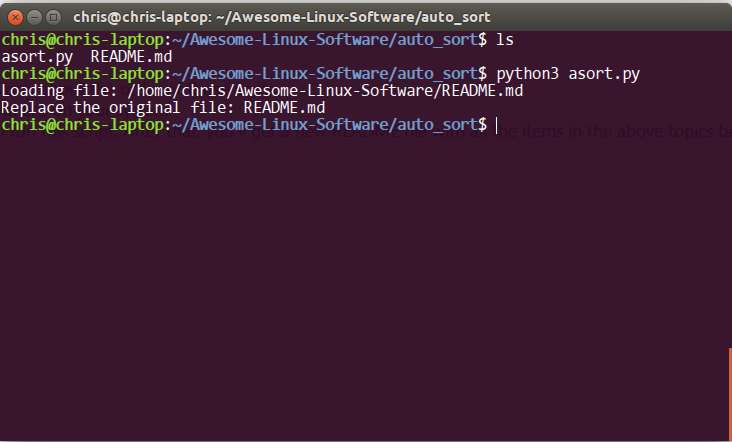

- [English](#introduction)
- [中文](#介绍)
- [Português (Brasil)](#português-brasil)
- [Español](#español)

# Introduction
`asort.py` is a very simple python3 script that aims to make sure items in the README file of the repo [Awesome-Linux-Software](https://github.com/VoLuong/Awesome-Linux-Software) are sorted alphabetically.

This script only sorts items in the following topics for now (items between topic Applications and topic Setup):
- Applications
- Command Line Utilities
- Desktop Environments
- Display Managers
- Window Managers

# Usage
1. Add items to corresponding topics, don't worry about the order of those items.
2. Make sure you've installed python3 environment on your system.
3. Open a terminal, type `python3 asort.py` to run this script. After that, you'll get a new README file with all the items in the above topics sorted alphabetically.

## Note
`asort_zh.py` works for the file [README_zh-CN.md](https://github.com/VoLuong/Awesome-Linux-Software/blob/master/README_zh-CN.md), the Chinese version of this list.
`asort_pt-BR.py` works for the Brasilian Portuguese version of the file [README_pt-BR](https://github.com/VoLuong/Awesome-Linux-Software/blob/master/README_pt-BR.md)
`asort_zh.py` works for the Spanish version of the file [README_es-ES](https://github.com/VoLuong/Awesome-Linux-Software/blob/master/README_es-ES.md)

# License
MIT License.

---------------------------------------------
# 介绍
`asort.py` 是一个非常简单的 python3 脚本，它负责将 [Awesome-Linux-Software](https://github.com/VoLuong/Awesome-Linux-Software) 仓库的 README.md 文件中的条目按照字母表顺序排列，以方便查阅。

该脚本只会为如下几个主题中的条目进行排序（实际上就是在主题 *应用程序* 和 *配置* 之间的所有条目）：
- 应用程序
- 命令行实用工具
- 桌面环境
- 显示管理器
- 窗口管理器

# 用法
1. 请首先按照说明将新的条目添加到合适的主题下，不用考虑排序问题；
2. 然后，确保你在系统上安装了 Python3 运行环境；
3. 打开终端，运行 `python3 asort.py` 即可。之后，你将得到一个新生成的 README 文件，并且文件中所有的在上述几个主题中的条目都已经按照字母表的顺序排列好了。

## 注意
新增的 `asort_zh.py` 专门用于中文版 [README_zh-CN.md](https://github.com/VoLuong/Awesome-Linux-Software/blob/master/README_zh-CN.md) 条目排序。用法与上面类似。

# 许可
MIT 许可协议。

---------------------------------------------
# Português (Brasil)
`asort.py` é um script python3 muito simples, que visa garantir que os itens no arquivo README do repositório [Awesome-Linux-Software](https://github.com/VoLuong/Awesome-Linux-Software) sejam ordenados alfabeticamente.

Este script apenas classifica itens nos seguintes tópicos por enquanto (Itens entre os tópicos Aplicativos e Configuração):
- Aplicativos
- Utilitários de linha de comando
- Ambiente de trabalho
- Gestores de exibição
- Gestor de janelas

# Modo de usar
1. Adicione itens aos tópicos correspondentes, não se preocupe com a ordem desses itens.
2. Verifique se está instalado o ambiente python3 em seu sistema.
3. Abra o terminal e digite `python3 asort.py` para executar o script. Depois disso, você receberá um novo arquivo README com todos os itens nos tópicos acima classificados em ordem alfabética.

## Nota
`asort_pt-BR.py` funciona no arquivo [README_pt-BR.md](https://github.com/VoLuong/Awesome-Linux-Software/blob/master/README_pt-BR.md), versão Portugês Brasileira desta lista.

# Licença
Licença MIT.

---------------------------------------------
# Español
`asort.py` es un es un simple script para garantizar los elementos del archivo README del repositorio [Awesome-Linux-Software](https://github.com/VoLuong/Awesome-Linux-Software) se ordenan alfabéticamente.

Este script sólo puede ordenar elementos en estas secciones por ahora (Los elementos son las secciones entre aplicaciones y Configuración)
- Aplicaciones
- Herramientas de línea de comandos
- Los Entornos des escritorios
- Gestors des pantallas
- Gestor de ventanas

# modo de uso
1. Añadir un nuevo software a las secciones correspondientes. El orden del software no importa.
2. Asegúrese de que el entorno de desarrollo de Python3 está instalado.
3. abra una línea de comandos y escriba: 'python3 asort.py' para activar el script. Después de esto, el script creará un nuevo archivo README con todos los elementos ordenados automáticamente.

#Notas
`asort.py` es compatible con la versión en inglés de la lista [README](https://github.com/VoLuong/Awesome-Linux-Software/blob/master/README.md)
`asort_zh.py` es compatible con la versión china de la lista [README_zh-CN.md](https://github.com/VoLuong/Awesome-Linux-Software/blob/master/README_zh-CN.md)
`asort_pt-BR.py` es compatible con la versión portuguesa brasileña de la lista [README_pt-BR](https://github.com/VoLuong/Awesome-Linux-Software/blob/master/README_pt-BR.md)
`asort_es-ES.py` es compatible con la versión español de la lista [README_es-ES](https://github.com/VoLuong/Awesome-Linux-Software/blob/master/README_es-ES.md)

# Licencia
Licencia MIT
